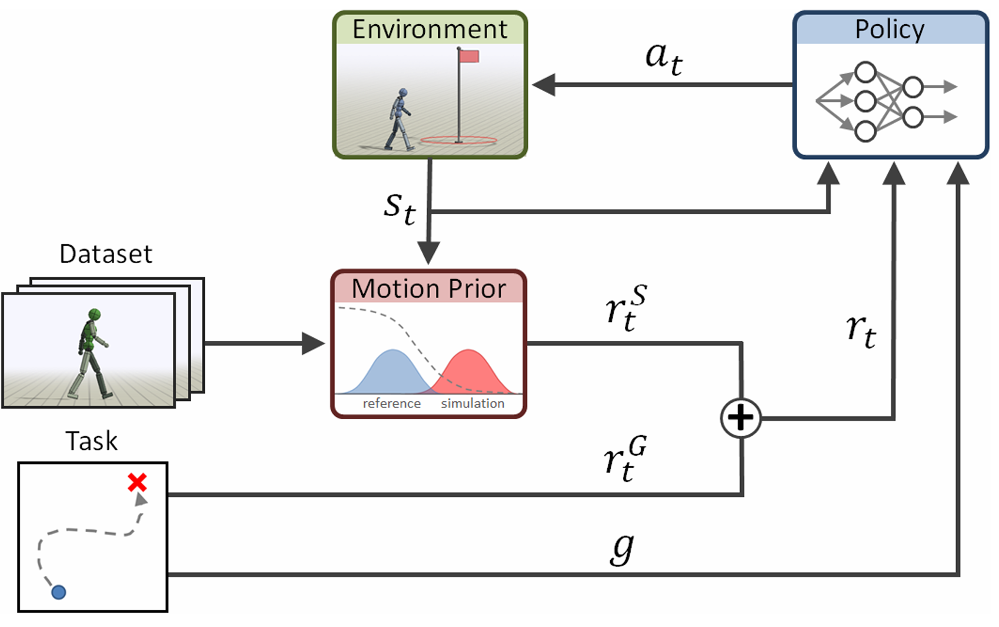
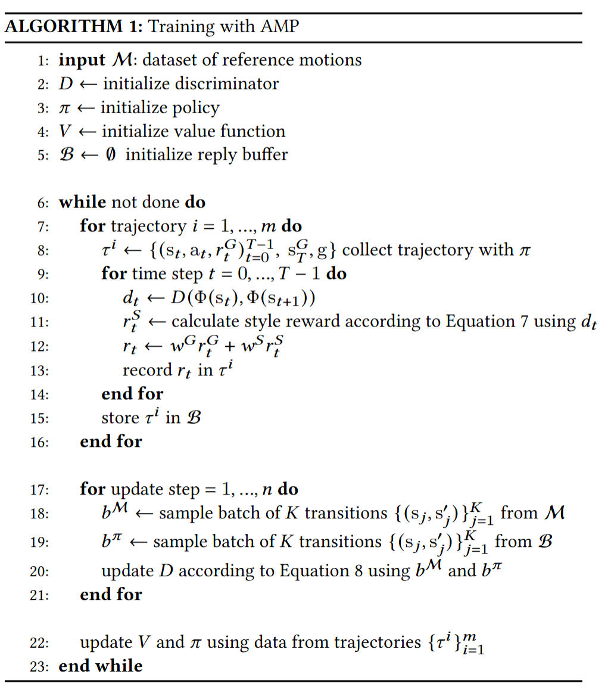

#强化学习 #具身 #Minic 

[toc]

# AMP: Adversarial Motion Priors for Stylized Physics-Based Character Control
- 项目：[AMP: Adversarial Motion Priors for Stylized Physics-Based Character Control](https://xbpeng.github.io/projects/AMP/index.html)
- 代码：[xbpeng/MimicKit: A lightweight suite of motion imitation methods for training controllers.](https://github.com/xbpeng/MimicKit)
- 论文：[[2104.02180] AMP: Adversarial Motion Priors for Stylized Physics-Based Character Control](https://arxiv.org/abs/2104.02180)

# 动机

很多应用其实并非想要精确跟踪特定参考动作，而是模仿参考动作的行为特征（即风格）。

想不大量手动调整奖励函数的情况下生成自然的动作，提出了对抗运动先验（adversarial motion priors，AMP）。给定一组参考动作，将运动先验建模成 GAN 中的判别器，来区分数据集中的参考动作和 policy 动作。

# 相关工作

生成合成动作方法一般分两类

## 基于物理

基于物理的方法通常也分两类：提供高保真度但适应性有限的运动学方法，以及确保合理性但需要精心设计目标函数的基于物理的方法

## 基于模仿

模仿类方法的目标通常是将问题视为跟踪，最小化 policy 和参考运动的目标姿态之间误差。通常会在输入时使用相位变量（phase variable）作为 policy 的附加输入，即时间步，但是这种方法不好扩展到包含多种参考运动的数据集。

# 方法

## 判别器

判别器输入本帧状态 $s$ 和下一帧状态 $s'$ ,学习的损失为：

$$
\arg\min_D \mathbb{E}_{d^M(s,s')} \left[ \left( D(\Phi(\mathbf{s}), \Phi(\mathbf{s}')) - 1 \right)^2 \right] \\
+ \mathbb{E}_{d^\pi(s,s')} \left[ \left( D(\Phi(\mathbf{s}), \Phi(\mathbf{s}')) + 1 \right)^2 \right]  \\
+ \frac{w^{\text{gp}}}{2} \mathbb{E}_{d^M(s,s')} \left[ \left| \nabla_\phi D(\phi)\big|_{\phi = (\Phi(\mathbf{s}), \Phi(\mathbf{s}'))} \right|^2 \right],
$$

其中前两项：

$$
\arg\min_D\quad \mathbb{E}_{d^M(s,s')} \left[ \left( D(\mathbf{s},\mathbf{s}') - 1 \right)^2 \right] + \mathbb{E}_{d^\pi(s,s')} \left[ \left( D(\mathbf{s},\mathbf{s}') + 1 \right)^2 \right]. \tag{6}
$$

即最小二乘 GAN（LSGAN），数据集的得分 1，policy 的预测为 -1. 判别器给出的风格奖励函数为：

$$
r(s_t, s_{t+1}) = \max\left[0, 1 - 0.25(D(s_t, s_{t+1}) - 1)^2\right].  \tag{7}
$$

后一项：

$$
\frac{w^{\text{gp}}}{2} \mathbb{E}_{d^M(s,s')} \left[ \left| \nabla_\phi D(\phi)\big|_{\phi = (\Phi(\mathbf{s}), \Phi(\mathbf{s}'))} \right|^2 \right]
$$

用来缓解判别器在真实岩本上分配非零梯度导致训练不稳定。

在本文中，输入判别器的状态 $s$ 为：

- 机器人基座坐标系下的基座线速度和角速度
- 关节角位置和速度
- 机器人基座坐标系下的手脚头等末端执行的 EEF 位姿
姿态使用 [6D法切向量表示法](../../DL_knowlege/6D法切向量表示法.md) 。基座坐标系基座正面为 x，上方为 y

## 网络结构

Policy 就是两层 MLP（1024，512），输入状态 $s_t$ 和目标动作 $g$ ，输出动作的高斯分布的均值 $\mu(\mathbf{s}_t, \mathbf{g})$ 和固定的对角协方差矩阵 $\Sigma$ ，这里协方差矩阵是固定的。值函数 $𝑉(𝐬_𝑡,𝐠)$ 和判别器 $𝐷(𝐬_𝑡,𝐬_{𝑡+1})$ 由具有类似架构的单独⽹络建模。

## 训练流程

这里 action $a_t$ 使用关节位置来表示，如果是铰链关节，比如人膝盖手肘，就是 1 自由度的关节角，若是球形关节，使用 [3D旋转变量表示法](../../DL_knowlege/3D旋转变量表示法.md)

初始化过程从运动轨迹中随机采样，然后角色有任何非脚与地面的接触，就立马停止。（除非学的动作是滚动或者跌倒起身）

整体训练就是 PPO，奖励为

$$
r_t=0.5r_G+0.5r_S
$$

$r_G$ 是任务奖励， $r_S$ 是风格奖励，具体计算方式见 [判别器](#判别器)

# 相关参考
- [AMP论文分析 | 范子琦的博客](https://www.robotsfan.com/posts/1742892a.html)
- [(99+ 封私信 / 81 条消息) 人形机器人从实践到理论16---AMP！Tienkung-lab!拟人走跑AMP算法学习记录 - 知乎](https://zhuanlan.zhihu.com/p/1982471173326528684)