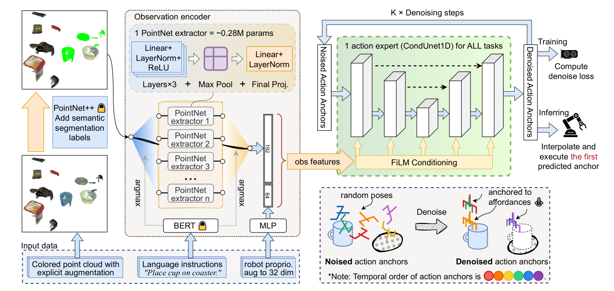

#具身智能 

[toc]

# AnchorDP3: 3D Affordance Guided Sparse Diffusion Policy for Robotic Manipulation RoboTwin Challenge Simulation
- 论文：[[2506.19269v2] AnchorDP3: 3D Affordance Guided Sparse Diffusion Policy for Robotic Manipulation](https://arxiv.org/abs/2506.19269v2)
- 会议：CVPR 2025

## 整体结构

## 创新点
### 1. 机器人状态和动作表示方式

同时用了关节向量和 eef，具体如下：

|  索引范围 | 状态和动作维度            |
| ----- | ------------------ |
| 0:6   | 左关节位置              |
| 6     |  左抓取器              |
| 7:13  | 右关节位置              |
| 13    | 右侧抓手               |
| 14:17 |  左侧末端位置 xyz        |
| 17:23 | 左侧末端姿态 R [:3,:2]   |
| 23:26 | 右侧末端位置 xyz         |
| 26:32 | 右侧末端姿态 R [: 3,: 2] |

这里姿态旋转使用旋转矩阵的前两列来表示，[保证数值上的连续表示，有益网络训练](https://arxiv.org/abs/1812.07035)（第三列可以直接使用旋转矩阵前两列叉乘得到）

这里训练的时候，以上 32 维都用，这样有益于元素收敛，但是实际使用仅使用前 14 维度（只使用关节）

### 2. Obervation 处理

使用了 4 个 RGBD 相机，然后使用内外参把深度图变成点云，然后合起来，这里用的 rgb 点云。

然后对每个点还使用了局部点云几何特征增强，即每个点取周围 K 个点计算（KNN）如下特征：

1. 表面法线
2.  曲率特征
最终每个点用 11 维表示，分别是 3 维位置 +rgb+3 维法线 +2 维曲率特征。然后下采样使用了 FPS，下采样到 4096 点。

### 3. 点云分割模型的数据生成

这里应该是 train 了一个点云分割模型，通过在仿真里面构建了一个工作流来训练一个二分类的 pointnet++。

工作流构建方式：

1. 确定任务关键物体和机器人本体
2. 模拟器中渲染所有物体，获得所有 RGBD 图像
3. 把 1 中所有物体可见性设置 False 重新渲染，获得所有 RGBD 图像
4. 基于 2 和 3 的深度差，得到 2D 分割遮罩 
5. 依据 4 结果对 2 中每个点分配二进制标签

### 4. 任务分类

本身竞赛有 6 个人物类，这里依据物体形状差异，分别 train 了 8 个 pointnet++。然后用一个 bert-base 来依据 language 分类任务，然后确定当前任务需要用的 pointnet++。训练的时候，只有对应任务的 pointet 更新。

**另外发现 DP3 中类似结果，复杂点云编码网络没啥好处，小的 MLP 就能取得不错效果。**

### 5. 关键姿态预测

不同于常见的 VLA 模型，这里不预测密集动作，而是预测固定的关键动作，称为*Affordance-Anchored Keyposes*。关键动作示例可参见 [关键动作说明](#关键动作说明) 

### 6. 数据集构建方式

这里 $O_t$ 是 observation，包含点云数据和 32 维 status， $a_t$ 表示当前观测下的 action，也是 32 维。给个观测帧的标签是未来 8 个关键锚点动作。每两个关键动作之间仅仅保存两个随机选择帧。

# 补充说明
## 表面法线计算方式

对于每个点 $p_k$ ，我们使用其 K - 近邻 ${\mathcal{N}_k = {\mathbf{p}_j \mid j \in \mathrm{KNN}(k)}}$ 计算微分几何特征

表面法线 $n_k$ 计算方式：

$$
\mathbf{C}_k = \frac{1}{|\mathcal{N}_k|} \sum_{\mathbf{p}_j \in \mathcal{N}_k} (\mathbf{p}_j - \boldsymbol{\mu}_k)(\mathbf{p}_j - \boldsymbol{\mu}_k)^\top
$$

这里 ${\boldsymbol{\mu}_k = \frac{1}{|\mathcal{N}_k|} \sum_{\mathbf{p}_j \in \mathcal{N}_k} \mathbf{p}_j}$ ,表面法线 $n_k$ 为 $\mathbf{C}_k$ 的最小特征值的特征向量。

## 曲率特征计算方式

对于每个点 $p_k$ ，我们使用其 K - 近邻 ${\mathcal{N}_k = {\mathbf{p}_j \mid j \in \mathrm{KNN}(k)}}$ 计算微分几何特征

通过以上方式的法线计算得到：

$$
\mathbf{V}_k = \left[ \mathbf{n}_k \times \mathbf{n}_j \mid \forall \mathbf{p}_j \in \mathcal{N}_k \right] \in \mathbb{R}^{3 \times K}
$$

分解协方差矩阵 $\boldsymbol{\Sigma}_k = \mathbf{V}_k \mathbf{V}_k^\top$ 得到特征值 $\lambda_1 \geq \lambda_2 \geq \lambda_3$ ，曲率特征如下：

$$
{\mathbf{c}_k = \left( \log(\lambda_1 + \epsilon), \log(\lambda_2 + \epsilon) \right)}
$$

${\epsilon = 10^{-5}}$ 来做数值稳定。

## 关键动作说明

对于抓放任务，可以将单个任务的抓放数据集要学习的 action 标签都变成以下 7 类，那么对于单条轨迹，只有以下 7 类动作，其动作类型就很稀疏，可能只有 10 几个动作。

- Pre-Grasp (PG): 末端执行器位于便利性对齐的接近向量上。 
- Target Grasp Open (TGO): 抓手位于抓取便利性中心，开口最大。 
- Target Grasp Closed (TGC) 目标抓取闭合：便利性优化的抓取闭合姿态。 
- Pre-Place (PP) 预放置（PP）：物体被运送到放置接近向量。 
- Target Place Closed (TPC) 目标位置关闭（TPC）：对象位于目标功能位置。 
- Target Place Open (TPO): 目标位置开放（TPO）：放置后夹爪缩回 
- Home (HM) 主页（HM）：中性配置。
