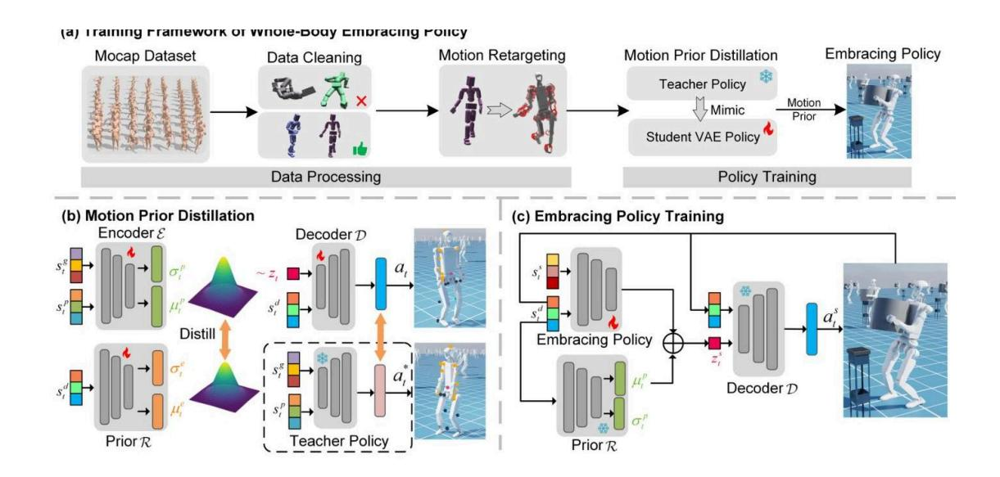
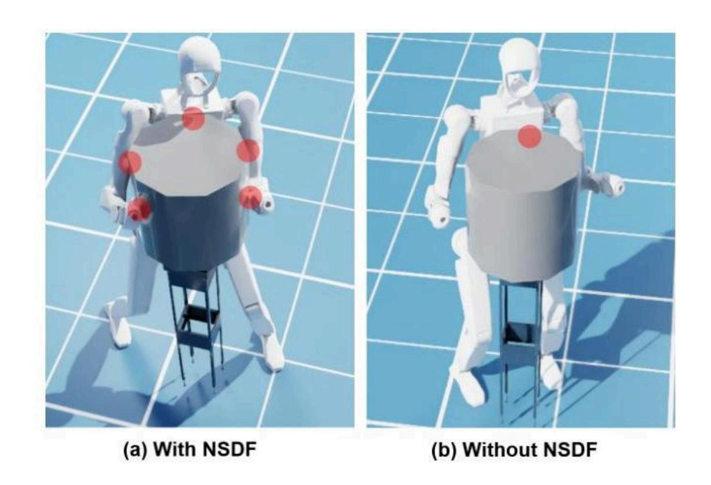
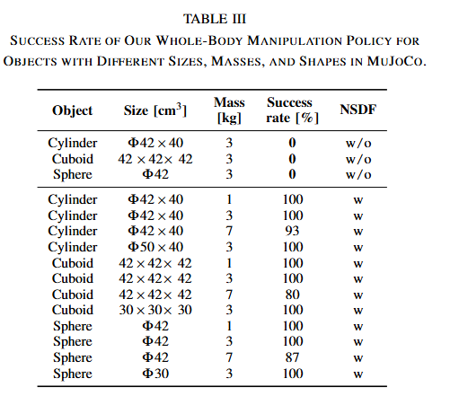
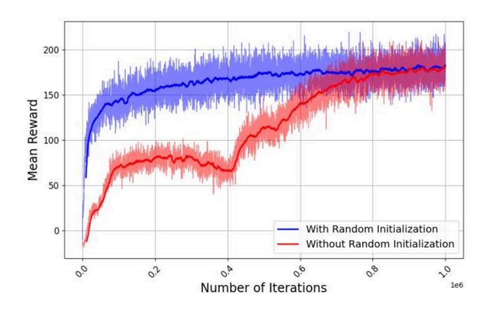
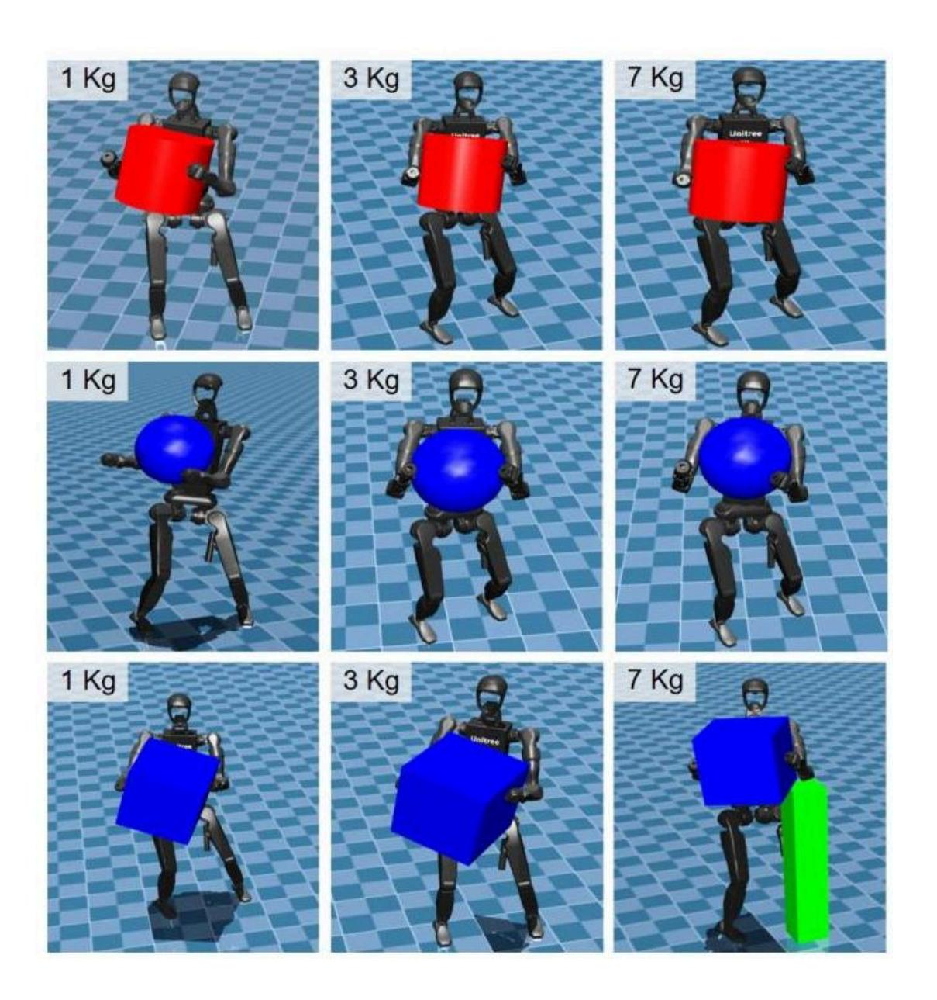
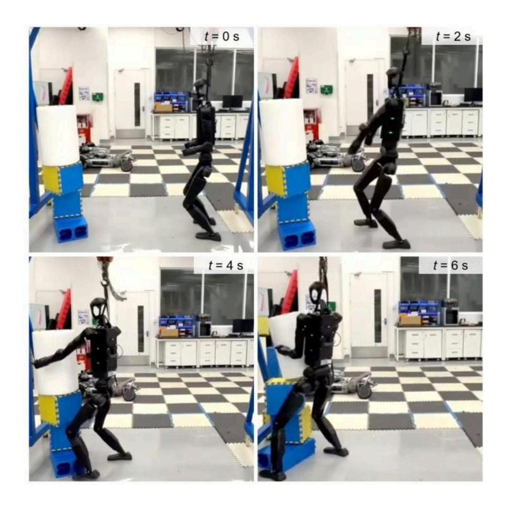

# Embracing Bulky Objects with Humanoid Robots: Whole-Body Manipulation with Reinforcement Learning

#具身智能 #manipulation #alphaXiv

# 动机

全身体操 (whole-body manipulation，WBM) 控制难度大，基于模型的方法需要指定接触点和规划顺序，计算量大；基于学习的方法需要精心涉及奖励，难训练。

本文将预训练的人类动作先验和 [神经符号距离场(neural signed distance field,NSDF)](../../DL_knowlege/神经符号距离场(neural%20signed%20distance%20field,NSDF).md) 相结合，提出了一种 RL 框架。人类动作先验提供合理的的运动学分布，稳定策略训练和收敛。NSDF 提供机器人空间意识和交互鲁棒。

# 方法
## 主要框架

- （a）训练框架：该框架由两个组件组成，数据处理和政策训练。在数据处理中，我们从 AMASS mocap 数据集开始，使用 MaskedMimic 丢弃违反运动学约束的序列（例如，自碰撞和脚滑），并将剩余的运动重新定位到机器人形态以收集机器人参考轨迹。在政策训练过程中，我们首先使用教师策略和学生 VAE 策略从收集到的轨迹中提炼出人类运动先验，然后使用学习到的运动先验来指导高级拥抱策略的训练。
- （b）运动先验蒸馏：一个预训练的教师策略通过提供参考动作来指导机器人运动模仿。学生策略，结构化为基于 VAE 的模型，通过模仿学习学习重建教师的行为分布。这个过程构建了一个可学习的类人运动先验 $\mathcal{R}$ ，这有助于下游任务的效率训练。 
- （c）拥抱策略训练：基于学习到的人形运动先验 $\mathcal{R}$ 我们训练了拥抱任务的全身操作策略。

## 具体流程
### 输出预处理方法

数据处理使用 MaskedMimic 来处理 AMASS mocap 数据集（这里的数据都是记录成 SMPL 人类模型），得到干净人类动作数据。

使用 H2O 来进行动作重定位映射到机器人上。

### 教师模型训练方法

使用 [PHC 算法框架]( https://github.com/ZhengyiLuo/PHC ) 来训练:

$$
\mathbf{a}_t^* = \pi_{\text{teacher}}(\mathbf{s}_t^p, \mathbf{s}_t^g)  \tag{1}
$$

其中 $\mathbf{a}_t^*$ 是教师策略生成的动作， $\mathbf{s}_t^p = \{\mathbf{v}_t, \boldsymbol{\omega}_t, \mathbf{g}_t, \mathbf{q}_t, \dot{\mathbf{q}}_t, \mathbf{a}_{t-1}^*\} \in \mathbb{R}^{90}$ 通过根线性速度 $\mathbf{v}_t$ 、角速度 $\boldsymbol{\omega}_t$ 、投影重力向量 $\mathbf{g}_t$ 、关节位置 $\mathbf{q}_t$ 、关节速度 $\dot{\mathbf{q}}_t$ 和先前动作 $\mathbf{a}_{t-1}^*$ 来编码本体感觉状态。目标状态定义为 $\mathbf{s}_t^g = {\hat{\mathbf{p}}_{t+1} - \mathbf{p}_t, \hat{\mathbf{p}}_{t+1}} \in \mathbb{R}^{2 \times 3 \times 27}$ ，它结合了来自预处理重映射的数据集 $\mathcal{D}_r$ 的参考运动轨迹，通过位置偏移（ $\hat{\mathbf{p}}_{t+1} - \mathbf{p}_t$ ）和每个刚体的目标配置 $\hat{\mathbf{p}}_{t+1}$ 来指定。该策略实现为一个多层感知器（MLP），并使用近端策略优化（PPO）进行优化。

### 学生策略蒸馏

采用学生策略主要是为了将跟踪策略（教师策略）转换成能自己输出动作的策略。

遵循 [PULSE](https://github.com/ZhengyiLuo/PULSE) 算法框架，参考图 2(b)：

采用变分编码解码器结构。

在上面教师模型训练好后，将教师 policy 的最优动作输出 $a_t^*$ 作为最终动作的监督 label。

整体训练流程如下

- 预处理数据集 $D_r$ 中得到机器人状态序列（ $s_t^p, s_t^g, s_t^d$ ）和教师政策输出的动作 $a_t^*$；
- encoder $\mathcal{E}$ 输入 $s_t^p$ 和 $s_t^g$ ，输出 latent 变量 $z_t$ 的分布 $\mathcal{N}(\mu_t^e, \sigma_t^e)$ ，并通过重参数化技巧采样 $z_t$ ；
- prior 网络 $\mathcal{R}$ 输入 $s_t^d$ ，输出逼近 $z_t$ 的分布 $\mathcal{N}(\mu_t^p, \sigma_t^p)$ ；
- decoder $\mathcal{D}$ 输入 $s_t^d$ 和采样的 $z_t$ ，输出动作分布 $\mathcal{N}(\mu_t^d, \hat{\sigma}_t^d)$ ，并采样得到重构动作 $a_t$；
- 计算总损失 $\mathcal{L}_{all}$，通过反向传播更新 encoder$\mathcal{E}$、decoder$\mathcal{D}$、prior 网络 $\mathcal{R}$ 的参数，直至损失收敛。

#### 损失函数

$$
\mathcal{L}_{\text{all}} = \mathcal{L}_{\text{action}} + \alpha \mathcal{L}_{\text{regu}} + \beta \mathcal{L}_{\text{KL}}, \tag{5}
$$

其中 $\mathcal{L}_{\text{action}} = |\mathbf{a}_t^* - \mathbf{a}_t|_2^2$ 是动作重建损失。正则化项 $\mathcal{L}_{\text{regu}} = |\boldsymbol{\mu}_t^e - \boldsymbol{\mu}_{t-1}^e|_2^2$ 通过强制连续潜在轨迹的时序一致性来惩罚潜在轨迹的突然变化，其中 $\boldsymbol{\mu}_t^e$ 和 $\boldsymbol{\mu}_{t-1}^e$ 分别是编码器在时间 $t$ 和 $t-1$ 的输出分布的均值。KL 散度项 $\mathcal{L}_{\text{KL}}$ 将编码器的潜在分布与学习到的先验对齐。系数 $\alpha$ 和 $\beta$ 分别协调平滑性和 KL 正则化项的相对重要性。

蒸馏训练完成之后，冻结解码器 $\mathcal{D}$ 和先验网络 $\mathcal{R}$

### 抱物体策略训练

直接 PPO, 思路类似残差学习，结构参见图 C。

每个时间步 $t$ 的观测定义为 $\mathbf{s}_t^{\text{task}} = \{\mathbf{s}_t^d, \mathbf{s}_t^s\}$ ，它是解码器输入 $\mathbf{s}_t^d$ 和一组特定任务特征 $\mathbf{s}_t^s$ 的拼接。具体含义参见 [符号表](#符号表)

#### NSDF 特征

通过一个预训练的网络得到，它输入箱子中心点，输出箱子中心点到机器人上身 15 个 link 的最近点的距离，其方法来自 [SAMP](https://arxiv.org/abs/2509.11185)

也可参考笔记 [神经符号距离场(neural signed distance field,NSDF)](../../DL_knowlege/神经符号距离场(neural%20signed%20distance%20field,NSDF).md)

#### 奖励设置

参见原始论文 Table2：

| Reward Terms           | Definition                                                                                                                                               | Weight  |
| ---------------------- | -------------------------------------------------------------------------------------------------------------------------------------------------------- | ------- |
| Torque                 | $\|\boldsymbol{\tau}\|_2^2$                                                                                                                              | -1e-7   |
| Joint Acceleration     | $\|\ddot{\mathbf{q}}\|_2^2$                                                                                                                              | -2.5e-8 |
| Action Rate            | $\|\mathbf{a}_{t-1} - \mathbf{a}_t\|_2^2$                                                                                                                | -0.5    |
| Joint Angle Limitation | $\sum \left[ -\min\left(0, \mathbf{q} - \mathbf{q}_{\text{lowerlimit}}\right) + \max\left(0, \mathbf{q} - \mathbf{q}_{\text{upperlimit}}\right) \right]$ | -1e-3   |
| Feet Slippage          | $\sum \|\mathbf{v}_{\text{foot}}\| \cdot (\, \|\mathbf{f}_{\text{contact}}\| > 1\,)$                                                                     | -0.05   |
| Feet Contact Force     | $\sum [\, \max(0, \|\mathbf{f}_{\text{contact}}\| - F_{\max})\,]$                                                                                        | -1e-5   |

##### 平滑度奖励
**作用：** 引导策略生成平滑且物理上合理的动作。
$r_{\text{smooth}} = r_{\text{torque}} + r_{\text{acc}} + r_{\text{action}}$ ，其中 $r_{\text{torque}}$ 惩罚高关节扭矩， $r_{\text{acc}}$ 惩罚大执行器加速度， $r_{\text{action}}$ 惩罚动作值快速变化。

##### 物理限制奖励
**作用：** 为了保护机器人在部署过程中的安全
$r_{\text{limit}} = r_{\text{dof}} + r_{\text{slippage}} + r_{\text{feet}}$ ，其中 $r_{\text{dof}}$ 鼓励关节保持在物理限制范围内，并阻止接近关节边界的位置， $r_{\text{slippage}}$ 增强了机器人的稳定性。通过限制机器人脚上的接触力， $r_{\text{feet}}$ 防止机器人过度踩地，使它的动作更加平稳。

##### 任务奖励

$r_{\text{task}} = r_{\text{walk}} + r_{\text{carry}} + r_{\text{arm}} + r_{\text{NSDF}}$

由于任务是长期的，因此分了三个阶段：

1. 接近阶段：接近物体
2. 操作阶段：抱住物体
3. 运送阶段：运送到目标位置

划分了两个区域：

1. 操作区域 (pick-up zone)：以物体为中心，半径 0.35 米内为机器人可以进行操作阶段的区域
2. 外环区域：内半径 3.5 米，外半径 4 米。既可以作为机器人初始生成区域，也可作为机器人搬运的交付区域

**接近阶段：**
机器人在外环区域， $r_{carry}=r_{arm}=0$ ，

$$
r_{\text{walk}} =  
\begin{cases}  
1, & \text{在操作区}, \\  
\exp(-|\sigma \hat{p}_t^{\text{box}}|_2) + \exp(-|\sigma \hat{\theta}_t^{\text{box}}|_2) + \exp(-|\sigma \hat{v}_t^{\text{body}}|_2), & \text{操作区外}.  
\end{cases} \tag{9}
$$

即 $r_{walk}$ 重点鼓励机器人靠近物体

**操作和运送阶段：**

$$
r_{\text{carry}} =  
\begin{cases}  
0, & \text{Out of pick-up zone}, \\  
\exp(-|\sigma \hat{p}_t^{\text{target}}|_2) + \exp(-|\sigma \hat{\theta}_t^{\text{target}}|_2) + \exp(-|\sigma \hat{v}_t^{\text{box}}|_2), & \text{In pick-up zone}.  
\end{cases} \tag{10}
$$

$$
r_{\text{arm}} = \exp\left(-\sigma(|\hat{p}_t^{\text{lh}}|_2 + |\hat{p}_t^{\text{rh}}|_2)\right) + \exp\left(-\sigma(|\hat{h}_t^{\text{lh}}|_2 + |\hat{h}_t^{\text{rh}}|_2)\right), \tag{11}
$$

其中 $\hat{p}_t^{\text{lh}}$ 和 $\hat{p}_t^{\text{rh}}$ 分别表示从左侧和右侧末端执行器到物体的距离。

**场景随机初始化设置：**
- 场景 1：物体在桌上，机器人随机初始化在外环区域
- 场景 2：物体在桌上，机器人初始状态手动设置，上身出于预抱物体的状态，机器人初始化在操作区域
- 场景 3：机器人出于抱的姿势，物体在手上
每次重置环境，随机选择其中之一。

## 符号表

| Symbol                                        | Dimension                           | Description                                                                                                                                                                                                                   |
| --------------------------------------------- | ----------------------------------- | ----------------------------------------------------------------------------------------------------------------------------------------------------------------------------------------------------------------------------- |
| $\mathbf{a}_t$                                | $\mathbb{R}^{27}$                   | 目标关节位置                                                                                                                                                                                                                        |
| $\mathbf{v}_t$                                | $\mathbb{R}^3$                      | Root 线速度                                                                                                                                                                                                                      |
| $\boldsymbol{\omega}_t$                       | $\mathbb{R}^3$                      | Root 角速度                                                                                                                                                                                                                      |
| $\mathbf{g}_t$                                | $\mathbb{R}^3$                      | 投影重力矢量                                                                                                                                                                                                                        |
| $\mathbf{q}_t$                                | $\mathbb{R}^{27}$                   | 关节位置                                                                                                                                                                                                                          |
| $\dot{\mathbf{q}}_t$                          | $\mathbb{R}^{27}$                   | 关节速度                                                                                                                                                                                                                          |
| $\mathbf{a}_{t-1}$                            | $\mathbb{R}^{27}$                   | 前一个动作                                                                                                                                                                                                                         |
| $\hat{\mathbf{p}}_{t+1}$                      | $\mathbb{R}^{3 \times 27}$          | 参考身体位置                                                                                                                                                                                                                        |
| $\hat{\mathbf{p}}_{t+1} - \mathbf{p}_t$       | $\mathbb{R}^{3 \times 27}$          | 位置偏移                                                                                                                                                                                                                          |
| $\mathbf{s}_t^p$                              | $\mathbb{R}^{90}$                   | $\mathbf{s}_t^p = \{\mathbf{v}_t, \boldsymbol{\omega}_t, \mathbf{g}_t, \mathbf{q}_t, \dot{\mathbf{q}}_t, \mathbf{a}_{t-1}^*\} \in \mathbb{R}^{90}$ 教师策略输入的本体状态                                                                |
| $\mathbf{s}^g_t$                              | $\mathbb{R}^{2 \times 3 \times 27}$ | $\mathbf{s}_t^g = \{ \hat{\mathbf{p}}_{t+1} - \mathbf{p}_t, \hat{\mathbf{p}}_{t+1} \} \in \mathbb{R}^{2 \times 3 \times 27}$ 教师策略输入的目标状态                                                                                      |
| $\mathbf{s}^d_t$                              | $\mathbb{R}^{87}$                   | $\mathbf{s}_t^d = \{ \boldsymbol{\omega}_t, \mathbf{g}_t, \mathbf{q}_t, \dot{\mathbf{q}}_t, \mathbf{a}_{t-1} \} \in \mathbb{R}^{87}$ 先验策略 $\mathbf{R}$ 的输入，和 $\mathbf{s_t^p}$ 类似但是去掉 root 线性速度分量 $\mathbf{v}_t$ 来使之输入可以符合现实场景 |
| $\mathbf{s}^s_t$                              | $\mathbb{R}^{19}$                   | $\mathbf{s}_t^s = \{\hat{\mathbf{p}}_t^{\text{box}}, \hat{\boldsymbol{\theta}}_t^{\text{box}}, \hat{\mathbf{p}}_t^{\text{target}}, \hat{\boldsymbol{\theta}}_t^{\text{target}}, \mathbf{d}_t\} \in \mathbb{R}^{19}$           |
| $\hat{\mathbf{p}}_t^{\text{box}}$             | $\mathbb{R}^{1}$                    | 机器人躯干与箱子中心之间的距离                                                                                                                                                                                                               |
| $\hat{\boldsymbol{\theta}}_t^{\text{box}}$    | $\mathbb{R}^{1}$                    | 机器人躯干与箱子中心之间的方向角度差                                                                                                                                                                                                            |
| $\hat{\mathbf{p}}_t^{\text{target}}$          | $\mathbb{R}^{1}$                    | 机器人躯干与目标位置之间的距离                                                                                                                                                                                                               |
| $\hat{\boldsymbol{\theta}}_t^{\text{target}}$ | $\mathbb{R}^{1}$                    | 机器人躯干与目标位置之间的方向角度差                                                                                                                                                                                                            |
| $\mathbf{d}_t$                                | $\mathbb{R}^{15}$                   | NSDF 特征，通过一个预训练的网络得到，它输入箱子中心点，输出箱子中心点到机器人上身 15 个 link 的最近点的距离，其方法来自 [ SAMP](https://arxiv.org/abs/2509.11185)                                                                                                                 |

# 训练参数设置

用 IsaacSim 构建，env_nums=4096。抱的对象时 42cm x 40 cm 的圆柱体，最初放置在离机器人 4 米远处。使用 RTX 4080 训练

# 实验
**关于 NSDF 的消融**

W/O 代表没用 NSDF

**关于随机初始化消融**

**sim2sim 泛化**

红色和训练时尺寸相同，蓝色未未见过形状，绿色时初始物体放置底座。
若物体质心在目标位置 0.1 米范围内无坠落，即为成功。

**sim2real**

推理是 Intel i7，宇树 H1-2. 策略 50Hz，抱 40cm x 60cm 的圆柱体
