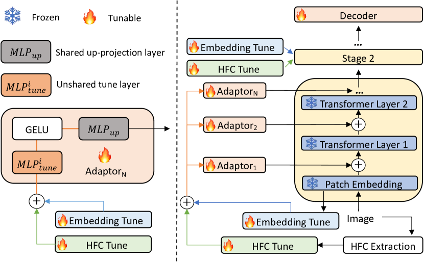

# 其他信息
- 会议：CVPR 2023
- 论文： <https://arxiv.org/abs/2303.10883>
- 代码：<https://github.com/NiFangBaAGe/Explicit-Visual-Prompt>

# 论文内容

## 关键信息摘抄
### 1 Introcduction

作者认为预训练模型已经包含有足够多的语义信息, 因此通过引入单个个体图像的低级特征, 作为将模型迁移到特定任务上的特定知识可能更有效.

本文中作者考虑两种引入特征, 一是冻结的 patch 嵌入, 这对于改变原始模型的分布很重要; 二是图像的高频信息成分,, 因为预训练的模型是可以通过数据增强来习得这些特征的不变性.

#### 3 Method

作者基于 SegFormer 来展开工作，其成果同样适用于 ViT 和 Swin 等网络．

作者设置了一个超参数，掩码比率 $\tau$ 来设置取高频分量（HFC）或是低频分量 (LFC) 计算时的二进制掩码区域 $M_h \in \{0,1\}^{H \times W}$ 。即先对图片每个通道计算 fft，然后按照上述的二进制掩码区域对 fft 频率分量进行遮盖，然后再计算 ifft。具体公示表示如下：

$$
M^{i,j}_h(\tau) =
\begin{cases}
0, \frac{4|(i-\frac{H}{2})(j-\frac{W}{2})|}{HW} \leq \tau \\
1, & \text{otherwise} \\
\end{cases}
$$

$$
I=ifft(zM_h(\tau))
$$

#### 3.2 Explicit Visual Prompting

作者展示了其主要模块的设计。之所以将 patch 嵌入和高频分量作为信息输入，前者是帮助模型分布从预训练数据集转移到目标数据集，后者是让模型学到对高频分量这些低级特征保持不变性。其 Adaptor 主要结构如下图所示：

先分别通过一个线性层将 HFC 和 Patch Embedding 投影到特定维数上，然后将两者相加，通过 Adaptor。

#### 4 Experiment

作者分别在伪造检测，阴影检测，散焦模糊和伪装物体检测四个任务上进行测试

#### 4.2 Implementation Details

实验硬件为 12 G 显存的 Nvidia Titan V.优化器适用 AdamW。跑焦模糊检测和伪装对象检测初始学习率为 $2e^{-4}$ ，其他初始学习率为 $5e^{-4}$ .阴影检测训练 20 个 epoch，其余训练 50 个 epoch。增强仅使用水平翻转，batchsize 为 4. 学习率调整策略使用 CosineAnnealingLR。

在实验结果上，除开在跑焦检测上我们略逊与全调，其他任务上我们均取得了 sota。 $\tau=4$ 可以取得精度和速度上比较好的平衡。

依据实验，在 SegFormer 4 个 stage 中分别应用方法，在 3 stage 上效果最明显，因为 3 stage transformer 块最多，有 27 个。

其代码实现参考：<https://github.com/NiFangBaAGe/Explicit-Visual-Prompt/blob/601ae9985f04264c0411aa3722822f70134fa488/models/mmseg/models/backbones/mix_transformer_evp.py#L212>
