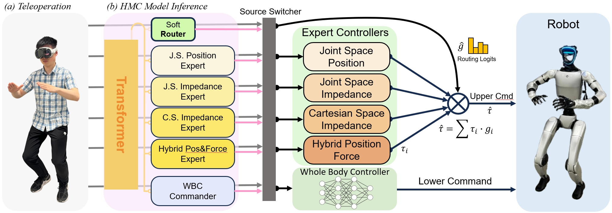

#具身智能   #力控
# HMC: Learning Heterogeneous Meta-Control for Contact-Rich Loco-Manipulation
- 论文：[[2511.14756v1] HMC: Learning Heterogeneous Meta-Control for Contact-Rich Loco-Manipulation](https://arxiv.org/abs/2511.14756v1)

# 力感知机器人的三个挑战
1. 模态不匹配：位置、阻抗和混合控制器在各个任务阶段各有所长，但没有单一模式足以完成整个任务。
2. 数据不平衡：大规模远程操作数据以位置信息为主，而利用顺应性或力控进行演示的数据则相对稀缺
3. 突然切换：控制器之间的硬性、离散转换导致扭矩不连续，从而导致不稳定和不安全的交互

# 整体框架

