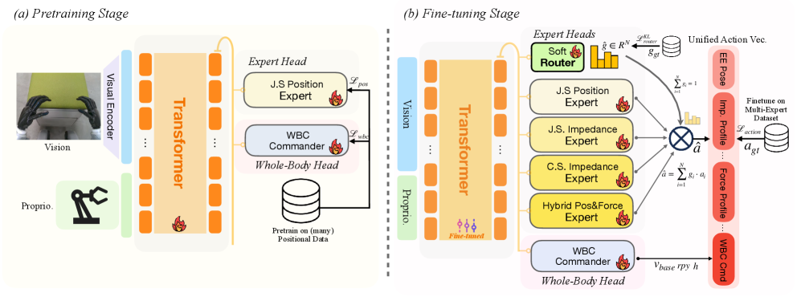

#具身智能   #力控
# HMC: Learning Heterogeneous Meta-Control for Contact-Rich Loco-Manipulation
- 论文：[[2511.14756v1] HMC: Learning Heterogeneous Meta-Control for Contact-Rich Loco-Manipulation](https://arxiv.org/abs/2511.14756v1)

# 力感知机器人的三个挑战
1. 模态不匹配：位置、阻抗和混合控制器在各个任务阶段各有所长，但没有单一模式足以完成整个任务。
2. 数据不平衡：大规模远程操作数据以位置信息为主，而利用顺应性或力控进行演示的数据则相对稀缺
3. 突然切换：控制器之间的硬性、离散转换导致扭矩不连续，从而导致不稳定和不安全的交互

# 整体框架

文章分为 HMC-Controller 和 HMC-Policy

## HMC-Controller

HMC-Controller 是一个底层控制器，它将模型的控制指令转换成统一的扭矩控制给到电机来进行机器人控制, 具体参见 [论文第 3 部分 ]( <https://arxiv.org/html/2511.14756v1#S3> )

涉及的专家模块包括 4 种：

| 专家头类型       | 微调阶段的输出（动作参数）                                              | 作用（为什么不直接输出扭矩？）                                                                                       |
| ----------- | ---------------------------------------------------------- | ----------------------------------------------------------------------------------------------------- |
| 位置专家头       | 目标关节角度（ $q_d$ ）、目标关节速度（ $\dot{q}_d$ ）                      | 位置控制的核心是 “追目标位置”，参数需结合机器人当前关节状态（实际 q、 $\dot{q}$ ）才能算扭矩，专家头不掌握实时状态（如当前关节角度），无法直接算扭矩。                   |
| 阻抗专家头       | 目标位置（关节 / 笛卡尔空间）、刚度（ $K_q/K_x$ ）、阻尼（ $D_q/D_x$ ）           | 阻抗控制的核心是 “调软硬度”，刚度 / 阻尼是关键参数，需结合当前位置误差、速度误差才能算扭矩（见文档中阻抗控制公式（2）（3）），专家头只负责预测 “要多软 / 多硬”，不负责计算具体扭矩。     |
| 混合力 - 位置专家头 | 目标位置（自由方向）、目标力（约束方向）、选择矩阵（ $S_p/S_f$，指定 “哪个方向控位置、哪个方向控力” ） | 混合控制需 “分方向指定规则”，选择矩阵决定 “哪个方向控位置、哪个方向控力”，目标力 / 位置是基准值，需结合当前力反馈（f）、位置反馈（x）才能算扭矩（见公式（4）），专家头只输出 “规则和基准”。 |

## HMC-Policy

结构上就是 transformer，具体结构论文未写。训练分 2 阶段

### 预训练

类似 ACT 套路，使用纯位控数据监督学习，计算和 GT 的 L1 损失。仅仅训练 transformer 基干，J.S Position Expert 和 WBC Commander（全身控制）

### 微调
**使用数据：**
 包含位置、阻抗、混合力 - 位置三种模态的演示（比如人在遥操作时，会切换控制模式：插入抽屉时调软阻抗，拉动时调硬刚度 + 控力度）
 
  **数据预处理：**
 对 “真实模态标签”（比如 “这一帧用了阻抗控制器”）做**低通滤波**—— 让标签变化更平缓（比如从阻抗到位置的标签权重慢慢变，不是突然跳变），避免软路由学出 “abrupt 切换”。
 
**网络参数冻结：**
解冻所有模块（Transformer、3 个专家头、软路由、WBC 头），但把 “共享 Transformer” 的学习率调低 

**损失函数：**
Soft Router 部分使用 KL 散度，让软路由预测的权重（ $g_t$ ）接近 “经过低通滤波的真实权重”（ $g_t^{g_t}$ ）—— 让权重分配符合人的操作逻辑，切换更平滑。

其余部分使用各专家输出 x 软路由权重，拼接上 WBC 全身控制，和 GT 计算 L1

### 一些处理细节
1. 在微调时，不同专家需要的参数，其他专家会填 0，也就是统一拼接编码。每个专家都会输出 EEF，有的还会包含其他参数，具体参见 [HMC-Controller](#HMC-Controller)
2. 实际使用时会先把每个专家输出的控制指令通过 HMC-Controller 转换成扭矩，然后乘上软路由参数。