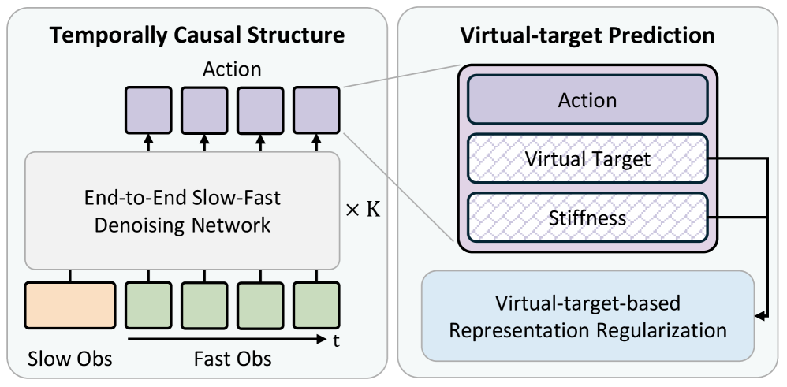
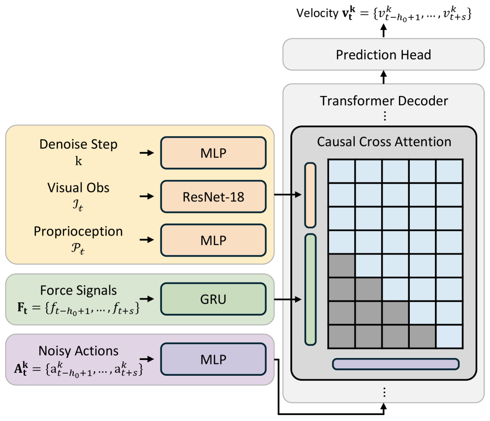

#VLA #具身智能 #DiffusionPolicy #力控 

[toc]

# ImplicitRDP: An End-to-End Visual-Force Diffusion Policy with Structural Slow-Fast Learning
- 论文： <https://arxiv.org/abs/2512.10946>
- 项目： <https://implicit-rdp.github.io>

## 动机
1. 一些引入力信号的方法在预测时依然是基于 action chunk 的，在每个块仍然是开环的
2. 简单 e2e 的网络直接融合力信号，容易出现模态崩溃，模型学不会什么时候用什么模态

## 整体结构

> Fig1

> Fig2  

图 2 显示的单次去噪的过程，所以输入里面有 Denoise Step k。

### 算法推理流程

推理时，假定慢系统输入过去两帧 $h_o=2$ ,系统延时帧数 $l=3$ ,快系统输入过去三帧 $h_e=3$ 。

那么在快系统 $h_e$ 的窗口期内，每次快系统输入的过去帧数就是 $h_o+i+l$ ，参照经验 1，这里每次预测的最新动作就是 $\hat{A}_t^0[-1]$ 

### 训练目标修改

假设机器人动作都很慢，那么可以忽略惯性和阻尼，阻尼系统公式 3：

$$
f_{ext} = M\ddot{x}_{vt} + D\dot{x}_{vt} + K(x_{vt} - x_{real}),  \tag{3}
$$

化简为公式 4：

$$
x_{vt} = x_{real} + K^{-1} f_{ext}  \tag{4}
$$

这里 $x_{real}$ 是实际姿态， $x_{vt}$ 是虚拟目标， $f_{ext}$ 是外部扭矩， $K$ 是刚度矩阵，3x3 大小的对角线矩阵。

#### 刚度矩阵 K 的可能生成方法

若 xyz 中与 $f_{ext}$ 非正交的轴，K 中对角线的对应地方的数值都按照公式 5 计算：

$$
k_{adp} = \begin{cases} 
k_{max}, & \|f_{ext}\| < f_{min} \\ 
k_{max} - \dfrac{k_{max} - k_{min}}{f_{max} - f_{min}}(\|f_{ext}\| - f_{min}), & \text{otherwise} \\ 
k_{min}, & \|f_{ext}\| > f_{max} 
\end{cases}  \tag{5}
$$

和 $f_{ext}$ 正交的轴，对应位置直接填一个很大数值 $k_{high}$ 

#### 训练目标

这里参照经验 1，实际每个预测的动作向量 $a_{aug,t}$ 为原始动作向量 $a_t$ ,依据公式 4 计算的虚拟目标向量 $x_{vt}$ 和刚度大小向量 $k_{adp}$ 来拼接来实现。

虽然这里预测虚拟目标向量 $x_{vt}$ 和刚度大小向量 $k_{adp}$ 作用耦合，但是依然在预测目标上要加上 $x_{vt}$ 的原因：

1. 力传感一般是 TCP 坐标系，动作是世界坐标系，用 $x_{vt}$ 替代力，可以统一目标的坐标系
2. 依据公式 4，没接触的时候 $x_{vt} \approx x_{real}$ ，接触的时候，会使 $K^{-1}$ 变大。这样可以使模型更加关注高接触力事件。参见 3-C4 节。

#### 训练目标速度化（更好的学习稳定性）

^2dff04

参见 3-D1。

这里参考类似 Flow Matching 中的概率，不在预测每步去噪的噪声，而是预测从纯噪声到干净 label 过程中的速度向量。即使用公式 7 作为预测目标：

$$
\mathbf{v}_t^k \triangleq \sqrt{\bar{\alpha}_k}  \epsilon - \sqrt{1 - \bar{\alpha}_k}  \mathbf{A}_t^0  \tag{7}
$$

目标函数使用 L2.

**在实际推理时，使用以下式子推导出预测样本，然后截取前面部分的控制指令使用**

$$
\hat{A}_t^0 = \frac{\sqrt{\bar{\alpha}_k} \cdot \epsilon - v_t^k}{\sqrt{1 - \bar{\alpha}_k}}
$$

## 一些实现细节
1. 参见 [训练目标速度化](#^2dff04)
2. 高刚度物体交互时，力反馈的噪声大，因此专门设计了一个顺应性指尖来产生清晰的力反馈
3. 修改了默认的机器人阻抗控制，实现精确的位置跟踪
# 一些经验
1. 参照 TA-VLA 中做法，让模型也预测电机未来扭矩作为未来额外目标，学会物理的内部表示
2. 为保持一个 action chunk 里面重用和确定性的去噪，将 DDIM 中的额外噪声的标准差参数设置为 0，这样就是确定性去噪