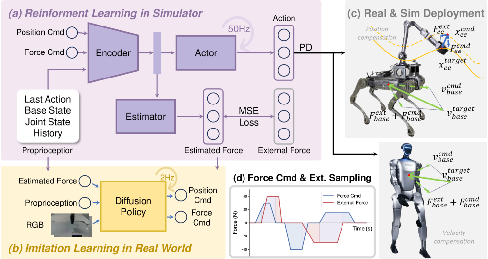
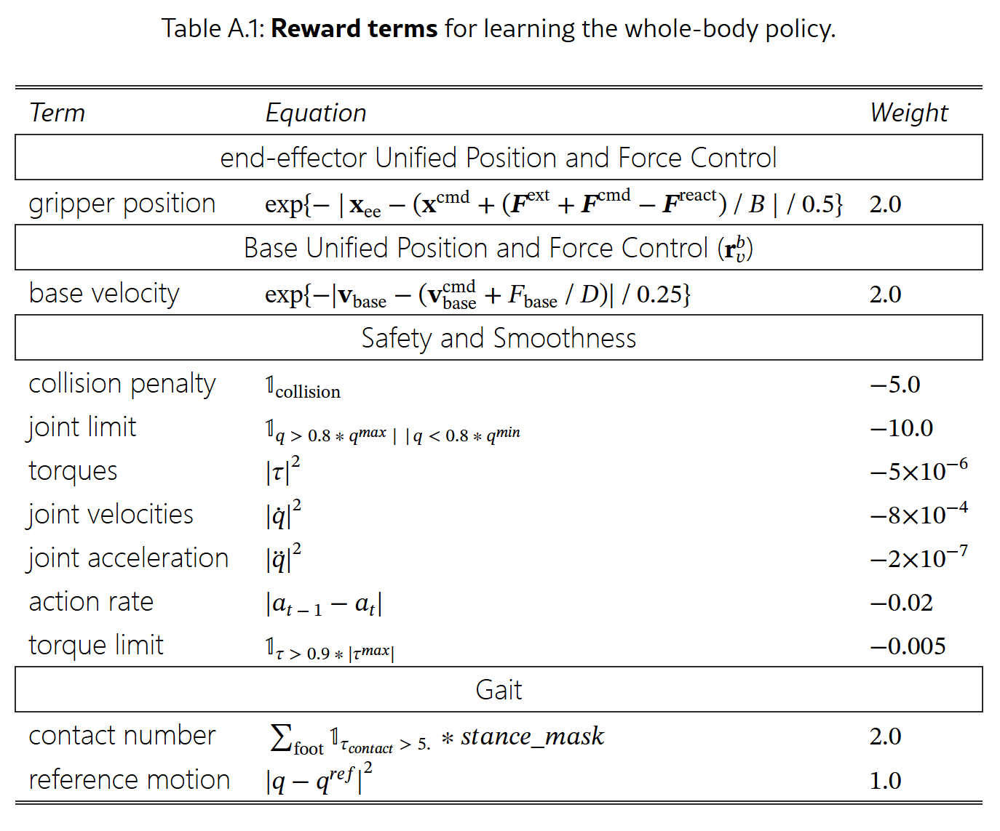
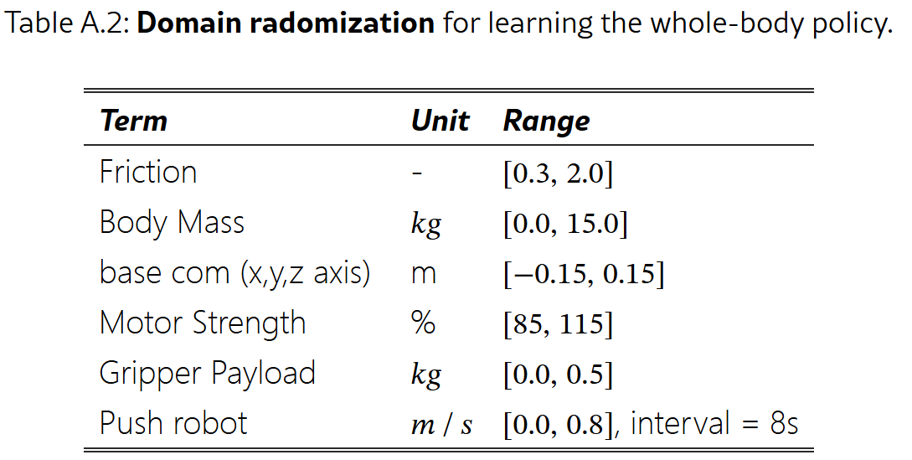
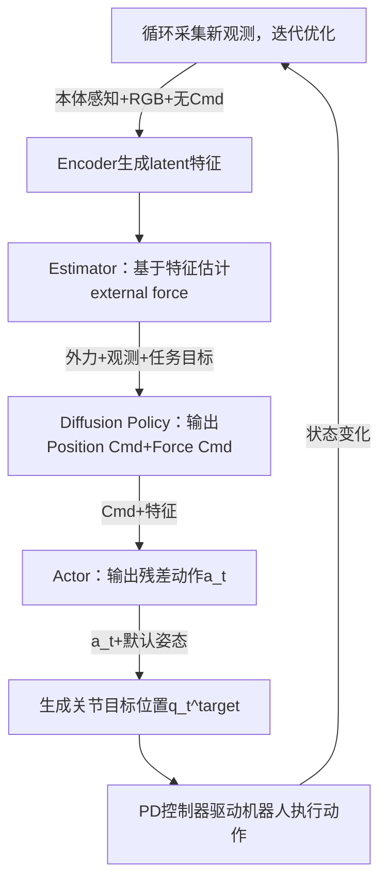

#具身智能 #力控 #DiffusionPolicy 

# Learning a Unified Policy for Position and Force Control in Legged Loco-Manipulation
- 论文：[[2505.20829v2] Learning a Unified Policy for Position and Force Control in Legged Loco-Manipulation](https://arxiv.org/abs/2505.20829v2)
- 会议：CoRL 2025 best paper
- 代码：[unified-force/UniFP: CoRL2025 UniFP: Learning a Unified Policy for Position and Force Control in Legged Loco-Manipulation](https://github.com/unified-force/UniFP/tree/main)
- 简称： UniFP
- 视频：[CoRL 2025 最佳论文奖 UniFP | 全球首个力位混合控制算法_哔哩哔哩_bilibili](https://www.bilibili.com/video/BV1R8WnzdEgN/?spm_id_from=333.337.search-card.all.click)

# 动机

RL 通过域随机化已经能做一些很鲁棒的动作，但是都是依赖精确位置控制，忽略来接触力信息，而且这些系统本身也缺少力传感。

本文想通过建模找一个统一的方式把力和位控结合起来，同时不依赖额外的力传感

# 问题建模

阻抗控制的完整公式：

$$
\mathbf{F} = K(\mathbf{x} - \mathbf{x}^{\text{des}}) + D(\dot{\mathbf{x}} - \dot{\mathbf{x}}^{\text{des}}) + M(\ddot{\mathbf{x}} - \ddot{\mathbf{x}}^{\text{des}}),  \tag{1}
$$

其中， $\mathbf{x}$ 表示机器人的实际位置； $\mathbf{x}^{\text{des}}$ 、 $\dot{\mathbf{x}}^{\text{des}}$ 和 $\ddot{\mathbf{x}}^{\text{des}}$ 分别表示机器人所需到达的目标位置、目标速度以及目标加速度。参数 $K$ 、 $D$ 和 $M$ 分别对应于机器人的刚度系数、阻尼系数以及等效质量（惯性）。

这里因为末端执行器通过执行任务较慢，这里简化系统，去掉速度加速度，式子变为 $\mathbf{F} = K(\mathbf{x} - \mathbf{x}^{\text{des}})$ ，然后将 $\mathbf{F}$ 拆解成主动作用力 $\mathbf{F}^{\text{cmd}}$ ，因 $\mathbf{F}^{\text{cmd}}$ 而产生的环境反作用力 $\mathbf{F}^{\text{react}}$ ，以及外部干扰力 $\mathbf{F}^{\text{ext}}$ ，最终公式变为：

$$
\mathbf{x}^{\text{target}} = \mathbf{x}^{\text{cmd}} + \frac{\mathbf{F}^{\text{ext}} + (\mathbf{F}^{\text{cmd}} - \mathbf{F}^{\text{react}})}{K},   \tag{2}
$$

**对于机器人其他部分，比如本体控制，可能更多是关注速度，那么将公式 2 中 x 换成速度 v，K 换成 D 即可。**
在实际实施中，为了便于处理，这里把环境反作用力 $\mathbf{F}^{\text{react}}$ 以及外部干扰力 $\mathbf{F}^{\text{ext}}$ 统一建模成总外部力，最终公式 2 变为：

$$
\mathbf{x}^{\text{target}} = \mathbf{x}^{\text{cmd}} + \frac{\mathbf{F}^{\text{ext}} + \mathbf{F}^{\text{cmd}}}{K}
$$

# 算法整体框架

这里模型的 Proprioception 包括

$$
\mathbf{o}_t = \left[ \mathbf{g}_t^{\text{base}},\ \boldsymbol{\omega}_t^{\text{base}},\ \mathbf{q}_t,\ \dot{\mathbf{q}}_t,\ \mathbf{a}_{t-1},\ \mathbf{c}_t^{\text{cmd}},\ \theta_t^{\text{feet}} \right]  \tag{5}
$$

即：机器人基座姿态，角速度，关节位置，关节速度，之前动作，收到的指令和脚部开始运动的时间。

关于脚部开始运动时间参见 [脚部开始运动时间](#脚部开始运动时间)

这里输入指令 $\mathbf{c}_t^{\text{cmd}} = [\mathbf{v}_{\text{base}}^{\text{cmd}}, \mathbf{x}_{\text{ee}}^{\text{cmd}}, \mathbf{F}_{\text{ee}}^{\text{cmd}}, \mathbf{F}_{\text{base}}^{\text{cmd}}]$ 包括机器人基座速度，末端执行器速度，末端力，基座力控制指令，四足考虑以上所有四种指令，人行没有末端，仅仅考虑基座速度和基座力指令。

输出动作 $a_t$ 是相对默认姿态的额外变化值，

实际实施时会输入机器人历史 32 帧的数据。模型预测机器人外部总作用力，末端位置和基座速度，然后转换成相应的控制指令.

在实际训练时，外部作用力和力控指令是随机生成然后线性增加到预设然后保持和线性衰减的，如图 d 中，这个周期不断重复。

另外为了好训练，我们先去掉力估计和输入，先 train 位置，然后在引入随机力指令和外部干扰。

## 模拟器中 PPO 设置
### 奖励函数设置

Actor 模型最终的输出的 action，应该是 12+6 维个关节的信号。

注意，依据附录 C3，estimator 不仅预测外力，还预测 eef 的位置和基座线速度。

**注意：**

这里预测的 eef 的位置是相对于一个是世界坐标系的一个基座坐标系，该基座坐标系的 xy 和机器人基座一致，但是高度和姿态固定。这样可以让模型学习到，比如要够到的位置在机械臂自身动作范围之外，但是基座可以往前倾斜，进而实现协调运动

### 域随机化参数

### 输入命令和力的采样分布范围
1. EEF 末端是球坐标系 $\mathbf{x}_{\text{ee}}^{\text{cmd}} = (r^{\text{cmd}}, \theta^{\text{cmd}}, \phi^{\text{cmd}}), \quad r^{\text{cmd}} \in [0.35, 0.85]\,\text{m},\ \theta^{\text{cmd}} \in [-0.4\pi, 0.4\pi\text{rad}],\ \phi^{\text{cmd}} \in [-0.6\pi, 0.6\pi\text{rad}]$ 
2. 末端执行器的力指令范围：$\mathbf{F}_{\text{ee}}^{\text{cmd}} \in \mathbb{R}^3 : [-60\,\text{N}, 60\,\text{N}]$
3. 机器人基座速度指令范围：$\mathbf{v}_{\text{base}}^{\text{cmd}} = (v_x^{\text{cmd}}, v_y^{\text{cmd}}, \omega_z^{\text{cmd}}), \quad \text{where} \quad v_x \in [-0.8, 0.8]\,\text{m/s},\ v_y \in [-0.6, 0.6]\,\text{m/s},\ \omega_z \in [-0.8, 0.8]\,\text{rad/s}$
4. 基座力控指令范围：$\mathbf{F}_{\text{base}}^{\text{cmd}} \in \mathbb{R}^3 : [-60\,\text{N}, 60\,\text{N}]$
5. 外部作用力范围：末端执行器外部作用力： $\mathbf{F}_{\text{ee}} \in \mathbb{R}^3 : [-60\,\text{N}, 60\,\text{N}]$ 机器人基座外部力： $\mathbf{F}_{\text{base}} \in \mathbb{R}^3 : [-60\,\text{N}, 60\,\text{N}]$

## 模仿学习
### 数据记录

通过远程操控机器人来记录其关节状态、基座状态、控制指令、末端执行器所受的力值，以及安装在机器人末端执行器和基座上的摄像头拍摄的 RGB 图像

### 模型出入口

以机器人的状态、估计出的力值以及图像信息作为输入，从而预测出所需的力值及末端执行器的运动位置。

## 测试时流程

# 补充知识
## 脚部开始运动时间

以下内容来自 gemini 3pro：

在人形机器人的强化学习（RL）控制策略中，你提到的这个“脚部时间”，学术上通常被称为 **“相位（Phase）”** 或 **“参考时钟（Reference Clock）”** 。

为了通俗地解释它，我们可以用 **“广播体操”** 或者 * *“两人三足”** 的游戏来打比方。

---

### 一、 什么是“脚部时间”？（通俗理解）

想象一下，如果让你闭上眼睛原地踏步，你的大脑里其实有一个**“内部节奏”**：

- “1… 2… 1… 2…”
    
- 或者是：“左脚抬… 左脚落… 右脚抬… 右脚落…”
    

对于机器人来说，“脚部时间”就是这个**“节奏器”**。

它并不是指“现在是几点几分”，而是一个**周期性的进度条**。它告诉机器人的大脑（神经网络）：**“现在是整个迈步循环中的第 50% 阶段，根据计划，你现在应该正在抬右腿。”**

### 二、 为什么模型需要输入这个时间？（核心作用）

如果不输入这个时间，机器人就会面临 **“歧义性”**（Ambiguity）的问题。

#### 1. 消除动作的歧义

假设机器人此刻双脚都着地，膝盖微曲。

- 如果没有“时间/节奏”信号：模型不知道下一步该干嘛。是该起跳？是该抬左脚？还是该抬右脚？还是就站着不动？
    
- 有了“时间”信号：模型看到时间信号显示“周期 0.1”，它就明白：“噢，周期刚开始，设定是左脚先迈，所以我现在必须用力蹬地抬起左脚。”
    

#### 2. 降低学习难度（作为一种先验知识）

让人形机器人学会走路是非常难的。如果不给时间信号，相当于让机器人从零开始探索“走路需要左右交替”这个规律。

给入了时间信号，相当于人类直接告诉了机器人一种 **“先验知识”**（Prior Knowledge）：走路是周期性的，而且我已经把节奏定好了，你只需要在这个节奏下学会保持平衡即可。

这极大地简化了训练过程，让机器人更容易走出漂亮的、像人一样的步态，而不是像醉汉一样乱晃。

#### 3. 实现人机交互

当我们推操纵杆让机器人“向前走”时，本质上我们是启动了这个“时钟”。时钟转得快，机器人就走得快；时钟停了，机器人就停下。这是一种最简单的控制指令映射。

### 三、 实际应用时，这个“时间”是如何得到的？

这可能是最让你意外的地方：**这个时间通常不是“测”出来的，而是程序员“写死”在代码里，强加给机器人的。**

在实际部署中（Sim-to-Real），流程通常是这样的：

1. 控制器内部有个计数器：
    机器人的电脑里运行着一段非常简单的代码，就像一个秒表。

    $$\tau = \frac{t}{T}$$

    其中 $t$ 是当前运行的时间，$T$ 是一步所需的总时间（比如 0.6 秒）。

2. 映射成正弦/余弦波（关键技巧）：
    模型通常不直接吃 $0 \rightarrow 1$ 这样的线性数字（因为从 0.99 变到 0 的瞬间突变太大了，模型不好处理）。
    所以，工程师通常会把这个进度条转换成 $\sin(2\pi \tau)$ 和 $\cos(2\pi \tau)$。
    - 当 $\sin$ 值为正时，机器人知道该抬左脚。
    - 当 $\sin$ 值为负时，机器人知道该抬右脚。
3. 输入给模型：
    这个由代码生成的 $\sin$ 和 $\cos$ 值，会作为“观察向量（Observation）”的一部分，和机器人的关节角度、速度一起，喂给神经网络。

**总结一下流程：**

- **用户指令**：按下遥控器“前进”。
- **代码逻辑**：开始运转计数器（0…1…0…1…）。
- **输入模型**：模型看到计数器在变，意识到“老板让我动起来”。
- **输出动作**：模型根据当前的计数进度，计算出电机该怎么转，驱动腿部迈出去。
    
### 四、 进阶：一定需要这个时间吗？（前沿视角）

虽然目前主流的方法（如基于 Isaac Gym/Isaac Lab 的大多数论文）都使用这个“周期性时钟”来训练走路，但它也有缺点：

- **缺点**：机器人会变得像个“僵尸”，只会机械地按照节奏走。如果被绊了一下，它可能需要“停顿”一下来稳住重心，但时钟信号还在无脑地催它“快迈腿”，这就会导致摔倒。

所以，现在最前沿的研究（比如一些无需参考轨迹的 RL，End-to-End RL）正在尝试**去掉这个输入**。让机器人自己根据地形、速度要求，涌现出（Emerge）自己的节奏。

但在你目前的学习阶段，你可以简单地认为：

这个“脚部时间”就是一个电子节拍器。

- **它的作用**：告诉机器人“现在该迈哪条腿”。
- **它的来源**：是控制程序自己生成并“喂”给神经网络的。
