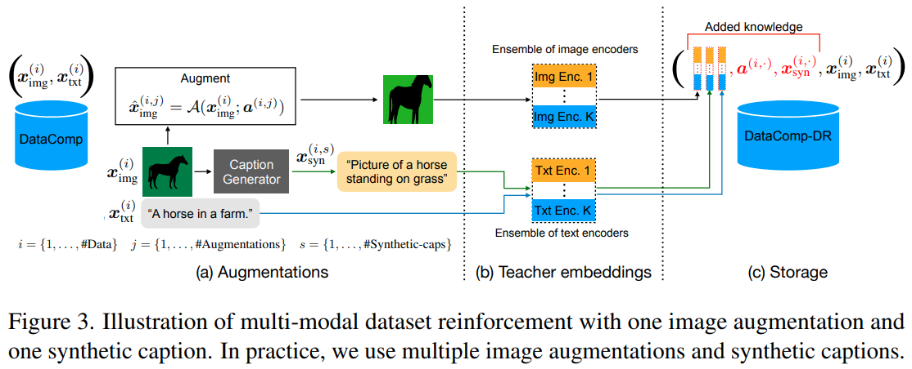
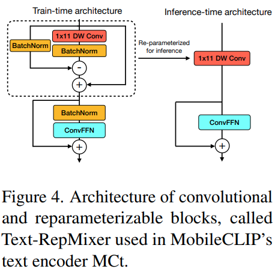

#多模态 #CVPR

- 代码: <https://github.com/apple/ml-mobileclip>
- 论文: <https://arxiv.org/abs/2311.17049>
- 会议: CVPR 2024
# Introduction

Specifically, we reinforce the image-text DataComp dataset by adding synthetic captions and embeddings from a strong ensemble of pretrained CLIP models (Fig. 3), obtaining DataCompDR.

通过在 DataComp 数据集上添加合成文本和嵌入的方式来得到增强版数据集,DataCompDR.

本文贡献:

1. 设计了一组用于移动设备的 CLIP 模型.采用来 CNN 和 transformer 的混合架构,并对于图像和文本编码器进行来结构重参数化.
2. 引入了多模态强化训练,这种训练策略节可以了从预训练的图像标题模型和一组强大的 CLIP 模型中转移来的知识,提高了学习效率.
3. 引入来两个增强数据集,DataCompDR-12M 和 DataCompDR-1B.相比 DataComp,学习效率可以提高 10~1000 倍.
4. ModileCILP 的结果 SOTA.

# Related Work

使用预训练图像标题模型来合成图像描述是可以提高 clip 模型质量和学习效率.离线知识蒸馏方法也是可以减轻大型教师模型在训练时带来的开销.

# Multi-Modal Reinforced Training

本文设计的多模态强化训练包含了两个部分:

1. 通过合成标题来利用图像标题模型的知识
2. 从一组强大的 Clip 模型中提取图像文本对齐的知识蒸馏.
本文参考了 [文献14](https://arxiv.org/abs/2303.08983) 中的数据集强化策略,将合成标题和教师模型嵌入也存储在数据集中,从而避免来图像标题模型和教师模型带来的额外训练开销.

## Dataset Reinforcement

使用 DataComp 以及数据过滤网络得到的数据虽然噪声低,但是文本描述可能不足.本文使用来 CoCa 模型来对每张图片生成多个合成标题.使用真实标题和合成标题结合,对于零样本检索和分类有很大好处.

然后我们对每张图像生成多个增强图片,并记录它们的增强参数方便复现.

我们使用模型集成来将一组 Clip 模型融合成教师模型,然后用每个 clip 模型计算我们的原始图片和增强图片的嵌入以及真实文本的嵌入.

## Training
### Loss function

总体损失等于原始 CLIP 损失和训练模型与各个教师模型输出嵌入的 JS 散度.具体如下:

用 $B$ 表示训练的图像文本对的 batch, 用 $\Psi_{\mathrm{img}}^{(k)}, \Psi_{\mathrm{txt}}^{(k)} \in \mathcal{R}^{b \times d_{k}}$ 表示第 $k$ 个教师模型对 $B$ 生成的 $d_k$ 图像文本关联矩阵. 同理我们用 $\Phi_{\mathrm{img}}, \Phi_{\mathrm{txt}} \in \mathcal{R}^{b \times d}$ 表示训练模型的图像文本关联矩阵. 给定矩阵 $U$ 和 $V$ ,则 $S_{\tau}(U,V) \in \mathcal{R}^{b \times d_{k}}$ 表示 $UV^T/\tau$ 应用行 softmax 等到的相似性矩阵, 这里 $\tau$ 表示温度系数.

$$
\begin{align}
L_{Total}(B) &= (1-\lambda)L_{CLIP}(B)+\lambda L_{Distill}(B) \\
L_{Distill}(B) &= \frac{1}{2}L^{I2T}_{Distill}(B)+\frac{1}{2}L^{T2I}_{Distill}(B) \\
L^{I2T}_{Distill}(B) &= \frac{1}{bK}\sum_{k=1}^K KL(S_{\tau_k}(\Psi_{\mathrm{img}}^{(k)}, \Psi_{\mathrm{txt}}^{(k)})||S_{\tau_k}(\Phi_{\mathrm{img}}, \Phi_{\mathrm{txt}}))
\end{align}
$$
