#多模态 #CVPR

- 代码: <https://github.com/apple/ml-mobileclip>
- 论文: <https://arxiv.org/abs/2311.17049>
- 会议: CVPR 2024
# Introduction

Specifically, we reinforce the image-text DataComp dataset by adding synthetic captions and embeddings from a strong ensemble of pretrained CLIP models (Fig. 3), obtaining DataCompDR.

通过在 DataComp 数据集上添加合成文本和嵌入的方式来得到增强版数据集,DataCompDR.

本文贡献:

1. 设计了一组用于移动设备的 CLIP 模型.采用来 CNN 和 transformer 的混合架构,并对于图像和文本编码器进行来结构重参数化.
2. 引入了多模态强化训练,这种训练策略节可以了从预训练的图像标题模型和一组强大的 CLIP 模型中转移来的知识,提高了学习效率.
3. 引入来两个增强数据集,DataCompDR-12M 和 DataCompDR-1B.相比 DataComp,学习效率可以提高 10~1000 倍.
4. ModileCILP 的结果 SOTA.

# Related Work

使用预训练图像标题模型来合成图像描述是可以提高 clip 模型质量和学习效率.离线知识蒸馏方法也是可以减轻大型教师模型在训练时带来的开销.

# Multi-Modal Reinforced Training

本文设计的多模态强化训练包含了两个部分:

1. 通过合成标题来利用图像标题模型的知识
2. 从一组强大的 Clip 模型中提取图像文本对齐的知识蒸馏.
本文参考了 [文献14](https://arxiv.org/abs/2303.08983) 中的数据集强化策略,将合成标题和教师模型嵌入也存储在数据集中,从而避免来图像标题模型和教师模型带来的额外训练开销.

## Dataset Reinforcement

使用 DataComp 以及数据过滤网络得到的数据虽然噪声低,但是文本描述可能不足.本文使用来 CoCa 模型来对每张图片生成多个合成标题.使用真实标题和合成标题结合,对于零样本检索和分类有很大好处.

然后我们对每张图像生成多个增强图片,并记录它们的增强参数方便复现.

我们使用模型集成来将一组 Clip 模型融合成教师模型,然后用每个 clip 模型计算我们的原始图片和增强图片的嵌入以及真实文本的嵌入.

## Training
### Loss function

总体损失等于原始 CLIP 损失和训练模型与各个教师模型输出嵌入的 JS 散度.具体如下:

用 $B$ 表示训练的图像文本对的 batch, 用 $\Psi_{\mathrm{img}}^{(k)}, \Psi_{\mathrm{txt}}^{(k)} \in \mathcal{R}^{b \times d_{k}}$ 表示第 $k$ 个教师模型对 $B$ 生成的 $d_k$ 图像文本关联矩阵. 同理我们用 $\Phi_{\mathrm{img}}, \Phi_{\mathrm{txt}} \in \mathcal{R}^{b \times d}$ 表示训练模型的图像文本关联矩阵. 给定矩阵 $U$ 和 $V$ ,则 $S_{\tau}(U,V) \in \mathcal{R}^{b \times d_{k}}$ 表示 $UV^T/\tau$ 应用行 softmax 等到的相似性矩阵, 这里 $\tau$ 表示温度系数.

$$
\begin{align}  
L_{Total}(B) &= (1-\lambda)L_{CLIP}(B)+\lambda L_{Distill}(B) \\
L_{Distill}(B) &= \frac{1}{2}L^{I2T}_{Distill}(B)+\frac{1}{2}L^{T2I}_{Distill}(B) \\
L^{I2T}_{Distill}(B) &= \frac{1}{bK}\sum_{k=1}^K KL(S_{\tau_k}(\Psi_{\mathrm{img}}^{(k)}, \Psi_{\mathrm{txt}}^{(k)})||S_{\tau_k}(\Phi_{\mathrm{img}}, \Phi_{\mathrm{txt}}))  
\end{align}
$$

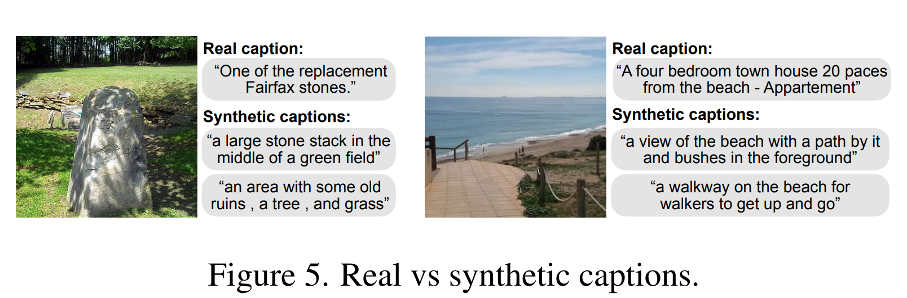

### Efficitent training

训练时, 对于每个样本, 我们从数据集中读取图像 $x^{(i)}_{img}$ 和对应的真实标签 $x^{(i)}_{txt}$ .然后随机加载增强参数 $a^{(i,j)}$ 并重现增强图像 $\hat{x}^{(i,j)}_{img}$ .然后随机加载一个对应的合成标签 $x^{(i,j)}_{syn}$ (每张图片都用 CoCa 生成了多个合成标题). 然后读取对应的教师模型 $k$ 生成的增强图片 $\hat{x}^{(i,j)}_{img}$ 的嵌入 $\psi^{(i,j,k)}_{img}$ ,合成标签 $x^{(i,j)}_{syn}$ 的嵌入 $\psi^{(i,s,k)}_{syn}$ ,以及真实标签文本 $x^{(i)}_{txt}$ 的嵌入 $\psi^{(i,k)}_{txt}$ .

然后我们使用增强图片, 真实标题构建一个数据 batch $B_{real}$ ,使用增强图像, 合成标题构建一个批次 $B_{syn}$ ,然后分别计算损失, 最终损失等于两者相加, 即:

$$
\sum_{B \in \{B_{real},B_{syn}\}} L_{Total}(B)
$$

# Architecture
## Text Encoder

本文发现纯卷积架构性能比对应的 Transformer 版本要差, 因此我们使用来一维卷积和自注意力层的结合.

我们引入了 Text-RepMixer, 这个架构可以重参数化. ConvFFN 的设计思路类似 [Conformer](https://developer.aliyun.com/article/1577359) ,具体参见附录 F.

### Image Encoder

基于 FastViT 架构, 我们引入了一种改进的 Transformer 架构, 简称 MCi.

在 FastViT 中, FFN 的 MLP 扩展比是 4 (即中间层维度: 输入维度=4:1). 本文将 MLP 扩展比降至 3 并增加来深度. 具体参见附录 A.MCi 0 和 [mobileone](https://arxiv.org/abs/2206.04040) 的配置一样, MCi 1 是 MCi 0 的加深版本, MCi 2 是 MCi 1 的加宽版本. 我们变体网络阶段的配置计算比和 Mobileone 类似, 这种设计的效率很高, 对模型容量也有较好提升.

# Experiments
### 训练设置

消融实验使用 12.8 M 图像文本对训练, batchsize 为 8192, 使用 8 xA 100 进行 30-45 k 迭代.

大规模训练使用 batchszie 为 65536, 使用 256 xA 100 进行 200 k 迭代. 模型都是从零开始训练, 具体详细见附录 B.

### 数据集

我们使用 Bestpool 过滤 DataComp 数据集, 得到 1.28 B 样本, 称为 DataComp-1 B.我们还在这个数据集中进行均匀采样来 12.8 M 对, 构成 DataComp-12 M.

### 增强 DataComp

我们使用我们的数据增强策略增强 DataComp-1 B 和 DataComp-12 M, 得到 DataCompDR-1 B 和 DataCompDR-12 M.我们使用 OpenCLIP 中的 coca_ViT-L-14 为每张图片生成 5 个合成标题, 并使用较强的图像增强 (DataCompDR-1 B 增强 10 次, DataCompDR-12 M 增强 30 次). 教师模型我们使用来 OpenCLIP 中 `datacomp_xl_s13b_b90k` 和 `openai` 预训练的 ViT-L-14. 教师模型存储的嵌入大小为 1536 维 (由 2 个 768 维向量组成). 我们使用无损压缩和 BFloat 16 来存储所有的增强. 一个 DataCompDR 的样本是一个三元组, 包括一个随机增强图片, 一个 gt 标题, 一个随机挑选的合成标题.

### MobileCLIP 架构

训练了三个小变体, `MobileCLIP-S0(MCi0;MCt)`, `MobileCLIP-s1(MCi1:Base)`, `MobileCLIP-S2(MCi2:Base)`. 这里 Base 是一个 12 层 Transformer, 类似基于 ViT-B/16 的 CLIP 文本编码器.

## 消融实验

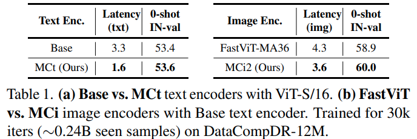

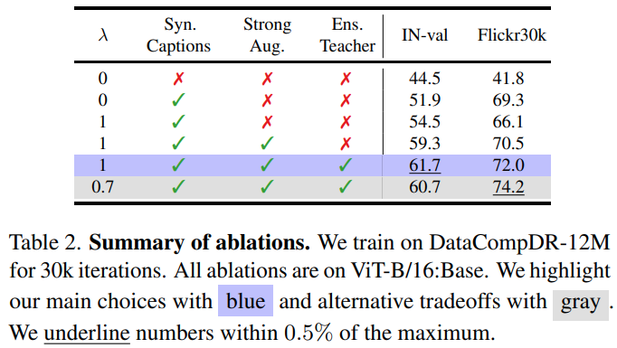

使用合成标题能提升 25 个点. 一般 CLIP 中都用轻微图像增强来避免图像和文本错位, 而我们用了较强的增强. 具体消融见附录 C.

注意本文中, 大规模实验中, 损失的权重 $\lambda=0.7$ ,而对于小型变体, $\lambda=1.0$ .(这意思就是小型变体纯纯走蒸馏).

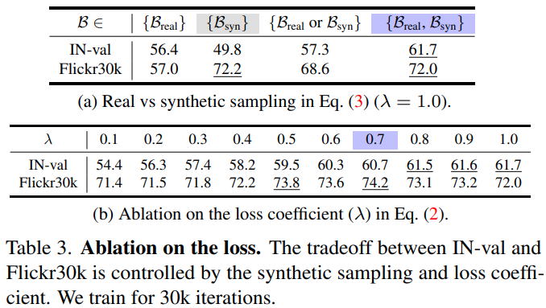

还是一个 batch 里面均衡采样, 同时包含真实标题和合成标题比较好.

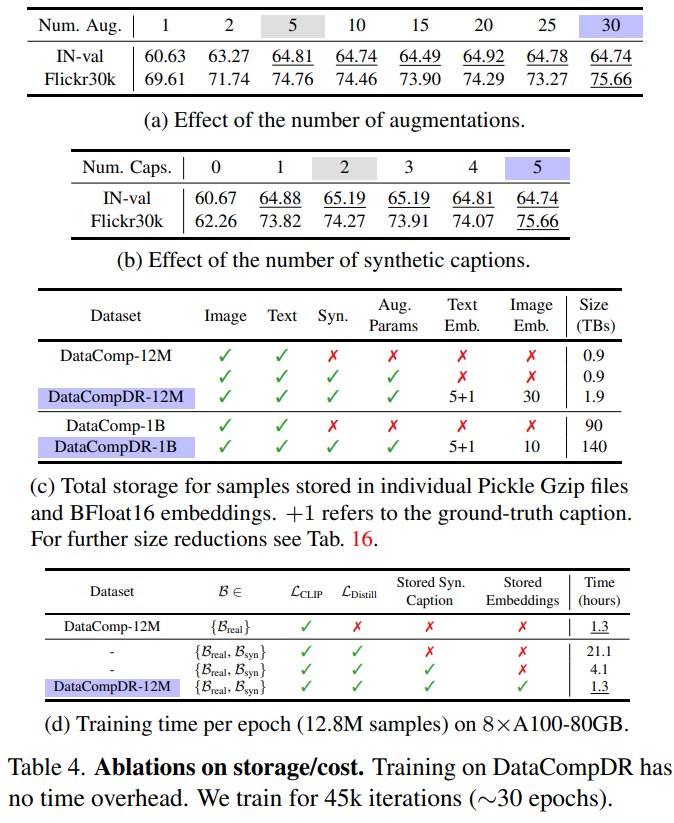

这个主要研究增强图像次数和合成标题数量的影响. 性能在使用 5 次增强和 2 次合成标题时几近饱和, 这说明每个增强在模型完全学习到新知识之前可以被重复使用多次. 但是本次实验为了获得最佳性能, 对于 `DataCompDR-12M` 和 `DataCompDR-1B` 上我们分别使用来 10 和 30 次图像增强, 5 个合成标题.

表 4 d 表明了在线合成标题和字幕生成以及离线做这些的时间代价, 表上时间是使用 8 xA 100 在 `DataCompDR-12M` 上, 对常规 CLIP 进行一个 epoch 训练的时间. 一个 epoch 需要 1562 次迭代, batchsize 我们设置为 8192.

我们将一个文本对的所有增强使用一个 Pickle 格式文件存储, 并使用 Gzip 压缩. 这里嵌入使用的是 BFloat 16 来保存的. 附录 E 展示了这样做尺寸节省的分析以及 BFloat 16 不会影响准确性. 我们建议在 `DataCompDR-12M` 上使用 5 个增强/合成标题训练 30 个 epoch, 在 DataCompDR-1 B 上使用 2 个增强训练 10 个 epoch.

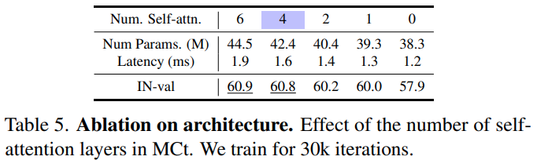

在对于文本编码器架构的消融实验上. 我们使用一个 6 层纯卷积文本编码器为基础, 在中间系统性的引入自注意力层. 最佳权衡是用 4 个自注意力层和 2 个 Text-RepMixer 层.

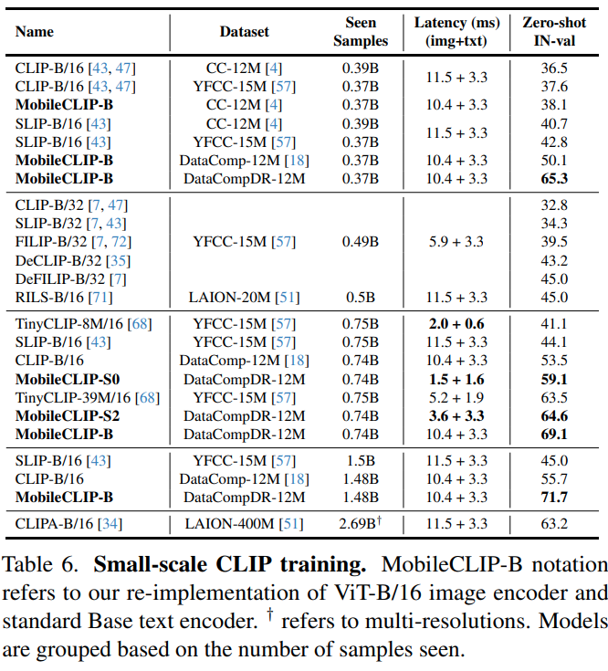

表 6 展示来 mobileclip-b 在样本利用率, 运行效率上的优势.

## 学习效率

[使用知识蒸馏来进行更长时间训练已被证明可以持续提高分类模型表现.](https://arxiv.org/abs/2106.05237)

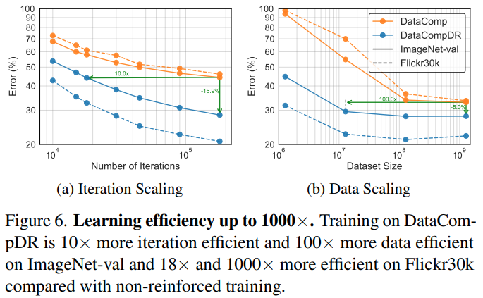

图 6 b 中所有实验, 我们进行了 20 k 次迭代, 全局 batchsize 为 65 k (相当于在 1.28 B 子集上一个 epoch 的训练).

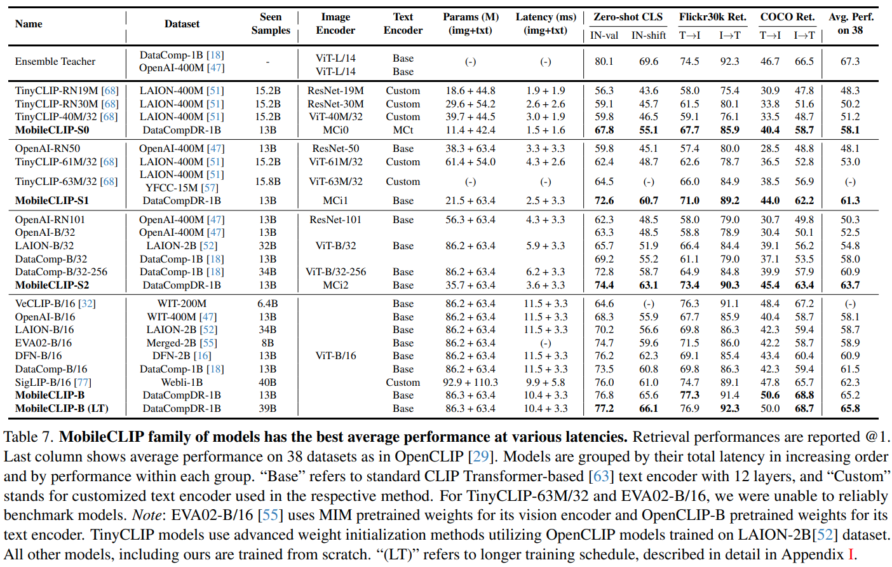

注意上表中 Base 指基于 CLIP Transformer 的标准 12 层文本编码器,"Custom" 指使用对应方法中的定制文本编码器. EVA 02-B/16 视觉编码器用的 MIM 预训练, 文本编码器使用 OpenCLIP-B.TinyCLIP 使用了 OpenLIP 在 LION-2 B 上训练的高级权重初始化方法. 所有模型均为重头开始训练, LT 代表了更长的训练时间.

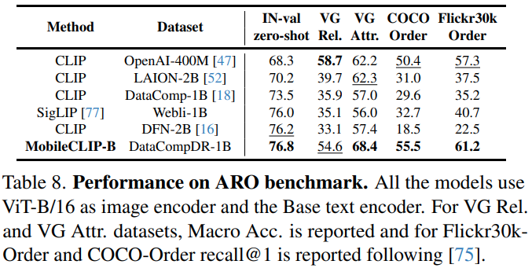

表 8 展示了模型的检索性能.

# 附录 A

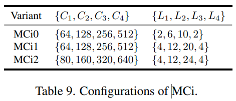

表 9 展示了我们三个不同变体的配置

## 附录 B 实验设置

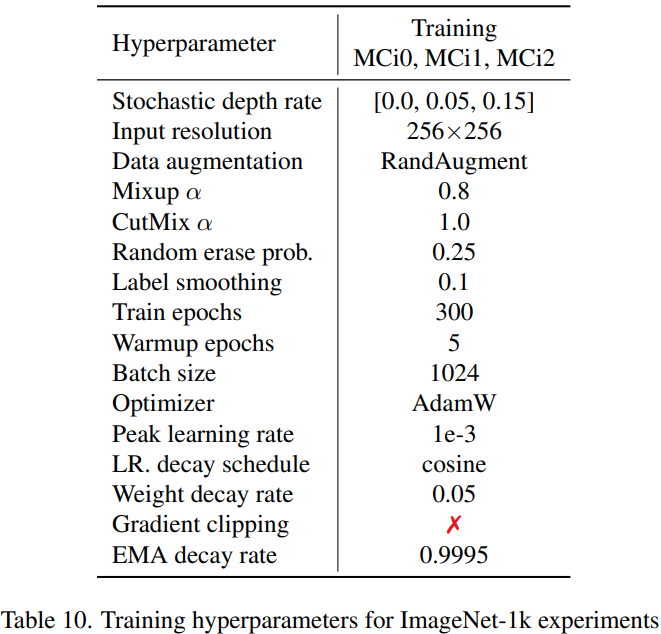

在 DataCompDR-12 M 上的实验, batchsize 都是 8192. 蒸馏的教师模型为 RegNetY-15 GF, 实现用的 timm 库. 训练硬件使用 8 XA 100.

## 附录 C 图像增强

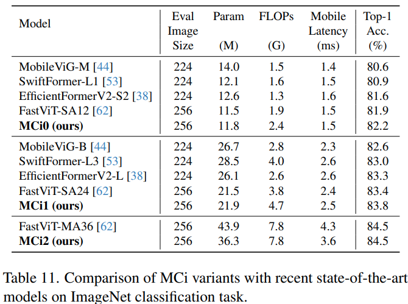

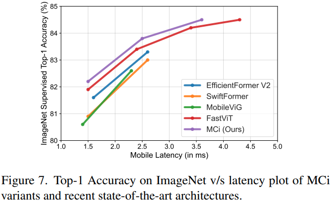

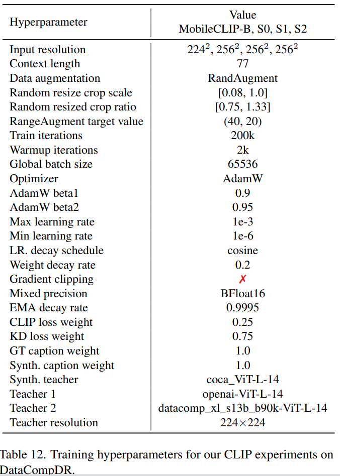

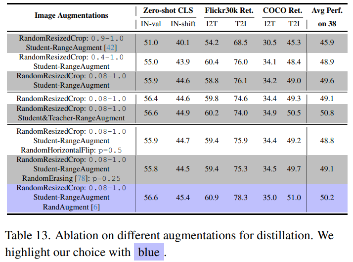

分析图像增强影响, 我们使用的是 8 M 子集. 表 13 中, 我们展示的是基于 ViT-B/16 的 CLIP 模型, 损失函数为本文的损失.