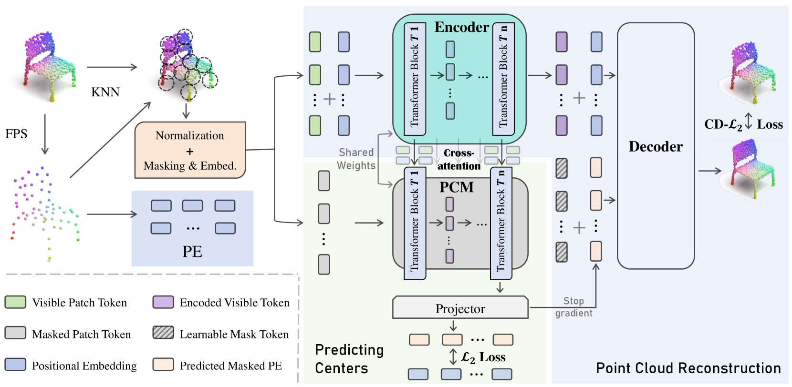

#3D点云 #自监督 

#  PCP-MAE: Learning to Predict Centers for Point Masked Autoencoders

- 论文： <https://arxiv.org/abs/2408.08753>  
- 代码： <https://github.com/aHapBean/PCP-MAE>
- 会议： NIPS 2024

先对点云进行 [最远点采样（Farthest Point Sampling，FPS）](../../DL_knowlege/Farthest%20Point%20Sampling.md) 和 KNN 将点云划分成 Patch，之后每个 patch 取中心和归一化，然后分为可见和 mask，其中中心点作为位置编码（positional embedding，PE）。然后分别进入编码器。这里 $CD-L_2$ 是 [Chamfer Distance Loss Function](../../DL_knowlege/Chamfer%20Distance%20Loss%20Function.md)

## Patch 形成方法

先对点云应用 FPS，采样得到 N 个中心，然后对 N 个中心应用 KNN，每个中心取 k 个点形成 N 个 patch，patch size 为 N，K，3。

这里 Visible Patch Token 的生成方式类似 Point-BERT，先用 mini-pointnet 生成嵌入。

## Positonal Embedding 形成方式

先对每个 FPS 的中心，遵循 VisionMAE 中的方式，采用如下公式计算出位置嵌入：

$$
\text{PE}_x = \left[ \sin \left( \frac{x}{e^{2 \times \frac{1}{D/6}}} \right), \cos \left( \frac{x}{e^{2 \times \frac{1}{D/6}}} \right), \sin \left( \frac{x}{e^{2 \times \frac{2}{D/6}}} \right), \cos \left( \frac{x}{e^{2 \times \frac{2}{D/6}}} \right), \ldots, \sin \left( \frac{x}{e^2} \right), \cos \left( \frac{x}{e^2} \right) \right]
$$

然后把这个输入到一个可学习的 MLP ，称为（PEM）, 再把 xyz 直接在 hidden dim 上链接起来，获得最终的 PE，典型的重参数化技巧。

## Mask 方式

对补丁的地方用全局随机补丁

## 实验细节

对于每个输入点云，我们首先应用缩放和平移操作，然后对预训练数据进行旋转以进行数据增强。从输入点云中通过最远点采样（FPS）采样 1024 个点后，将其分为 64 个点块，每个点块包含 32 个点，使用 FPS 和 K- 最近邻（KNN）选择。PCP-MAE 使用 AdamW 优化器 AdamWOptimizer 进行预训练，批大小为 128。初始学习率设置为 0.0005，权重衰减为 0.05。使用余弦学习率衰减调度器 cosLrDecay。

预训练是在 ShapeNet 上进行预训练