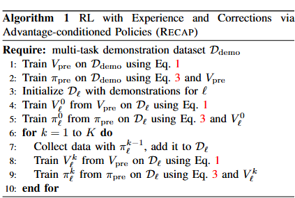

#VLA #具身智能 

[toc]

# Pi0.6：a VLA That Learns From Experience
- 论文：<https://www.physicalintelligence.company/download/pistar06.pdf>
- Blog：[A VLA that Learns from Experience](https://www.physicalintelligence.company/blog/pistar06)

## 整体框架

论文先进行了使用离线强化学习的预训练，之后再针对目标任务进行微调，所有的训练包括预训练都遵循通用的程序。

整体循环训练方式如下：

每次训练遵循以下三步:

1.  收集数据。我们在任务上运行 VLA，为每个情节标 注任务结果标签（这些标签决定了奖励），并可选地提 供人类干预，以提供对早期迭代中错误的修正示例。
2. 价值函数训练。我们使用迄今为止收集的所有数据来训练一个大型、多任务的价值函数，我们将其称为 $V^{\pi_{ref}}$ ，该函数可以检测失败并判断任务完成的预期时间。
3. 基于优势条件的训练。为了利用这个价值函数来改进 VLA 的策 略，我们加入了一个基于从数据中提取的优势值的优化指标。
上表中 12 是预训练，3 45 是微调，6789 是持续提升的循环。

## 预训练
### 数据集

数据集混合方式类似 Pi0.5，包含网络 VL 数据，子任务的预测形成，以及多种不同机器人执行的低级动作预测

### 训练方式
#### 价值函数训练
##### 价值函数模型

使用和 VLA 同架构但更小的网络，670M 的 VLM 

##### 训练目标

训练网络预测轨迹的剩余步数（负值），如果是失败轨迹，负值更大。

对于单个轨迹每个动作帧，其奖励函数如下：

$$
r_t = \begin{cases} 0 & \text{if } t = T \text{ and success} \\ 
-C_{\text{fail}} & \text{if } t = T \text{ and failure} \\
-1 & \text{otherwise} \end{cases} \tag{5}
$$

$T$ 是轨迹最后一步， $C_{fail}$ 是个巨大的常数。取每个动作帧剩余步骤的数量作为当前的动作帧价值 $R_t(\tau) = \sum_{t'=t}^{T} r_{t'}$ （累积回报），然后统计整个数据集每帧的动作帧价值，然后分箱成 201 个区间类别，然后训练网络用交叉熵做分类，其优化的 loss 为公式 1：

$$
\min_{\phi} \mathbb{E}_{\tau \in \mathcal{D}} \left[ \sum_{\mathbf{o}_t \in \tau} H(R_t^B(\tau), p_\phi(V | \mathbf{o}_t, \ell)) \right]. \tag{1}
$$

实际使用中预测值是 -1~0，然后通过对应任务最长序列的帧数反序列化回去。

#### 离线 RL 训练

对于 actor 模型，即 policy，训练 loss 为：

$$

\begin{gather}

\min_\theta \mathbb{E}_{\mathcal{D}^{\pi_{\text{ref}}}} \left[ -\log \pi_\theta(\mathbf{a}_t | \mathbf{o}_t, \ell) - \alpha \log \pi_\theta(\mathbf{a}_t | I_t, \mathbf{o}_t, \ell) \right],    \\
\text{where } I_t = \mathbb{1}\left( A^{\pi_{\text{ref}}}(\mathbf{o}_t, \mathbf{a}_t, \ell) > \epsilon_\ell \right).  \tag{3}

\end{gather}
$$

##### VLM 额外输入条件的计算

这里 $I_t$ 为当优势 $A^{\pi_{\text{ref}}}(\mathbf{o}_t, \mathbf{a}_t, \ell)$ 大于阈值 $\epsilon_\ell$ 时，在 VLM 添加 "Advantage: positive"，否则添加 "Advantage: negative"。

优势，阈值 $\ell$ 的计算具体参见以下细节部分 [优势的计算](#优势的计算)

注意，若轨迹有人工干预，那么 $I_t$ 为 1

训练时，用 30% 概率丢弃 $I_t$ ,即 0.7 概率训练计算 loss 函数后一项，0.3 概率计算 loss 函数前一项。     

#### 策略似然的计算

FAST 输出的离散动作可以输出似然，但是 flow matching 部分的连续动作无法精确计算对数似然。

离散动作的似然直接计算每个 token 的概率，然后连乘得到轨迹概率。

本文将离散动作的对数似然与连续动作的流匹配损失之和大致视为整体动作似然的下界。

$$
\begin{gather}
\log \pi_\theta(\mathbf{a}_{t:t+H}, a^\ell_{t:t+H} | I_t, \mathbf{o}_t, \ell, \hat{\ell}) \geq  \\
\mathbb{E}_{\eta,\omega} \bigg[ \log p_\theta(a^\ell_{t:t+H} | I_t, \mathbf{o}_t, \ell, \hat{\ell}) - \\
\alpha_\eta \left\| \omega - \mathbf{a}_{t:t+H} - f_\theta(\mathbf{a}^{\eta,\omega}_{t:t+H}, I_t, \mathbf{o}_t, \ell, \hat{\ell}) \right\|^2 \bigg]  \tag{4}
\end{gather}
$$

其中，使用 $\eta_t^\omega$ 表示带噪声的动作 $a_{t+H} = \eta a_{t:t+H} + (1-\eta)\omega$ ， $\omega \sim \mathcal{N}(0,1)$ ，其中 $\eta \in [0,1]$ 是流匹配的时间索引， $f_\theta$ 表示扩散专家的连续输出。 $\alpha_\eta$ 是一个损失加权项（可以选择性地依赖于噪声）.

## 推理部署

实际推理时有两种用法，公式 2 展示了策略的选择方式：

$$
\hat{\pi}(\mathbf{a},|\mathbf{o},\ell) \propto \pi_{\mathrm{ref}}(\mathbf{a}|\mathbf{o},\ell) \left( \frac{\pi_{\mathrm{ref}}(\mathbf{a}|I,\mathbf{o},\ell)}{\pi_{\mathrm{ref}}(\mathbf{a}|\mathbf{o},\ell)} \right)^{\beta}  \tag{2}
$$

#### 方法 1

将公式 2 中 $\beta=1$ ,如此 $\hat{\pi}(\mathbf{a},|\mathbf{o},\ell) = \pi_{\mathrm{ref}}(\mathbf{a}|I,\mathbf{o},\ell)$ ,将 I 设置为 "Advantage: positive"，此时只需推理一遍。

#### 方法 2

依据公式 2，在一个 batch 中包含无条件的推理和 I 为 "Advantage: positive" 推理，从论文附录 E 可知，公式 2 取对数为公式 13：

$$
\nabla_{\mathbf{a}} \log \pi_{\theta}(\mathbf{a}_{t:t+H}|\mathbf{o}_t,\ell) + \ \beta \left( \nabla_{\mathbf{a}} \log \pi_{\theta}(\mathbf{a}_{t:t+H}|I_t,\mathbf{o}_t,\ell) - \nabla_{\mathbf{a}} \log \pi_{\theta}(\mathbf{a}_{t:t+H}|\mathbf{o}_t,\ell) \right),  \tag{13}
$$

这里的 $\nabla_{\mathbf{a}} \log \pi_{\theta}$ 实际就是 flow matching 输出的速度场或者 diffusion 输出的噪声。公式 13 得到一个新的速度场或者噪声，然后使用 ODE 生成器，得到最终网络。

### 结果
1. 文章还尝试了 AWR 和 PPO，但是效果不好，甚至不如 SFT。因为 PPO 需要使用一个小的信任区间来约束 policy，训练稳定但是效果不好。AWR 生成策略速度慢，吞吐量差。

## 一些细节
### 优势的计算

计算公式如下：

$$
A^\pi(o_t, a_t) = \mathbb{E}_{p_\pi(\tau)} \left[ \sum_{t'=t}^{t+N-1} r_{t'} + V^\pi(o_{t+N}) \right] - V^\pi(o_t)
$$

其中每个符号的含义需结合文章的强化学习（RL）设定理解：

| 符号                              | 文章定义                                                                               |
| ------------------------------- | ---------------------------------------------------------------------------------- |
| $A^{\pi}(o_t, a_t)$             | 参考 policy $\pi$ 下，“观测 $o_t$ 时执行动作 $a_t$” 的优势值：- 若 $A>0$：该动作比平均水平好；- 若 $A<0$：该动作比平均水平差。 |
| $\mathbb{E}_{\rho_{\pi}(\tau)}$ | 对 policy $\pi$ 诱导的轨迹分布 $\rho_{\pi}(\tau)$ 的期望（即对所有可能后续轨迹的平均）。                       |
| $N$                             | “n 步前瞻” 参数：计算优势时考虑 “当前步 $t$ 到未来 $t+N-1$ 步” 的回报，平衡偏差与方差。                              |
| $r_{t'}$                        | 时刻 $t'$ 的即时奖励：文章中是**稀疏奖励**（文档 V.C），如成功结束得 0、失败得 $-C_{fail}$、中间步骤得 $-1$。               |
| $V^{\pi}(o_{t+N})$              | policy $\pi$ 下，观测 $o_{t+N}$ 的 “价值”：即从 $o_{t+N}$ 开始到任务结束的期望累积奖励。                      |
| $V^{\pi}(o_t)$                  | policy $\pi$ 下，当前观测 $o_t$ 的价值（平均期望回报）。                                              |

**核心逻辑**：优势值 = “执行动作 $a_t$ 后未来 N 步的期望总回报” - “不执行该动作时的平均期望回报（当前价值）”，本质是量化动作的 “额外收益”。

### 二、优势的分阶段工程实现（文档 V.D、附录 F）

文章在 “预训练（Pre-training）” 和 “训练后迭代（Post-training）” 两个阶段，对优势的计算做了针对性调整，核心差异在于 “n 步前瞻参数 $N$” 的选择，以适配不同数据场景：

#### 1. 预训练阶段：用 “全 episode 回报” 计算优势（$N=T$）

预训练时，模型使用 “多任务、多机器人” 的海量演示数据（数万小时），为简化计算并适配多样数据，将 “n 步前瞻 $N$” 设为**每个 episode 的总步数**$T$（即覆盖整个任务周期），此时优势公式简化为：

$$
A^{\pi_{ref}}(o_t, a_t, \ell) = \sum_{t'=0}^{T} r_{t'} - V^{\pi_{ref}}(o_t, \ell) 
$$

- **关键细节**：

- $\sum_{t'=0}^T r_{t'}$：当前轨迹的 “总 empirical 回报”（实际执行后观测到的总奖励，非期望），因为预训练数据是已收集的演示轨迹，可直接计算。

- $V^{\pi_{ref}}(o_t, \ell)$：从 “分布型价值函数” 中提取的连续值（文档 IV.A）：

文章先将价值函数训练为离散分布 $p_{\phi}(V | o_t, \ell)$（映射到 201 个离散价值 bin），再通过 “加权求和” 得到连续价值：

$$
V^{\pi_{ref}}(o_t, \ell) = \sum_{b=0}^{200} p_{\phi}(V=b | o_t, \ell) \cdot v(b) 
$$

其中 $v(b)$ 是第 $b$ 个 bin 对应的实际价值（如 “剩余步数的负数”，文档 V.C）。

- **为什么这么设计**：无需多次调用价值函数计算未来 N 步价值，仅需 1 次 inference 即可得到当前 $o_t$ 的价值，适合大规模预训练数据的高效处理。

#### 2. 训练后迭代阶段：用 “固定 50 步前瞻” 计算优势（$N=50$）

预训练完成后，模型需通过 “自主 rollout 数据” 迭代优化，此时采用**固定的 50 步前瞻（**$N=50$**）**，优势公式还原为基础定义的简化版（省略期望符号，因用实际轨迹数据计算）：

$$
A^{\pi_{ref}}(o_t, a_t, \ell) = \left( \sum_{t'=t}^{t+49} r_{t'} + V^{\pi_{ref}}(o_{t+50}, \ell) \right) - V^{\pi_{ref}}(o_t, \ell) 
$$

- **关键细节**：

- $N=50$ 的选择：文章通过实验验证，50 步前瞻既能覆盖 “短期动作影响”（如机器人抓握、折叠的关键步骤），又不会因前瞻过长导致方差过大（文档附录 F）。

- $o_{t+50}$ 的获取：从当前轨迹中直接提取 “未来第 50 步的观测”（无需额外采样），确保计算基于真实执行数据，贴合实际部署场景。

- 价值函数的更新：每次迭代前会用 “最新收集的自主数据 + 专家干预数据” 重新微调价值函数（文档 IV.A、V.D），确保 $V^{\pi_{ref}}$ 能准确评估当前 policy 的动作价值。

### 三、优势的关键辅助设定（与计算相关）

为了让优势值能有效用于 “政策提取（Policy Extraction）”，文章还做了两个关键设定，虽不直接属于 “计算步骤”，但影响优势的使用：

1. **优势阈值**$\epsilon_{\ell}$**（任务相关）**：
对每个任务 $\ell$，设定一个阈值 $\epsilon_{\ell}$，判断动作是否为 “改进动作”：

$$
I_t = \mathbb{1}\left( A^{\pi_{ref}}(o_t, a_t, \ell) > \epsilon_{\ell} \right) 
$$

其中 $I_t$ 是 “改进指示器”（用于 $\pi_{0.6}^*$ 的优势条件训练），阈值 $\epsilon_{\ell}$ 的设置为：

- 预训练：设为该任务价值函数预测值的**30% 分位数**（确保仅 30% 的演示动作被判定为 “改进动作”）；
- 微调阶段：设为**40% 分位数**（适配自主数据的多样性，文档 V.D、附录 F）。
- 个别诸如叠衣服高难任务：设置为 10%
1. **优势与人类干预的结合**：
对 “专家干预的纠正动作”，强制设 $A^{\pi_{ref}} > \epsilon_{\ell}$（即 $I_t=1$），因默认人类纠正动作是 “最优动作”，无需通过价值函数计算优势（文档 IV.B）。

