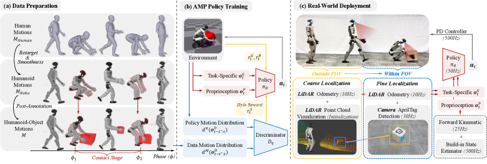

# PhysHSI: Towards a Real-World Generalizable and Natural Humanoid-Scene Interaction System

#具身智能 #manipulation #强化学习 

- 论文：[[2510.11072v1] PhysHSI: Towards a Real-World Generalizable and Natural Humanoid-Scene Interaction System](https://arxiv.org/abs/2510.11072v1)
- 代码：[InternRobotics/PhysHSI: Official implementation of the paper: "PhysHSI: Towards a Real-World Generalizable and Natural Humanoid-Scene Interaction System"](https://github.com/InternRobotics/PhysHSI)
- 项目：[PhysHSI: Towards a Real-World Generalizable and Natural Humanoid-Scene Interaction System](https://why618188.github.io/physhsi/)

# 动机

构建人机场景交互 (humanoid-scene interaction, HSI) 难度大。现有方法中：基于运控或者轨迹优化，计算成本高，前提假设多。基于 RL 的方法，若从头学 policy，奖励设计负担大；使用动捕（MoCap）做先验依赖于完美场景观测，现实观测不全，sim2real 难。

# 方法

整体方法分三部分：

1. 数据准备
2. AMP 训练
3. 真实世界迁移
## 数据准备

数据重定向方法比较简单，通过缩放优化将 AMASS 和 SAMP 的 SMPL 动作定位到人形上，用平滑滤波抑制抖动，得到仅包含动作，无物体信息的数据集 $M_{Robo}$ 。接下来就是想办法生成带有连贯物体信息的数据了。 

手动标注接触起始帧（拾取 $\phi_1$ ,放置 $\phi_2$ ），拾取前，物体设定一个位置，携带中，设置物体位置在双手中点，方向和机器人基座对齐，放置后，物体再设定一个位置。这样产生一个增强的人形数据集 $M$ ,其中其对象位置一致且物理上连贯

**这里如何生成物体和动作完全匹配还需要近一步验证**

## AMP 策略训练
### 观测

每个时间步 t，输入观测包含过去 5 个时间步的历史本体感知 $o^P_{t-4:t}$ 和任务观测 $o^G_{t-4:t}$ 。

####    本体感知

$$
\mathbf{o}_t^p \triangleq \left[ \omega_{b_t}, \mathbf{g}_{b_t}, \theta_t, \dot{\theta}_t, \mathbf{p}_{b_t}^{ee}, \mathbf{a}_{t-1} \right], \tag{1}
$$

参见 [符号表](#符号表)，即本体感知包含，基座角速度，重力方向，关节位置，关节速度，手脚头 5 个末端在基座坐标系中的 3D 位置，前一时间执行的动作。

> （ $\triangleq$ ）表示定义为

#### 任务观测

一般包含物体的边界框 $\mathbf{b}_t \in \mathbb{R}^3$ ，物体位置 $\mathbf{p}_{b_t}^{o_t} \in \mathbb{R}^3$ ，方向 $\mathbf{R}_{b_t}^{o_t} \in \mathbb{R}^6$ ，使用 [6D 法线 - 切线表示法](../../DL_knowlege/6D法切向量表示法.md)，以及物体目标放置位置 $\mathbf{p}_{b_t}^{g_t} \in \mathbb{R}^3$ ,以上均以机器人基座标表示。

#### 判别器观测

$$
\mathbf{o}_t^{\mathcal{D}} \triangleq \left[ h_t, \mathbf{v}_{b_t}, \boldsymbol{\omega}_{b_t}, \mathbf{g}_{b_t}, \boldsymbol{\theta}_t, \mathbf{p}_{b_t}^{ee}, \mathbf{p}_{b_t}^{o_t} \right]  \tag{2}
$$

参见 [符号表](#符号表)，即基座高度，基座线速度，角速度，重力方向，关节位置，末端位置，目标物位置

### 奖励

不少奖励设计参考了 [ASAP](https://arxiv.org/abs/2502.01143)

奖励形式上如下：

$$
r_t \triangleq w^G r_t^G + w^R r_t^R + w^S r_t^S
$$

其中 $w$ 是系数， $r_t^G$ 是任务奖励， $r_t^R$ 是能量约束正则化奖励，惩罚过大扭矩和速度， $r_t^S$ 是风格奖励，鼓励机器人模仿参考运动数据集中的行为。

#### 风格奖励 

基本就是 AMP 中判别器的训练目标：

其中判别器的优化目标如下：

$$
\begin{aligned}
\arg\min_{\mathcal{D}}  
&-\mathbb{E}_{d^M(\mathbf{o}_{t:t+t^*}^{\mathcal{D}})}\!\left[\log\left(\mathcal{D}(\mathbf{o}_{t:t+t^*}^{\mathcal{D}})\right)\right] \\
&-\mathbb{E}_{d^{\pi}(\mathbf{o}_{t:t+t^*}^{\mathcal{D}})}\!\left[\log\left(1 - \mathcal{D}(\mathbf{o}_{t:t+t^*}^{\mathcal{D}})\right)\right] \\
&+ w^{\mathrm{gp}} \, \mathbb{E}_{d^M(\mathbf{o}_{t:t+t^*}^{p})}\!\left[ \left\|\nabla_\eta\,\mathcal{D}(\eta)\big|_{\eta = \mathbf{o}_{t:t+t^*}^{\mathcal{D}}}\right\|^2 \right] 
\end{aligned}  \tag{3}
$$

基本就是参考动作标签 1，policy 动作标签 0，同时限定参考动作梯度的大小，从而不让判别器过拟合在参考动作细节上。其中 $d^M$ 表示参考动作分布， $d^{\pi}$ 表示策略输出动作分布。

风格奖励形式为：

$$
r_t^S \triangleq -\log\left(1 - \mathcal{D}(\mathbf{o}_{t-t^*:t}^{\mathcal{D}})\right).   \tag{4}
$$

即判别器输出越靠近参考动作，奖励越高。

#### 正则化奖励

具体参见原文附录 7-B1，其权重如下：

| Term | Weight |
| ---- | ------ |
| 速度   | -2e-4  |
| 加速度  | -1e-7  |
| 位置限制 | -5.0   |
| 速度限制 | -1e-3  |
| 扭矩   | -1e-4  |
| 扭矩限制 | -0.1   |
| 动作率  | -0.03  |

#### 任务奖励

具体参见原文附录

##### 搬箱子任务

$$
r_t^{G\_carryBox} = r_t^{\mathrm{loco}} + r_t^{\mathrm{carry}} + r_t^{\mathrm{pick}} + r_t^{\mathrm{put}}  \tag{13}
$$

分了 4 个阶段：定位箱子 loco，搬起箱子 carry, 搬动过程 pick，放置过程 put

**定位箱子奖励：**
鼓励机器人以合适的速度走向箱子

$$
r_t^{\mathrm{loco}} = \begin{cases} 
1.5, & \left\| \mathbf{p}_{xy}^{o_i} - \mathbf{p}_{xy}^{b_t} \right\| < 0.7 \\ 
1.0 \exp\left( -5.0 \left\| 0.85 - \mathbf{d}_t^* \cdot \dot{\mathbf{p}}_{xy} \right\|^2 \right) + 
0.5 \exp\left( -0.75 \left\| \Delta\theta(\mathbf{d}_t^*, \mathbf{d}_{b_t}) \right\| \right), & \text{otherwise} 
\end{cases}   \tag{8}
$$

 $\mathbf{p}_{xy}^{o_i}$ 和 $\mathbf{p}_{xy}^{b_t}$ 分别表示物体和机器人基座在世界坐标系中的二维位置。 $\mathbf{d}_t^*$ 是从 $\mathbf{p}_{xy}^{b_t}$ 指向 $\mathbf{p}_{xy}^{o_i}$ 的水平单位向量， $\mathbf{d}_{b_t}$ 是机器人基座在世界坐标系中的二维水平单位向量, $\dot{\mathbf{p}}_{xy}$ 是机器人在世界坐标系移动的速度向量， $a \cdot b$ 表示向量点积。 $\Delta\theta(\mathbf{d}_t^*, \mathbf{d}_{b_t})$ 是目标航向与基座航向之间的偏航误差，定义为：

 $$
 \Delta\theta(\mathbf{a}, \mathbf{b}) = \arctan2(\mathbf{a}_y, \mathbf{a}_x) - \arctan2(\mathbf{b}_y, \mathbf{b}_x) \tag{9}
 $$

_即机器人离箱子距离小于 0.7，奖 1.5. 后面 $1.0 \exp\left( -5.0 \left\| 0.85 - \mathbf{d}_t^* \cdot \dot{\mathbf{p}}_{xy} \right\|^2 \right)$ 是速度奖励，奖励机器人以 0.85 的速度向箱子走，再后面一项是偏航角奖励_

**搬起箱子奖励：**
鼓励机器人拿起箱子并将其移动到目标位置。

$$
r_t^{\mathrm{carry}} = \begin{cases} 
0.0, & \left\| \mathbf{p}_{xy}^{o_i} - \mathbf{p}_{xy}^{b_t} \right\| > 0.7 \\ 
2.2, & \left\| \mathbf{p}_{xy}^{b_t} - \mathbf{p}_{xy}^{g_t} \right\| < 0.7 \\ 
1.0 \exp\left( -5.0 \left\| 0.85 - \mathbf{d}_t^\# \cdot \dot{\mathbf{p}}_{xy}^{b_t} \right\|^2 \right) + \\ 
\quad 0.5 \exp\left( -0.75 \left\| \Delta\theta(\mathbf{d}_t^\#, \mathbf{d}_{b_t}) \right\| \right) + \\ 
\quad 0.7 \exp\left( -3.0 \left\| \mathbf{p}^{o_t} - \mathbf{p}^{\mathrm{hand_t}} \right\|^2 \right), & \text{otherwise} 
\end{cases}
$$

 $\mathbf{p}_{xy}^{g_t}$ 表示世界坐标系中目标位置的二维坐标， $\mathbf{d}_t^\#$ 是从 $\mathbf{p}_{xy}^{b_t}$ 指向 $\mathbf{p}_{xy}^{g_t}$ 的水平单位向量， $\mathbf{p}^{\mathrm{hand}}$ 表示机器人双手的平均三维坐标， $p^{o_t}$ 是物体的位置三维坐标。 

 _即机器人离箱子大于 0.7 没奖，距离放置点小于 0.7 奖 2.2, 除开同款的速度方向奖励之外加了个箱子和手的奖励鼓励机器人双手夹抱住箱子_

**搬运奖励：**
鼓励机器人把箱子抬一定高度。

$$
r_t^{\mathrm{pick}} = \begin{cases} 
0.0, & \left\| \mathbf{p}_{xy}^{o_i} - \mathbf{p}_{xy}^{b_t} \right\| > 0.7 \\ 
2.0, & \left\| \mathbf{p}_{xy}^{b_t} - \mathbf{p}_{xy}^{g_t} \right\| < 0.7 \text{ or } \mathbf{p}_z^{o_i} > 0.75 \\ 
2.0 \exp\left( -3.0 \left\| 0.75 - \mathbf{p}_z^{o_i} \right\| \right), & \text{otherwise} 
\end{cases}
$$

$\mathbf{p}_z^{o_t}$ 表示世界坐标系中箱子高度。

**放置奖励：**
鼓励机器人将箱子准确放置在目标位置

$$
r_t^{\mathrm{put}} = \begin{cases} 
0.0, & \left\| \mathbf{p}_{xy}^{b_t} - \mathbf{p}_{xy}^{g_t} \right\| > 0.7 \\ 
2.0, & \left\| \mathbf{p}^{o_t} - \mathbf{p}^{g_t} \right\| < 0.05 \\ 
1.0 \exp\left( -10.0 \left\| \mathbf{p}^{o_t} - \mathbf{p}^{g_t} \right\| \right) + \\ 
\quad 1.0 \exp\left( -3.0 \left( \mathbf{p}_z^{o_t} - \mathbf{p}_z^{g_t} \right) \right), & \text{otherwise} \end{cases}  \tag{12}
$$

$\mathbf{p}_z^{g_t}$ 是世界坐标系中目标高度

### 场景初始化

采用参考状态初始化（reference state initialization，RSI）。即从数据集的 episode 中抽取一个 t，然后作为初始化状态。但是这样可能过拟合在参考场景上。

最终采取初始化策略如下：

1. 一部分机器人初始动作从参考动作序列中采用，然后依据 [数据准备](#数据准备) 章节中的方法，生成箱子的大小位姿和随机终点目标位置，然后微调机器人动作保持和箱子接触，
2. 一部分机器人从默认初始动作开始，随机生成箱子大小和位置
##### 搬箱子任务
- 箱子和目标相对于机器人初始位置的二维位置在机器人初始基位置相对的 \[−4.0,4.0\]​m 范围内均匀采样。
- 箱子和目标的高度位置在地面以上的\[0.0,0.6\]​m 范围内均匀采样。
- 箱子的大小是随机的，宽度在\[0.2,0.5\]​m 范围内均匀采样，高度在 \[0.15,0.35\]​m 范围内均匀采样。
- 箱子的密度在 \[10,100\]​kg/m3 范围内均匀采样。
### 非对称 AC 训练

这里 actor 的输入就是 $o^{\pi}_t$ ，critic 输入则包含更多，比如基础速度，任务观测

### 动作约束

参照 [奖励](#奖励) 章节中公式 3，风格奖励权重 $w^S$ 是逐渐增加的，让机器人越来越重视动作像人，且使用 [L2C2 平滑正则](https://arxiv.org/abs/2202.07152) 来增强动作顺滑性。

###  符号表

| 符号                           | 维度                        | 含义                                                                                                                                                                                                      |
| ---------------------------- | ------------------------- | ------------------------------------------------------------------------------------------------------------------------------------------------------------------------------------------------------- |
| $o^{\pi}_t$                  |                           | AMP policy 输入的观测，包含历史本体感知 $o^P_{t-4:t}$ 和任务观测 $o^G_{t-4:t}$                                                                                                                                             |
| $o^P_{t-4:t}$                |                           | 历史本体感知，过去 5 个时间步 $\mathbf{o}_t^p \triangleq \left[ \omega_{b_t}, \mathbf{g}_{b_t}, \theta_t, \dot{\theta}_t, \mathbf{p}_{b_t}^{ee}, \mathbf{a}_{t-1} \right],$                                          |
| $o^G_{t-4:t}$                | $\mathbb{R}^{3+3+6+3}$    | 任务观测                                                                                                                                                                                                    |
| $\omega_{b_t}$               | $\mathbb{R}^{3}$          | 基座角速度                                                                                                                                                                                                   |
| $\mathbf{g}_{b_t}$           | $\mathbb{R}^{3}$          | 基座重力方向                                                                                                                                                                                                  |
| $\theta_t$                   | $\mathbb{R}^{29}$         | 关节位置                                                                                                                                                                                                    |
| $\dot{\theta}_t$             | $\mathbb{R}^{29}$         | 关节速度                                                                                                                                                                                                    |
| $\mathbf{p}_{b_t}^{ee}$      | $\mathbb{R}^{5 \times 3}$ | 五个末端执行器（左右手/脚和头部）在基座坐标系中的 3D 位置                                                                                                                                                                         |
| $\mathbf{a}_{t-1}$           | $\mathbb{R}^{29}$         | 前一时间步采取的动作, 29 个关节                                                                                                                                                                                      |
| $\mathbf{o}_t^{\mathcal{D}}$ | $\mathbb{R}^{57}$         | 判别器观测输入 $\mathbf{o}_t^{\mathcal{D}} \triangleq \left[ h_t, \mathbf{v}_{b_t}, \boldsymbol{\omega}_{b_t}, \mathbf{g}_{b_t}, \boldsymbol{\theta}_t, \mathbf{p}_{b_t}^{ee}, \mathbf{p}_{b_t}^{o_t} \right]$ |
| $h_t$                        | $\mathbb{R}$              | 基座高度                                                                                                                                                                                                    |
| $\mathbf{v}_{b_t}$           | $\mathbb{R}^{3}$          | 基座线速度                                                                                                                                                                                                   |
| $\mathbf{p}_{b_t}^{o_t}$     | $\mathbb{R}^{3}$          | 目标物体所在位置                                                                                                                                                                                                |
| $\mathbf{p}_{xy}^{o_t}$      | $\mathbb{R}^{2}$          | 物体在世界坐标系位置，二维                                                                                                                                                                                           |
| $\mathbf{p}_{xy}^{b_t}$      | $\mathbb{R}^{2}$          | 机器人基座在世界坐标系位置，二维                                                                                                                                                                                        |
|                              |                           |                                                                                                                                                                                                         |
|                              |                           |                                                                                                                                                                                                         |

## Sim2real

关键点是：**对于每个时间步 t，末端执行器位置 $\mathbf{p}^{ee}_{b_t}$ 和目标物体（比如箱子）的位置 $\mathbf{p}^{o_t}_{b_t}$ ，方向 $\mathbf{R}^{o_t}_{b_t}$ 必须有。** 

但是目标位姿在现实中可靠定位更难。因此文章涉及了一个由粗到精的感知系统。同时将仿真训练调整预期一致

### 感知定位

初始化时，目标通常在视野外面，此时目标相对机器的初始位置 $\mathbf{p}^{o_0}_{b_0}$ 使用 LiDAR 来指定，方向 $\mathbf{R}^{o_0}_{b_0}$ 用单位旋转矩阵。

**物体在远处视野外时：**
使用 FAST-LIO 估计机器人 t 时刻相对 0 时刻的变换矩阵 $\mathbf{T}^{b_t}_{b_0}$ ,那么 t 时刻目标相对机器人的位姿为：

$$
\mathbf{p}_{b_t}^{o_t}, \mathbf{R}_{b_t}^{o_t} = f_T^{-1}\big((T_{b_0}^{b_t})^{-1} T_{b_0}^{o_0}\big) \tag{6}
$$

$f_T^{-1}$ 表示从变换矩阵中提取位置和方向。

**物体在近距离视野内：**
用 AprilTag 定位相机坐标系 $c_t$ 下物体位置 $\mathbf{p}^{o_t}_{c_t}$ 和方向 $\mathbf{R}^{o_t}_{c_t}$ ，然后通过正向运动学得到相机相对基座的变换 $\mathbf{T}^{c_{t'}}_{b_{t'}}$ 。
若临时视野丢失目标物体，还会保留目标物体最后在相机中的位姿 $\mathbf{T}^{o_{t'}}_{c_{t'}}$ ，然后依据里程计得到当前时间 t 下，机器人基座相对丢失时的位姿转换 $\mathbf{T}^{b_t}_{b_{t'}}$ 。
然后依据公式可以得到最终目标在当前时刻相对本体的位姿：

$$
\mathbf{p}_{b_t}^{o_t}, \mathbf{R}_{b_t}^{o_t} = f_{\mathrm{T}}^{-1}\left( \left(T_{b_{t'}}^{b_t}\right)^{-1} T_{b_{t'}}^{c_{t'}} T_{c_{t'}}^{o_{t'}} \right) \tag{7}
$$

**动静态对象区分：**
若是静态对象，就是上述策略估计对象位置作为观测一部分。
若是动态对象，在抓取前用上述策略作为观测一部分，抓取后对象不在视野，那就屏蔽目标物体位姿，纯本体感知来作为观测。

区分的方式简单处理，使用一个距离域值，若对象距离超过域值，就是静态，否则是动态随机器人移动，用本体感知作为策略的观测。

### 域随机化
1. 向箱子姿态和相机姿态添加随机偏移和噪声
2. 在箱子抱住的阶段时，对箱子的观测随机屏蔽掉部分
其他域随机化设置参考了 [BeamDojo]( <https://arxiv.org/abs/2502.10363v2> )(一个让机器人走梅花桩的工作)

具体如下，参考原文附录 7-B2

**观察域随机化**

| Term   | Value                            |
| ------ | -------------------------------- |
| 角速度噪声  | $\mathcal{U}(-0.3, 0.3)$ rad/s   |
| 关节位置噪声 | $\mathcal{U}(-0.02, 0.02)$ rad/s |
| 关节速度噪声 | $\mathcal{U}(-2.0, 2.0)$ rad/s   |
| 重力投影噪声 | $\mathcal{U}(-0.05, 0.05)$ rad/s |
| FK 噪声  | $\mathcal{U}(-0.05, 0.05)$ m     |

**人形物理属性**

| Term      | Value                          |     |
| --------- | ------------------------------ | --- |
| 执行器偏移     | $\mathcal{U}(-0.05, 0.05)$ rad |     |
| 电机强度噪声    | $\mathcal{U}(0.9, 1.1)$        |     |
| 载荷质量      | $\mathcal{U}(-2.0, 2.0)$ kg    |     |
| 质心位移      | $\mathcal{U}(-0.05, 0.05)$ m   |     |
| Kp, Kd 噪声 | $\mathcal{U}(0.85, 1.15)$      |     |

**目标物动力学**

| Term   | Value                   |
| ------ | ----------------------- |
| 箱体摩擦系数 | $\mathcal{U}(0.5, 1.2)$ |
| 箱体恢复系数 | $\mathcal{U}(0.0, 0.2)$ |
| 平台摩擦系数 | $\mathcal{U}(0.5, 1.2)$ |

**目标物定位**

| Term | Value                          |
| ---- | ------------------------------ |
| 位置偏移 | $\mathcal{U}(-0.05, 0.05)$ m   |
| 位置噪声 | $\mathcal{U}(-0.05, 0.05)$ m   |
| 旋转偏移 | $\mathcal{U}(-5.0, 5.0)^\circ$ |
| 旋转噪声 | $\mathcal{U}(-5.0, 5.0)^\circ$ |

### 硬件情况

宇树 G1，内置 Livox Mid-360 激光雷达，头部额外装 D455 深度相机，水平视角 86 度，垂直视角 57 度。策略在 Orin 上运行。

# 训练细节设置
## 总体通用设置

| Hyperparameter             | Value |
| -------------------------- | ----- |
| num of robots              | 4096  |
| num of steps per iteration | 100   |
| num of epochs              | 5     |
| gradient clipping          | 1.0   |
| adam epsilon               | 1e-8  |

## PPO 设置

| Hyperparameter                 | Value                               |
| ------------------------------ | ----------------------------------- |
| clip range                     | 0.2                                 |
| entropy coefficient            | 0.01                                |
| discount factor $\gamma$       | 0.99                                |
| GAE balancing factor $\lambda$ | 0.95                                |
| desired KL-divergence          | 0.01                                |
| actor and double critic NN     | MLP, hidden units \[512, 256, 256\] |

## PhysHSI

| Hyperparameter                     | Value                               |
| ---------------------------------- | ----------------------------------- |
| reward coefficient $w^S$ (general) | 0.3                                 |
| reward coefficient $w^G$ , $w^R$   | 0.7, 0.7                            |
| gradient penalty $w^{gp}$          | 1.0                                 |
| distance threshold $\varepsilon$   | 0.6                                 |
| AMP discriminator NN               | MLP, hidden units \[512, 256, 256\] |

# 实验
### 一些重要结论
1. 运动平滑的数据对自然行为有利。
2. 移除对象标注（即观测中无对象）会增加失败了，AMP 依赖对象状态来进行阶段转换和运动风格切换
3. [混合场景初始化](#场景初始化) 对泛化和训练效率很重要。单纯从参考动作采样，然后不改对象位置，泛化能力差，不如不用场景初始化。
4. 在观测输入时随机屏蔽部分信息对整理性能影响有限。

# 工作的不足
1. 硬件限制，宇树 G1 橡胶手夹抱箱子抱不动较大较重的。
2. 目前 HSI 数据是手动标注和筛选的，不好大规模处理。
3. 感知模块不够强
# 参考
- [PhysHSI——搬运箱子，不在话下：仿真中AMP训练，现实中结合内置的LiDAR和头部的外置相机做视觉感知、定位-CSDN博客](https://blog.csdn.net/v_JULY_v/article/details/153319617?spm=1001.2014.3001.5502)