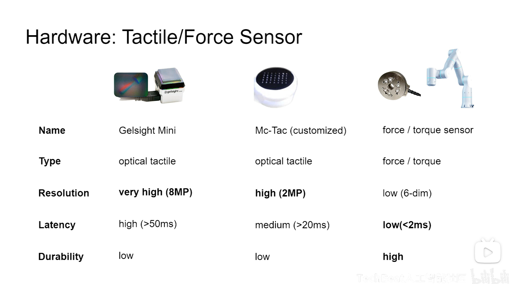
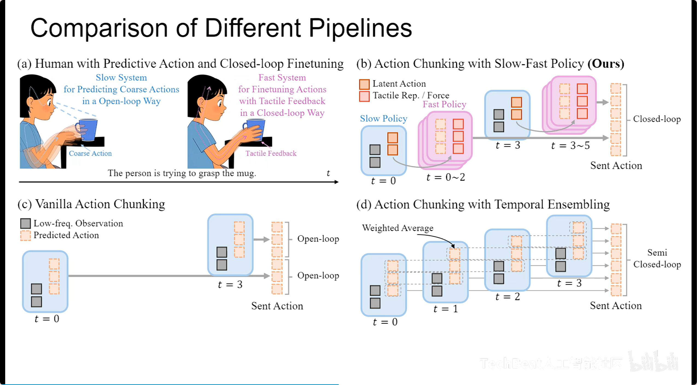
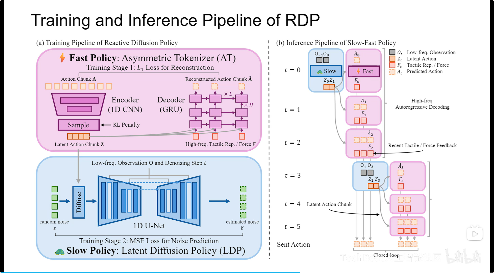

#具身智能  #DiffusionPolicy #力控

# Reactive Diffusion Policy: Slow-Fast Visual-Tactile Policy Learning for Contact-Rich Manipulation
- 论文：[[2503.02881] Reactive Diffusion Policy: Slow-Fast Visual-Tactile Policy Learning for Contact-Rich Manipulation](https://arxiv.org/abs/2503.02881)
- 代码：[xiaoxiaoxh/reactive_diffusion_policy: [RSS 2025] Reactive Diffusion Policy: Slow-Fast Visual-Tactile Policy Learning for Contact-Rich Manipulation](https://github.com/xiaoxiaoxh/reactive_diffusion_policy)
- 视频：[Talk | 上海交通大学薛寒：RDP 视觉-触觉/力觉融合的机器人模仿学习_哔哩哔哩_bilibili](https://www.bilibili.com/video/BV14TVmzcEox/?vd_source=c6acf7e2d08361599bddd176f227d590)

# 视频记录
## 传感器差异

## 和常规 action chunk 的区别

## 训练和测试流程

## 限制
1. RDP 和 TactAR 用于二指夹爪
2. RDP 无法处理高频视觉输入
3. 只能做单任务
## 触觉任务的一些启发
1. 高频闭环控制很重要
2. 数据质量对于 IL（imitation learning ）很重要
## 传感器选择
1. 力传感器耐造，高效
2. 视触觉传感器细节多，噪声少