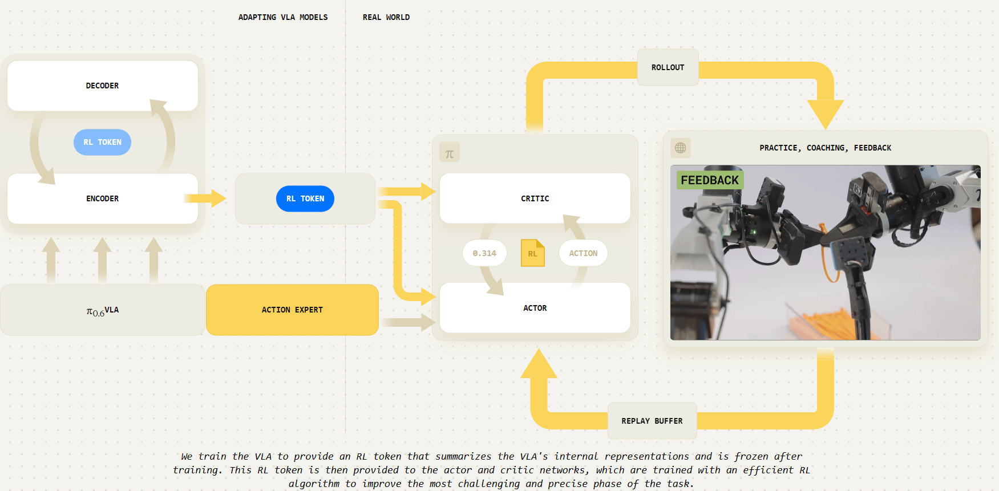
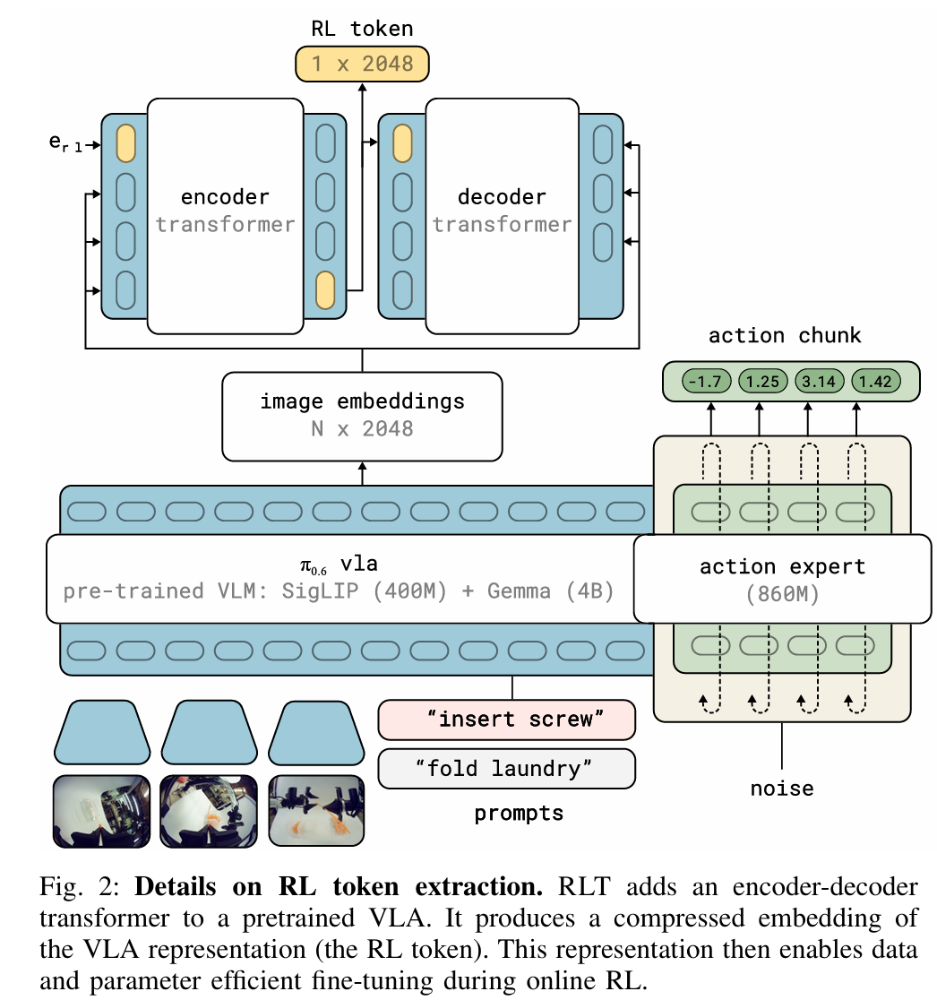
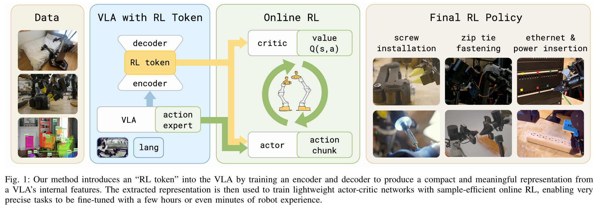
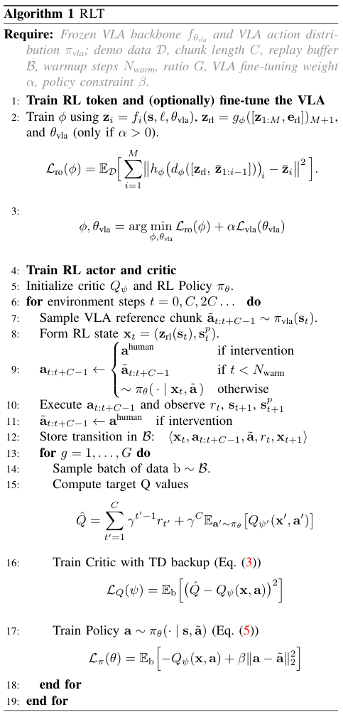

#VLA #具身智能 #强化学习 

# RL Token: Bootstrapping Online RL with Vision-Language-Action Models
- 论文：<https://www.pi.website/download/rlt.pdf>
- 博客： <https://www.pi.website/research/rlt>

## 动机

VLA（视觉 - 语言 - 动作）模型虽然泛化能力强，但在需要毫米级精度的任务上往往表现不佳——动作缓慢、需要反复尝试。直接对整个 VLA 做强化学习微调代价极高，而轻量级 RL 方法又无法利用 VLA 的丰富先验知识。

## 整体框架

RL Token 训练细节：

注意 RL Token 在通过 AEtrain 的时候，没有加上机器人本体的 status。本体信息是在 RL 阶段加入的。这里离线 RL 算法用的 TD 3.

**Critic 部分：** 

输入包括机器人 status，RL token 和动作块 $a_{1:C}$ ，使用 TD error 来 train，这里的动作块参见算法中的第 9 步

**Actor 部分**

输入包括机器人 status,RL token 和 VLA 输出的参考动作块 $\tilde{a}_{1:C}$ ，学习目标是最大 Q 值的同时降低 actor 输出动作和参考动作的 L 2 差距。

训练时为了防止 actor 复制 VLA 动作，会随机将参考动作全置 0.

### 训练流程

流程中 $d_{\phi}$ 是解码器， $h_{\phi}$ 是解码器的线性投影层，第 8 步中 $s_t^p$ 是机器人本体状态。

其中训练过程还有以下细节：

1. 在收集 rollout 时，人若参加干预，干预动作会覆盖 actor 输出和 VLA 的输出，此时采集的 RL 元经验， $a，\tilde{a}$ 都是人的遥操信号。本质上 policy 此时训练退化成 BC，因为会随机丢参考动作，因此可以抑制 actor 学成复制参考动作。
2. 臂在动作时，每个中间步都获取 obs，但是这里是隔一步来存以此到 buffer 中的。
3. Policy 更新和学习是异步的。
4. Actor 更新一次，critic 更 2 次。TD 3 的基本配置
5. 开头的时候有一个热身阶段，该阶段使用 VLA 产生参考动作预填充 buffer，避免 critic 看到的 action 全是垃圾（因为 actor 开始很拉），参见第 9 步
6. Update-to-Data (UTD) Ratio（机器人执行一步，后台模型更新 5 次）
7. VLA 会预测何时将执行权给 RL。简单 VLA，精细 RL
### 行为克隆成功的两个根因
1. Action chunking
2. 扩散或者自回归的表达能力强

# 实现细节
## 网络设置

VLA 用 pi 06，扎带固定，插网线和插头，RL 网络都是 2 层 256 的 MLP，拧螺丝是 512 的 3 层 MLP。

训练期间，VLA 输出的参考动作 50% 几率被置 0.actor 用固定标准差，依据当前 obs 输出下一 action chunk。

## 数据

预训练，每个任务 1~10 小时。RL 每个任务 400~1000 个 episode。

## 奖励信号设置

简单稀疏 01 奖励，成了 1 没了 0。只要有一次成功，那么 Q 值训练的 TD error 就可以把这个值流出来。所以大部分的 transition 经验，里面 r 都是 0

## 注意点
### RL policy 输出的 action chunk 的长度是小于 VLA 输出的 action chunk 长度

这样使用 RLpolicy 来获得反应力，vla 管规划