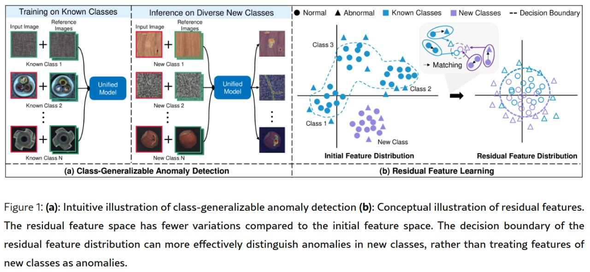

#异常检测 #NIPS

# ResAD_A Simple Framework for Class Generalizable Anomaly Detection
- 会议： NIPS 2024 splotlight
- 文章：<https://arxiv.org/abs/2410.20047>
- 代码：<https://github.com/xcyao00/ResAD>
# Abstract

常规的一对一的 AD 模型泛化性能差，因为正常特征的表示在不同类间的差异很大。而本文提出了一个框架 ResAD 用来学习不同类之间正常样本的残差特征，这种残差特征在新类别中，其变化也不会很大，因此模型可以较好的适应到新的类别。ResAD 主要包含三个部分：

1. 特征转换器：将原始特征转换为残差特征
2. 一个简单且浅的特征约束器：将正常残差特征约束到空间超球中，尽量减少特征的变化并保持不同类之间特征尺度的一致性
3. 特征分布估计器：用于估计正常残差特征的分布，然后通过是否在分布内来判定正常异常
# Introduction

过去的一些 AD 模型泛化性能有限，遇到新类仍然需要重新训练微调。

本文想达成的效果是使用多个已知类别的样本来训练一个统一的模型，得到的模型可以在无需对目标数据行为重训或者微调的情况下，使用少量新类正常样本就可以泛化到新类上。这个任务的主要挑战就是：**不同类别的正常样本模式差异大。** 而我们认为，与原始正常特征相比，残差特征的类不变性更加稳定，且异常特征的残差应该比正常样本更大。

本文大致的步骤是：
1. 使用预训练的特征提取器从少量正常参考样本中得到正常参考特征。
2. 将每个输入特征减去正常参考特征得到残差特征。
3. 受支持向量描述（SVDD）和 [Explainable Deep One-Class Classification](../paper_note/Explainable%20Deep%20One-Class%20Classification.md) 启发，我们使用一个简单且浅的网络，配合提出的异常不变 OCC 损失，将正常残差特征转换到受约束的空间超球中。
4. 利用受超球面约束的特征空间，我们使用特征分布估计器 realNVP 来学习和估计正常残差特征的分布。