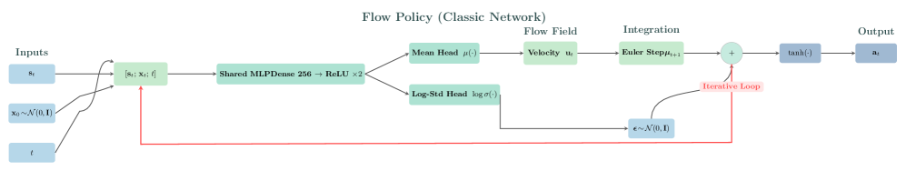
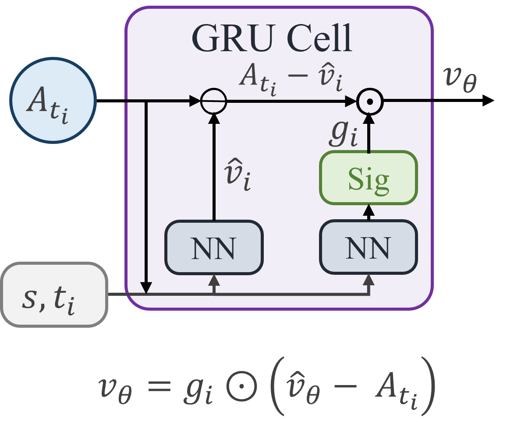
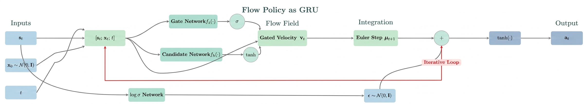
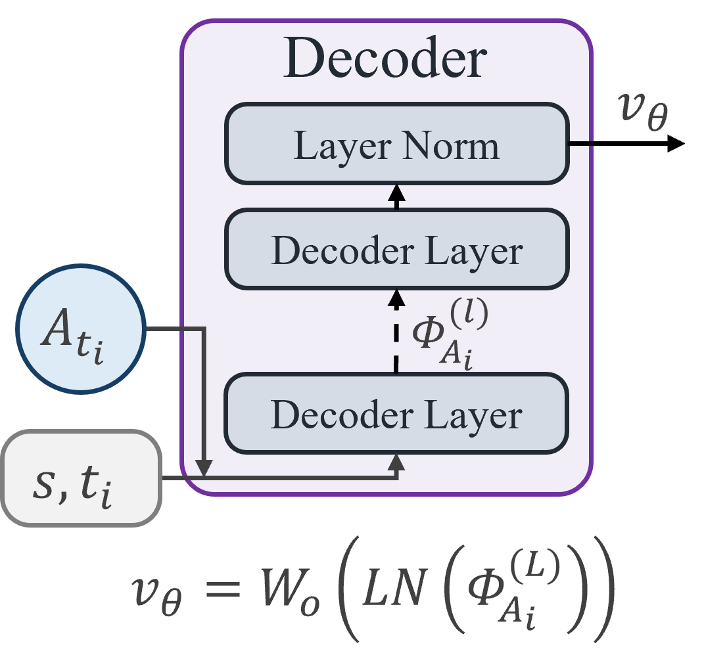
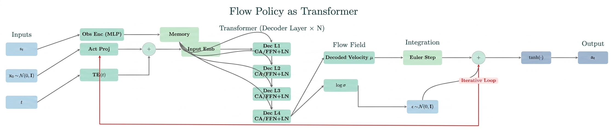

#强化学习 #生成模型 

# SAC Flow: Sample-Efficient Reinforcement Learning of Flow-Based Policies via Velocity-Reparameterized Sequential Modeling
- 论文：[[2509.25756v3] SAC Flow: Sample-Efficient Reinforcement Learning of Flow-Based Policies via Velocity-Reparameterized Sequential Modeling](https://arxiv.org/abs/2509.25756v3)
- 代码：[SAC-FLOW/sacflow-setup.md at master · Elessar123/SAC-FLOW](https://github.com/Elessar123/SAC-FLOW/blob/master/sacflow-setup.md)

# 核心洞见 和问题
## FM 可以视为 RNN

**Flow Matching 的采样过程其实可以视为是一个残差 RNN 迭代过程，其中上时刻的采样中间结果可视为是 RNN 隐状态，剩下引导的条件和时间步可以视为是 RNN 常规输入。**

FQL 等文章发现了，使用 K 步去噪，双层 MDP 通过时间来反传梯度并不稳定。这个现象和我们将 Flow Matching 视作 RNN，而 RNN 在传递过程中可能出现梯度爆炸的现象有相通之处。基于此，我们使用更加现代的架构，比如 GRU （Flow-G）或者 Transformer decoder（Flow-T） 来作为 FM 的参数化形式应该可以稳定 K 步反向传播。

## 如何计算 SAC 算法中损失函数中的动作似然

参考 [Diffusion Meets Flow Matching](https://diffusionflow.github.io/) 可知，常规 FM 是确定性采样，但是实际上也可以用 SDE 来做非确定采样（非确定采样可能回导致模型更加侧重后期的采样）

# 具体做法
## FM 使用现代序列架构重参数化
### 常规做法

### Flow-G

图中 $\sigma$ 是 sigmoid 函数，Gate Network 就是个 2 层 MLP（bias 是 5 比较奇怪），Gandidate Net 同理 2 层 MLP，是上图中的 $\hat{v}_{\theta}$ ,也是 GRU 中的隐状态，注意代码中 candidate net 后面没有 tanh，这个 tanh 是加在 Log $\sigma$ Network 后的，Log $\sigma$ Network 是三层 mlp，之后还会再过一层标准化。

### Flow-G

符号同上。

## Flow Matching 用于 SAC 时，似然的计算方法
#### Flow Matching 转变 SDE 的方法

参见 [Diffusion Meets Flow Matching](https://diffusionflow.github.io/)，FM 中 $x$ 到 $\epsilon$ 到的插值去噪过程常态下是 ODE，时间 t 是从 0 动作到 1 纯噪声：

$$
dz_t = u_t dt  \tag{2.10}
$$

由公式 2.10，构造同款的前向破坏过程的 SDE（这里前面一项是一个修正漂移项，用来抵消多步加噪之后的轨迹漂移）：

$$
dz_t = \left(u_t \mathbf{\color{red}{+}}\frac{1}{2}\varepsilon_t^2 \nabla \log p_t(z_t)\right) dt + \varepsilon_t dz   \tag{2.11}$$
没错这里是 **+** 号。 （[Diffusion Meets Flow Matching](https://diffusionflow.github.io/) 中的公式 11 描述的是反向生成过程，所以是 **-** 号，具体推导的方法是应用 Anderson 逆向时间 SDE 定理）

看着公式 2.11，再看原始论文 A 1 节公式 13 和 14：

$$

A_{t_{i+1}} = A_{t_i} + b_\theta(t_i, A_{t_i}, s)\,\Delta t_i + \sigma_\theta\sqrt{\Delta t_i}\,\,\varepsilon_i, \quad \varepsilon_i \sim \mathcal{N}(0, I_d) ，0 = t_0 < \cdots < t_K = 1. \tag{13}

$$

$$b_\theta(t_i, A_{t_i}, s) = \left(\frac{1 - t_i + \dfrac{t_i \sigma_\theta^2}{2}}{1 - t_i}\right) v_\theta(t_i, A_{t_i}, s) - \left(\frac{t_i \sigma_\theta^2}{2(1 - t_i)t_i}\right) A_{t_i}, \tag{14}$$
那么为何公式 14 长这个样子，以下简单推导一下：
照着公式 2.11 把公式 13 符号对齐改写一下：

$$

 A_{t_{i+1}} = A_{t_i} + \underbrace{\left( v_\theta + \frac{1}{2} \sigma_\theta^2 \nabla \log p_t(A_{t_i}) \right)}_{这就是论文里的漂移项 b_\theta} \Delta t_i + \sigma_\theta \sqrt{\Delta t_i} \epsilon_i   \tag{1.1}

$$

由于在 Rectified Flow 中，中间插值等于：

$$A_t = (1-t)A_0 + t A_1$$

这里 $A_0 \sim \mathcal{N}(0, I)$ 是纯噪声， 显然 $A_t \sim \mathcal{N}(t A_1, (1-t)^2 I)$  ，那么带入 $\nabla \log p_t(A_t)$ 可得：

$$\nabla \log p_t(A_t) = -\frac{A_t - t A_1}{(1-t)^2}  \tag{1.2}$$

Rectified Flow 中时间是 1，那么速度 $v_\theta = A_1 - A_0$ ， $A_1 = A_t + (1-t)v_\theta$ 带入 公式 1.2 干掉 $A_1$ :

$$

\begin{aligned}

\nabla \log p_t(A_t) &= -\frac{A_t - t(A_t + (1 - t)v_\theta)}{(1 - t)^2} \\[6pt]

&= -\frac{(1 - t)A_t - t(1 - t)v_\theta}{(1 - t)^2}  \\[6pt]

&   = \frac{t}{1-t} v_\theta - \frac{1}{1-t} A_t

\end{aligned}   \tag{1.3}

$$

把公式 1.3 带回 公式 1.1 漂移项 $b_{\theta}$ :

$$

\begin{aligned}

b_\theta &= v_\theta + \frac{1}{2} \sigma_\theta^2 \left( \frac{t}{1-t} v_\theta - \frac{1}{1-t} A_t \right)  \\

& = \left( 1 + \frac{t \sigma_\theta^2}{2(1-t)} \right) v_\theta - \left( \frac{\sigma_\theta^2}{2(1-t)} \right) A_t   \\

& = \left( 1 + \frac{t \sigma_\theta^2}{2(1-t)} \right) v_\theta - \left( \frac{\sigma_\theta^2}{2(1-t)} \right) A_t  \\

& = \left(\frac{2(1-t) + t \sigma_\theta^2}{2(1-t)} \right) v_\theta - \left( \frac{\sigma_\theta^2}{2(1-t)} \right) A_t  \\

& = \left(\frac{1-t + \frac{t \sigma_\theta^2}{2}}{1-t} \right) v_\theta - \left( \frac{\sigma_\theta^2}{2(1-t)} \right) A_t

\end{aligned}

$$
以上说白了就是用一个 随机过程替代一个确定性过程，保持两个过程的边缘分布一样。论文中说第一项是膨胀项，第二项是收缩项：
$$b_\theta(t_i, A_{t_i}, s) = \underbrace{\left( \frac{1 - t_i + \frac{t_i \sigma_\theta^2}{2}}{1 - t_i} \right) v_\theta(t_i, A_{t_i}, s)}_{\text{第一部分：膨胀项}} - \underbrace{\left( \frac{t_i \sigma_\theta^2}{2(1-t_i)t_i} \right) A_{t_i}}_{\text{第二部分：收缩项}}$$
这里直观理解是因为最后的随机噪声会影响最终变化的速度方向，因此用一个大于 1 系数的膨胀项来抵消其他方向的速度干扰，而后一项收缩项则是保证不至于冲过头。
依据公式 13，其条件 $A_{t_{i+1}} \mid A_{t_i}, s$ 服从的分布为：
$$\eta_\theta(A_{t_{i+1}} \mid A_{t_i}, s; \Delta t_i) = \mathcal{N}\!\left(A_{t_i} + b_\theta(t_i, A_{t_i}, s)\,\Delta t_i,\; \sigma_\theta^2 \Delta t_i I_d\right)  \tag{1.4}$$

### 去噪轨迹似然的计算方法
通过上诉 公式 1.4，我们终于可以计算每个生成步的似然。但是在实操过程中，论文也提到了最终动作为 $a = \tanh(A_{t_K})$ .
如果我们将每个生成步也视为与环境交互的 rollout 中的一步，那么意味着其实在 rollout 的过程中每个 $A_{t_i}$ 也应该经过一个 tanh。那么这条去噪轨迹的概率密度应该是论文公式中的 15，即乘上一个 jacobian 矩阵：
$$p_c(\mathcal{A} \mid s) = \zeta(A_{t_0}) \prod_{i=0}^{K-1} \eta_\theta(A_{t_{i+1}} \mid A_{t_i}, s; \Delta t_i) \cdot \|\det \mathcal{J}(a)\|^{-1}, \quad a = \tanh(A_{t_K}), \tag{15}$$
这里 $||\det \mathcal{J}(a)|| = \prod_{j=1}^d (1 - a_j^2)^{-1}$ ，这里是对每个关节做 tanh。

# 补充
## Anderson 逆向 SDE 定理的法则：

如果你有一个**前向**时间（ $t$ 从 $0 \to 1$ ， $dt$ 为正）的 SDE：

$$ \mathrm{d}\mathbf{z}_t = \mathbf{f}_t \mathrm{d}t + g_t \mathrm{d}\mathbf{w}_t $$

那么它的**逆向** SDE，其漂移项必须是：

$$ \text{逆向漂移} = \mathbf{f}_t - g_t^2 \nabla \log p_t $$

在 Flow Matching 中：

- **前向 ODE** 是 $d\mathbf{z}_t = \mathbf{u}_t dt$ 。
    
- 为了构造分布相同的 **前向 SDE**，我们必须**加上**拉力来对抗扩散（这里 $dt$ 为正，所以直觉成立）：

    $$ \text{前向 SDE: } d\mathbf{z}_t = \left( \mathbf{u}_t \mathbf{\color{red}{+}} \frac{1}{2}\varepsilon_t^2 \nabla \log p_t \right) dt + \varepsilon_t \mathrm{d}\mathbf{w} $$

- 现在，应用 Anderson 定理求 **逆向 SDE**：

    $$ \text{逆向漂移} = \left( \mathbf{u}_t + \frac{1}{2}\varepsilon_t^2 \nabla \log p_t \right) - \varepsilon_t^2 \nabla \log p_t $$

    合并同类项： $+0.5 - 1.0 = -0.5$ 。

    $$ \text{逆向漂移} = \mathbf{u}_t \mathbf{\color{red}{-}} \frac{1}{2}\varepsilon_t^2 \nabla \log p_t $$