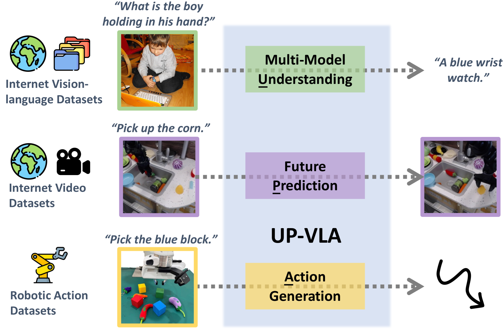

# UP-VLA: A Unified Understanding and Prediction Model for Embodied Agent

#VLA #具身智能 

以下总结来自 alphaXiv

- 论文地址：[[2501.18867] UP-VLA: A Unified Understanding and Prediction Model for Embodied Agent](https://arxiv.org/abs/2501.18867)
- 代码：[CladernyJorn/UP-VLA: Official PyTorch implementation for ICML 2025 paper: UP-VLA.](https://github.com/CladernyJorn/UP-VLA)

一个统一的视觉 - 语言 - 动作（VLA）模型 UP-VLA，整合了多模态理解和未来视觉预测，以增强机器人控制。该模型在 CALVIN 基准测试的 ABC→D 任务中比以往最先进水平提高了 33%，并在真实世界机器人任务中展示了改进的泛化和精度。

# 核心问题与方法

UP-VLA 解决了当前具身人工智能（embodied AI）领域的视觉 - 语言 - 动作（VLA）模型的一个根本性限制。现有的视觉 - 语言模型（VLM）在高层次语义理解方面表现出色，但在精确机器人控制所需的低层次空间和动态推理方面却力不从心。相反，视觉预测模型能够捕捉细粒度的物理动态，但缺乏语义理解能力。

作者提出了一种统一的训练范式，将多模态理解与未来视觉预测结合在一个单一的自回归框架中。这种方法使模型能够同时处理语言指令、理解视觉场景、预测未来状态并生成精确的机器人动作。

## 架构与方法论

UP-VLA 采用基于 Phi-1.5 语言模型骨干的多编码器架构。该系统使用两种不同的视觉编码器：

*   **连续视觉编码器**：一个 CLIP-ViT 编码器处理图像，用于多模态理解任务，将视觉特征投影到语言嵌入空间。
*   **离散视觉编码器**：一个 VQ-GAN 编码器将视觉观测转换为离散 token，用于自回归未来预测。

训练过程分为两个阶段：

**阶段 1：预测与理解预训练** 模型在混合数据集上进行预训练，这些数据集结合了机器人演示（Bridge 数据集）和视觉 - 语言对（LLaVA-tuning-665k）。此阶段建立了视觉预测能力和语义理解能力。

**阶段 2：预测与动作微调** 模型使用联合预测和理解在下游具身任务上进行微调。一项关键创新是“理解增强提示（understanding-augmented prompting）”机制，模型利用其多模态理解能力生成场景描述，以增强动作生成。

统一的损失函数结合了三个组成部分：

$$
L=LMMU+LPRE+LACTL = L_{MMU} + L_{PRE} + L_{ACT}
$$

其中 $L_{MMU}$ 处理理解任务的语言建模，$L_{PRE}$ 管理未来图像 token 预测，而 $L_{ACT}$ 使用 MSE 处理连续动作，使用 BCE 处理离散动作，从而控制动作生成。

# 实验结果

UP-VLA 在多个基准测试中表现出显著改进：

**CALVIN 模拟结果**

* 在 ABC→D（分布外）上实现了 4.08 的平均完成长度，比之前的最先进技术 GR-1（3.06）提高了 33%
* 在 ABCD→D（分布内）上获得了 4.42 分，优于 GR-1（4.21）和 RoboFlamingo（4.09）

**真实世界机器人评估** 模型在 Franka-Emika Panda 机器人上针对三类任务进行了测试：

*   **已见任务**：UP-VLA 达到了 80% 的成功率，超越了所有基线
*   **未见任务（新物体）**：展示了 60% 的成功率，显示出强大的语义泛化能力
*   **精确任务**：在需要精细空间理解的任务中达到了 55% 的成功率

# 主要贡献与消融研究

论文的消融研究揭示了两个组成部分的重要性：

**视觉预测的影响**：移除视觉预测导致 CALVIN ABC→D 上的性能从 4.08 下降到 1.44，证实了其在理解物理动态方面的关键作用。

**多模态理解的影响**：移除多模态理解（MMU）能力导致真实世界实验中对未见物体的性能下降，而在已见任务上保持了可比的性能。

该模型展示了有效的场景理解和空间推理能力，如定性示例所示，它准确描述了机器人环境中的物体位置和关系。

# 技术创新

UP-VLA 的主要技术贡献在于其统一的自回归框架，该框架无缝整合了不同的模态和任务。该模型通过将连续图像标记与语言嵌入拼接起来处理多模态理解任务，而视觉预测任务则将离散图像标记置于序列中的语言标记之后。

注意力机制经过精心设计，具有灵活的掩码，以允许不同标记类型之间进行适当的信息流。对于动作生成，模型采用联合预测，同时生成未来观测和动作序列，同时通过增强提示利用场景理解。

# 意义与影响

UP-VLA 代表了具身 AI 的一项重大进展，它成功弥合了语义理解与精确控制之间的鸿沟。统一的训练方法表明，结合互补的预训练目标可以产生超越任何单一组件的涌现能力。

这项工作的影响超越了性能提升。通过展示视觉预测和多模态理解可以有效统一，UP-VLA 为开发更强大的机器人基础模型提供了蓝图。该方法解决了在需要语义推理和精确操作的真实世界环境中部署机器人的关键挑战。

该模型对未见过物体和环境的强大泛化能力，结合其处理精确操作任务的能力，预示着在制造业、物流和服务机器人领域有着广阔的应用前景，在这些领域，机器人必须适应新情况同时保持高精度。
