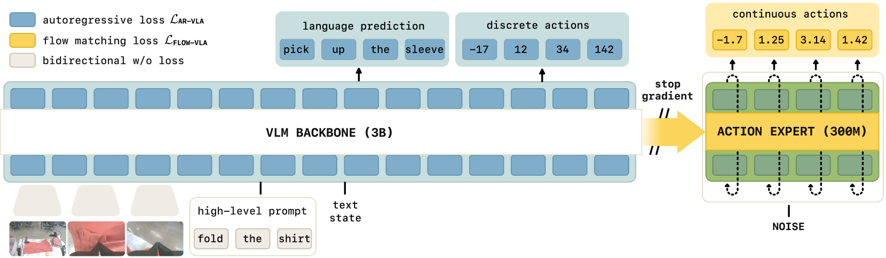

# VLAs that Train Fast, Run Fast, and Generalize Better
- 主页：[《快速训练、快速运行和泛化能力更强的 VLA》 --- VLAs that Train Fast, Run Fast, and Generalize Better](https://www.physicalintelligence.company/research/knowledge_insulation)
- 论文：[[2505.23705] Knowledge Insulating Vision-Language-Action Models: Train Fast, Run Fast, Generalize Better](https://arxiv.org/abs/2505.23705)

## 拟解决问题

VLM 的设计是输出离散 token，仅能进行离散操作，不能输出连续值。使用专门的动作专家，虽然提高实时性，但是可能损害预训练 VLM 中的语义知识。

## 解决方法

使用知识隔离（knowledge insulation, KI）, 即同时调整动作专家以产生连续动作（例如，通过流匹配或扩散）的同时，用离散动作微调 VLM 主干，而不将动作专家的梯度传播回 VLM 主干。

## 改进点
1. 使用自回归和流匹配进行联合训练。自回归仅在训练时作为表示学习的目标
2. 在非动作数据集上共同训练模型，例如通用视觉 - 语言数据集和机器人规划数据（VLM 数据共同训练）
3. 阻止动作专家和骨干权重之间的梯度流

## 一些经验
1. OpenVLA-OFT 和 π0.5 在内的几个工作采用了两阶段程序，其中模型首先使用自回归离散化进行训练，然后微调到具有连续输出的目标域。
2. Pi0 方法会导致指令遵从和训练速度下降，动作专家的梯度会影响预训练的 VLM 骨干。
3. [PRISE 算法](https://arxiv.org/abs/2402.10450) 也是应用压缩时间信息的变化来压缩自回归模型的动作 token 编码的。
4. Pi0 的设计是：对于流匹配时间索引 $\tau \in [0,1]$ ，模型的输入是动作块 $a_{1:H}^{\tau, \omega} = \tau a_{1:H} + (1 - \tau) \omega, \quad \omega \sim \mathcal{N}(0, I)$ 的噪声版本，模型被训练来预测流 $\omega - a_{1: H}$ 。在推理时间，这个流场被集成以去噪 $\omega$ 到最终的动作块。
5. 本文用了 [MoT](https://arxiv.org/abs/2411.04996) 算法来处理不同的模态
6. 4090 上 pi0-fast 预测 1 秒动作块要 750ms