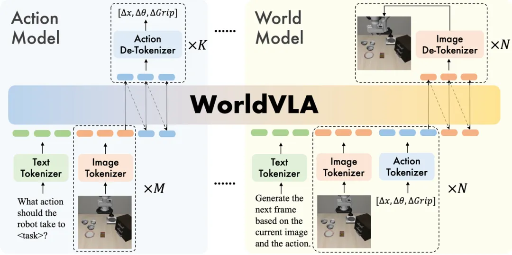
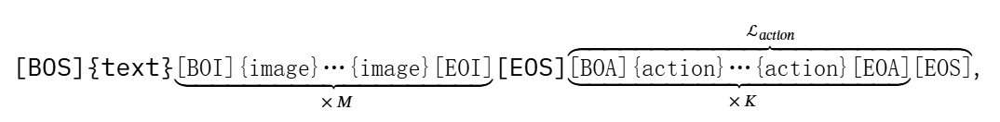

#具身智能 #VLA 

# WorldVLA: Towards Autoregressive Action World Model
- 地址: <https://arxiv.org/pdf/2506.21539>
- 代码: <https://github.com/alibaba-damo-academy/WorldVLA>
- 解析: <https://mp.weixin.qq.com/s/gKJUaea80H_EJV1gKUnfaQ>

## 拟解决问题

现有 VLA 很多都是 VLM 上添加一个动作头，很多时候动作仅仅作为输出结果处理，但未将动作当作输入进行分析建模。

世界模型可以基于当前观测和动作预测未来视觉状态，但是却无法直接生成动作输出。

## 架构

这里 Image Tokenizer 是 VQ-GAN 模型，针对特定图像区域有额外感知损失。256x256 的图像会生成 256 个 token，512 生成 1024 个 token。

Action tokenizer 将 action 每个维度离散化成 256bin，bin 宽是基于训练数据统计，整体用 7 个 token 表示，3 个相对位置，3 个相对角度，1 个绝缘夹爪状态。

Text Tokenizer 是 BPE Tokenizer，vocabulary 大小 65536，其中 8192 个图像标记，256 个动作标记。所有文本、动作和图像都被离散化为标记，并以自回归方式进行训练。

## 训练
### 经验
1. 由于使用 causal 注意力来自回归训练，早期动作错误会传到后续动作，导致性能下降所以在 att mask 中直接让当前的动作只能看到当前观测，看不到上一步动作。这是由于世界模型都是在 VL 上 train 的。

2.  分辨率和模型性能之间整相关关系（Chameleon 骨干网络预训练）

## 输入输出

输入 token 形式如下：

## 评价 

只在 libero 上做了实验，不太靠谱。