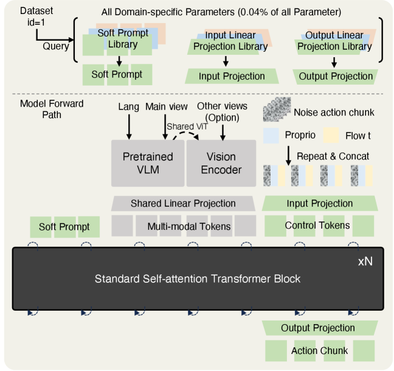
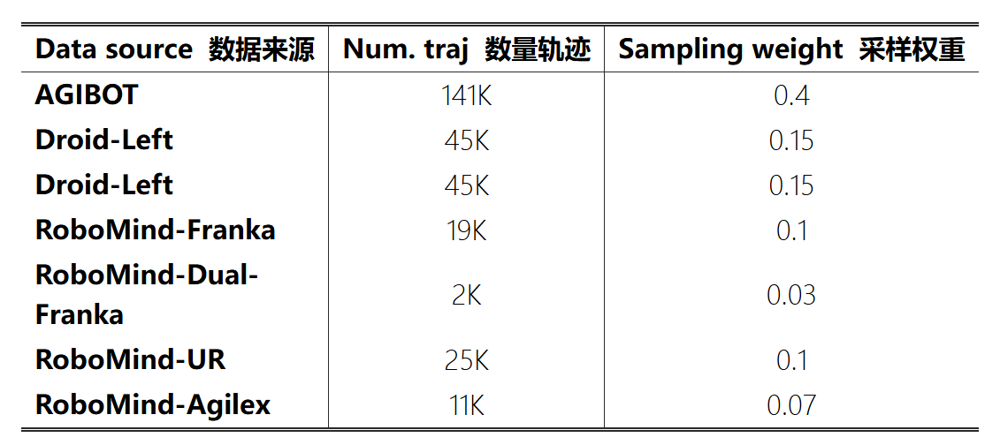
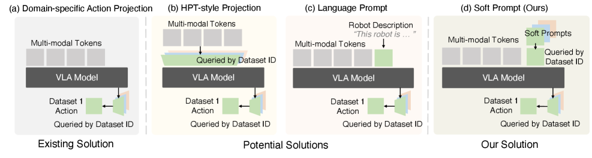

#VLA #具身智能 

# X-VLA: Soft-Prompted Transformer as Scalable Cross-Embodiment Vision-Language-Action Model
- 论文：[[2510.10274v1] X-VLA: Soft-Prompted Transformer as Scalable Cross-Embodiment Vision-Language-Action Model](https://arxiv.org/abs/2510.10274v1)
- 代码：[2toinf/X-VLA：官方实现的“Soft-Prompted Transformer”模型——该模型被用作可扩展的跨模态（视觉-语言-动作）交互模型 --- 2toinf/X-VLA: The offical Implementation of "Soft-Prompted Transformer as Scalable Cross-Embodiment Vision-Language-Action Model"](https://github.com/2toinf/X-VLA)
- 时间：2025.10.11

## 整体框架

主干是 Florence-large, 24 层 transformer，hidden dim 1024

## 实现细节

X-VLA-0.9B 的预训练是在 64 块 NVIDIA A100 GPU 上进行的，全局批处理大小为 1024，大约需要 4 天时间。

AdamW， $\beta_1=0.9,\beta_2=0.95,lr=1 \times 10^{-4},weight\_decay=0.01,epoches=200K$ ,bfloat16, 图像 224，ColorJitter 增强 

在前 1,000 次迭代中，仅更新软提示和动作头，而所有其他参数保持冻结；随后是一个 1,000 次迭代的预热阶段，逐渐将学习率恢复到联合训练的默认值。

**不同数据集采样权重**

**实验训练**
Florence-Base，backbone 为 DiT-Base（12 层 Transformer，hidden dim 768，AdaLN）
8 X A100，batchsize 256，epoches 200K
## 跨机体处理方式

### 单独任务头
**做法：**
模型输出处分配不同投影头
**缺点：**
未能在早期进行实体感知，导致忽略了诸如相机设置不同，任务分布不同的变化（因为不同机体通常数据集也不同）

### HPT 风格投影
**做法：**
多模态输入后应用不同投影层，之后再到 VLM 网络

### 语言提示
**做法：**
直接在语言输入上添加提示

### 软提示
**做法：**
使用一个可学习的软提示，在早期就添加到输入 query

## 一些经验
#### 动作表示方式

用的 EEF，姿态是旋转矩阵前两列

#### 平衡数据采样

不同任务之间平衡，轨迹内平衡

### 输入的处理方式
#### Observation 的处理方式
1. **主视觉 - 语言流（Main Vision-Language Stream）**：固定的主摄像头视图（Main view）与语言指令（Lang）一起被送入一个**完整的预训练 VLM（Pretrained VLM）**。这个 VLM 会同时处理图像和文本，生成包含高级任务理解的多模态特征（Multi-modal Tokens）。
2. **辅助视觉流（Auxiliary Vision Stream）**：腕部相机等其他视图（Other views）被送入一个**共享的视觉编码器（Shared ViT / vision backbone）**。关键在于，这个编码器**只是 VLM 的视觉部分**，这些视图的特征**不会**与语言指令在 VLM 内部进行融合。
3. **特征融合（Feature Fusion）**：来自上述两个流的特征，连同机器人本体感觉状态（Proprioception）、动作噪声（Noise action chunk）以及论文的核心创新“软提示”（Soft Prompt），会**一起作为序列输入到核心的自注意力 Transformer 模块**中。
#### 本体编码

Action 和 status 分别和时间嵌入的 tensor 在 seq len 维度拼接起来，然后通过投影层，在和其他模态在 token dim 的维度拼接起来。

#### 结构设计上
1. [MM-DiT]( https://arxiv.org/abs/2403.03206 ) 为不同输入模态分配单独参数，虽然减少了模态间语义差距，但是容易导致训练不稳定
2. 混合机体训练时，同时 train 多个 lora 也不好，会互相打架
3. 还是过混合机体训练，使用 MoE。如果不做负载均衡，最终就只有少量专家被 train 导致路由崩溃，如果做负载均衡，专家之间切换会导致优化不稳定
