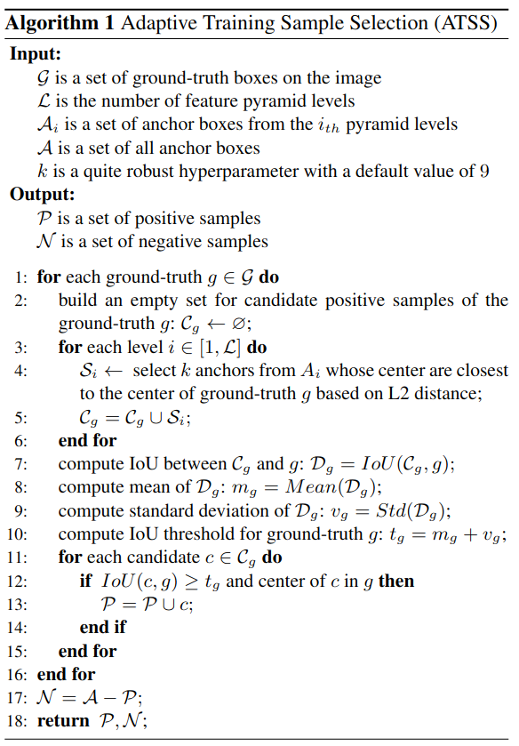

#目标检测

[toc]

# Bridging the Gap Between Anchor-based and Anchor-free Detection via Adaptive Training Sample Selection
- 会议: CVPR 2020 Oral
- 文章: <https://arxiv.org/abs/1912.02424>
- 代码: <https://github.com/sfzhang15/ATSS>

## 总结简述

作者主要是在想研究 Anchor-based 和 Anchor-free 上的不同主要在哪.以 RetinaNet 和 FCOS 为分析的具体实例.作者发现主要两者有以下不同:

1. RetinaNet 使用 anchor 和 GTBOX 的 IOU 来判定正负样本,而 FCOS 通过 GTBOX 中心点和设置点的距离和尺寸 (因为是多尺度) 来判定正负样本.

2. 回归量不一样. RetinaNet 回归目标是 anchor 位置和大小偏置.而 FCOS 回归是回归铺设点到上下左右的距离.

3. 正负样本数目不一样. RetinaNet 每个点有 9 个 anchor, 而 FCOS 只有一个.

在实现时,作者将 RetinaNet 的 anchor 数设置成一个,然后将 FCOS 上的一些训练技术也应用到 RetinaNet 上.最终实验发现,导致两者性能差异的问题主要是第一点.

基于以上问题分析,作者提出了 Adaptive Training Sample Selection (ATSS).

## 参考资料
- <https://www.bilibili.com/video/BV1rV411z7PR?from=search&seid=4253782902000237128&spm_id_from=333.337.0.0>
- <https://www.bilibili.com/video/BV1Sq4y1U7DE?from=search&seid=13359235666546027063&spm_id_from=333.337.0.0>
- <https://zhuanlan.zhihu.com/p/115407465>
