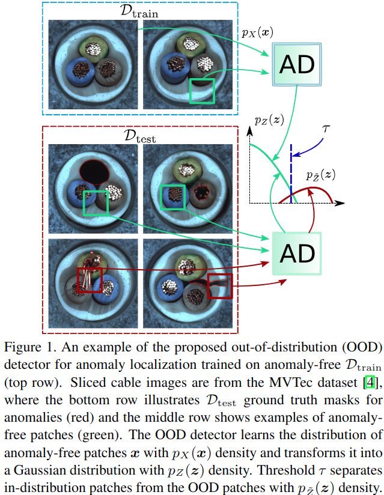
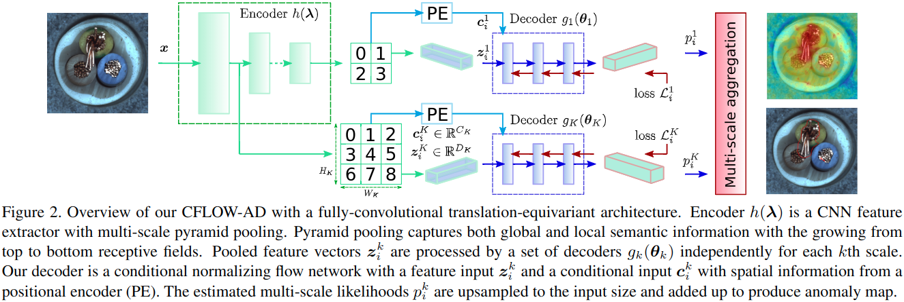

#无监督 

[toc]

# CFLOW-AD: Real-Time Unsupervised Anomaly Detection with Localization via Conditional Normalizing Flows
- 会议: WACV 2022
- 代码: <https://github.com/gudovskiy/cflow-ad>
- 论文: <https://arxiv.org/abs/2107.12571>

## 摘要

最近提出的方法虽然精度高但是忽略了实时性.本文方法 CFLOW-AD 是基于条件标准流模型的.本文方法在速度和内存占用上都有优势.

## 1. 引言

在个别情况下,由于异常样本难以获取和标注,我们可以将此类 AD 任务视为是带有 AD 目标样本的分布外检测 ( out-of-distribution detection,OOD)

图 1 显示了我们的一个大致思路.原始正常图片块的分布是 $p_X(x)$,然后我们训练一个 translation-equivariant 模型来将原始分布 $p_X(x)$ 变换为一个高斯分布 $p_Z(z)$.最后通过使用比如距离分布期望的欧式距离等方式来设定一个阈值,用来区分分布内和分布外样本.



## 2. 相关工作

重点最后一段, DifferNet 使用流模型来做图片级的异常检测.而本文在 DifferNet 基础上进行延伸,使用条件流模型来做像素级的异常检测.相比 Real-NVP 结构使用全局平均池化,我们提出的使用条件流模型可以在低复杂度的多尺度特征映射上进行定位.我们的主要贡献如下:

- 我们从理论上分析了为何之前模型都假设样本符合多元高斯分布,和为何一个通用的 NFLOW 框架可以以更少的计算量得到类似的结果.

- 我们提出了使用条件流模型来进行无监督的异常检测和定位

- 结果 SOTA

## 3. 理论背景
### 3.1. 使用高斯先验来进行特征提取

我们考虑训练一个 CNN $h(\lambda)$ 来进行分类任务.通过最小化训练数据分布 $Q_{x,y}$ 与模型分布 $P_{x,y}(\lambda)$ 之间的 KL 散度来求取参数 $\lambda$,这里 $(x,y)$ 为监督学习的输入 - 标签对.

通常,参数 $\lambda$ 是通过从高斯分布中采样得到的,整个优化过程可以写做:

$$
\underset{\lambda}{argmin} D_{KL}[Q_{x,y}||P_{x,y}(\lambda)]+\alpha R(\lambda),   \tag{1}
$$

这里 $R(\lambda)$ 是正则项,一般是 L2 正则, $\alpha$ 为其超参.

根据花书说法,不仅参数 $\lambda$ 是符合多元高斯 (multivariate Gaussian,MVG) 分布的,隐藏层提取出的特征映射 $z$ 同样也符合.

### 3.2. 马氏距离 

在多元高斯先验的假设下, Lee 等人最近提出了使用多元高斯分布来对特征向量 $z$ 进行建模,并使用马氏距离作为分类的置信度.Rippel 等人通过计算特征向量 $z$ 和 MVG 分布的马氏距离来进行异常检测.假设随机变量 $z \in R^D$ 的 MVG 分布 $N(u,\sum)$ 的密度函数 $p_Z(z)$ 为:

$$
p_Z(z)=(2 \pi)^{-D/2} det \Sigma^{-1/2}e^{-\frac{1}{2}(z-u)^T \sigma^{-1} (z-u)},  \tag{2}
$$

这里 $u \in R^D$ 是期望向量, $\Sigma \in R^{D \times D}$ 是正常样本真实分布的协方差矩阵.

马氏距离计算公式如下:

$$
M(z)=\sqrt{(z-u)^T \Sigma^{-1} (z-u)},  \tag{3}
$$

这里一般使用训练集分布来替代真实样本分布.异常样本分布应该和正常样本分布是不同的,通过计算两者特征向量的马氏距离可以区分出来.

这套 MVG 框架在图片级的异常检测任务里很有效, PaDiM 将这套理论用于像素级的异常检测定位也取得了不错的效果.

### 3.3. 和流模型的关系

Dinh 提出了一种叫做流模型 (normalizing flows) 的生成模型. 这类模型通过使用一个易于处理的基础分布 $p_U(u)$ 和一个双向可逆映射 $g^{-1}: Z \to U$ 来改变生成模型的积分公式来得到期望中的 $p_Z(z)$ .则对于变量 $z \in Z$ 的对数似然可以写为:

$$
log \hat{p}_Z(z,\theta)=log p_U(u)+log |det J|,  \tag{4}
$$

这里样本 $u \backsim p_U$ 通常符合标准 MVG 分布, 矩阵 $J=\nabla_z g^{-1}(z,\theta)$ 是双射可逆流模型 (z=g(u,\theta)) 的 Jacobian 矩阵.

整个流模型 $g(\theta)$ 是一组具有易计算其 Jacobian 行列式的基本变换层组成的.比如在 RealNVP 中, 其耦合层的就是一个三角阵.通过使用随机梯度下降最大化公式 4 来进行模型优化.同样,使用最小化模型预测 $\hat{p}_Z(z,\theta)$ 和目标密度 $p_Z(z)$ 之间的 KL 散度 $D_{KL}[\hat{p}_Z(z,\theta)||p_Z(z)]$ 来进行优化也是可以的.其目标函数定义如下:

$$
L(\theta)=E_{\hat{p}_Z(z,\theta)}[log \hat{p}_Z(z,\theta) -log p_Z(z)],  \tag{5}
$$

这里 $p_Z(z)$ 是 MVG 的,那么使用马氏距离改写公式 5:

$$
L(\theta)=E_{\hat{p}_Z(z,\theta)}[\frac{M^2(z)-E^2(u)}{2}+log \frac{|det J|}{det \Sigma^{-1/2}}]  \tag{6}
$$

这里 $E^2$ 就是欧式距离,具体证明见附录 A.

当我们设定马氏距离符合 MVG 分布时,标准流模型可以使用给定的密度 $p_Z$ 通过极大似然估计得到任意分布.This normalizing flow framework can estimate the exact likehoods of any arbtrary distribution with $p_Z$ desity, while Mahalanobis distance is limited to MVG distribution only. 花书说在 CNN 训练使用 L1 正则是假定其参数符合拉普拉斯分布,而不添加任何正则,则相当于对参数没有进行任何的先验假设.此外,下一节,我们将引入条件流模型,相比与文献 7,8 中模型,它的结构更加紧密且是全卷积的并行结构.

## 4. CFLOW-AD 模型



### 4.1. 用于特征提取的 CFLOW 编码器

即这里为了简单起见,直接使用了一个 ImageNet 预训练的模型作为编码器的预训练模型,然后在每个 block 最后使用一个 K 池化拉出特征图,这样就利用了多尺度信息.

### 4.2. 用于似然估计的 CFLOW 解码器

这里我们使用流模型来估计特征向量 $z$ 的对数似然. To increase efficacy of distribution modeling,we propose to incorporate spatial prior into $g(\theta)$ model using conditional flow framework.

我们使用了一个 [Position embedding(PE)](../../DL_knowlege/Position%20embedding.md) 模块产生条件向量 $c^k_i$ .这里的 PE 其实脱胎至 All you need is attention 这篇文章,它使用正余弦函数来对位置进行编码.具体论文实现代码如下:

```python
def positionalencoding2d(D, H, W):
    """
    :param D: dimension of the model
    :param H: H of the positions
    :param W: W of the positions
    :return: DxHxW position matrix
    """
    if D % 4 != 0:
        raise ValueError("Cannot use sin/cos positional encoding with odd dimension (got dim={:d})".format(D))
    P = torch.zeros(D, H, W)
    # Each dimension use half of D
    D = D // 2
    div_term = torch.exp(torch.arange(0.0, D, 2) * -(math.log(1e4) / D))
    pos_w = torch.arange(0.0, W).unsqueeze(1)
    pos_h = torch.arange(0.0, H).unsqueeze(1)
    P[0:D:2, :, :]  = torch.sin(pos_w * div_term).transpose(0, 1).unsqueeze(1).repeat(1, H, 1)
    P[1:D:2, :, :]  = torch.cos(pos_w * div_term).transpose(0, 1).unsqueeze(1).repeat(1, H, 1)
    P[D::2,  :, :]  = torch.sin(pos_h * div_term).transpose(0, 1).unsqueeze(2).repeat(1, 1, W)
    P[D+1::2,:, :]  = torch.cos(pos_h * div_term).transpose(0, 1).unsqueeze(2).repeat(1, 1, W)
    return P
```
