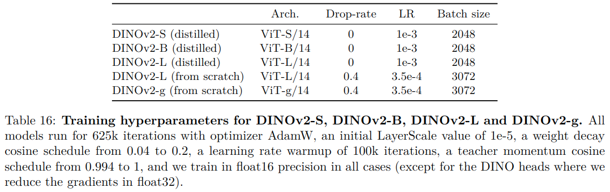
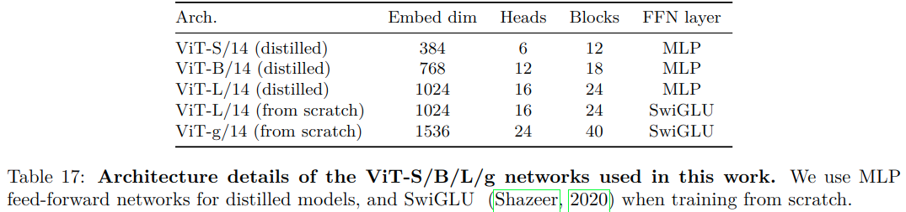

#自监督 

[toc]

- 论文: <https://readpaper.com/pdf-annotate/note?pdfId=4745545008782786561&noteId=1816025687761446400>
- 代码: <https://github.com/facebookresearch/dinov2>
- 作者团队: META

# 全文关键点翻译
## 摘要

近年来, 自然语言处理 (NLP) 领域上使用大规模数据来对模型进行预训练的突破, 为视觉领域基础模型的工作开辟了道路. 这些模型可以产生通用的视觉特征, 可以极大的简化在各个系统中图像的处理. 即这些通用特征可以在不同的图片分布和任务上使用而无需微调. 现有的预训练方法, 特别是自监督方法, 是可以通过在足量的不同来源且精心筛选的数据上训练来得到这样的通用特征的. 我们回顾了现有方法, 并结合不同的技术来调整在不同的模型和数据规模上进行预训练的方法. 现有多数方法主要旨在加速和稳定大规模训练. 而本文在数据方面, 我们构建了一套自动化流水线来构建一个专用的, 多样的精心筛选的数据集, 而不是像其他自监督方法那样使用杂乱没有筛选的数据训练. 模型方面, 我们训练了一个 1 B 参数的 ViT, 并将其蒸馏成了一堆小模型. 这些模型在多数图像和像素级基准上都超越了现有的最好的通用特征模型, OpenCLIP.

## 1. 引言

学习一个任务无关的预训练表征是 NLP 中的基础工作. 人们可以无需微调的 " 按原样 " 使用这些特征, 就可以在下游任务上取得比特定任务模型还要好的效果. 而实现这种效果的方式通常是使用大规模的原始文本来对语言模型或词向量进行无监督预训练.

参照 NLP, 我们期望视觉邻域也可以有这样一个模型. 即这些模型无论是在图像级任务 (比如图像分类) 还是像素级任务 (比如分割), 都可以产生一个开箱即用的特征. 实现这个目标最有希望的方向是文本指导预训练, 即使用文本监督指导特征的训练. 但是这种文本指导预训练的方法限制了模型保留图像信息的丰富性, 毕竟文本只是图像信息的一种精简, 而一些复杂的像素级信息不会在此类监督训练中保留. 另外, 这些图像编码器需要图文对齐的语料库来训练, 不能直接使用原始数据训练.

而另一种有希望的方向是自监督学习, 即仅使用图片学习特征. 这类方法从概念上来说更接近于语言建模任务, 他们可以获取图片或者像素级的信息. 尽管这个方向看上去可以学到一个通用特征, 但是目前大部分的工作还是在一个相对较小的数据集 (ImageNet-1 k) 上进行的. 虽然也有一些工作尝试在更大数据规模上进行, 但是他们主要使用的是一些很粗糙的数据集, 这通常会导致特征的质量显著下降. 因为这类数据确实对数据质量和多样性的控制, 而这两个要素对产生好特征是至关重要的.

本文, 我们将探索自监督学习是否可以在一个大规模且高质量的数据集上学到一个通用视觉特征. 我们回顾了现有的可以学习图片和像素级特征的判别式自监督方法, 比如 iBOT, 并在更大数据集下重新思考了它们的设计. 我们大部分的技术都旨在在不同规模的模型和数据规模上实现稳定且高效的判别式自监督学习. 这些改进使得我们方法比一般判别式自监督方法快 2 倍, 内存上省 3 倍.

对于预训练数据, 我们则建立了一个自动流水线来过滤和平衡那些未整理的图片. 这是启发自 [Wenzek 等人](https://readpaper.com/paper/2989539713) 的 NLP 工作, 他们的工作主要利用数据间的相似性和外部元数据, 不需要人工标注. 处理这些图片的一大难点是如何平衡多样性, 避免在某几个域 (dominant) 上过拟合. 使用基本的聚类方法就可以较好的解决这个问题. 我们收集来一个小而多样, 大约 142 M 张图片的数据集来验证我们的方法.

最后, 我们提供了各种预训练模型 (搞笑泥浆去尿), 即 DINOv 2, 它是使用我们数据训练的各种 ViT 模型. 我们还开源了所有模型和代码, DINOv 2 可以在任意数据上复现. 如图 2 所示, 我们在不同视觉任务基准上测试了 DINOv 2. 结果表明, 自监督预训练是可以学到一个较通用的冻结特征参数, 其效果可以和目前公开的最佳弱监督模型相媲美.

## 2. 相关工作
### 图像内部自监督训练

自监督方法的第一大类是专注于从图像构建角度来进行建模, 比如从图片的剩余部分中获得监督信号 **(已知一部分预测剩下一部分)** .这个思路来源于 Doersch 等人 2015 年的工作, 他们通过预测给定图像块的上下文来进行训练. 还有很多工作是基于图像重新着色, 预测图像转换, 图像修复或者图像块重排序. 而最近, 随着基于 patch 的架构, 比如 ViT 的出现, 学界开始回顾图片修复做预训练, 包括在特征空间中做图像修复. 值得一提的是, He 等人的工作, MAE 效果不错, 其学到的特征在下游任务微调时可以提点. 然后其他人借鉴 MAE, 将其应用在来视频等其他模式上. 然而他们的特征依然需要监督微调, 而**我们的特征是开箱即用的**.

### 判别式自监督训练

第二大类的工作思想和我们类似, 使用一组图片中的判别信号来学习特征. 这类方法可以追溯到早期深度学习工作, 在实例分类方法出现之后开始变得流行. 有一些工作基于实例级目标, 或是聚类提出来一些改进方法. 这些方法在 ImageNet 等一些标准数据集上可以提供较好的冻结特征, 但是难以扩展到更大的模型上. 我们在大型预训练数据集和模型的背景下重新审视这些方法的训练. 我们在 Zhou 等人的工作上进行进一步实验, 因为我们发现这个工作很适合模型数据缩放.

### 自监督预训练的缩放

目前越来越多的工作着眼于自监督学习在数据和模型大小上缩放的能力. 多数工作都是使用大规模的未经清理的数据来做无监督训练. 这些工作证明了判别自监督式方法能力随着数据规模提升, 但是由于预训练数据质量不高, 多数工作还是需要微调他们的特征. 值得一提的是, Goyal 等人还发现这些方法在预训练数据足够的情况下, 主要收益于模型大小的缩放. 这一系列的工作质疑自监督方法处理任何数据的能力, 而我们专注于生产最好的预训练编码器.

### 数据自动管理

我们数据集构建借鉴自数据检索社区. 而在半监督领域中, 使用数据检索来增强训练集也很常见. 一些工作使用哈希标签或者其他元数据来过滤未清洗的数据. 不同于这类工作, 我们不使用元数据作为监督来过滤图片, 而是利用图片之间的视觉相似性. 我们的方法主要是受文本数据处理流程启发, 即在 wikipedia 上训练一个语言模型, 然后从未清洗数据源中提取文本进行评分.

## 3. 数据处理

我们从大量未经清洗的数据中检索和几个精选数据集类似的图片来构建我们的 LVD-142 M 数据集. 下面, 我们将展示我们数据处理流程中的一些主要环节, 包括在精选和未清洗数据集上进行的处理, 图像去重和检索系统. 如图 3 所示, 我们的处理流程不需要任何的元数据或是文本, 仅在图像上工作. 附录 A 中包含了我们方法上的更多细节.

### 数据源

附录表格 15 详细列出了我们使用的精选数据集, 包括 ImageNet-22 k, ImageNet-1 k 训练部分, Google Landmarks 等. 对于未清洗的粗略数据, 我们是直接从网上爬的原始图像. 对于存储库中每个网页, 我们使用 `` 标签来提取图片的 URL. 然后丢弃不安全和受域限制的 URL, 然后对下载下来的图片进行后处理 (包括 PCA 哈希去重, NSFW 过滤, 模糊可识别面孔). 最后得到 1.2 B 的无重复图像.

### 去重

我们对未清洗的数据应用了 [Pizzi 等人 2022 年工作](https://readpaper.com/paper/4594878964267229185) 中的复制检测流程, 去除了相似图片. 这将减少数据集中的冗余并增加了图片的多样性. 我们还将任何可能和我们工作中使用到的基准数据集中验证和测试部分相似的图片都移除了.

### 自监督图像检索

通过从未清洗的数据中检索和精选数据集中类似的图片, 我们构建了清洗之后的预训练数据集. 我们使用在 ImageNet-22 k 上预训练的 ViT-H/16 作为图像编码器,使用 k-means 聚类未清洗的数据, 距离计算使用余弦相似度. 对于待查数据集 (应该是 benchmark),给定一个待查图片, 若其足够大, 我们就对每个 query 图片检索 N (通常为 4) 个最近邻居. 若很小, 我们就从其对应的聚类中抽取 M 张图片 (未清洗). 我们将对检索结果进行确认, 然后再调整 M 和 N. 具体可以参见附录 [A.4 检索](#A.4%20检索)

### 实现细节

在去重和检索阶段, 我们都使用 [Faiss](https://github.com/facebookresearch/faiss) 计算查找最近邻居的嵌入. 我们还使用了 GPU 加速索引, 带有乘积量化编码的文件倒排索引. 整个处理流程使用了 20 个节点, 每个节点 8 块 V 100, 时间两天.

## 4. 自监督式判别预训练

本文方法可以视为是在 SwAV 框架下 DINO 和 iBOT 损失的组合. 我们还添加了一个正则化来扩展特征, 并为高分辨率图片添加了一个短期的训练. 接下来, 我们将快速过一下这些方法, 更多细节可以在相关论文或我们的开源代码里找到.

### 图像级目标

主要考虑学生模型特征和老师模型特征之间的交叉熵损失. 这里的特征都是 vit 的 CLS token, 从同一图像的不同剪裁中获得. 我们学习学生模型的参数, 老师模型参数是学生模型参数的指数移动平均法.

### Patch 级目标

随机遮盖一些学生网络上的输入 patch，然后对学生网络和教师网络在遮盖的 patch 上的特征进行交叉熵损失函数的比较。这种损失函数与图像级别的损失函数相结合。

### 将以上两个目标的头权重解绑

作我们发现，将两种目标的权重绑定在一起会导致模型在 Patch-level 欠拟合，在 Image-level 过拟合。分离这些权重可以解决这个问题，并提高两种尺度上的性能。

### Sinkhorn-Knopp 中心化

这个方法是对 DINO 和 iBOT 两种方法中的一些步骤进行改进，具体可见这篇论文：Unsupervised Learning of Visual Features by Contrasting Cluster Assignments (arxiv.org)

### KoLeo 正则化

KoLeo regularizer 是一种正则化方法，它通过计算特征向量之间的差异来确保它们在批次内均匀分布，其源自于 Kozachenko-Leonenko 微分熵估计器，并鼓励批次内特征的均匀跨度。具体见：Spreading vectors for similarity search (arxiv.org)

### 自适应分辨率

这一步主要是涉及在预训练的最后一段时间内，将图像的分辨率提高到 518×518 ，便在下游任务中更好地处理像素级别的信息，例如分割或检测任务。高分辨率的图像通常需要更多的计算资源和存储空间，因此只在预训练的最后阶段使用这种方法，以减少时间和资源成本。

## 5. 高效实现细节

我们使用 A 100 和 PyTorch 2.0 训练模型. 代码也可以仅用来做特征提取. 模型细节见附录表 17. 相同硬件条件下, 对比 iBOT 实现, DINOv 2 实现要快两倍, 而内存消耗仅其 1/3.

### Fast and memory-efficient attention

我们自己实现了 FlashAttention 来提高自监督层内存利用率和速度. 在所有情况下, 我们的实现都不弱于原版, 且支持更多硬件. 由于 GPU 的特性, 每个头的嵌入维度是 64 的整数倍时, 效率最高, 而整个嵌入维度是 256 的整数倍时, 矩阵操作更加高效. 为了最大化计算效率, 我们的 ViT-g 结果和 [Zhai 等人](https://readpaper.com/paper/3172942063) 提出的略有不同. 我们的嵌入维度是 1536, 有 24 个头 (一个头 64 维), 而原版是 1408 维, 16 个头 (一个头 88 维). 我们的实验没有发现两者最终精度上有大的差别, 我们的 Vit-g 参数量是 1.1 B.

### Nested tensors in self-attention

我们实现的版本支持在前向过程中传递全局 crops 和局部 crops (两者的 patch tokens 数量不同), 相比之前实现时两者的传播路径是分开的, 我们的版本计算效率有很显著的提升.

### Efficient stochastic depth 更有效率的随机深度

我们实现了一个更有效率的随机深度 (stochastic depth), 我们的方法是跳过残差而不是掩盖结果. 受益于特定的融合核, 节省的内存和计算比例大致等于 drop 比例. 当 drop 比例较高时 (本工作中是 40%), 这可以极大的提高计算效率和内存使用. 我们的实现还包括在 batch 维度上随机 shuff B 个样本, 在 block 中切片最早的 $(1-d) \times B$ 个样本.

### Fully-Sharded Data Parallel (FSDP) 

我们使用 AdamW 优化器, 这需要在 float 32 精度上存 4 个模型的副本 -- 学生模型, 老师模型, 优化器的第一时刻版本, 优化器的第二时刻版本. 对于数量级为十亿级的模型, 比如 ViT-g, 大约需要 16 GB. 为了节省显存, 我们将模型副本分开在不同 GPU 上, 即通过 PyTorch 中 FSDP 的功能, 跨 GPU 的使用这 16 GB. 这样模型大小不再受制于单个 GPU 显存大小, 仅受制于所有 GPU 的总显存大小. PyTorch 中 FSDP 的第二个好处是, 减少了跨 GPU 通信的成本: 优化器需要权重是 float 32 精度, 而 backbone 广播的权重和梯度只需 float 16 精度 (MLP 头梯度还是需要 float 32 精度来避免训练时的不稳定). 相比之前使用 DDP float 32 精度 all-reduce 操作 (其他自监督预训练方法常用), 这可以节省将近 50% 的通信成本.当缩放 GPU 节点数量时，训练过程比使用 float16 自动转换的 DDP 更有效. 总而言之, 我们遇到的所有情况下, 混合精度的 FSDP 比 DDP 都要好.

### 模型蒸馏

我们大部分改进都着眼于大模型在大数据上的训练. 对于更小的模型, 我们是从 ViT-g 中蒸馏出来, 而非重头训练. 知识蒸馏旨在给定输入的情况下, 最小化大模型和小模型输出之间的距离. 由于我们的目标函数形式和蒸馏类似, 因此蒸馏时我们的训练过程类似, 不同点在于, 我们将大模型冻结作为教师, 对学生模型应用 EMA 作为最终模型, 移除随机深度, 在两个全局 crops 上应用 iBOT 损失. 消融实验表明, 蒸馏比重新训练效果要好, 甚至对于 ViT-L 也是这样. 我们最终的蒸馏方法和 [Duval 等人]() 在 23 年提出的类似, 不同在于我们不修改蒸馏的损失函数, 并评估学生的 EMA.

## 6. 消融实验

我们设计了一组消融实验来验证我们处理流程中不同部分的影响, 包括第 4 节提到的一些技术上的修改, 预训练数据和模型蒸馏的影响. 在第 7 节, 我们将测试各种下游任务.

### 6.1 训练策略优化

我们方法是在 iBOT 方法基础上, 结合第 4 节提及的几个方法. 为了验证这些方法影响, 我们训练了多个在 iBOT 上添加不同组件的模型. 表 1, 我们展示了在 ImageNet-1 k 使用 k-NN 的线性回归的 Top-1 准确率. 结果显示, 所有组件都可以在多数情况下提点. 只有 LayerScale 和随机深度应用在线性回归时会有明显掉点, 但是它们对稳定训练有很大效果.

### 6.2 预训练数据源

特征质量直接受预训练数据质量影响. 本实验中, 我们将研究使用 ImageNet-22 k (常用预训练数据集), 未清洗数据和 LVD-142M 的影响. 对于未清洗数据, 我们从和 LVD-142 M 相同数据源处随机采样了 142 M 的图片. 我们在每个数据集上各训练了一个相同训练轮数的 ViT-g/14. 我们还制作了一个 ImageNet-22 k 的变体数据集用于对于实验, 即从其中删除了和 ImageNet -1 k 具有同义词的图片 (INet-22 k\\INet-1 k). 详细指标见表 2.

显然, 使用精选数据训练在多数基准测试中比使用未清洗数据训练效果更好. 这证实了即使是自监督学习, 也可以从精选数据集中训练受益. 相比于模型在 ImageNet -22 k 上训练, 使用 LVD-142 M 训练在除开 INet-1 k 上其他所有基准都要更好. 这也证明了训练数据更多样化, 可以提高模型泛化扩展特征的质量.总体而言，消融实验显示，我们的数据集可以很好地平衡不同类型的图像，从而总体上获得最佳性能。

### 6.3 模型和数据规模

图 4 显示了缩放模型和数据规模的影响. 随着模型规模增长, 在 LVD-142 M 上训练的优势相比 ImageNet-22 k 会越来越明显. 比如, 在 LVD-142 M 上训练的 ViT-g 比 ImageNet-22 k 训练的模型, 在多数基准测试数据上都要好, 在 ImageNet 1 k 上也不差.

### 6.4 损失的组成

关于 6.1 节中提到的技术改进, 我们通过逐步添加来验证. 本节我们从效果最好的模型出发, 分析每个损失对性能的影响. 我们消除了 KoLeo 损失和掩码图片建模项的影响. 我们使用 ImageNet-1 k 和 ADE-20 K 上的线性分类, Oxford-M 上的最近邻图片检索来评价性能. 表 3 a 显示了 Koleo 损失的影响. 我们可以看到, 实例检索性能提升了 8%. 这证明了这一项可以优化特征, 同时, 其他指标不会受到这种正则化的影响. 表 3 b 展示了 iBOT 中掩码图片建模项的影响. 这一项对密集预测任务有很大影响, 应用之后可以提高 3% 性能.

### 6.5 知识蒸馏影响

我们从大模型中蒸馏出小模型而非从头训练. 我们的蒸馏流程如节 5 所述. 图 5 显示了, 在 12 个基准测试集上, 从头训练 ViT-L/14 和蒸馏的性能区别. 我们也展示了用于蒸馏的大模型 ViT-g/14 的性能作为天花板. 结果显示, 蒸馏模型在其中 10 个 benchmarks 都表现更好.

### 6.6 分辨率影响

我们还衡量了在预训练期间改变分辨率对图片和 patch 级特征的影响. 我们分别从头训练了固定分辨率 224 x 224,416 x 416 的模型, 和从头训练 224 x 224, 最后 10 k 迭代换成 416 x 416 大小. 由于高分辨率训练的计算量很大, 我们就用了一个较小规模的设置: 在 ImageNet 1 k 上训练一个 ViT-L/16. 图 6 展示了 ImageNet 1 k 和 ADE-20 k 在不同分辨率下进行线性分类 ([linear probe](../../DL_knowlege/linear%20probing.md)) 的结果. 使用高分辨率图片训练结果比多分辨率训练要好, 但是计算代价很高: 在 416 尺寸上训练, 计算成本几乎是 224 的 3 倍. 而仅在最后 10 k 迭代使用高分辨率训练的模型也不差, 其计算成本仅增加了一点点. 基于此, 我们认为在训练末尾使用高分辨率比使用高分辨率从头训练要好.

## 7. 结果

本节, 我们在很多图像理解任务上评价模型. 附录 c 显示了我们使用的 benchmarks 上列表. 评测显示, 在自监督方面, 我们 SOTA. 和很多弱监督工作相比, 我们的工作结果可以与之媲美.

**基线**: 我们和两类模型进行了比较, 所有模型都是目前公开可用的性能最好的自监督模型. 首先我们和 MAE, DINO, SEERv 2, MSN, EsViT, Mugs, iBOT 进行了比较. 给定方法有多个变体架构时, 我们仅展示在 ImageNet 1 k 上 top-1 精确度最好的. 其次, 我们和一些开源弱监督方法进行了比较, 包括 CLIP, OpenCLIP, SWAG. 在 ImageNet 1 k 上, 我们仅显示每个方法的最佳结果. 对于其他评测, 我们仅比较自监督模型中表现最好的 4 个. 作为对比, 我们也展示 OpenCLIP-G 的最佳结果, 这是一个弱监督模型.

### 7.1 ImageNet 分类

第一个评测, 我们将探讨在 ImageNet 1 k 分类数据集上模型产生整体图像表示的质量. 评测时, 我们冻结 backbone, 仅训练一个简单分类器. 遵循之前工作习惯, 我们的分类层就是一个简单的线性模型, 这样方便复现, 尽管类别分布本身可能是个非线性的. 由于多数自监督模型都使用 ImageNet-1 k 作为验证机, 所以我们还展示了在 ImageNet-ReaL 和 ImageNet-V 2 上的 top 1 精确度. 为了展示这种额外的测试集结果, 在所有模型上, 我们自己写了代码进行测试. 我们将冻结特征和表 4 中最好的公开 SSL 模型进行比较, 忽略其架构和预训练数据的影响. 可以看到我们工作相比之前的 SOTA 工作 (使用 ImageNet-22 k 训练的 iBOT ViT-L/16) 有 4.2% 的提升. 同时, 在其他一些测试集上, 我们的方法提升更大, 这证明了我们方法有更好的泛化能力. 具体的线性分类评价见附录 B.3.

#### 和弱监督的差距 

我们也和目前开源的弱监督 SOTA 模型进行了比较. 为此, 我们在 ImageNet 1 k 上, 对三种现成的具有几种变体架构的模型, 进行了线性分类评价. 对于所有模型, 我们都使用自己的代码来进行评价, 但是我们保证我们的验证性能和模型公开报告中一致. 结果见表 4. 可以发现, 我们的模型比使用 ViT-G/14 的 OpenCLIP 高 0.3%, 比 EVA-CLIP 的 ViT-G/14 高 0.1%. 与此同时, 我们模型在 ImageNet-V 2 测试集上有较大提升 (比 EVA-CLIP 高 1.1%), 这意味着我们方法泛化更好. 在后续中, 我们将 OpenCLIP-G 作为弱监督模型的参考.

#### 可否微调编码器

我们也探索了在特定数据集上进行监督微调时, 模型的性能是否会受到影响. 虽然这不是本文的核心主旨, 但是这个实验也展示了我们的模型是否对线性分类专门做了设置. 为了进行这个健全性检测, 我们遵循 Touvron 等人的微调流程, 但并不调整超参数. 表 5 显示了当 backbone 进行微调时, 在 ImageNet 1 k 验证集上, top 1 准确率可以上升 2%, 无论使用 224 分辨率还是 448 分辨率. 通过微调超参数可以进一步提升性能, 但这不符合健全性检测的目标. 尽管如此, 我们微调的结果也仅比目前 SOTA 模型低了 2.2%(最佳模型是 Chen 等人在 2023 年提出的, 指标为 91.1%). 由于 DINOv 2 在线性分类和微调实验中效果都不错, 这说明本文方法的一个强大特性是微调是可选的.

#### 鲁棒性分析

为了完善我们的研究, 探索 DINOv 2 特征的泛化能力, 我们在域泛化 benchmarks 上测试了使用 ImageNet 1 k 训练的线性分类模型. 我们使用了上述最好的线性分类模型, 在这些 benchmarks 上跑了一下前项推理. 值得注意的是, 多数模型都是在 ImageNet 1 k 上进行端到端训练的. 结果见表 6. 和 SOTA 的 SSL 模型相比, 我们模型显示出了更好的鲁棒性 (和 iBOT 相比, A 提高了 29.6%, R 提高 22.1%, Sketch 提高 23%). 相比最好的弱监督, 我们的模型在 ImageNet-A 上也有很大的进步, 但是 R 和 Sketch 上仍有差距.

### 7.2 其他图像和视频分类基准

本节, 我们将测试在一下下游分类基准任务上的特征泛化能力. 我们使用了两类数据集来测评. 一类是 iNaturalist 和 Places 205, 这类数据集规模大且具有细密的纹理. 一类是 SimCLR 中提出了 12 类图片分类任务. 对于 iNaturalist 2018, iNaturalist 2021 和 Places 205, 我们使用和 7.1 节一样的数据增强和线性分类. 表 7 展示了这三个数据集上的 top 1 精度. 值得一提的是, 在 iNaturalist 变体数据集上, 我们的模型比 OpenCLIP ViT-G/14 要好很多, 在 Places 205 上比其略差.

我们还测试了我们模型在视频动作识别上的效果, 即便我们的模型并不在上面训练. 使用的数据集是 UCF-101, Kinetics-400 和 Something-SomethingV 2. 对于这个测试, 我们从视频中平均间隔采样 8 帧, 利用 UCF 和 K-400 的平均特征训练了一个线性分类器. 对于 SSv 2, 我们则使用串联而非平均特征, 这样可以保留更多时间信息. 对于每个数据集, 我们都测试了平均精度, 具体见表 7. 仅看自监督方法, 我们的方法取得了新 SOTA. 相比 OpenCLIP, 我们的模型在 UCF 和 Kinetics 上略胜一筹 (+0.1% 和 +0.5%), 而在 SSv 2 上则有长足的进步 (+2.5%). 值得注意的是, SSv 2 需要对视频帧有更加丰富的理解.

最后, 表 8 显示了我们在 Chen 等人提出的 12 个 transfer 分类基准上使用冻结特征的结果. 这个基准包括场景, 物体 (food, cats,planes) 和纹理. 其中我们将 Birdsnap 数据集使用 CUB 数据进行了替换, 因为它没有完全公开. 我们依然遵循了 Chen 等人的实验方式, 在预计算的特征上训练了一个逻辑回归. 我们的方法在 SSL 模型中结果很出色, 在 Stanford Cars (比 DINO ViT-B/8 高 14.8%) 和 FGVC Aircraft(比 iBOT ViT-L/16 高 14.8%) 上差距最明显. 尽管这些测试基准都支持文本引导预训练, 但是在多数分类基准上, 我们和 OpenCLIP 相比不落下风. 但在 SUN (-5.3%) 和 Cars (-4.7%) 上和其差距明显.

### 7.3 实例识别

本实验重在探索模型在实例级识别任务上使用非参数方法的性能.数据库中的图像根据它们与查询图像的余弦相似度进行排序. 我们在 Paris 和 Oxford 上评价我们的模型并和 baselines 模型进行比较. 我们在 Met 数据集上也进行了测试, 这是一个来自大都会博物馆和阿姆斯特丹的艺术品数据集，其中包含与阿姆斯特丹档案图像相匹配的街景图像。具体结果如表 9, 我们的模型在 SSL 方法中又大幅领先 (Oxford-Hard+41%mAP), 相比弱监督也有不小的进步 (Oxford-Hard+34%mAP). 这说明我们的特征在任务细粒度上表现鲁棒, 无论是类别级还是实例级的. 对于现成的鲁棒计算机视觉特征来说, 这是一个理想的属性.

### 7.4 密集识别任务

接下来我们将在几个密集预测下游任务上衡量我们提取的 patch 级特征的性能. 我们主要评价了语义分割和单目深度估计任务, 每个都使用了多个数据集进行评估.

#### 语义分割

对于语义分割评测, 我们主要考虑两个不同设置.   
**Linear:** 直接在 patch tokens 上训练一个线性层来预测类别的逻辑回归. 这会产生一个低分辨率的 Logit 特征图 (当模型 patch size 为 16, 其尺寸为 32 x 32), 然后将其上采样到原始分辨率来作为语义分割图. 这个处理方法非常简单, 但是难以产生高分辨率的分割.

**+ms:** 线性设置的增强版本. 我们在 patch tokens 后再接 4 层, 图像分辨率使用更高的 640, 同时在测试阶段使用多尺度增强测试来提升预测效果. 表 10 展示了我们模型以及各种变体在两种设置下的效果.

在所有设置上所有数据集上, 我们的模型都有良好的表现. 值得注意的是, 我们使用 **+ms** 的模型和完全微调使用 Upernet 解码器的 MAE 表现不相上下 (53.0 vs 53.6 mIOU). 这是很牛逼的, 因为我们只使用了一个很简单的预测头. 我们的最强模型在加强版设置下, 在 PascalVOC 上的表现几乎媲美其 SOTA 模型 (86.2 vs 89.0 mIoU).

最后一个实验, 我们冻结了 backbone, 插入 [ViT-Adapter]() 和一个 Mask 2 former 头. 我们仅调整适配器和任务头的权重, 这整个训练过程是很轻量的. 最后, 在 ADE 20 K 上, 我们取得了 60.2 的 mIoU, 接近其 SOTA 成绩, 62.9 mIoU.

#### 深度估计

这个实验中, 我们在三个单目深度数据集上评测我们的 patch 级特征, 三个数据集分别是 NYUd, KITTI 和 NYUd 转换 SUN 3 d 数据集.我们遵循了 Li 等人在 2022 年工作的测试方法. 进行了三种不同的设置来进行测试.

**lin. 1:** 提取最后一层 transformer 的特征, 对每个 patch token 添加一个 CLS token. 然后我们将 token 使用双线性插值上采样 4 来提高分辨率. 最后我们训练了一个简单的线性层, 使用分类损失来预测深度, 深度被划分成 256 个平均间隔, 并通过一个线性的归一化.

**lin. 4:** 我们使用相同的测试方法, 但是我们将 Vit 各层的 token 拼接起来, 具体而言 Vit-S/B 都是拼接 3,6,9,12 层, 而 ViT-L 则是 5,12,18,24 层, ViT-G 是 10,20,30,40 层.

**DPT:** 在冻结模型的最顶上加一个 [DPT 解码器](https://readpaper.com/paper/3136635488),并设置其为一个回归任务. 对于每个架构, 我们都缩放其头的维度. 

表 11 展示了所有实验设置的结果.

结果显示, 我们的方法大幅领先所有的 SSL 和 WSL 特征. 值得注意的是, 使用 iBOT ViT-L/16 提取的特征结果比 OpenCLIP ViT-G/14 要好. 这个结果支持了一个猜想, 即使用文本字幕引导训练的模型难以学习这类微妙的模式. DPT 版本的模型其结果甚至超越了最近 Li 等人在 2022 的工作. 最后, 跨域泛化的测试, 即 SUNRGB-D 的结果也显示了我们特征在两个域上有良好的转换性能. 在 NYUd 室内场景上训练的深度估计模块可以很好的泛化到室外场景的 SUN-RGBd.

### 7.5 定性结果

最后, 我们来做一些定性分析.

#### 语义分割和深度估计

我们将展示一些密集预测测试上的定性结果: 图 7 上在 ADE 20 K 上的语义分割, 在 NYUd, KITTI 和 SUNRGB-D 上的深度估计. 我们还在每个数据集上比较了 DINOv 2 和 OpenCLIP 的线性分类. 虽然设置并不完美, 但是 DINOv 2 使用线性分割模型可以产生比 OpenCLIP (相同设置) 更好的结果. 实际上, OpenCLIP-G 分割会产生很多生硬和断连部分.深度估计的定性结果清楚地说明了 OpenCLIP 和 DINOv2 之间的定量差距。这些结果表明，我们的特征以及从 OpenCLIP 中提取的特征，能够线性分离复杂的信息，如深度，即使两者都没有使用这种类型的信息进行训练. 并且我们的特征在深度估计上的结果更加平滑, 没那么生硬. 部分目标, 比如 SUN RGB-D 中的椅子, 会被 OpenCLIP 完全忽略, 但是在我们的特征中则可以很好的定位出来.

#### 分布外泛化

图 8 展示了在深度估计和分割线性分类任务上一些分布外样本. 定性的结果也符合我们的结论, 即我们的特征是可以在域之间泛化的. DINOv 2 在动物和图像上, 无论是分割预测还是深度估计, 都可以很好的分离出来, 即便域完全不一样.

#### Patch 特征的 PCA 可视化

本节, 我们将展示模型提取特征之后进行 PCA 可视化的结果. 先对图片进行一次 PCA, 分离出前景和背景, 然后仅保留其中正值的 patch. 然后对重新着色为 RGB 的 PCA 图片中保留下来的前景目标的所有 patch 再次进行 PCA, 然后对前 3 个特征进行归一化, 并进行着色, 结果如图 1 和图 9 所示 (具体步骤可以参见 [github](https://github.com/facebookresearch/dinov2/issues/45#issuecomment-1519813830)). 结果有两个有趣的点: 一是我们这个基于检测最大方差方向的无监督前景背景检测器, 可以很好的分离出主要物体的边界. 二是一些对应于目标的组件, 在同一类别中也可以很好的匹配, 即便我们的模型并没有训练去如何解析目标的各个部分. (具体表现就是不同图片中狗头都是绿色, 狗身都是彩色)

#### Patch 匹配

最后, 我们尝试了在不同图像上进行 patch 级特征的匹配. 我们首先使用上述的前景目标检测的方法. 然后我们计算两幅图片上提取出的 patch 特征的欧式距离, 通过一个分配求解问题来建立其两边特征的映射关系. 为了减少匹配的数量, 我们还使用了非极大值抑制来仅保留最显著项. 图 10 显示了匹配的一些结果.

我们发现, 特征似乎可以捕捉到不同目标和动物之间的语义信息. 比如, 飞机翅膀可以匹配到鸟翅膀. 我们发现模型对图片风格 (图片 vs 绘画) 和目标姿态 (参见大象例子) 也有很强的鲁棒性.

## 8. 公平性和偏见分析

接下来, 我们进行了两个公平性分析. 分别是地理公平性和潜在有害标签公平性. 这些实验, 我们都使用最大的 ViT-G 模型.

### 8.1 地理公平性

略

### 8.2 性别, 肤色, 年龄公平性

略

## 9. 模型训练对环境的影响

略

## 10. 展望

本文提出了 DINOv 2, 这是一个新的在大规模精选数据集上使用无监督训练的图像编码器系列. 这是第一个, 可以在多数基准测试上无需微调, 就可以和弱监督模型性能分庭抗礼的自监督模型. 这些模型展现了一些有趣的特性, 比如对物体部件和场景集合形状的理解, 且可以跨图像域. 我们期待更大规模的模型和数据可以出现更多的这些特性, 类似大语言模型中的指令的出现, 我们将沿着这些方向继续前进. 本文还证明了这些视觉特征可以和简单的线性分类器兼容, 这意味着底层的信息很容易获得. 未来, 我们将计划利用这种能力还训练一个支持语言的人工智能系统, 它可以像处理单词 token 那样处理视觉特征, 然后提取需要的信息接入到其他系统.

## 致谢

略

## 附录 A
### A.1 数据选择

表 15 列出了我们组建 LVD-142 M 时从各个数据集选取的部分. 该集合旨在为图像级和密集识别任务提供覆盖各种下游视觉任务的图像。

### A.2 图像相似性

我们使用余弦相似度来衡量图像特征 (无论是去重阶段还是特征生成阶段), 具体公式如下:

$$
m(s,r)=cosine-similarity(f(s),f(r))=\frac{f(s) \cdot f(r)}{||f(s)||_2 ||f(r)||_2}
$$

这里 $s$ 和 $r$ 为一对图像, $f$ 是用来生成特征的模型.

### A.3 去重

**自去重:** 

为了去重未经清洗的 1.3 B 图像, 我们使用了 Pizzi 等 2022 年工作来产生图像的嵌入, 使用余弦相似度来检索每个图像最近的 64 个近邻图像. 针对相似度分数大于 0.6 的近邻图像, 得益于可扩展的不相交集的数据结构实现, 我们提取了这些近邻图像的 knn 图的连通分量. 然后对于每个重复图片, 我们仅保留一个连通分量. 经过这步去重, 数据还剩下 1.1 B.

**检索去重**

为了减少冗余并正确评估我们的特征的性能. 在上一步基础剩余图片基础上, 我们进行了类似操作, 相似度阈值换成了 0.45, 识别重复图像的分量并完全丢弃 (即相似度高于 0.45 的统统丢弃). 经过这一步, 数据还剩 744 M.

### A.4 检索

我们使用了两种方法来通过检索增强数据集: 基于样本和基于聚类的. 第一种, 基于样本的, 适用于图像数量大于 1 M 的数据集, 每张图片检索 k 张最近邻图片, 一般我们是将数据集大小乘上 k 作为最终检索数目. 比如对于 Google Landmarks v 2 和 ImageNet-22 k, 我们使用 $k=4$ ,对于 LVD-142 M 的核心部分, 我们使用 $k=32$ .对于更小的数据, 我们使用第二种基于聚类的方法, 首先, 我们使用分布式 k-means 将未清洗数据聚 100000 类. 这样每个聚类应该捕获了不同类型的图像概念和内容. 然后我们从检索数据集相关联的聚类中挑选 10000 张图片 (被挑选的聚类所有的图片须大于 3 张). 由于这样可能会导致一些检索数据集可以检索到非常多的图片, 因此我们将数据集的检索总数量限制在 1 M, 这样可以保持 LVD-142 M 内不同数据集之间的平衡.

## B 实现细节
### B.1 无监督预训练

我们的无监督预训练是在 DINO 和 iBOT 代码上构建的. 表 16 展示了我们的超参, 表 17 展示了我们 ViT 的架构.

#### KoLeo 正则

我们在 CLS token 间使用了权重 0.1 的 KeLeo 正则, 使用的时候是对单个 GPU 中所有样本, 没有进行交叉通信.

#### EMA 更新教师模型权重

教师模型的初始化方式和学生模型已知, 使用了对学生模型使用一个指数移动平均法来作为教师的更新权重, 动量值在 \[0.994,1.0\] 之间, 使用余弦学习率调整策略. 在每个训练步骤的最后更新教师权重.

### B.2 高分辨率自适应

我们使用预训练的权重初始化模型, 然后用和原始预训练的相同步骤训练了 10 k 次迭代. 所有的学习率调度策略和原始训练一样, 只不过进行了压缩来适应 10 k 的迭代.除开基础的学习率会略做调整, 其余所有超参也和第一次预训练保持一致.

### B.3 线性探测评价

对于线性探测, 我们定义了 3 个评价参数: 学习率, 输出层层数, 是否将 average-pooled patch token 和 cls token 拼接 (或是是否只用 cls token). 我们训练线性层使用 SGD 优化器, 训练了 12500 次迭代, 使用了随机缩放剪裁增强. 上面 3 个评价参数的搜索网格范围如下:

- 学习率搜索网格为\{0.0001,0.0002,0.0005,0.001,0.002,0.005,0.01,0.02,0.05,0.1,0.2,0.3,0.5\}
- 输出层数搜索网格为 \{1,4\}
- 是否拼接 average-pooled  token

我们在论文报告中的结果取验证集上最高精度, 这也是一个常见做法. 这种网格搜索计算量并不大, 因为每次迭代时, 主干是冻结的, 我们仅在主干上进行一次推理, 然后将输出提供给所有的线性分类器 (每个分类器都执行自己单独的矩阵乘法.)

## C 用于测试评价的基准数据集列表

如表 18 所示.

# 相关解析参考
- <https://ai.facebook.com/blog/dino-v2-computer-vision-self-supervised-learning/>
- <https://levelup.gitconnected.com/meta-dino-how-self-supervised-learning-is-changing-computer-vision-1666a5e43dbb>
- <https://zhuanlan.zhihu.com/p/623274167>
- <https://mp.weixin.qq.com/s/fjsmYZ6DK-uRTdTnHEIaEw>
