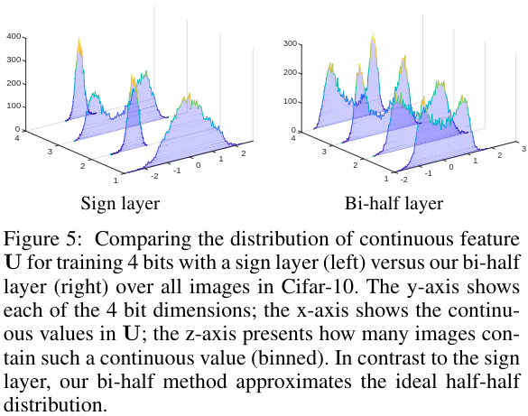

#图像检索
#无监督 

[toc]

# Deep Unsupervised Image Hashing by Maximizing Bit Entropy

- 论文:https://arxiv.org/abs/2012.12334v1
- 代码:https://github.com/liyunqianggyn/Deep-Unsupervised-Image-Hashing
- 会议:AAAI 2021

## 摘要
我们提出 Bi-half Net 来最大化无监督学习的二进制码的信息熵.我们发现当二进制码码值趋于平均分布时,此时码值信息熵最大.直接使用 loss 函数难以优化.为此,我们设计了一个无参数的网络层来显式强制时连续的图像特征逼近平均分布.这个网络层将尝试最小化图像特征和平均分布之间的 Wasserstein 距离.

## 1 引言
直接使用网络输出的最后一层输出来作为索引特征是可行的,但是计算量太大.  
如图1,我们可以将把连续变量变换成离散二进制变量的过程看作是一个有损信道.当二进制码的分布是一半-一半的这样分布时,其容量最大,信息熵最大.即一半的图像被编码为-1而另一半图像被编码为+1.我们可以通过最小化这个信息损失来使得连续变量逼近 half-half 分布.也有一些方法通过添加额外的项来优化信息熵,但这会增加一个额外的超参数且难以优化.为此,我们提出了 Bi-half: 即使用一个无参数网络层,通过衡量 Wasserstein 距离来优化信息损失.这个层可以最大程度的提高哈希码的容量,产生紧凑且信息丰富的 bin 码.  

本文贡献如下:
- 提出了一个简单,非参的 Bi-half 层来最大化 hash 码的信息容量.
- 通过端到端的最小化 Wasserstein 距离,使得连续特征和离散的 hash 码一一对应.
- 我们研究来2种方法,可以提到 loss 中的额外项来最大化 bit 的信息熵.
- 结果 SOTA.

>将图片通过哈希压缩到K位的哈希码.K 是学习出来的连续特征,并有自己的阈值.我们可以将把连续变量变换成离散二进制变量的过程看作是一个有损信道.绿色直方图是标准哈希,蓝色是本文方法,这里显示了单个特征在N个图像上是如何分布的.比起在损失函数中使用额外项,我们设计来 Bi-half 层来显式的最大化哈希通道的信息熵.

## 2 相关工作
略

## 3 方法
我们使用 $X=\{ x_i \}^N_{i=1}$ 表示训练集的 N 张图片.这些图片都被编码为 K 位的二进制码 $B \in \{1,-1\}^{N \times K}$, 这也是我们哈希编码层的输出. $U \in R^{N \times K}$ 是标准神经网络最后的特征图,也是我们哈希编码层的输入.

### 3.1 最大化哈希通道容量
对于每个通道,连续变量 U 传输到二进制变量 B 的最大传输信息即为通道容量:
$$
C=max_{p(u)} I(U;B),   \tag{1}
$$
$p(u)$ 为输入分布,$I(U;B)$ 为连续变量 U 和二进制变量 B 之间的互信息.我们将 $I(U;B)$ 进行如下改写:
$$
I(U;B)=H(B)-H(B|U)  \tag{2}
$$
$H(B)$ 为信息熵,$H(B|U)$ 为条件信息熵.因此最大化通道容量 C 等价于最大化 B 的信息熵 $H(B)$ 和最小化条件熵 $H(B|U)$.由于 B 是一个离散二进制变量,因此当其符合 half-half 分布时,其信息熵最大:
$$
p(B=+1)=p(B=-1)=\frac{1}{2} \tag{3}
$$
针对给定的连续变量 u,  定义传输概率 $p_u(pos)$ 为输出为 +1 的概率, $p_u(neg)$ 为输出为 -1 的概率.显然 $p_u(pos)+p_u(neg)=1, 0 <= p_u(pos),p_u(neg) <= 1$.则条件熵的计算方式如下:
$$
\begin{align}
 H(B|U) &=\int_{u \in U} p(u)H(B|H=u) du \\
 &= - \int_{u \in U} p(u)(p_u(pos) log^{p_u(pos)} +p_u(neg) log^{p_u(neg)}) du \tag{4}
\end{align}
$$
这里即当 $H(B|U=u)=0$ 时,公式4最小,此时意味着对于任意给定的连续变量 u,其二进制码是完全确定没有不确定性的.  

对此,我们鼓励连续特真分布 $p(u)$ 与理想的 half-half 分布对齐,来最大化二进制变量的信息熵.为了最小化公式4,在训练时,我们将以一个非确定的传输概率开始训练,将 $p(u)$ 对齐到+1到-1的 half-half 分布.而在测试时,我们则简单的使用一个符号函数来作为二值化的决策函数.

### 3.2 用于量化的 Bi-half 层
我们使用最优传输 (Optimal Transport,OT) 来将连续特征分布对齐到理想的 half-half 分布.最优传输旨在最小化将概率 $P_r$ 转换到概率分布 $P_g$ 的代价,[详细介绍可见](https://zhuanlan.zhihu.com/p/82424946).当概率分布 $P_r$ 和 $P_g$ 仅能通过离散样本获得时,此时对应的最优传输定义为:
$$
\pi_0= \underset{\pi \in \prod(p_r,p_g)}{min}  \langle \pi,D \rangle _F,  \tag{5}
$$
$\prod(P_r,P_g)$ 表示 $P_r$ 和 $P_g$ 的联合概率测度空间. and $\pi$ is the general probabilistic coupling that indicates how much mass is transported to push distribution $P_r$ towards distribution $P_g$. $\langle ... \rangle _F$ 表示傅里叶点积.$D$ 是代价矩阵,它表示对分布$P_r$中$x$移动到分布$P_g$的$y$所需的代价的矩阵.显然这个矩阵所有值都是非负的.当这个成本被定义为距离时, OT 就是 Wasserstenin 距离来. 若 $D$ 中元素 $d(x,y)$ 是欧式距离平方,那么 OT 就是 [earth movers distance](https://en.wikipedia.org/wiki/Earth_mover%27s_distance),即 1-Wasserstein 距离.我们将优化 1-Wasserstein 距离.   

随机采样 M 个样本作为一个小的 batch,那么对于连续变量 U 和二进制变量 B,其经验分布 $P_u$ 和 $P_b$ 而可以写做:
$$
P_u=\sum ^M_{i=1} p_i \delta_{u_i} , P_b=\sum^2_{j=1}q_i \delta_{b_j}, \tag{6}
$$
这里的 $\delta_x$ 是位置 x 的狄拉克尖峰脉冲函数.$p_i$ 和 $q_j$ 是位置 $u_i$ 和 $b_j$ 的概率值.显然: $\sum ^M_{i=1} p_i =1,\sum^2_{j=1}q_i=1$,注意这里二进制变量只有两个位置(值),$b_1$ 和 $b_2$,对应的概率值 $q_1$ 和 $q_2$.

则哈希编码策略就是最小化最优传输代价 $\pi_0$,即最小化 1-Wasserstein 距离:
$$
\pi_0= \underset{\pi \in \prod(p_u,p_b)}{min} \sum_i \sum_j \pi_{ij}(u_i-b_j)^2,  \tag{7}
$$
这里 $\pi \in \prod(p_u,p_b)$ 所有联合概率分布 $\pi_{ij}$ 的集合.

我们发现单位哈希的最优传输代价即为将特征编码为 half-half 分布二进制码的代价.对于 M 个样本中一位的哈希码,我们首先计算特征变量 u,然后将所有 batch 的 u 的每一位进行排序,大的一半置为 +1, 小灯一半置为 -1,即:
$$
b=\pi_0(u)=
\begin{cases}  
+1, & \text{top half of sorted $u$}  \\
-1, & \text{otherwise}
\end{cases}

\tag{8}
$$
我们将上诉公式应用到一个新的简单的哈希编码层,即 bi-half layer,该层将每个哈希通道的连续特征量化到 half-half 分布二进制代码.该层可以轻易的嵌入到现行的网络结构中并产生高质量的代码.同时参见公式4中引入的传输随机性,这还可以提高模型泛化能力,达到去噪的效果.

> Fig2: bi-half 层.M 是小批量 batch 的大小,K 是特征维数.对于每一位哈希码,即 U 中每一列,我们首先进行排序然后根据其位置是前半段还是后半段,置为 +1 或 -1.而在训练过程中使用 sign 函数来将连续特征分配给最近的二进制码,并减小两者之间的欧式距离.蓝色格子显示来我们方法和直接使用 sign 函数的不同,sign函数下,这些位置的码应该翻转.

**优化** 离散的二进制码是不连续的,因此不能直接使用梯度下降来优化.幸好,最近一些关于二进制神经网络 ([binarized neural networks,BNN](https://zhuanlan.zhihu.com/p/59202590)) 的工作探索出了使用 ([straight through estimator,STE](https://zhuanlan.zhihu.com/p/72681647))来解决这个问题.这里我们也使用 STE 来获得梯度.注意,我们期望 U 和 B 在反传时更新状态是相同的,已符合前馈时的目标.  
对于给定的时间 $t$,其当前状态为 $U_t$ 和 $B_t$.在 $t+1$ 时,我们强制两者更新状态相同,即 $U_{t+1}=B_{t+1}$.假设使用 SGD 更新,则 $U_{t+1}=U_t-lr*\frac{\partial L}{\partial U_t},B_{t+1}=B_t-lr*\frac{\partial L}{\partial B_t}$,$lr$ 为学习率, $L$ 为损失函数. $U_t$的计算方式为 $\frac{\partial L}{\partial U_t}=\frac{\partial L}{\partial B_t}+\gamma(U_t-B_t),\gamma=\frac{1}{lr}$.则其前馈和反传过程可以按照以下方式计算:
$$
Forward: B= \pi _0(U), 
Backward: \frac{\partial L}{\partial U}= \frac{\partial L}{\partial B}+ \gamma(U-B)   \tag{9}
$$
在前馈过程中,连续特征变量被量化成符合 half-half 分布的二进制代码.在反传过程中,将鼓励连续特征分布和理想的 half-half 分布对齐.

## 4 实验
**dataset** 略.   

**实现细节.**  
*图片设置:*  
对于 Mnist 图片,我们从头训练了一个自编码器.对于其他数据集,我们是使用预训练的 VGG-16 作为基干网络,并使用一个额外的 FC 层来降维.然后使用 Bi-half 层来生成二进制编码.训练的优化器使用的 SGD, momentum 是0.9,weight decay 为 $5 \times 10^{-4}$,batch size 是32.初始学习略为0.0001.每次loss不再衰减时,就将学习率缩小10倍.超参数 $\gamma$ 是通过在训练集上进行交叉验证得到的,$\gamma = 3 \times \frac{1}{N \cdot K}$
*视频设置:*
略.

**评价方法**
略

### 4.1 从头训练自编码器
略

### 4.2 经验性分析
对于预训练模型,我们参照[(Su et al. 2018)](https://proceedings.neurips.cc/paper/2018/hash/13f3cf8c531952d72e5847c4183e6910-Abstract.html)的无监督设定,使用了 $||cos(a_1,a_2)-cos(b_1,b_2)||^2_2$ 作为代价函数来最小化余弦相似度之间的差异.这里 $a$ 是预训练模型最后一层输出的连续特征变量, $b$ 是对应的二进制代码.  

**连续特征是如何分布的:** 图5 显示了我们在 Cifar-10(I) 上训练4位码的网络时可视化出连续特征变量U在每个维度上的直方图分布.很明显比起 Cao et al.2017 和 Su et al.2018 的 sign layer,本文方法出来的结果更加贴近 half-half 分布.

> y轴对应4位码的维数.x轴显示了连续变量U.z轴是有多少图片包含这个连续变量.

**单个哈希码的分布是怎样的:** 图4(a) 显示了16位哈希码中每个位置 +1 在所有图片中出现的概率. 可以看到 sign layer 的分布是一个非平均分布,有部分位置几乎不可能是 +1.由于在整个数据集上这些位置是几乎确定的,因此这些位置是可以省略的.相比之下,本文方法呈一个平均分布,可以充分利用编码容量.  

**其他哈希编码策略:** 图4(a)中右图显示了 continuous relaxation layer,smoothed continuation layer ,sign layer 和 Bi-half layer 在 Cifar-10(I) 训练32和64位编码的性能. sign layer 比其他两种略好的原因可能是它可以有效保持编码离散这个约束.当然本文方法更好.  

**bi-half layer 的变体:** bi-half layer 的一个变体是添加一个平移项 $t$ 在 sign 函数上,即 $sign(u+t)$.为了验证这个方法,我们估计了每个 batch 的中位数.并在推理使用一个指数移动平均数(exponential moving average,EMA)来替代这个中位数.图4(b) 显示了我们在 Flickr25k 上的实验结果.左图显示了在不同的批量大小上,EMA 是如何随着训练 epoch 进行变化的.我们的学习率和 batch size 是近似线性缩放的.小的 batch size 更容易导致 EMA 不稳定.中间图显示了 bi-half 方法和不同 batch 下变体方法的差异,编码长度是16.增大 batch 可以显著提升变体方法的性能.最后结论还是 bi-half 最棒棒.

