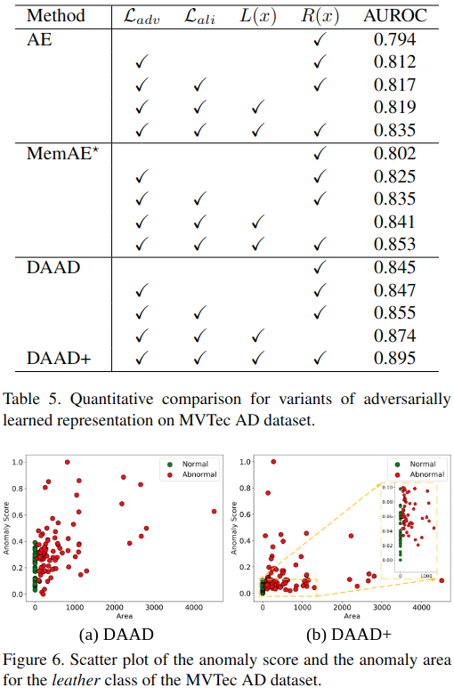

#异常检测

[toc]

# Divide-and-Assemble: Learning Block-wise Memory for Unsupervised Anomaly Detection

- 会议: ICCV 2021
- 论文: <https://arxiv.org/abs/2107.13118v1>

## 摘要

理想情况下,我们期待对正常样本重建完美但是对异常样本重建较差.但是深度神经网络的泛化难以控制,现有的模型,比如 AE 就表现不是很好.为此,我们提出了可以将图片的重建视为是一个分离然后组装的过程.我们发现,通过改变特征图上划分的粒度,我们可以控制对正常还有异常样本的重建.更细的粒度可以得到更好的重建结果,而更粗的粒度则重建效果越差.合适的粒度可以最大化正常和异常样本之间的重建误差.分合框架 (divide-and-assemble framework) 通过嵌入一个新颖的,多尺度的,分块记忆模块到 AE 中来实现的.除此之外,我们还引入了对抗学习,探索了在判别器潜空间表征下的语义,这可以提升对于细小异常的检测.

## 1. 引言

基于重建的方法在无监督异常检测中被广泛应用,AE 是最朴素的一个.我们都认为正常样本的重建误差要小于异常样本.但是由于 AE 中的下采样丢失了很多细节信息,因此导致其输出模糊,甚至和正常样本重建误差过大.我们可以通过减少下采样率和添加跳接来增强 AE 重建能力.但是由于深度神经网络不可控的泛化能力,因此很难保证提高正常样本的重建质量同时抑制异常样本,如图 2.因此,寻常的 (vanilla) AE 性能不行.

已经有一些工作开始探索如何扩大正常和异常样本的重建差距,但是都不够有效.我们认为现存的记忆增强的模型都依赖于对已经编码的特征图进行逐像素的解码.若特征图基本重建块 (block) 小到一个像素,那么每个重建块能表征的模式就很受限制了.重建块越小,异常区域和正常区域在这个小的重建块上就越可能有相似是模式,也就越难通过重建拉开两者差距.图 1 就展示了这么一个例子.图 1 中,我们尝试从正常 A 中以不同的 block size 进行学习,然后用学习到的 blocks 来重建正常的 B 和 C.当 block 越小,我们就会学习到越小的模式 (蓝白块),当块过大,我们就很难正确重建 B 和 C.而块大小适中,我们就可以完美重建出正常的 B 并错误重建 C.

基于以上启发,我们提出了分合异常检测框架 (Divide-and-Assemble Anomaly Detection,DAAD),将图片重建过程视为是一个分合过程.编码后的特征图被均匀的划分到一个网格块中,引入了一个 block 级别的记忆模块来对正常样本块级的分布进行建模,这样的一个设计使得调节网络重建能力成为了可能.另外,跳接是可以安全添加的,它可以有效提升正常样本的重建质量,对于异常样本则没有帮助,给定一张输入图片, DAAD 将使用多个编码层的多尺度特征来检索 memory banks 中最相近的项.然后我们将这些项通过相应的跳接送到解码器中.利用反传,记忆项和模型参数可以一起端到端的学习.

另外,在现实世界中,大量的异常,比如划伤,裂纹都是很细小的,这些缺陷的像素很容易掩模在正常像素里.对于基于重建的方法,正常像素的累计误差要远大于异常像素,这会使得聚合得到的异常分数难以判别出正常异常.虽然正常样本的像素重建误差要小于异常像素,但是仍然很难分辨出异常.为此,我们引入了对抗学习的判别器,并探索了它在低维度下的语义表征.输入图片和重建图片特征之间的相似性被用来衡量正常度.语义特征级的异常分数和底层重建分数是互补的,二者结合起来可以提升检测性能.

本文主要贡献总结如下:

- 我们提出了多尺度块级的记忆模块来实现了正常样本更好重建和异常样本更差重建之间的权衡,并使二者更加有区分性.
- 我们引入了对抗学习特征表征来从语义上检测异常,进一步补足了基于重建的检测的性能
- 结果 SOTA

## 2. 相关工作

**无监督异常检测:**

_基于重建的方法:_ 本文就是这一类方法,旨在通过引入多尺度块级的记忆模块和对抗学习表征来提高基线模型性能.

_基于特征的方法:_ 利用预训练模型迁移学习来模拟正常样本分布.代表工作 [SPADE](),[MAHA](),[FAVAE]() 尝试使用额外数据集来学习到更多知识.

[**记忆网络:**](../../DL_knowlege/memory%20network.md)

RNN 和 LSTM 可以抓取到序列数据的长期依赖.但是它们的记忆能力有限,无法精准的记住序列数据的所有内容.而最近, Weston 等人提出了一个记忆网络,使用特化的 memory bank 可以更好的读写和记忆.但是这个网络很难通过反传来训练,因为其每一层都需要监督学习. Sukhbaatar 等人通过连续记忆表征来读写记忆,使得端到端训练这个记忆网络成为可能.基于端到端的记忆网络, Miller 利用键值对来进一步扩展记忆体的能力.记忆网络的成功使得它在目标检测,动作识别,视觉问答,异常检测开始有了广泛应用.我们在多尺度上使用块级而非像素级的记忆网络来调节网络的重建能力.

## 3. 方法

首先,我们会简要介绍 DAAD 框架的,然后展示块级记忆模块的详细构成,最后我们引入对抗学习特征来协助识别异常,最后我们将会介绍训练时的 loss 函数和异常分数的计算方法.

### 3.1. 网络结构

#### 3.1.1 编码器,解码器

具体架构见图 3.编码网络 $G_E$ 将输入图片 x 映射到表征 z.对称的解码网络 $G_D$ 通过将隐变量 z 上采样到输入分辨率以及预测重建,记为 $\hat{x}$.我们学 UNet 加入来横向链接,这个可以更好的保留局部和全局信息,但是也可能增加如图 2 所示问题的风险,即网络重建无法区别异常和正常.为了解决这个问题,我们在每个横向链接中加上基于块级的记忆模块.

#### 3.1.2 块级记忆模块

分合的概念是通过块级记忆模块来说实现的.使用块级待查表征 (Block-wise Query Representation) 和 memory bank 来记录原型模式.使用一个基于注意力机制的寻址操作来读取和更新记忆项.

**Block-wise Query Representation.**  
给定输入图片 x,通过编码器可以得到一系列的特征映射 $\{f_1,f_2,…,f_L\}$,$L$ 是尺度的数目.每个特征映射 $f_l$ 的尺寸是 $H^l \times W^l \times C^l$,我们将其划分为大小 $Q=r_h \times r_w \times r_c$ 的网格,其中 $r_h,r_w,r_c$ 是高宽通道的分离比.网格中每个 blocks 大小可以记为 $\{q^k \in R^{\frac{H^l}{r_h} \times \frac{W^l}{r_w} \times \frac{C^l}{r_c}},k=1,2,…,Q\}$.每个 block 被展开成一个向量并被存入 memory bank.对于每一个待查的 query,其特征是从 memory bank 通过寻址操作聚合出来的.这个聚合特征维度和 query 相同,然后我们将之 reshape 会 block 大小 $\frac{H^l}{r_h} \times \frac{W^l}{r_w} \times \frac{C^l}{r_c}$,通过整合这些 aggregated featture blocks,我们可以得到转化后的 feature maps $\{\hat{f_1},\hat{f_2},\hat{f_L}\}$,然后将其送到解码器 $G_D$ 来重建 $x$.注意我们在所有尺度上使用相同的分离缩放比,所以不同层级的特征映射的 block size 都不一样,那么对应的 memory bank 也就无法共用.

**Memory Bank and Addressing.**  
memory bank $M \in R^{N \times D}$ 定义为包含来 N 条 memory items 的真值矩阵,每条 memory items 固定维度为 D.用来记录训练期间原始的正常模式.通过计算 query $q^k$ 和 memory bank 中每条记录 $m_i$ 的相似性确定注意力权重,每个权重 $w_i$ 的具体计算方式如下:

$$
w_i=\frac{exp(\frac{q^km^T_i}{||q^k||||m_i||})}{\sum_{j=1}^N exp(\frac{q^km^T_j}{||q^k||||m_j||})}    \tag{1}
$$

显然 $w_i$ 非负且何为 1.基于此注意力权重,我们可以得到一个新的 feature block $\hat{q}^k$ :

$$
\hat{q}^k=wM=\sum_{i=1}^N w_im_i   \tag{2}
$$

#### 3.1.3 对抗学习表征

对于一些难以重建的复杂图像,基于重建误差的异常分数常常会受到大量正常样本像素累积误差的影响.为此,我们引入来一个对抗学习表征.在训练阶段,我们最小化原始图像和重建图像在低维度语义表征空间上的最小距离.在测试阶段,我们将特征相似性融入到异常分数中,这使得在对于正常样本重建较差的情况下,分数更加鲁棒.为了防止从模式崩溃中学习到特征,我们利用了对抗训练策略.即将编解码网络视为是一个生成器 G,在解码器之后再添加一个判别器 D.如图 4 所示,判别器预测给定输入的真伪标签,整个结构设计参照的 DCGAN. 在训练阶段, D 用来甄别真实图片 $x$ 和 G 生成的图片 $\hat{x}$.在推理阶段,网络 D 被用来作为一个特征提取器,提取输入图片 $x$ 和重建图片 $\hat{x}$ 的特征.

### 3.2. 损失函数

$$
L=\lambda_{rec}L_{rec}+\lambda_{adv}L_{adv}+\lambda_{ali}L_{ali} \tag{3}
$$

$L_{rec},L_{adv},L_{ali}$ 分别为重建,对抗和对齐损失,$\lambda$ 为其对应的损失权重.

**重建损失.**  
我们使用重建图片 $\hat{x}$ 和输入图片 $x$ 的 L2 距离作为重建损失,即:

$$
L_{rec}=\underset{x \backsim p_x}{E} ||x-\hat{x}||_2   \tag{4}
$$

$p_x$ 表示正常样本的分布.

**对抗损失.**

$$
L_{adv}=\underset{x \backsim p_x}{E}[log D(x)]+\underset{x \backsim p_x}{E}[log(1-D(G(x)))]  \tag{5}
$$

**对齐损失 Alignment Loss**

该损失旨在匹配重建图像 $\hat{x}$ 和输入图片 $x$ 的特征表示.这有助于确保特征相似性可以用来检测异常,即,正常样本的特征相似性要高于异常样本.如图 4,给判别器 D 喂一对图片 ($\hat{x}$ 和 $x$),我们提取 D 卷积层最后一层的特征.我们将提取出的特征 $f_D(x)$ 和 $f_D(\hat{x})$ 作为 $x$ 和 $\hat{x}$ 的语义表征.那么最终对齐损失如下:

$$
L_{ali}=\underset{x \backsim p_x}{E} ||f_D(x)-f_D(\hat{x})||_2  \tag{6}
$$

### 3.3. 异常分数

$$
A(x)=\gamma R(x)+(1-\gamma) L(x)  \tag{7}
$$

$R(x)$ 是重建损失, $L(x)$ 是对齐损失.

## 4. 实验

### 4.1. setup

数据集: MVTec-AD, MNIST, CIFAR10

**实现细节**  
针对 MVTec-AD,每张输入图片 resize 到 $256 \times 256$,像素值归一化到 $[-1,1]$.数据增强使用了水平和垂直反转.$r_h,r_w,r_c$ 为 8,8,1,memory bank 大小为 N.若仅仅使用重建误差 (DAAD),优化器 Adam 初始学习率 $1e^{-4}$,权重衰减为 0,动量参数 $\beta_1=0.9,\beta_2=0.999$.若使用了对抗损失和对齐损失 (DAAD+),学习率增加到 $2e^{-4}$.损失权重为 $\lambda_{rec}=50,\lambda_{adv}=0.5,\lambda_{ali}=0.5$,公式 7 中 $\gamma=0.9$,训练 1000 轮,batch size 为 8.

**评价**  
使用了 AUROC.

### 4.2. 结果

**MVTec-AD**

和普通 AE 相比,我们的 AUROC 高了 10.1%,这点在 4.3 节会讨论.

**MNIST,CIFAR10**

### 4.3. 消融实验

**基线上的提升**

MemAE 是在 AE 基础上使用了像素级的 memory module. MemAE 对 AE 几乎没有改善,而 AE+Skip 同时提高了正常和异常的重建,使得两者难以区分,但是在诸如地砖,木头,螺钉等类别中表现不错,因为这类前景和背景纹理很类似,好的重建使得异常和正常有更好的区分度.

**块大小的影响**

表 4 显示了不同 division rate 对性能的影响.图 5 显示了不同 division rate 对重建结果影响的可视化.从这些结果可以看出,块大小对重建质量的影响还是很大的.块越小,网络就可以更好的重建出图片细节.当块足够小,模型甚至可以重建出异常区域.而块过大时,模型甚至可能无法较好的重建出原始图像.在通道轴上进行 division 也会得到类似的结果.

**对抗学习表征的影响**

我们发现对抗式训练已经无法给 DAAD 带来提升,因为 DAAD 已经可以完美重建.而对齐损失 $L_ali$ 则通过给模型添加一个小的约束来实现了一个小的提升.我们认为重建分数仅能针对缺陷较大的情况下起作用.而对齐分数可以压缩正常样本的异常分数,特别是对于诸如皮革地毯等难以重建的类.

## 5. 结论

记忆模块很适合用来对正常样本进行建模.本文从分类和聚合特征映射的角度来探索块重建,通过控制构建块的粒度来实现了对正常较好重建,对异常较差重建的平衡.另外,通过使用对抗学习,探索了异常在低纬度空间中的语义,补充了图像空间中异常的检测.

## 6. 补充内容

**memory bank 大小的影响**

如图 7,500 大小为最佳性能,但是单纯增加 memory bank 并不能就增加性能

**在视频数据集上的实验**

略

**DAAD 结构**

**判别器结构**

对于输入图片 $256 \times 256$,特征提取器会将 feature map 展开然后缩到 100 维.
