#异常检测

[toc]

# Explainable Deep One-Class Classification

- 代码: https://github.com/liznerski/fcdd
- 文章: https://openreview.net/forum?id=A5VV3UyIQz
- 会议: ICLR 2021

## 摘要

用于异常检测的深度单类分类旨在学习一个映射将正常样本在特征空间中尽量聚集,从而将异常样本直接映射出去.由于这种变换是一个高度非线性的,因此对其进行解释是十分困难的.本文,我们将提出一种可解释的深度单类分类方法,全卷积数据描述(Fully Convolutional Data Description,FCDD),它会将样本的特征提取出来形成一个热力图解释. FCDD 在异常检测中表现不错,且为 CIFAR-10 和 ImageNet 等一些常见基准数据集提供了合理的解释.在 MVTec-AD 下,FCDD 在无监督的情况下达到了 SOTA. 在训练过程中结合 gt 标注的异常解释,仅是使用少量的这样的数据,也可以显著提高模型性能.最后利用 FCDD 的可解释性,我们论证了单类分类模型对于诸如水印等图像特征的无力.

## 1 引言

关于 anomaly detection(AD) 的历史.略.

深度支持向量数据描述(deep support vector data description,DSVDD)方法,旨在寻找一个网络模型将正常数据变换聚集到一个特定的中心,而异常数据位于其他位置.而本文提出的 FCDD 则是其一个变体,转换之后的图像的本身就是下采样之后的异常热力图.热力图中距离中心远的像素就是输入图像中的异常区域. FCDD 仅使用卷积和池化层,这可以限制输出像素的感受野.本文方法属于单类分类这一框架.

在 CIFAR-10 和 ImageNet 上, FCDD 的异常检测性能达到了 SOTA 并提供了可解释性.在 MVTec-AD 上,我们展示了 FCDD 可解释性的精准度.并且在后续实验中,我们发现了深度单类分类模型容易产生 ["Clever Hans" 效应](https://arxiv.org/abs/1902.10178)(即观察者期望效应),比如检测了一些虚假的特征,比如水印.我们还发现生成的异常热力图比起包括基于梯度的基线模型结果来说,噪声更少且结构性更多.  
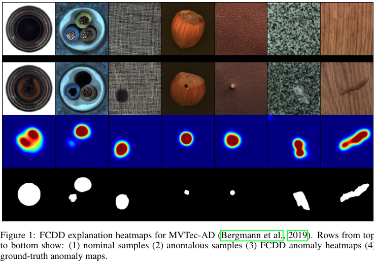

## 2 相关工作

本章我们将综述一些 AD 工作,并将重点放在其可解释性上.比如经典的使用自编码器的,通过在正常样本上训练使得自编码器在异常样本上重建性能很差,将重建误差作为异常分数,并可以找到像素级的区别予以解释.从而提供异常热力图.最近的一些工作更是将注意力引入到重建模型中,用以解释.在视频领域, Sabokrou 等人使用了预训练的全卷积结构,结合稀疏自编码器来提取 2D 特征并定位异常.重建方法的一个缺点是,对于已知的异常,它们无法在训练过程中充分利用.

最近,单类分类方法兴起.这类方法尝试使用无监督的方式将正常和异常样本分离,通过网络尝试将正常样本进行聚类,将异常样本排斥.在 NLP 领域,DSVDD 已经被成功用于文本,并由此产生了使用注意力机制来进行解释这一形式.对于图像, Kauffmann 则尝试使用深度泰勒分解来获得相关分数.

表现最棒的是一些基于自监督的方法.这些方法将正常样本进行变换,然后训练一个网络来预测何种变换被应用到了输入上,并通过预测的置信度来获得异常分数,并能够拓展到已知的异常上,但目前,这类方法的可解释性很差.

当然,通过来说解释的方法有很多种,比如和模型无关的 LIME 或是基于梯度的方法.对于本文而言,我们注意到全卷积架构常被用于监督性的分割任务,且在训练过程中需要目标分割图.

## 3 解释深度单类分类方法

在开始解释我们的方法之前,我们先回顾一下单类分类和全卷积架构.

**深度单类分类方法:**  
深度单类分类通过学习一个网络将正常样本映射到输出空间中心 c 周围,将异常样本映射掉的思想来进行异常检测.对于我们的方法,我们使用了[超球面分类器(Hypersphere Classifier,HSC)](https://arxiv.org/abs/2006.00339),该方法是 Deep SAD 的一个变体, DSVDD 的半监督版本.使用 $X_1,...,X_n$来表示样本集,$y_1,...,y_n$表示标签,$y_i=1$是异常,$y_i=0$是正常,那么 HSC 的优化目标为: ^a639b1

$$
\underset{W,c}{min}    \frac{1}{n} \sum_{i=1}^{n}{(1-y_i)h(\phi(X_i;W)-c)-y_ilog(1-exp(-h(\phi(X_i;W)-c)))}    \tag{1}
$$

关于函数的分析见下面[关于超球分类器函数的分析](#关于超球分类器函数的分析)

整体函数的函数图如下:
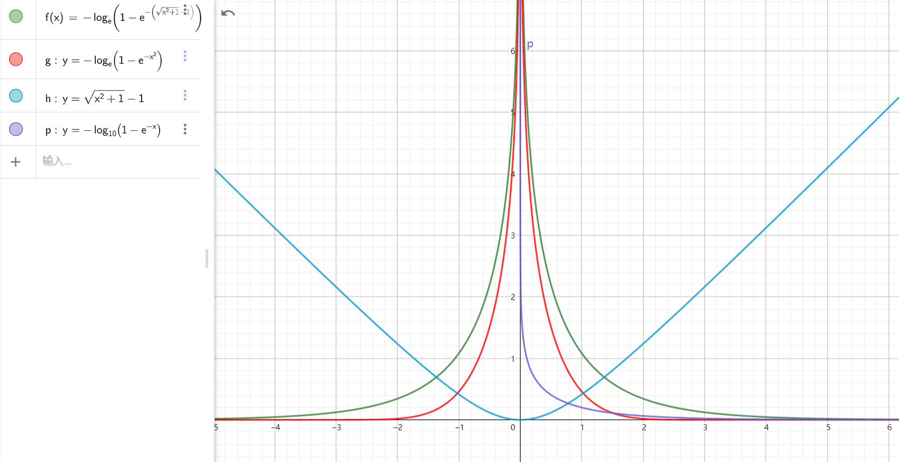

这里 $c \in R^d$ 输出空间中心,$\phi : R^{c \times h \times w} \to R^d$ 为神经网络,权值为$W$. $h$ 为 [pseudo-Huber 损失](../../DL_knowlege/Huder%20loss.md#Pseudo-Huber%20loss%20function), $h(a)=\sqrt{||a||_2^2+1}-1$,即使用一个可导的二次惩罚来近似一个线性惩罚. HSC 损失鼓励正常样本聚集到 $c$,异常样本远离 $c$ .在本文实现中,中心 $c$ 对应于网络最后一层的偏置项.所以这个中心是包含在网络$\phi$中的,因此我们在 FCDD 的描述将忽略这点.

**全卷积架构:**  
 全卷积网络将图片映射成一个矩阵,比如$\phi: R^{c \times h \times w} \to R^{1 \times u \times v}$,它一般仅包含卷积层和池化层,不包含全连接层.这种情况下,池化可以被视为是固定权重的卷积.

显然全卷积网络是保留了空间信息的.

**全卷积数据描述**  
 由此,我们引入 FCDD.结合 FCN 和 HSC,FCDD 的输出特征可以保留空间信息,且可以作为下采样之后的异常分数热力图.对于那些需要全分辨率热力图的情况,我们提供了一种基于感受野特性的低分辨率热力图上采样方法.  
 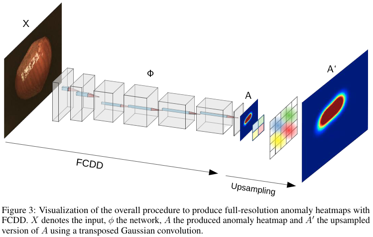  
 FCDD 使用标注的数据进行训练,使用 $X_1,...,X_n$来表示样本集,$y_1,...,y_n$表示标签,$y_i=1$是异常,$y_i=0$是正常,异常数据可以是任何不来自正常样本集合的随机图片,比如 Tiny Image 或者是 ImageNet. 使用这种辅助数据在推荐系统的异常检测中比较常见,我们称之为离群点暴露(Outlier Exposure,OE).当我们可以拿到一个来自异常数据集的真实样本时,这代表着在实际测试中我们也很可能会遇到,我们发现即使使用少量甚至几个标注异常作为语料库,模型性能表现也很不错.(这句没太理解清楚).换言之,即使没有任何的已知异常实例,我们可以合成人工异常样本,这也是很有效的.

FCDD 在 FCN 的输出上,针对每个像素使用 HSC, 即对于最终输出特征图上每个点 $A(X)=(\sqrt{\phi(X;W)^2+1}-1)$.那么 FCDD 的优化目标是:

$$
\underset{W}{min} \frac{1}{n} \sum_{i=1}^{n}{(1-y_i) \frac{1}{u \cdot v} ||A(X_i)||_1- y_ilog(1-exp(-\frac{1}{u \cdot v ||A(X_i)||_i}))}   \tag{2}
$$

其中$||A(X)||_1$是所有像素$A(X)$的和,且皆为正值.异常样本将最大化$||A(X)||_1$,而正常样本将尝试最小化它,因此我们将其作为异常分数.而增大$||A(X)||_1$的$A(X)$所对应的区域就可能是异常区域.而这些区域的形状取决于 FCN.在[附录 A]()中展示了我们对于感受野的敏感性分析,我们发现感受野大大小对性能影响不大.注意最终输出特征图大小是$u \times v$,原始图片大小是$h \times w$.直接使用最终输出作为一个低分辨率热力图当然是可以的,但是通常我们希望有一个全分辨率的热力图.由于在训练中,我们通常没有异常区域的 gt,因此通过监督学习得到一个 FCN 将低分率热力图上采样到原始分辨率是几乎不可能的.为此,我们基于感受野策略,提出了一个上采样策略.

**热力图上采样:**  
由于我们在训练时没有异常区域的 gt,因此无法使用监督学习训练类似反卷积的结构.对于输出$A(X)$的每个像素都有对应有一个感受野中心的输入像素. Luo 揭示了,输入像素对输出像素的影响以感受野中心,以高斯分布衰减.基于此,我们使用一个权重为固定高斯分布的反卷积来上采样$SA(X)$,反卷积核为感受野大小,步长为累计步长.权重分布的方差是按照经验来选取,详情见[附录 B]().图 3 显示了整个方法的结构.  
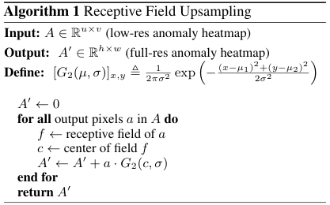

## 4 实验

本节将对 FCDD 进行定量和定性实验评价.定量评价时,我们使用 AUC 作为评价指标.定性评价,我们将 FCDD 和其他深度 AD 解释性方法比较.对于基线模型,我们将基于梯度的方法结合 HSC 作为基线,另外还使用自动编码器的重建方法也作为基线.对于基线模型的低分辨率特征图,我们使用和 FCDD 一样的上采样方法. [附录 G]()显示了不用我们提出的上采样方法的效果.[附录 C]()我们对已不同热力图上采样方法.对于我们的实验,我们将忽略于模型无关的解释方法,比如 LIME 或是 anchors,因为它们不是针对 AD 量身定制且性能较差.

### 4.1 标准异常检测基准

使用了 Fashion-MNIST,CIFAR-10 和 ImageNet.做法是设置一类为正常,其它类都是异常.训练是仅仅使用正常类以及一些随机图片用来做离群点暴露,对于每类我们使用 AUC 作为评价指标.

**Fashion-MNIST**.我们使用 EMNIST 作为训练集, CIFAR-100 作为 OE.网路结构是三卷积+BN+2 池化.

**CIFAR-10** 同样使用 CIFAR-100 中和 CIFAR-10 无关的类作为 OE,网络结构类似 LeNet-5,但是所有卷积都是 3x3,添加 BN,将最后的全链接和最大池化换成 2 个卷积.

**ImageNet** 使用 ImageNet1k 中 30 个类作为正常训练和测试.使用 ImageNet22k 中和 1k 无关的类作为 OE. 使用类似 VGG11 的结构,输入缩放成 224x224.详情见[附录 D]()

**SOTA 方法**
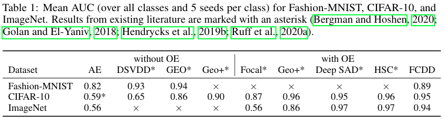

**定量结果**
结合上表, FCDD 虽然使用了比较龊的 FCN 结构,但是性能依然接近 SOTA 方法,且解释性不错,而自编码器结果则出现了类似随机预测的结果.
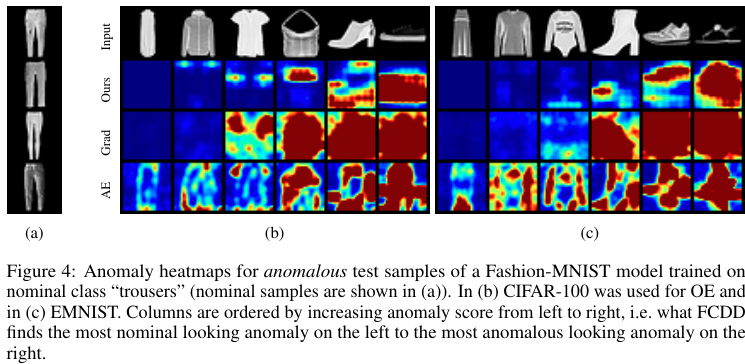

**定性结果**
图 4 和 5 显示了 Fashion-MNIST 和 ImageNet 上的热力图.在 Fashion-MNIST 上使用裤子作为正常类, FCDD 倾向于将水平排列的区域识别为异常,这是正常的,因为裤子大多是垂直排列的.对于 ImageNet 方法使用橡树果作为正常样本,我们可以看到似乎颜色是更加重要的特征,绿色和棕色区域往往趋于认为是正常的,而其他颜色则被认为是异常的,比如红色的谷仓和白色的雪.不仅如此,它似乎也可以利用更多的语义特征,比如识别绿色的毛毛虫是异常的,而橡树果即使是在红色的背景下,也依然能够识别对.
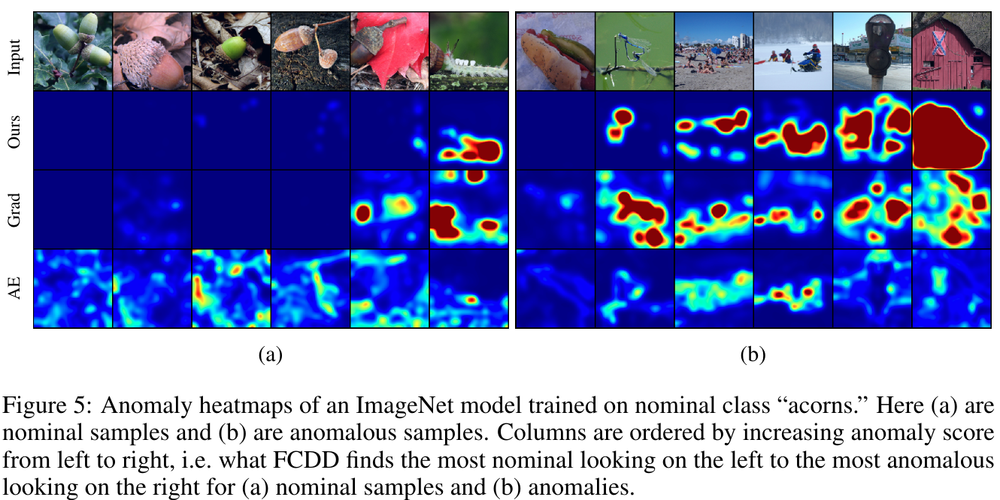

图 6 显示 CIFAR-10 模型在不同 OE 下的热力图,正常样本是飞机,我们可以观察到,随着 OE 样本的增加, FCDD 更加倾向于对图中主要目标进行解释,比如鸟,船,卡车.在[附录 G]()中展示了我们对所有类进行热力图的测试结果.
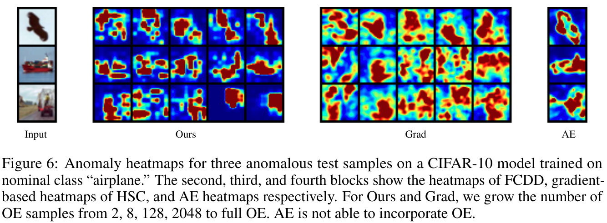

**基线解释**
参见图 6,我们发现基于梯度的方法容易产生和空间上下文无关的中心斑点.而 AE 的热力图是基于重建的,和异常分数直接相关,反而看上去更加合理.我们还发现,将 OE 或者是标记好的异常纳入到 AE 并不容易,这使得 AE 的性能较差.简而言之, FCDD 的异常热力图更加良好且具有一致的可解释性.

### 4.2 关于人工合成缺陷的解释

这里我们在 MVTec-AD 数据集上人工制造缺陷,并再次测试了 FCDD 的性能.该数据集提供了缺陷的 gt 掩模,因此可以对模型解释进行定量评估. MVTec-AD 包含了 15 个对象对,所有图片都是 RGB 图片,分辨率都是 1024,其中异常测试样本进一步分为 8 中缺陷类型,具体取决于具体分类. 我们借鉴 Bergmann, 计算热烈图像素分的 AUC,使用给定的缺陷 gt 掩模作为量化对照标签.对于 FCDD,我们使用了基于 VGG11 的模型,从 ImageNet 预训练,冻结了前 10 层,添加了一个额外的全卷积层.

**人工合成缺陷**
由于这里的异常是类间微妙的缺陷,而不是超出类别的,因此使用诸如 ImageNet 这样的自然图像数据集作为 OE 是没有帮助的.处于这个原因,我们通过使用一种"confetti noise"来制造缺陷,这是一个简单的噪声模型,它将颜色块插入到图像中来反映局部的缺陷变化,如图 7.
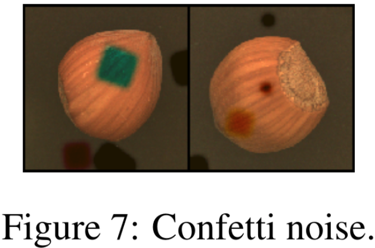

**半监督 FCDD**  
和重建方法相比,FCDD 可以很容易的应用到半监督领域.为了测试少量标注的异常对模型训练的指导效果,我们在 MVTec-AD 训练时,对于每个类选取了一个真实的缺陷样本到训练集,这样大约有 3~8 张缺陷样本被混入到了每类的训练集中.为了充分利用 gt 标注,我们以像素等级来训练模型.设定 $X_1,...,X_n$ 为输入,对应的 gt 是$Y_1,...,Y_n$,每个样本有 $m=h \cdot w$ 个像素.设定$A(X)$表示$X$对于的异常热力图.那么我们像素级的优化目标变成了:

$$
\underset{W}{min} \frac{1}{n} \sum_{i=1}^n(\frac{1}{m}\sum_{j=1}^{m}(1-(Y_i)_j)A'(X_i)_j) - log(1 - exp(- \frac{1}{m} \sum_{j=1}^m{ (Y_i)_j A' (X_i)_j})) \tag{3}
$$

**结果**  
引言中的图 1 展示了 FCDD 在 MVTec-AD 中的热力图.量化结果见表 2.可以看到在无监督的情况下,FCDD 是优于其他方法,AUC 高达 0.92.在半监督中,若仅使用一个异常样本,AUC 可以到 0.96,同时 FCDD 在所有类中的性能很稳定一致.  
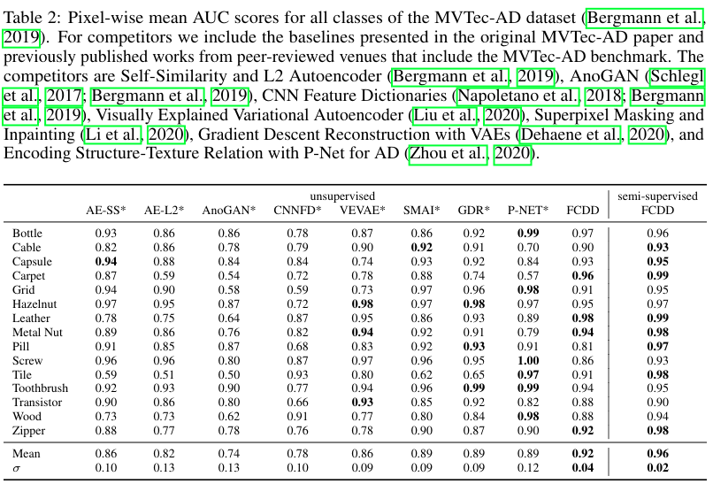

### 4.3 Clever Hans 效应

Lapuschkin 等人发现在 VOC 中,有五分之一马的图片在左下角包含了水印,当删除水印时,分类器会识别失败.他们将之称之为 "Clever Hans"效应.我们尝试将马类设置为异常,将 ImageNet 设置为正常样本来训练 FCDD.我们期望 FCDD 的热力图应该会出现在马身上,但是结果确实 FCDD 也出现了聪明汉斯效应.
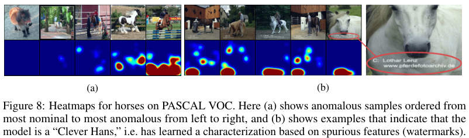

图 8b 显示了单类分类模型很容易学到一些虚假特征,比如水印等.我们还发现了,该模型在图形中的条,格和栅栏中得分很高,如图 8a.这可能是由于数据集中很多图像包含了马跳过栅栏围栏.在这两种情况下,马的本体特征并没有取得最高的分数,因为模型无法在训练时得知哪些是虚假的特征,这些特征通常在训练是提供了较好的区分能力,但是在测试时却不管用.比起黑盒模型,诸如 FCDD 这类透明模型可以更好的帮助从业者分辨出这类不良情况.

## 5 结论

综上,我们发现 FCDD 比以前方法性能更好,既可以适用于语义检测任务(4.1 节),也可以用来做更加细微的缺陷检测任务(4.2 节).最后,与其他后验解释的任务相比,FCDD 将异常分数和解释直接绑定,更不容易受到攻击.我们将在下一阶段工作中分析这种现象.

## 附录待补

## 关于超球分类器函数的分析

设定$c=1$,则$log(1-exp(x-c)))$部分的函数图下如下:
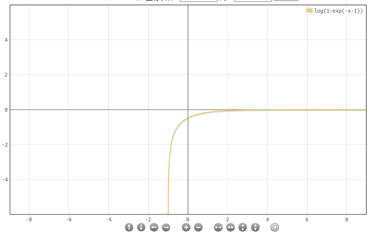
可以看到,假设
样本距离中心近,预测为正常,那么$y_i=0$,$h(\phi(X_i;W)$近似为$\frac{x^2}{2}$,那么此刻损失大约为$\frac{c^2}{2}-c$ ;

若样本距离中心近,预测为异常,那么此时损失大约是$log(1-exp(-\frac{c^2}{2}-c)))$,其中$-\frac{c^2}{2}-c$为一个很小的值,那么根据$-log(1-exp(x))$可知道此时损失很大, 近乎是垂直的指数.
).png>)

若样本距离中心远,预测为异常,后半部分大约是$-log(1-exp(-x-c)))$,其中$-x-c$较大,根据上图,产生的 loss 是很小的.

若样本距离中心远,预测为正常,后半部分大约是$-x-c$,依然是一个很大的 Loss.
