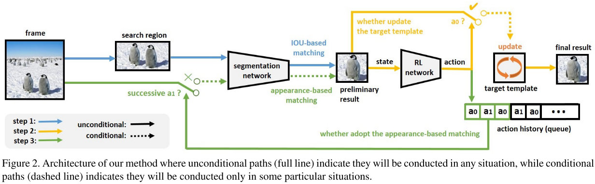
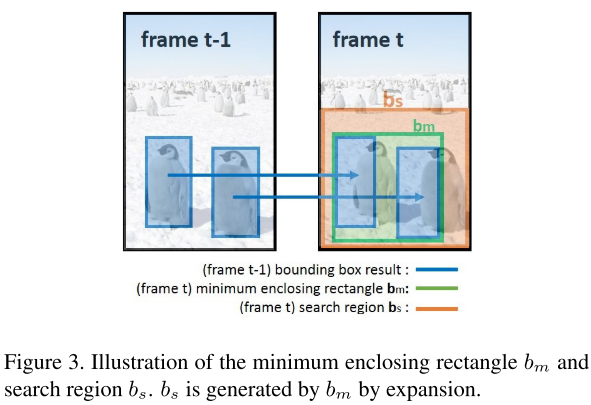
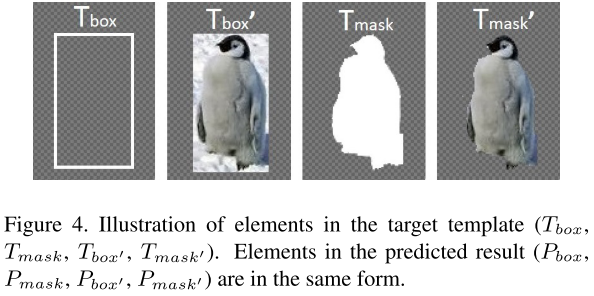

[toc]

[CVPR](../../Tag/CVPR.md)

# Fast Template Matching and Update for Video Object Tracking and Segmentation

- 文章: <https://arxiv.org/abs/2004.07538>
- 代码: <https://github.com/insomnia94/FTMU>
- 年份: 2020

## 摘要

本文主要聚集于多实例半监督视频目标分割,这里仅有第一帧给出了 box 级的背景标注.这项任务的难点在于如何选择匹配方法来给出预测结果以及是否根据最新结果更新模板.以往方法在这里处理不够细致且不灵活.本文则提出了使用强化学习来同时做这两件事情.即强化学习根据预测质量来确定是否更新目标模板.同时基于强化学习的动作历史来选定匹配方法.结果就是我们的方法比以往快来 10 倍,且精度也很不错.

## 1. 引言

video object segmentation (VOS) 的主要挑战是形变,运动模糊,光照挑战,背景混杂等等.

对于每个视频第一帧进行 mask 标注太麻烦,因此一些方法尝试使用 box 来替代 mask 标注.

现有的一些方法使用来检测.这类方法一般包含三步,第一步,使用 rpn 来得到目标的 proposal. 第二步在所有待选目标中找到和 target 目标最匹配的 proposal. 第三步,在这个 proposal 上做一个显著性的分割.但是这样做的方法现在性能和速度上都不及直接使用 mask 初始化的方法.

首先速度方面,我们发现现有的检测类方法在匹配阶段耗时过大,1.425s 匹配,0.025s 分割.这是由于他们使用了一些比如 ReID 或者孪生结构的这类很耗时的网络导致的.我们发现在两帧之间直接使用过去目标和现在帧待选区域的 IOU 进行快速匹配的结果是可以接受的.但是这种方法没法处理目标消失重出现的问题.所以基于外观匹配和 IOU 匹配的方法都不是这个问题的最优解.

另外一个影响 VOS 精度的问题是如何更新目标 template.简单的每次替换 template 会导致误差累积.

因此,我们需要一个不错的决策器来决定:

- 使用外观还是 IOU 来做匹配
- 是否更新 template

我们将之视为是条件决策问题,使用 RL 就可以解决.

综上,本文的创新在于第二步和第三步改进,第一步我们认为对结果影响不大.

## 2. 相关工作
### 2.1. Video Object Segmentation,VOS

VOS 可以分为以下三类:

- 无监督式.第一帧完全不给出标注.
- 交互式. 给出用户标记.在 [方法3](https://arxiv.org/abs/1804.03131) 中使用了一个训练好的嵌入模型来判断两个像素是否属于同一个目标,这被证明是很有效的方法.
- 半监督式.给出第一帧的 gt,使用第一帧 GT 来微调整个分割网络.为了适应目标外观变化,分割网络在测试阶段也会保持更新.使用元学习模型可以加速整个过程.为了克服训练数据的匮乏,这类方法主张利用静态图片来生成更多训练样本.当使用 box 形式作为首帧 GT ,原始的 Siamese 跟踪器被改进为生成目标的分割.In [29],original R-CNN network is modified to a conditional R-CNN network,and a temporal consistency re-scoring algorithm is utillized to find candidate proposals of the target object,followed by a salience segmentation network to find the final result.

### 2.2. 深度强化学习

RL 在很多计算机视觉任务中都有应用.在 VOT 中,[方法33](https://cvgl.stanford.edu/papers/xiang_iccv15.pdf) 使用 RL 来学习一个数据的相似函数.在 [方法4](https://arxiv.org/abs/1702.06291) 中,RL 被用来从 template 池中选择合适的 template.据 Han 等人, VOS 任务可以被分为找最优目标框和上下文框两个子任务,假定同一帧中不同对象的框和上下文框的分割 mask 是不同的.那么使用 RL 来选择最优目标对象框和上下文框便水到渠成.

## 3. 本文方法

  

### 3.1. 总览

本文主要使用 RL 来决策使用 IOU-based 匹配还是外观匹配,是否更新目标模板.

从图 2 来看,对于当前帧 $f_t$ 的处理可以分为三步. 

1. 将已经确定的 search region $b_s$ 放到一个实例分割网络来生成数个待选预测,然后使用 IOU matching 来确定初步的预测结果
2. 使用 RL 根据初步结果的质量和正确性来决定是否更新模板.
3. 决定是否使用外观模型来进行重检测.当目标丢失时,那么在之后 N 帧里,初步结果都会很糟糕,这时候,我们就需要将整张图片丢到实例分割网络,然后使用外观模型从待选预测中找到最优结果,然后再使用第二步来产生最终结果.第三部在每帧最多执行一次.

### 3.2. Agent Action

这里存在两个难点. 我们使用 `target taemplate` 来代表目标信息.如图 4,它包括目标的 bbox $T_{box}$,分割掩模 $T_{mask}$, bbox 框住的图片 $T_{box'}$,分割掩模的图片 $T_{mask'}$ 以及整张图片 $T_{frame}$.那么预测结果包括 bbox $P_{box}$,分割掩模 $P_{mask}$,预测 bbox 框住的图像 $P_{box'}$ 以及掩模图像 $P_{mask'}$ 和当前帧 $P_{frame}$

难点一是关于是否更新模板的决策.分割网络预测错误导致模板错误这个问题难以避免,因为在主处理过程前目标就已经确定了.

我们使用一个 RL agent 来做这个决策.其动作集就包含两个动作, $a_0$ 是使用 $f_t$ 的预测结果替换模板,$a_1$ 不替换.

难点二是匹配策略是用 IOU 还是外观模型来做匹配.其中 IOU 分数计算:

$$
S_{IOU}=\alpha IOU(T_{box},P_{box})+\beta IOU(T_{mask},P_{mask})  \tag{1}
$$

^9aa4bb

$$
\alpha+\beta =1 \tag{2}
$$

外观模型分数计算如下:

$$
S_a=Similarity(T_{box'},P_{box'})  \tag{3}
$$

^39da52

这里的 $Similarity()$ 是一个孪生网络.产生 $T_{box'},P_{box'}$ 的嵌入向量,然后使用 L2 距离作为相似度.

这里我们不再使用一个额外的 RL agent,而是根据动作历史来选择匹配方法.实际上动作历史是可以反映出预测质量的.若 RL agent 连续 N 帧都预测不替换,那么很可能目标已经丢失来,需要使用外观模型.

### 3.3. State and Reward

对于帧 $f_t$,RL agent 的输入就是 state $s_t$ ,包含了帮助 RL agent 预测最优动作 $a_t$ 的信息. 

$s_t$ 包含了两部分.第一部分 $S_T$ 是一张修改过的 $T_{frame}$ ,其中 $T_{box'}$ 不变,但是 $T_{box}$ 以外的地方全黑.用来提供 $T_{frame}$ 中目标的位置和外观信息.

第二部分 $S_P$ 则是修改过的 $P_{frame}$,即 $P_{mask'}$ 保持不变,但是区域以外的地方全黑.

这用提供预测目标的位置和外观信息.

最终的 $s_t$ 就是两者特征映射的 concate:

$$
s_t=feature(S_T)+feature(S_P)  \tag{6}
$$

^a21e39

这里提取特征的网络使用了 ImageNet 上预训练的 Resnet-50.我们使用了最前的 5 个 blocks,其特征映射的维度为 $R^{1 \times 1 \times 2048}$ .最终 $s_t$ 的维度为 $R^{1 \times 1 \times 4096}$.最后我们将 $s_t$ 喂进 RL agent 来预测帧 $f_t$ 的动作.

而奖励函数,用来反映最终视频序列分割结果是否准确的函数定义为 $r_t=g(s_t,a_t)$:

$$
g(s_t,a)=
\begin{cases}
100 J^3_t+10  &\text J_t >0.1 \\
-10 &\text J_t \leq 0.1
\end{cases}  \tag{7}
$$

这里 $J_t$ 是 $P_{mask}$ 和 gt mask 的 IOU.使用三次方可以放大好动作的奖励和坏动作的惩罚.

### 3.4. Search Region Size

^0b3eb8

我们首先将所有目标 box 合成一个大的 box $b_m$.然后将 $b_m$ 乘上一个放大系数得到 $b_s$. 这个放大系数一般会设置大中小三个.首先计算临近两帧之间目标的位移距离,若大于阈值,使用较大的放大系数.若两个目标的 bbox IOU 不为 0,使用较小的放大系数.若是以上条件都不满足,使用中等的放大系数.

### 3.5. Actor-Critic Training

我们使用 "actor-critic" 框架来训练 RL agent.即使用一个 "actor" 的子网络来产生动作,然后使用一个 "critic" 的子网络来评价动作的质量.训练完成之后,在推理阶段仅仅使用 "actor" 子网络.

在本文算法中,给定当前帧 $f_t$,我们首先将其状态 $s_t$ 喂进 "actor" 网络来产生一个动作 $a_t$ 来决定是否更新模板.并计算出此时的 $r_t$.

然后我们的 "critic" 网络将以基于值的方式来进行训练,参数更新方式如下:

$$
w=w'+l_c \delta_t \nabla_{w'}V_{w'}(s_t),  \tag{8}
$$

这里

$$
\delta_t=r_t+\gamma V_{m'}(s_{t+1})-V_{w'}(s_t)  \tag{9}
$$

这里 $w$ 和 $w'$ 是 "critic" 模型在更新后和更新前的权重. $l_c$ 是 "critic" 模型的学习率. $\delta_t$ 是 TD error 用来揭示实际分数和预测分数的差异. $V_{w'}(s_t)$ 是状态 $s_t$ 的累积奖励,这个状态是更新前的 "critic" 模型预测的. $\gamma$ 是个系数.

在 "critic" 更新后,以以下规则更新 "actor" 模型:

$$
\theta = \theta'+l_a \nabla(log \pi_{\theta'}(s_t,a_t))A(s_t,a_t)  \tag{10}
$$

这里:

$$
A(s_t,s_t)=Q(s_t,a_t)-V(s_t)=\delta_t  \tag{11}
$$

这里 $\pi(s,a)$ 是 policy 函数,用来揭示在状态 $s$ 下进行动作 $a$ 的概率. $V(s_t)$ 是状态 $s_t$ 的分数. $Q(s_t,a_t)$ 是在状态 $s_t$ 下进行动作 $a_t$ 的分数. $A(s,a)$ refres to the advantage function.

In this way, our "actor-critic" framework avoids the disadvantages of both value-based and policy-based methods during the training process. In other words,our RL agent is allowed to be trained and ipdated at each frame,rather than waiting until the end of the episode,which dramatically speeds  up the training process yet maintains training stability.

## 4. 应用细节
### 4.1. 分割网络训练.

这里我们的实例分割网络使用的是 YOLACT. 基干是 ResNet-101 .使用了 FPN.

### 4.2. RL Agent Training

使用 DAVIS 2017.将连续 10 帧作为一个 video clip, 作为一个 episode 来训练 RL agent.然后随机 20 个 videoclip 作为一个 batch. $l_a=1e-4,l_c=5e-4$.每 200 次迭代将学习率减少 1%. $\gamma=0.9$.在 1080 Ti 上训练来大约 10 天.

其他超参.在第一帧上,针对公式 1,我们设置 $\alpha=1,\beta=0$,其余帧为 $\alpha=0.5,\beta=0.5$.然后每三次不更新,就启动一次外观模型更新.

## 5. Experiments
### 5.1. 实验设置

# 个人总结
## 存在问题

现有算法不好找到一个合适的匹配机制取得速度和精度上的平衡,另外模板是否更新的决策也过于僵硬.

## 问题分析

略

## 论文解法
### 前项推理过程

根据之前结果或者是首帧的目标位置,将所有目标位置合成一个大框然后按照 [3.4节](#^0b3eb8) 选取放大参数得到 Search Region $b_s$,然后将 $b_s$ 喂给实例分割网络,然后根据 [公式1](#^9aa4bb) 来从 proposal 中选取 初步结果,然后根据 [公式6](#^a21e39) 使用 RL agent 决定是否更新 template.然后每连续三次都决定不更新 template.就启动外观模型匹配,参见 [公式3](#^39da52)

## 最终效果

略

## 其他细节

暂略

## 启示
