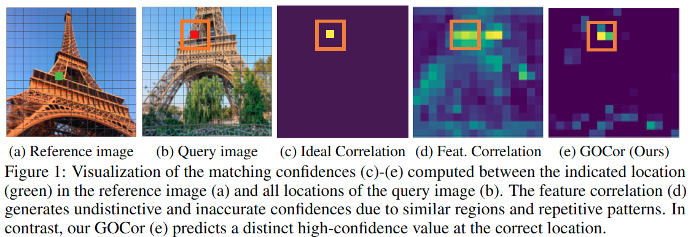
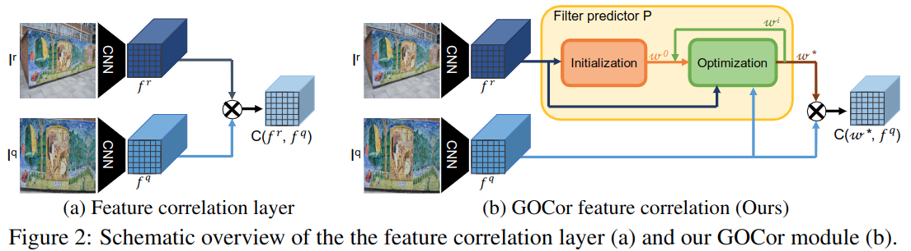
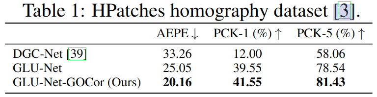
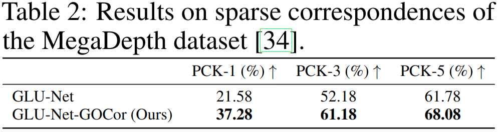
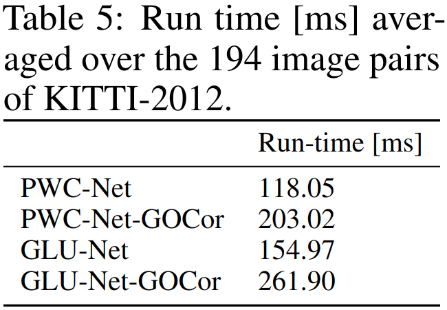
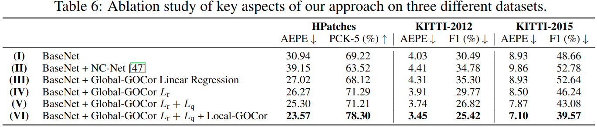
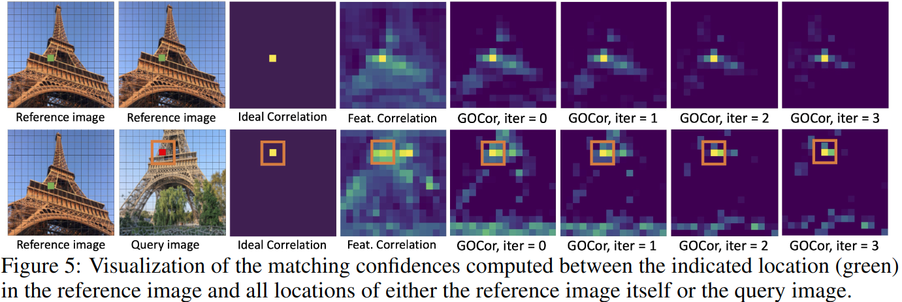

#图像配准   
[toc]

# GOCor: Bringing Globally Optimized Correspondence Volumes into Your Neural Network
- 文章:<https://readpaper.com/pdf-annotate/note?pdfId=4545181502207057921&noteId=730210243820609536>
- 代码:<https://github.com/prunetruong/gocor>
- 会议: NIPS2020

## 摘要

在许多涉及图像对的密集匹配的计算机视觉任务中,特征互相关层是其中的一个关键网络模块.通过计算图像对的局部特征向量的稠密标量积来预测 correspondence volume.然而,这种点到点的特征对比在消除图片中多个相似区域的二义性时是不够高效的,这导致了最终性能的下降.我们提出了 GOCor,一个完全可微的稠密匹配模块,可以直接替换特征相关层.我们的模块产生的 correspondence volume 是一个内部优化过程的结果，明确说明了在场景中类似的区域.此外,我们方法可以有效学习到空间匹配的先验来解决匹配中的二义性.我们还进行了大量的消融实验来分析 GOCor 模块.当在 SOTA 网络中插入这个模块时,在几何匹配,光流估计和稠密语义匹配任务中,其效果都优于特征互相关层.代码参见 [github.com/PruneTruong/GOCor](https://github.com/prunetruong/gocor).

## 1. 引言

寻找图片对中的像素级对应关系是诸如光流估计,几何匹配,差异估计 (disparity extimation) 等众多视觉任务的基础.最近的一些 SOTA 方法都依赖于特征互相关层来估计两图片的特征表征之间的像素级相似性.其结果是一个四阶张量,用来表示图片局部的匹配置信度.这可以称为光流估计的有效线索.在语义匹配,视频目标分割,few-shot 分割领域,这种稠密 dense correspondences 的封装取得了广泛的成功.因此,在各种重要视觉应用的网络结构设计中,特征互相关层都是一个关键的构建模块.

在特征互相关层中,correspondence volume 中每个置信度是通过计算两个特征向量的标量积得到的,特征向量提取自两图片中特定的区域,这里我们将两图片分布称为 reference 图片和 query 图片.然而,为了消除图像中多个相似区域,仅仅依靠郑重点到点的特征对比是远远不够的.如图 1 所示,在图片中存在大量重复模式时,特征互相关层会产生一些难辨别,不准确的匹配置信度 (图 1d).这是特征互相关层的一个重要缺点,因为重复图案,少纹理,和出现共同目标在计算机视觉应用中普遍存在.

 

我们设计了一个新的稠密匹配模块,旨在通过探索特征相关层未利用的信息来解决上述问题.我们发现特征互相关层生成的 correspondences volume 的置信度仅仅取决于一对 reference 和 query 在局部上提出的特征向量.但是 reference 的信息还很可能和 query 其他地方的外观信息很相似,比如场景中有相似区域.另外,特征互相关层会忽略 query 中的一些先验知识和约束,比如对应的唯一性和空间平滑性.本文提出的匹配模块将把上述信息和约束封装到一个可学习的目标函数中.通过最小化这个目标,我们可以前项推理出增强的 correspondence volume.这样,我们就可以预测全局优化的对应量,有效的考虑相似图像区域和匹配约束,如图 1e.

**贡献:**

1. 本文模块把在前项推理时最小化自定义匹配目标这一步骤公式化成一个内部优化过程,为有效整合显式可学习的匹配约束提供了一个通用框架.
2. 我们的目标函数很鲁棒,可以聚合场景中的相似区域的信息,使得 GOCor 模块可以更好的辨别他们.
3. 引入了一个科学系的目标来捕捉 query 图片的约束和先验信息
4. 我们应用了有效的展开优化 (对优化目标进行了求解?),配合准确的初始化,可以保证高效的端到端学习和推理
5. 在几何匹配和光流估计任务上,我们做了广泛的消融实验.实验证明 GOCor 可以在稠密语义匹配任务上具有通用性.另外,GOCor 具有广泛的域适应性.

## 2. 相关工作

**相关量强化 (Enhancing the correlation volume):** 由于 correspondences volume 的质量是最为重要的因素,因此一些工作专注于使用可学习的后处理技术来提升它.比如,Rocco 等人提出了可训练的邻居共识网络,NCNET,通常将它应用到互相关层之后来过滤模糊的匹配.而本文方法则是直接在互相关操作之前从特征图操作上入手.文献 [27] 和文献 [48] 和本文工作有一些联系,文献 [27] 根据输入动态生成过滤器,文献 [48] features updated with an attentional graph neural network, whose edges are defined within the same or the other image of a pair.文献 [63] 则引入了一个可学习的 cost volume,使得特征可以适应一个椭圆内积点乘空间.

**基于优化的元学习:** 本文工作和基于优化的元学习也有所联系.实际上,GOCor 可以视为内部学习的过程,它解决了我们优化目标中的回归问题.我们受到了文献 [5,6] 中优化策略极大的启发.从元学习的角度看,我们方法为标准设置提供了有趣的补充.与元学习中实例任务不同,在 few-shot 分类,跟踪任务中,GOCor 是一个大架构中的内部小模块,在元学习训练过程中, GOCor 没法接受到直接的监督信号.通过引入一个可学习的目标函数,我们的可学习模块将充分利用 query 样本.

## 3. 方法
### 3.1 特征互相关层

在许多任务中,特征互相关层是其网络设计中的一个重要模块,用于估计两图像之间的稠密对应关系估计.特征互相关层,计算两张图片局部特征的点积,形成 4D 的 _correspondence volume_.考虑 $f^r=\phi(I^r)$ 和 $f^q=\phi(I^q)$ 是网络 $\phi$ 从 reference 图片 $I^r$ 和 query 图片 $I^q$ 提取出的特征张量,其形状为 $H \times W \times D$.我们将空间位置 (i,j) 的特征向量记为 $f_{ij}^r$.那么互相关层计算两张图片之间的点积就是 $(f_{ij}^r)^Tf_{kl}^q$.互相关层有两种常见的变体,但是都依赖同样的局部特征点乘操作,但是有一些区别,接下来我们将定义这些操作.

**全局互相关层**    
它会评估 reference 和 query 所有位置像素的相似性,公式如下:

$$
C_G(f^r,f^q)_{ijkl}=(f^r_{ij})^Tf_{kl}^q,  (i,j),(k,l) \in \{1,...,H\} \times \{1,...,W\}  \tag{1}
$$

显然 $C_G(f^r,f^q)_{ijkl} \in R^{H \times W \times H \times W}$ 是一个 4D 张量,它可以表示所有局部特征对之间的相似性.  

**局部互相关层**    
这里点乘仅仅涉及 $f^r_{ij}$ 和其在 query $f^q$ 上一小片邻域.

$$
C_L(f^r,f^q)_{ijkl}=(f^r_{ij})^Tf_{i+k,j+l}^q,  (i,j) \in \{1,...,H\} \times \{1,...,W\},,(k,l) \in \{-R,...,R\}^2  \tag{2}
$$

$(k,l)$ 代表相对 reference 中 $(i,j)$ 的偏移,最大值是 $R$.这种限制对于一些大图片也是很有用的,但是它不能捕获超出限制之外的相似性.

### 3.2 动机

互相关层的主要作用是预测两种图片之间的稠密匹配置信度,如公式 1 和 2 所示.但是这个操作在建立稠密对应关系时忽略了两个重要点:

**reference 图片信息:**  
匹配置信度 $C_L(f^r,f^q)_{ij..} \in R^{H \times W}$ 仅仅考虑 $(i,j)$ 而不考虑其他位置性信息.当 reference 图片中包含多个相似区域,比如重复纹理和纯色区域 (如图 1),这可能是个大问题.由于 query 通常是和 reference 不同视角或者时间,但具有相同场景,因此这些区域也很可能存在 query 中.因此,理想情况下,匹配置信度估计应该复用 reference 图片已知的相似性.

**query 图片信息:**  
特征互相关层没有利用的第二个信息是可以从 query 中得到的先验和匹配约束.一个重要约束是每个 reference 局部的 $f^r_{ij}$ 在 query 中最多只有一个最佳匹配 $f^q_{kl}$.此外,图像对之间的密集匹配通常遵循空间平滑的规律,这是由于底层 3D 场景的时空连续性导致的.这是一个很强的先验.

综上,我们设计了一个新的稠密匹配模块来充分利用这些信息.

### 3.3 通用形式  

本节,我们将构建 GOCor 这是一个端到端可微分的网络模块,可以产生比特征互相关层更加精确的 correspondence volume.我们使用 $w^*$ 替换公式 1 和 2 中的 $f^r$,我们将其称为 _过滤器映射 (filter map)_.与直接计算 $f^r$ 和 $f^q$ 相关性不同,我们首先预测过滤映射 $w^*$.通过对 query 特征 $f^q$ 应用 $w^*$ 来得到最终的 correspondence volume $C(w^*,f^q)$.无论是公式 1 全局相关,还是公式 2 的局部相关,我们都使用 $C$ 来表示.最终我们通过丰富互相关层的输入来增强互相关层的输出.

接下来我们将专注于讨论如何设计一个合适的过滤映射 $w^*$. 总体上,我们将其设计为一个可微分的函数 $w^*=P_{\theta}(f^r,f^q)$,以 reference 和 query 特征作为输入, $\theta$ 是它的可训练参数.比如,简单的让 $P_{\theta}(f^r,f^q)=f^r$ 就可以得到原始的特征互相关层 $C(f^r,f^q)$. 然而设计 3.2 节中所描述的,可以充分利用信息的模块并不容易.此外,我们还要求模块可以泛化到新的数据域,即使图片内容和运动模式是未见过的.

我们使用一个目标函数 L 来表示上述挑战, 构建网络模块 $P_{\theta}(f^r,f^q)$ 来产生使优化目标最小的过滤映射,

$$
w^*=P_{\theta}(f^r,f^q)=\underset{w}{argmin}L(w;f^r,f^q,\theta)   \tag{3}
$$

这个公式表明了我们可以通过设计目标 L 和合适的优化算法来构建过滤预测模块 $P_{\theta}$.这个框架可以集成 3.2 节中讨论的限制,同时拥有很强的可解释性.在接下来章节中,我们将构建目标函数 L. 3.4 节中,我们将 reference 特征 $f^r$ 集成到优化目标公式 (3) 中. 3.5 节,我们将结合 query $f^q$ 的信息来扩展 L. 3.6 节,我们将讨论优化方法.图 2 显示了我们方法的大致结构.

### 3.4 Reference 图像目标  

本节,我们引入一个灵活的优化目标来利用 reference 特征 $f^r$ 的全局信息.这里我们不妨沿用公式 1 的全局相关中的习惯,使用下标来表示空间中的绝对位置.当针对 reference 图片位置 (i,j) 建立匹配置信度,特征互相关层 $C(f^r,f^q)$ 仅仅利用来位置 (i,j) 的编码特征 $f^r_{ij}$.然而, reference 特征图 $f^r$ 还包含来其他区域 (k,l) 中的编码特征 $f^r_{kl}$, query $f^q$ 也存在同样的问题.为了利用这个信息,首先,我们使用了过滤映射 $w$ 来替换特征图 $f^r$. 过滤映射的目的是使对应于 reference 位置 (i,j) 的匹配置信度尽量高 $C(w,f^r)_{ijij}=w^T_{ij}f^r_{ij} \approx 1$,同时保证对于 reference 特征图中其他位置 $(k,l) \neq (i,j)$ 具有低置信度 $C(w,f^r)_{ijkl}=w^T_{ij}f^r_{kl} \approx 0$.这样设计的目的是显式的抑制其他和 $f^r_{ij}$ 具有相似外观的区域 $f^r_{kl}$,对于 $f^q$ 也有这样的情况.

首先我们尝试 将上述 reference 图像约束通过最小化 $||C(w,f^r) - \delta||^2$. $\delta$ 代表期望相关的响应,具体而言就是在公式 1 全局相关中, $(i,j) == (k,l)$ 的地方 $\delta_{ijkl}=1$ 其余地方为 0.这个二次优化目标是可用特别有效的优化方法来求解的.但这个简单的二次目标也容易受到异常值影响.在我们的设计中,当不匹配的对产生一个大的负相关输出 $w^T_{ij}f^r_{kl}<<0$,优化目标应该不受影响.这是因为任何零置信度或者负置信度都足矣用来表示不匹配.但是一个过大的负值在二次目标中也会形成一个很大影响,这使得具有类似外观的挑战性区域会降低 correspondence volume 的质量.

基于以上问题,我们设计了一个鲁棒的非线性二次优化目标.即对于不匹配的区域产生一个正的互相关输出达到抑制相似外观的目的,忽略掉负的互相关输出.然后我们对于正负互相关输出引入单独的惩罚权重 $v^+_{ijkl}$ 和 $v^-_{ijkl}$ 来解释这种不对称性.使用以下函数 $\sigma$ 对置信值进行映射.

$$
\sigma(c;v^+,v^-)=
\begin{cases}
    v^+c, & \text {c>=0} \\
    v^-c,  & \text {c<0}
\end{cases}   
\tag{4a}
$$

$$
\sigma_\eta(c;v^+,v^-)=\frac{v^+-v^-}{2} (\sqrt{c^2+\eta^2}-\eta)+\frac{v^++v^-}{2}c  \tag{4b}
$$

这里我们设计来一个平滑的近似 $\sigma_\eta$,当 $\eta>0$ 可以避免函数 $\sigma$ 在置信度 $C(w,f^r)=0$ 时的不连续.当 $\eta=0$,公式 4b 将退化成 4a.

通过应用公式 4,置信度 $C(w,f^r)$ 使用权重 $v^+,v^-$ 的近似值来进行重加权.为解决如何在实际中设置 $v^+,v^-$,依据公式 3,我们将其设计成一个网络模块.这意味着 $v^+,v^-$ 成为了网络参数的一部分,可以和其他参数一起为了最终的任务进行学习.具体而言,我们将参数初始化为 $v^+_{ijkl}=v^+_{\theta}(d_{ijkl}),v^-_{ijkl}=v^-_{\theta}(d_{ijkl})$,其中 $d_{ijkl}=\sqrt{(i-k)^2+(j-l)^2}$, 是 $w_{ij}$ 和 $f^r_{kl}$ 之间的距离.这样设置使得网络可以学到正确匹配点 $d_{ijij}=0$ 到远处非匹配点 $f^r_{kl}$ 之间的过渡转换.综上,我们整合 referenece 图像信息的鲁棒可学习的目标函数公式如下:

$$
L_r(w;f^r,\theta)=||\sigma_{\eta}(C(w,f^r);v^+,v^-)-y||^2.     \tag{5}
$$

这里我们理想的相关性 $\delta$ 替换为可学习的目标置信度 $y_{ijkl}=y_{theta}(d_{ijkl})$.  我们公式 5 中的策略重参数化 $v^+_{\theta},v^-{\theta},y_{\theta}$,它是像素级距离 $d_{ijkl}$ 的线性函数,细节参见附录 C 章节.

### 3.5 Query 图像目标

之前章节,我们论述了将 reference 特征图 $f^r$ 融合进目标 (公式 3) 的方法. 但如 3.2 节中讨论的,从 query 图像中我们也可以获得丰富的信息.首先,图像对之间的对应遵守严格的约束, reference 图像中每个点在 query 图像中最多有一个匹配.其次,邻域间的匹配遵守空间平滑的先验,很大程度上是由底层 3D 场景的时空连续性引起的.我们通过在 query 图像上设定一个正则项来将这些约束封装进优化目标中.

$$
L_q(w;f^q,\theta)=||R_{\theta} * C(w,f^q)||^2     \tag{6}
$$

其中 $*$ 代表卷积操作, $R_{\theta} \in R^{K^4 \times Q}$ 是一个 4D 可学习张量,其中间尺寸为 K,输出通道为 Q. 4D 卷积使得我们可以充分利用 4D 的 correspondence volume.Furthermore, its use is motivated by the translation invariance property induced by the 2D translation invariance of the two input feature maps.最终我们通过对网络训练损失使用 SGD 优化方法,就可以学到 $R_{\theta}$ 和其他网络参数.  

在光流中的各种经典变体公式中,使用空间平滑先验是很常见的.我们方法也对这些有所借鉴.但不同的是,我们方法有一些有趣的不同的概念差异.  
第一,我们是对相关操作生成匹配置信度直接进行正则操作,而非对流向量.通过在 correspondence assignment 封装不确定性,使得 correspondence volume 可以提供更加丰富的描述.  
第二,我们的目标是底层过滤映射 $w$ 的函数.  
第三,我们的目标在网络中已经隐式的最小化了.  
最后,这种设计使得我们可以以端到端,数据驱动的方式来学习 $R_{\theta}$.而经典方法依赖手工设计正则化和先验.  
通过继承局部邻域的信息, 公式 6 中 $R_{\theta}$ 可以通过学习微分算子来增强空间平滑度.此外,我们的公式可以学习 query(公式 6) 相对于 reference(公式 5) 的权重,避免了这种超参数的调整.   

### 3.6 过滤映射预测模块 P

结合公式 5 reference 项和公式 6 中的 query 项,最终公式 3 的具体形式如下:

$$
L(w;f^r,f^q,\theta)=L_r(w;f^r,\theta)+L_q(w;f^q,\theta)+||\lambda_{\theta}w||^2   \tag{7}
$$

最后一项对应于 $w$ 的正则先验,使用一个可学习的标量 $\lambda_{\theta}  \in R$ 进行加权.注意公式 5 中 reference 图像目标 $L_r$ 可以针对每个位置 $w_{ij}$ 进行分解,而公式 6 中 query 项 $L_q$ 则引入了 $w$ 中所有元素的依赖关系.在网络前传期间来优化这样一个高维问题以实现公式 3 似乎不太可能.下一节,我们将证明,通过结合准确的初始化以及简单的迭代流程,是可以实现这个目标的.我们的模块可以作用于任何使用特征相关层的网络.

**优化器:**  
虽然在全局范围内找到公式 7 的较为精确的解比较难,但是这也并非必要的.我们仅需将其优化到一定的程度,就可以有效利用编码进公式 7 的信息了.因此,我们对过滤映射 $w^*=P_{\theta}(f^r,f^q)$ 应用迭代优化策略.具体而言,我们使用最抖下降算法 (Steepest Descent algorithm),这点来自文献 5.给定当前迭代 $w^n$,最抖下降法找到梯度方向上的步长 $\alpha^n$ 来最小化目标.首先,执行公式 5 的 [高斯-牛顿近似 (Gauss-Newton approximation)](../../Algorithm/Gauss-Newton法.md),即可得到一个简单的封闭表达式 (解析解).然后使用优化步长 $\alpha^n$ 作为梯度步长来更新过滤映射,

$$
w^{n+1}=w^n-\alpha^n \nabla L(w^n;f^r,f^q,\theta),   \alpha^n=\underset{\alpha}{argmin}L^n_{GN}(w^n-\alpha \nabla L(w^n;f^r,f^q,\theta)).  \tag{8}
$$

其中,$L^n_{GN}$ 是公式 7 在 $w^n$ 的高斯 - 牛顿近似.梯度 $\nabla L$ 和步长 $\alpha^n$ 使用解析解,细节见附录章节 A. 操作 8 是关于 $f^r,f^q,\theta$ 的可微的函数.

**初始化:**  
为了减少过滤预测网络 P 的优化迭代次数,我们使用一个高效且可学习的模块来生成初始过滤映射 $w^0$. 我们将其参数化为 $w^0_{ij}=\alpha_{ij}f^r_{ij}+b_{ij}\bar{f}^r$,这里 $\bar{f}^r \in R^d$ 是一个空间平均向量,编码了上下文信息.直观点来说,我们希望 $w^0$ 在匹配位置有高的激活 $((w^0_{ij})^Tf^r_{ij}=1)$,其他地方 $((w^0_{ij})^Tf^r_{ij}=0)$.标量系数 $a_{ij},b_{ij}$ 通过解这些问题,就可以轻易找到,具体参见附录章节 B.

## 4. 实验

我们对几何匹配和光流估计进行来全面的实验.我们还展示了本文方法可以成功应用到语义匹配任务.我们将全局和局部版本的 GOCor 集成到 SOTA 的模型中进行分析.更多细节见附录.

### 4.1 几何匹配

首先我们尝试了将 GOCor 集成到 GLU-Net 中,它是一个 4 级的金字塔网络.在两张图像上进行操作来得到其稠密光流,使用在粗级别上使用全局相关来获取长距离位移,在其他级别上使用局部相关.

**实验设置:**   
我们将其特征互相关层替换成对应的 GOCor 模块.全局 GOCor 使用完整的优化目标 (公式 7),而局部 GOCor 进使用 reference 项 (公式 5).训练时仅仅使用三个最抖下降迭代,推理时我们增加来册数.我们使用了和文献 59 相同的自监督训练方法和数据,对不同来源的图像使用合成单应性变换来保证多样性.为了更好的使用真实 3D 场景和移动目标,我们还引入来一个 动态训练集,这是通过对 COCO 中静态数据随机进行增强得到的.在所有实验中, GLU-Net 和 GLU-Net-GOCor 的训练流程和数据是完全相同的.

**评价数据集和标准:**   
我们使用 HPatches 中 59 个序列.还利用来多视角 ETH3D 数据集,这个数据是使用一个移动的手持摄像头拍摄的.遵循文献 59 中的做法.我们以不同的时间间隔来采集图像对,分析其几何变换的幅度.最后,由于难以在真实图像进行稠密标注,我们使用了 MegaDepth 数据集.遵循文献 52 中做法,我们使用静态训练数据在 HPatches 上进行比较.在 ETH3D 和 MegaDepth 上使用动态数据.同时我们使用 Average End-Point Error(AEPE),正确点率 (PCK-T) 作为评价指标.

**结果:**  
表 1 是 HPatches 的结果.

我们发现和特征相关层相比,我们的 GOCor 模块可以更好的处理大视角变换和大的外观变化.

表 2 是 MegaDepth 结果,图像包含了极端视角变化,只有 10% 的公共区域.

### 4.2 光流

略.

### 4.3 语义匹配

### 4.4 Run-time

在 Titan X 上跑 KITTI 数据集.我们控制来最抖下降法的迭代次数来取得精度和速度的平衡.在附录 E.1 中我们将提供更多细节分析,并提出更快的操作方法,虽然会造成轻微的性能下降.

### 4.5 消融实验

我们设计来了一个 baseline,包含 3 个层级的金字塔型的 CNN 网络,在后两个层中应用来全局相关层.所有方法都使用 4.1 节中描述的动态数据.在 HPatches, KITTI-2012 和 KITTI-2015 上的结果如表 6.我们首先分析了在全局相关层级使用 GOCor 替换特征相关的影响.版本 (IV) 中全局 GOCor 仅仅使用来 reference-based 目标 $L_r$.相比基线网络 (I),这个版本在所有数据集上都取得来较好的结果.版本 (III) 将我们的鲁棒 reference 损失 $L_r$ 换成来标准的线性回归目标 $||C(w,f^r)-\delta||^2$,结果下降很多.版本 (II) 中添加了文献 47 中提出的后处理策略,使用了 4D 卷积并加强了循环一致性.这通常会导致性能下降，这可能是由于无法处理训练和测试数据之间的域差距造成的.(V) 是在 (IV) 基础上集成了我们 query 目标 $L_q$,这取得来重大的进步,特别是在 KITTI 数据集上的表现.在 (VI) 版本中,我们使用局部 GOCor 模块替换来局部相关层.这在所有数据集和标准上都有很大提高.

图 5,我们通过绘制了我们的全局 GOCor 模块的 correspondence volume 定性的可视化了 reference ,这里 correspondence volume 是 reference 图片特定位置 (i,j) 和 refernece 以及 query 所有位置执行相关操作的结果.在 GOCor 层每次迭代之后,预测的 correspondence volume 都会获得更强的辨别性.显然,通过公式 5,query 图像的最终匹配置信度很大程度上收益于 reference 图像本身优化之后的相关分数.

## 5 结论

略.
