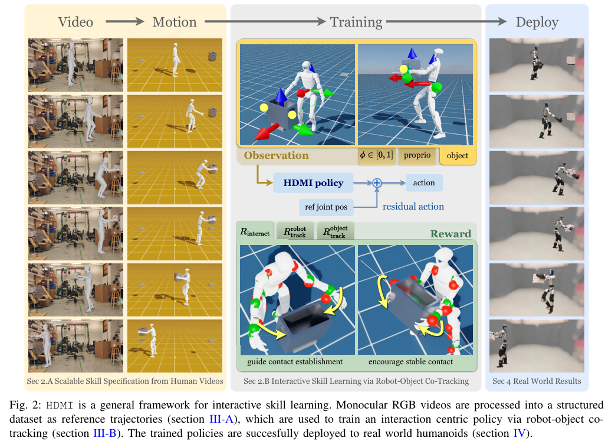

# HDMI: Learning Interactive Humanoid Whole-Body Control from Human Videos
- 论文：[[2509.16757v3] HDMI: Learning Interactive Humanoid Whole-Body Control from Human Videos](https://arxiv.org/abs/2509.16757v3)
- 项目：[[2509.16757v3] HDMI: Learning Interactive Humanoid Whole-Body Control from Human Videos](https://arxiv.org/abs/2509.16757v3)
- 代码：[HDMI/active_adaptation/envs/humanoid.py at main · LeCAR-Lab/HDMI](https://github.com/LeCAR-Lab/HDMI/blob/main/active_adaptation/envs/humanoid.py)
# 动机

在人形物体交互（humanoid–object interaction ，HOI）领域，数据稀缺和交互接触难处理。

本文提出 HDMI 框架从视频中提取交互数据来学习

# 整体方法

1. 先用 GVHMR 和 LocoMujoco 把单目 RGB 转换成 SMPL（人体参数化模型），得到结构化数据集
2. 跟踪动作学习
3. Sim2real
## 获取结构化数据集

在数据集中，每一帧都提供一个参考状态 $s_t^{ref}$，以及在物体局部坐标系下定义的期望接触点 $p_t^{contact}$。

第 $t$ 帧的参考状态为 $s_t^{ref} = (s_t^{robot}, s_t^{obj}, c_t)$，其中：

- $s_t^{robot}$ 包含 $p^{robot}$、$q^{robot}$ 和 $\theta_t^{ref}$，分别表示机器人参考根节点位置、根节点姿态和参考关节位置；
- $s_t^{obj}$ 包含 $p^{obj}$ 和 $q^{obj}$，分别表示物体的位置和姿态；对于门、折叠椅等多关节物体，$s_t^{obj}$ 还包含其关节状态 $\theta^{obj}$；
- $c_t \in {0, 1}$ 是二进制信号，表示第 $t$ 帧是否需要产生接触。
## 跟踪动作学习

输入 $\{s_t^{ref},p_t^{contact}\}$ ,输出下一帧动作，大致训练步骤如下：

1. 参考状态初始化：在每个训练回合（episode）中，机器人和物体均从参考运动的随机帧 $s_t^{ref}$ 进行初始化，并加入较小的随机扰动以提高稳健性；
2. 相位变量观测：策略会接收一个相位变量 $\phi \in [0, 1]$ ，其中 $\phi = 0$ 表示运动开始， $\phi = 1$ 表示运动结束。已有研究证明，仅通过这个时间相位变量就足以实现单运动跟踪（ASAP 和 deepmimic 证明了可行性）；
3. 基于跟踪误差的终止条件：当机器人或物体状态与参考运动偏差过大时，终止当前回合。

### 实现细节
#### 统一坐标表示

注意跟踪学习时，所有观测表示都会被转换到机器人基座坐标系下，包括 $p_t^{contact}$ 

#### 学习动作残差

Policy 学习一个校正量 $a_t$ ，最终输出动作是参考动作 + 校正量

#### 设置交互奖励

$$
R_{\text{contact}, i} = \exp\left(-\frac{\|\mathbf{p}_{\text{eef}, i} - \mathbf{p}_{\text{target}, i}\|_2}{\sigma_{\text{pos}}}\right) \cdot \min\left(\exp\left(\frac{\|\mathbf{F}_{\text{contact}, i}\|_2 - F_{\text{thres}}}{\sigma_{\text{frc}}}\right), 1\right)   \tag{1}
$$

$$
R_{\text{interaction}} = \left( \frac{1}{N_c} \sum_{i=1}^{N_c} R_{\text{contact}, i} \cdot \mathbf{c}_{t,i} \right)   \tag{2}
$$

 $c_t$ 是用来指示参考轨迹中是否接触上，接触上就是 1 , $\mathbf{p}_{\text{eef}, i}$ 和 $\mathbf{p}_{\text{target}, i}$ 分别为末端执行器的位置及其在对象上的目标接触点。 $\mathbf{F}_{\text{contact}, i}$ 是末端执行器与对象之间的接触力。位置项奖励末端执行器与对象接触点之间的接近程度。力项奖励足够但不过度的接触力，并以阈值 $F_{\text{thres}}$ 为上限，确保部署时的安全性。整体交互奖励在所有活跃的末端执行器上取平均，并由接触信号 $c_t$ 门控。 $N_c$ 是希望发生接触的末端的数量。

#### 域随机化

对机器人惯性和摩擦属性进行了域随机化

#### 奖励设置

Tab1

| 奖励         | 权重     |
| ---------- | ------ |
| **机器人跟踪**  |        |
| 身体局部姿态     | 2.0    |
| 根节点全局姿态    | 1.0    |
| 身体全局速度     | 1.0    |
| 关节跟踪       | 1.0    |
| 目标跟踪与交互    |        |
| 对象姿态       | 2.0    |
| 接触奖励       | 5.0    |
| **正则化惩罚项** |        |
| 动作速率 L2    | 0.1    |
| 关节位置限制 L1  | 10.0   |
| 关节速度惩罚     | 5.0e-4 |
| 关节力矩限制 L1  | 0.01   |
| 足部冲击力 L2   | 1.0    |
| 脚部滑移       | 0.5    |
| 足部离地时间     | 5.0    |

#### 终止条件设置

即至少 episode 会运行 25 步才会终止。

Tab2

| 终止条件        | 阈值                 | 最小步数 |
| ----------- | ------------------ | ---- |
| **机器人跟踪误差** |                    |      |
| 根全局姿态误差     | 0.5 米, 1.2 弧度      | 25   |
| 身体局部姿态误差    | 0.5 米, 1.2 弧度      | 25   |
| **目标跟踪误差**  |                    |      |
| 物体姿态误差      | 0.5 米, 1.2 弧度      | 25   |
| **接触丢失**    |                    |      |
| 失去接触        | 位置 0.2 m & 力 1.0 N | 25   |

## Sim2real

参考动作来自 Omomo 数据集。用宇树 G1 机器人。

测试了开门，搬箱子和杜鲁门鞠躬三个案例。

### 一些实验重点结论
1. 接触奖励和终止对于需要维持稳定接触的任务，比如搬箱子，很重要
2. 残差动作学习对于收敛速度很重要
# 参考
- [HDMI：人形机器人全身交互模仿学习](../../Clippings/HDMI：人形机器人全身交互模仿学习.md)