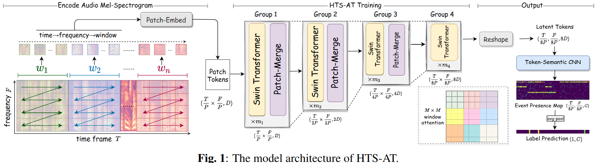

#音频分类

[toc]
- 论文: <https://readpaper.com/pdf-annotate/note?pdfId=4588566404186251265&noteId=1784997914055129856>
- 代码: <https://github.com/retrocirce/hts-audio-transformer>
- 会议: ICASSP 2022

# 全文关键点翻译
## 摘要
音频分类任务是将音频样本映射到它们对应的标签上的任务.最近,带有自注意力机制的 Transformer 模型也被应用到这个领域了.但是现存的音频 Transformers 需要较大的GPU现存和较长训练时间,且依赖预训练的视觉模型来得到一个较高的性能,这点也会制约模型在音频任务上的表现.结合以上问题,我们开发了 HTS-AT: 通过对音频 Transformer 应用层级结构来减少模型大小和训练时间. 该模型可以进一步和 token-semantic 模块结合,将最终输出映射到类别特征图上,以用于音频时间检测任务(定位声音的时刻). 实验测试表明,在 AudioSet 和 ESC-50 上,HTS-AT 取得了新的 SOTA 成绩,在 Speech Command V2 上,性能达到了 SOTA. HTS-AT 在事件定位上比以往 CNN 模型取得了更好性能. 此外,相比过去 Transformer 模型,HTS-AT 只需 35% 的模型参数和 15% 的训练时间.这些实验结果表明 HTS-AT 有很高的性能和效率.

**关键词:** 音频分类,声音时间检测, Transformer, token-semantic 模块

## 引言
音频分类是一个音频索引任务,旨在将音频样本映射到其对应的标签上.根据音频的分类,它又涉及到声音事件检测,乐器分类等等.它是音乐推荐,关键词定位,音乐生成等很多下游任务的基础.  

随着人工智能日新月异的发展,音频分类也取得了重大突破.在数据收集方面,涌现了很多不同类型的音频数据集(AudioSet,ESC-50,Speech Command等)为不同子任务提供了模型训练和验证的平台.在模型设计方面,音频分类模型繁荣了起来.CNN 模型在此领域早以被广泛应用,比如 DeepResNet,TALNet,PANN,PSLA等等. 这些模型利用 CNN 来提取音频光谱图上的特征,然后通过在网络深度和宽度上进行设计来提升性能. 最近也有一些工作将 Transformer 结构引入到了音频分类, 比如AST(audio spectrogram transformer).得益于自注意力机制和视觉预训练模型,该工作在音频分类上取得了最佳表现. 本文将在使用 Transformer 继续音频分类上更进一步.首先,我们会分析一下 AST 中的一些问题.

首先,由于 transformer 将音频光谱视为一个完整的序列数据,这使得 AST 需要较长的训练时间和较大显存.实际训练中,训练整个 AudioSet 需要4个 12G GPU训练1星期.使用 ImageNet预训练的视觉模型可以加速训练速度.但是这样会将模型局限在预训练超参上,不好扩展到更多音频任务上.事实上,我们发现不用预训练,AST 仅能达到一个基线水平(AudioSet mAP 0.366),这点使得我们更加注重模型在音频数据上的学习效率.其次,AST使用 class-token(CLS) 来预测标签,所以它不能被应用到音频事件检测任务上.但多数的 CNN模型是天然的支持帧级定位的,常见的做法是将网络倒数第二层的输出作为帧级定位图.这启发我们设计了一个模块,该模块可使得音频 transformer 每个输出 token 都可以感知到事件的语义(token-semantic 模块),以此来支持更多音频任务(声音时间检测和定位).

本文,我们设计了 HTS-AT,一个用于音频分类的带有 token-semantic 模块的层级结构的音频 transformer.贡献如下:

- HTS-AT 在 AudioSet,ESC-50, Speech Command V2 上 SOTA.即使不使用预训练模型,结果也仅比最佳结果低 1%~2%.
- 相比AST,HTS-AT 的参数更少(31M vs 87M),对显存要求更低,训练时间更少(80 hrs vs. 600 hrs).
- 仅使用弱标注的数据,HTS-AT 也可以实现声音定位,且效果比 CNN类模型更好.

## 方法
### 2.1 带有窗注意力的层级 Transformer
典型的 transformer 需要消耗大量的显存和训练时间,这是由于输入 token 的长度通常很长且长度在整个网络传递过程中都不会发生变化.为此,机器需要大量的显存来存放输出和每个block产生的梯度,且在注意力矩阵会很大,计算需要很长时间.针对这两个问题,如图1 所示,我们进行了两个关键设计: 层级 Transformer结构和窗注意力机制.

#### 2.1.1 编码音频光谱
如图1左侧所示,一个音频的梅尔频谱可以使用一个核大小$P \times P$的 Patch-Embed CNN 来分成不同小块.与图像不同,梅尔频谱的宽高代表不同信息(时间轴和频率轴).时间轴长度通常远比频率轴长很多.因此,为了更好的捕获到同一时间下频率之间关系,我们首先将梅尔光谱分成若干窗 $w_1,w_2,..w_n$,然后在窗内再分片.token的编码顺序是 $时间 \to 频率 \to 窗$. 按照这种顺序,同一时间帧的不同频率片在输入序列中是相邻的.

#### 2.1.2 片合并和窗注意力
如图1中间所示, token 片将被送入到若干组 transformer 编码模块中.在每组末尾,我们使用 Patch-Merge 层来减少序列尺寸.这里合并的操作是首先将序列变形到原始2D 图大小 $(\frac{T}{P} \times \frac{F}{P},D)$,$D$ 表示潜在状态维数.然后将通过合并相邻片将输入变形为$(\frac{T}{2P} \times \frac{F}{2P},4D)$,接着通过一个线性层变为$(\frac{T}{2P} \times \frac{F}{2P},2D)$.如图1所示,token 片会被下采样8倍,从$(\frac{T}{P} \times \frac{F}{P},D)$,变为$(\frac{T}{8P} \times \frac{F}{8P},8D)$,因此在每个 Group 之后,显存消耗会呈指数级下降.

对于 group 中每个 transformer 块,我们都会使用窗注意力机制来减少计算量.正如图1 中右 显示的不同颜色的 box,我们首先将token 片(2D形式) 分成不重合的若干$M \times M$ 大小注意力窗 $aw_1,aw_2,...,aw_3$. 我们仅仅在每个注意力窗内计算注意力矩阵.

