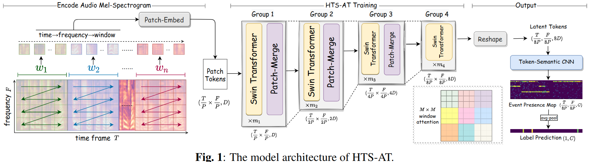

#音频分类

[toc]

- 论文: <https://readpaper.com/pdf-annotate/note?pdfId=4588566404186251265&noteId=1784997914055129856>
- 代码: <https://github.com/retrocirce/hts-audio-transformer>
- 会议: ICASSP 2022

# 全文关键点翻译
## 摘要

音频分类任务是将音频样本映射到它们对应的标签上的任务.最近,带有自注意力机制的 Transformer 模型也被应用到这个领域了.但是现存的音频 Transformers 需要较大的 GPU 现存和较长训练时间,且依赖预训练的视觉模型来得到一个较高的性能,这点也会制约模型在音频任务上的表现.结合以上问题,我们开发了 HTS-AT: 通过对音频 Transformer 应用层级结构来减少模型大小和训练时间. 该模型可以进一步和 token-semantic 模块结合,将最终输出映射到类别特征图上,以用于音频时间检测任务 (定位声音的时刻). 实验测试表明,在 AudioSet 和 ESC-50 上,HTS-AT 取得了新的 SOTA 成绩,在 Speech Command V2 上,性能达到了 SOTA. HTS-AT 在事件定位上比以往 CNN 模型取得了更好性能. 此外,相比过去 Transformer 模型,HTS-AT 只需 35% 的模型参数和 15% 的训练时间.这些实验结果表明 HTS-AT 有很高的性能和效率.

**关键词:** 音频分类,声音时间检测, Transformer, token-semantic 模块

## 1 引言

音频分类是一个音频索引任务,旨在将音频样本映射到其对应的标签上.根据音频的分类,它又涉及到声音事件检测,乐器分类等等.它是音乐推荐,关键词定位,音乐生成等很多下游任务的基础.  

随着人工智能日新月异的发展,音频分类也取得了重大突破.在数据收集方面,涌现了很多不同类型的音频数据集 (AudioSet,ESC-50,Speech Command 等) 为不同子任务提供了模型训练和验证的平台.在模型设计方面,音频分类模型繁荣了起来.CNN 模型在此领域早以被广泛应用,比如 DeepResNet,TALNet,PANN,PSLA 等等. 这些模型利用 CNN 来提取音频光谱图上的特征,然后通过在网络深度和宽度上进行设计来提升性能. 最近也有一些工作将 Transformer 结构引入到了音频分类, 比如 AST(audio spectrogram transformer).得益于自注意力机制和视觉预训练模型,该工作在音频分类上取得了最佳表现. 本文将在使用 Transformer 继续音频分类上更进一步.首先,我们会分析一下 AST 中的一些问题.

首先,由于 transformer 将音频光谱视为一个完整的序列数据,这使得 AST 需要较长的训练时间和较大显存.实际训练中,训练整个 AudioSet 需要 4 个 12G GPU 训练 1 星期.使用 ImageNet 预训练的视觉模型可以加速训练速度.但是这样会将模型局限在预训练超参上,不好扩展到更多音频任务上.事实上,我们发现不用预训练,AST 仅能达到一个基线水平 (AudioSet mAP 0.366),这点使得我们更加注重模型在音频数据上的学习效率.其次,AST 使用 class-token(CLS) 来预测标签,所以它不能被应用到音频事件检测任务上.但多数的 CNN 模型是天然的支持帧级定位的,常见的做法是将网络倒数第二层的输出作为帧级定位图.这启发我们设计了一个模块,该模块可使得音频 transformer 每个输出 token 都可以感知到事件的语义 (token-semantic 模块),以此来支持更多音频任务 (声音时间检测和定位).

本文,我们设计了 HTS-AT,一个用于音频分类的带有 token-semantic 模块的层级结构的音频 transformer.贡献如下:

- HTS-AT 在 AudioSet,ESC-50, Speech Command V2 上 SOTA.即使不使用预训练模型,结果也仅比最佳结果低 1%~2%.
- 相比 AST,HTS-AT 的参数更少 (31M vs 87M),对显存要求更低,训练时间更少 (80 hrs vs. 600 hrs).
- 仅使用弱标注的数据,HTS-AT 也可以实现声音定位,且效果比 CNN 类模型更好.

## 2 方法
### 2.1 带有窗注意力的层级 Transformer

典型的 transformer 需要消耗大量的显存和训练时间,这是由于输入 token 的长度通常很长且长度在整个网络传递过程中都不会发生变化.为此,机器需要大量的显存来存放输出和每个 block 产生的梯度,且在注意力矩阵会很大,计算需要很长时间.针对这两个问题,如图 1 所示,我们进行了两个关键设计: 层级 Transformer 结构和窗注意力机制.

#### 2.1.1 编码音频光谱

如图 1 左侧所示,一个音频的梅尔频谱可以使用一个核大小 $P \times P$ 的 Patch-Embed CNN 来分成不同小块.与图像不同,梅尔频谱的宽高代表不同信息 (时间轴和频率轴).时间轴长度通常远比频率轴长很多.因此,为了更好的捕获到同一时间下频率之间关系,我们首先将梅尔光谱分成若干窗 $w_1,w_2,..w_n$ ,然后在窗内再分片.token 的编码顺序是 $时间 \to 频率 \to 窗$ . 按照这种顺序,同一时间帧的不同频率片在输入序列中是相邻的.

#### 2.1.2 片合并和窗注意力

如图 1 中间所示, token 片将被送入到若干组 transformer 编码模块中.在每组末尾,我们使用 Patch-Merge 层来减少序列尺寸.这里合并的操作是首先将序列变形到原始 2D 图大小 $(\frac{T}{P} \times \frac{F}{P},D)$ , $D$ 表示潜在状态维数.然后将通过合并相邻片将输入变形为 $(\frac{T}{2P} \times \frac{F}{2P},4D)$ ,接着通过一个线性层变为 $(\frac{T}{2P} \times \frac{F}{2P},2D)$ .如图 1 所示,token 片会被下采样 8 倍,从 $(\frac{T}{P} \times \frac{F}{P},D)$ ,变为 $(\frac{T}{8P} \times \frac{F}{8P},8D)$ ,因此在每个 Group 之后,显存消耗会呈指数级下降.

对于 group 中每个 transformer 块,我们都会使用窗注意力机制来减少计算量.正如图 1 中右 显示的不同颜色的 box,我们首先将 token 片 (2D 形式) 分成不重合的若干 $M \times M$ 大小注意力窗 $aw_1,aw_2,…,aw_3$ . 我们仅仅在每个注意力窗内计算注意力矩阵.即我们使用了 $k$ 个窗口注意力 (window attention,WA) 矩阵来替代整个的全局注意力 (global attention,GA) 矩阵.假设潜在维度为 $D$ ,那么这两种机制在一个 transformer block 中计算一个 $f \times t$ 音频片 tokens 的计算复杂度如下:  

$$
GA: O(ftD^2+(ft)^2D)  \tag{1}
$$

$$
WA: O(ftD^2+M^2ftD)  \tag{2}
$$

即使用 WA,可以将后一项的复杂度减少 $/frac{ft}{M^2}$.由于每个音频片 tokens 的编码顺序是时间 - 频率 - 窗口,因此每个 window attention module 都会计算一定范围内连续频率条和时间帧的联系.随着网络的加深, Patch-Merge 层可以合并周围的窗口,这样就可以在更大的空间上通过注意力来学习联系.代码实现上,我们使用了带有滑动窗口注意力的 swin transformer 模块,这是一个更加高效的注意力机制.这同样使得我们在实验阶段就可以使用 swin transformer 的视觉预训练模型.

### 2.2 Token Semantic Module

AST 使用 class-token(CLS) 来预测分类标签,这使得它不能像 CNN 模型那样展示声音时间的开始和结束.在最后一层输出中,每个 token 都包含了对应时间帧和频率条的信息.由此,我们尝试将 tokens 转换为每个标签类别的激活图 (语义感知).对于标注更加细腻的数据集,我们可以让模型计算出在每个特定时间段的损失.对于标注比较粗略的数据集,我们可以利用 transformer 强大的关系建模能力来进行音频时间定位.在 HTS-AT 中,如图 1 右侧所示,我们修改了输出结构,在最终的 transformer block 后添加了了一个 token 语义 CNN 层,其核大小为 $(3,\frac{F}{8P})$ ,padding 尺寸为 $(1,0)$ ,它聚合所有的频率条,并将其通道数从 $8D$ 映射到事件类别数 $C$ .输出的特征图为 $(\frac{T}{8P},C)$ 大小,可以被视为声音事件定位图.最后,我们对特征图通道维求平均,然后计算和真实标签的 binary cross-entropy.除开定位功能,我们同样期望 token-semantic 模块可以提高分类性能,因为我们是通过对所有 tokens 进行分组来考虑最终输出的.

## 3 实验

本章,我们将在事件分类数据集 AudioSet,ESC-50,关键字定位数据集 Speech Command V2 和事件检测数据集 DESED 上进行测试.

### 3.1 AudioSet 结果
#### 3.1.1 数据集和训练细节

AudioSet 包含 2 百万条 10 秒长的样本,共分为 527 个声音事件类别.我们依照文献 11,12,14 中训练流程的做法,使用整个训练集 (2M) 训练我们的模型,并在测试集 (22K) 上进行测试.所有样本都转为单通道且采样率为 32kHz.我们使用了 1024 个窗,320 的 hop size 和 64 的 mel-bins 来计算短时傅里叶和梅尔倒谱.最终梅尔倒谱的大小为 $(1024,64)$ .输出特征图的大小为 $(1024,527)$ .patch 尺寸为 $4 \times 4$ ,patch 窗口长度为 256 帧,注意力窗口尺寸为 $8 \times 8$ .由于 8 可以被 64 整除,因此第一层的注意力窗不会横跨两个时间相距很长的帧.隐藏维度 D 为 96,最终输出的隐藏为 8D 即 768,这和 AST 是一致的.最后我们网络的每个组中 swin-transformer 块的数量分别为 2,2,6,2.  

根据文献 11,12 我们使用平衡采样器,mix-up 的混合参数为 $\alpha=0.5$ , 光谱图在时间上擦除的力度是 128 帧,频率条上擦除力度是 16,并且我们将使用权重平均.整个网络使用 Pytorch 实现,优化器使用 AdamW $(\beta_1=0.9,\beta_2=0.999,eps=1e-8,decay=0.05)$ ,总 batch size 为 128 $(32 \times 4)$ ,使用了 4 张 V-100 训练.warm-up 策略为在最初的 3 个 epoch 上,学习率分别为 0.05,0.1,0.3,每 10 个 epochs 学习率衰减一半直到 0.05.我们使用 mAP 来衡量模型的分类性能.

#### 3.1.2 实验结果

如表 1,我们将 HTS-AT 和三个不同的基线模型和三个消融变体进行了比较:(1)H: 仅层级结构;(2)HC: 包含 token-semantic 模块的层级结构;(3)HCP: 在 (2) 基础上使用预训练视觉模型.在单个模型上,我们取得的最好成绩是 mAP 0.471,相比 AST 的 0.459 有较大的进步.我们还使用了同一套设置但是不同的随机种子训练了 6 个 HTS-AT 模型,把他们聚合起来,mAP 可以达到 0.487,依然比 AST 的 0.475 和 0.485 高.我们基于以下两个事实来分析我们的结果. 

**Token Semantic 模块和预训练**  
PSLA,AST 和 HTS-AT 都使用了 ImageNet 的预训练模型,PSLA 使用的是预训练的 EfficientNet,AST 使用的是 DeiT,我们使用的是 Swin-T/C24,其输入是 $256 \times 256$ 的图片,( $256 \times 256 = 1024 \times 64$ ,所以我们可以直接转换相同大小的权重).我们观察到没用使用预训练的 HTS-AT 的 mAP 是 0.44,使用额外的 token semantic 模块之后可以提升到 0.453,最后使用预训练模型 mAP 可以达到 0.471. 然而,未使用预训练模型的 AST 仅仅可以达到 0.366,相比 0.459 低了 9.3%. 这些现象表明:(1) 预训练模型通过在模式识别上是先验,可以提高模型的最终性能.(2) HTS-AT 在不同参数下的扩展性比 AST 更好,不使用预训练模型的 HTS-AT 依然可以取得第三好的成绩.

**参数规模和训练时间**  
AST 有 87M 的参数,而 HST-AT 仅有 31M 的参数量,堪比 CNN 模型.而在训练时间估算上, PANN 花了 72 个小时才收敛,而 HST-AT 在 V-100 花了 $20 \times 4=80$ 小时,AST 使用 TITAN GPU 则花了 $150 \times 4=600$ 小时 (我们在 V-100 上训练时控制消耗的显存不超过 12 GB).速度的提升主要得益于更少的计算量和 GPU 显存消耗,AST 每个 batch 仅使用 12 个样本而 HST-AT 的 batch 可以设为 128.因此,我们认为 HTS-AT 相比与 AST 训练时间和参数量都更少,模型更加高效.

### 3.2 ESC-50 和 Speech Command V2 结果
#### 3.2.1 数据集和训练细节

ESC-50 数据集包含 2000 条 5 秒音频,共计 50 类的环境音.我们使用其中 4 折的数据 (1600 条) 训练了 5 次,每次剩下的数据作为测试集.我们选取了 3 次不同的随机种子来平均模型的性能和偏差.Speech Command V2 包含 105829 条 1 秒的口语片段,由 35 个常用单词组成.训练,验证,测试的片段数量分别为 84843,9981,11005.类似的,我们也训练了 3 次来作为预测结果.我们使用 acc 来作为评价指标.在数据集处理阶段,我们将 ESC-50 样本重采样到 32kHz, Speech Command 则 重采样到 16kHz.其余设置和 AudioSet 一样.

#### 3.2.2 实验结果

我们用最佳的 AudioSet-pretrained HTS-AT 模型分别在两个数据集上进行训练,并与基线模型 (同样在 AudioSet 中使用了额外数据进行训练) 进行比较.由于 AudioSet 上数据只有 1 秒和 5 秒,不足 10 秒,因此我们分别进行了翻倍使之都延长到 10 秒.如表 2 所示,HTS-AT 在 ESC-50 上取得了新 sota 97%,同时在 Speech Command V2 上平了 SOTA 98%.我们的模型结果抖动要比 AST 要小,这意味着 HTS-AT 在收敛之后,模型要稳定得多.

### 3.3 DESED 数据集实验结果

我们还额外测试了 HTS-AT 定位声音时间的能力.我们使用 DESED 测试集,该测试集中包含 692 条 10 秒音频数据,共分 10 类,带有精确的声音时间起始标注.我们主要是和 PANN 进行横向比较,因为 AST 不支持声音事件定位,PSLA 没有开源代码.我们也和 DCASE 2021 上模型进行了比较,但是他们使用了额外的训练数据,并在 DESED 和其他私有子集上进行了测试.我们使用每个类别上的基于事件的 F1 分数来作为衡量标准,代码使用用的 psds_eval 库.   

表 3 显示了不同模型在 DESED 10 类上的 F1 分数.我们发现在 8 类的 F1 分数上, HTS-AT 比 PANN 要好,平均分数也要更好.当和 leaderboard 模型进行比较时,HTS-AT 在某些类上依然可以取得更好的分数.但是,HTS-AT 在 Speech 和 Cleaner 类上相对较低,这意味着 HTS-AT 在事件定位上仍存有一定提升空间.以上实验证明了 HTS-AT 可以通过 token-semantic 模块来进行事件定位,这是对音频 transformer 功能的一个扩展.

## 4 结论

本文提出了 HTS-AT,一种用于音频分类的带有 token-semantic 模块的层级 transformer,该方法在多个数据集上取得了新 SOTA. 其中,token-semantic 模块使得 HTS-AT 可以定位声音事件的起停事件.实验证明了 HTS-AT 是一个高性能,具有较好稳定性且轻量的音频 transformer.我们也注意到最近带有精细标注的 AudioSet 刚刚发布了,我们将在上面进行进一步的训练和测试来探索 HTS-AT 的潜力.另外将音频分类如何和下游任务进行更好的结合也是未来的一个工作方向.
