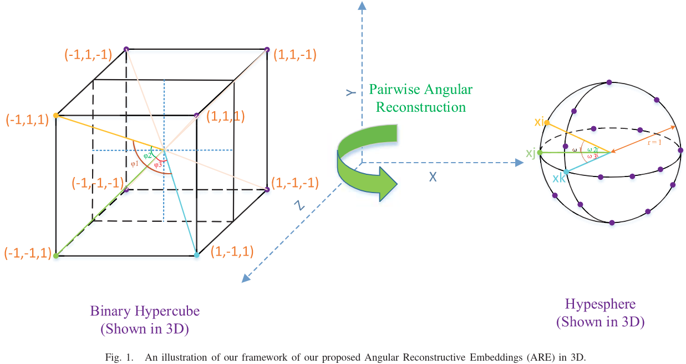

#图像检索 

[toc]

# Hashing with Angular Reconstructive Embeddings
- 论文: sci-hub
- 期刊: IEEE TRANSACTIONS ON IMAGE PROCESSING, VOL. 27, NO. 2, FEBRUARY 2018

## 摘要
现有哈希方法衡量数据相似性都是基于欧式距离的.本文将专注于使用余弦相似度来学习到一个紧凑的哈希码.为此,我们提出了角度重建嵌入(angular reconstructive embedding,ARE)方法,通过最小化原始特征和二进制嵌入的余弦相似度的重建误差来学习二进制码.针对连续和离散的情况,我们分别设计了算法来优化 ARE,实验表明 SOTA.

## 1. 引言
ANN 是大规模图片索引的有效方法,哈希是这种方法基础.大多数哈希方法都是通过一个哈希函数,将d维特征向量映射到r位的汉明空间,将数据相似度转换为汉明距离.很多人提出了很多不错的方法.  

这些离散方法大多还是保留来基于欧式空间的相似度衡量,只有少量工作考虑了余弦相似度,比如 LSH. STH 在无监督学习阶段使用余弦相似度来构建邻接矩阵(adjacency matrix).AQBC 则通过将每个特征映射到二进制超立方的顶点上来生成二进制编码,这些顶点的角度最小.尽管 AQBC 在高维稀疏数据上使用欧式/语义最邻近方法索引表现很好,但是它最初是假设数据非负的.

本工作中,我们将数据点之间的余弦相似度作为相似度衡量来学习二进制码.和 AQBC 不同,我们不要求数据非负.受 BRE 最小化原始欧式距离和汉明距离之间的重建误差启发,我们提出来最小化原始特征的余弦相似度和二进制嵌入的余弦相似度之间的重建误差的方法,并针对连续和离散情况,我们设计来两种简单而有效的算法来优化 ARE.

综上,本文贡献如下:
- 提出了 ARE,通过最小化原始特征和二进制嵌入的余弦相似度的重建误差来学习二进制码
- 为进一步将编码平衡和独立性纳入我们的模型,我们设计了两种简单而有效的算法来优化ARE.
- 实验表明方法 SOTA

## 2. 相关背景和工作
本节,我们先简要回顾 AQBC.  
假设我们的数据集包含 n 个观测值,记作 $X=[x_1,x_2,...,x_n]^T \in R^{n \times d},x_i \in R^d$,这里i是第i个数据观测样本,d是特征空间维度.将要得到的哈希编码记作 $B=[b_1,b_2,...,b_n]^T \in \{0,1\}^{n \times d}$,r是二进制长度,对应的哈希函数记作 $h_k \in \{0,1\},k=1,...,r$  

### A. 基于角度量化的二进制码
AQBC的目标是找到一个量化方案,这个方案会最大化单位超球面的正象限中向量之间的余弦相似度.在 AQBC 方案中,作者使用和 ITQ 类似的方法来考虑数据结构.由于旋转数据并不会改变角度,因此它们通过旋转将数据对齐到一个预先定义的量化标准.因此 AQBC 的目标是找到一个 $d \times d$ 的正交变换 $R \in R^{d \times d}$,使得每个变换之后的数据点 $R^T x_i$ 和对应的二进制码 $b_i$ 的余弦相似度之合最大. AQBC 的目标函数可以写做:
$$
Q_{AQBC}(B,R)=arg \underset{B,R}{max} \sum^n_{i=1} \frac{b_i^T}{||b_i||_2} R^Tx_i,  \\
s.t. b_i \in {0,1}^d, R^TR=I_d, \tag{1}
$$
这里 $I_d$ 是 $d \times d$ 的单位矩阵.为了生成 c 位的编码, $c<d$,公式1中 $d \times d$ 的正交变换矩阵R将被替换为 $d \times c$ 的投影矩阵 R,投影矩阵列之间正交.值得注意的一个问题是 $R^Tx_i$在旋转之后可能包含负值.但是在文献8中,这些可能的负值被直接视为0,这可能会导致数据丢失一些结构性信息,进而性能下降.

## 3. 角度重建嵌入
本节我们将介绍 ARE 的算法框架.首先我们先介绍 ARE,然后展示在连续和离散条件下, ARE 的优化方法

### A. 方法
在一些视觉应用中,两样本之间的角度的余弦常被作为一种相似度衡量.在不失一般性的前提下,我们假设数据存在于单位超球面,如图1,这些特征向量 $x_i$ 被归一化为单位2范数.在这个前提下,显然两两的欧式距离相似度等价于余弦相似度.基于目标的汉明距离是难以优化的,但是二进制码之间的余弦距离是易于优化的,因此,旋转余弦相似度理所应当.

回顾,定义两二进制码之间的汉明距离为$d_H=|\{k|h_k(x_i) \neq h_k(x_j),1 \leq k \leq r\}|$,这里无论 $b_\in \{0,1\}^r$ 还是 $b_\in \{-1,1\}^r$,所以这里不必假设给定的特征向量 $x_i$ 非负,i.e., live in the positive orthant of a unit hypersphere (where wach vertex is consisted of $\{0,1\}^r$) used in AQBC,我们将对应的要求的汉明嵌入记为 $B \in \{-1,1\}^{n \times r}$,其每个数据点 $b_i$可以被视为二进制超立方的顶点,每个顶点是由一组 ${-1,1}^r$ 组成.注意这里为了数学推导方便,我们使用"-1"替换"0",比如$B \in \{-1,1\}^{n \times r}$,而在应用时,我们使用"0"替换回来.如下使用-1替代0,将显著简化两个二进制码点之间余弦相似度的计算.

如图1所示,在超立方上保持原始特征向量的分布是很自然的 (rather than only in the positive orthant of a unit hypersphere).不同于 AQBC,本文方法将探索通过使用一系列的 $\{-1,1\}^r$ 来组成对应二进制超球面顶点,来尽可能的重建原始分布.和 AQBC 聚焦角度量化不同,受 BRE 启发,本文方法聚焦在汉明空间中保持欧式空间中两两的角度相似性,除非相似度度量不同.ARE的想法是很朴素的,我们将尝试学习一个汉明嵌入,通过最小化单位超球面上原始特征角度余弦和二进制超立方上二进制嵌入向量角度的余弦 之间的重建误差,如图1.

单位超球面上任意亮点的角度计算方式如下:
$$
cos(x_i,x_j)=\frac{x_i^Tx_j}{||x_i||_2||x_j||_2}=x_i^Tx_j,  \tag{2}
$$
二值超立方上两顶点之间角度的余弦计算方式如下:
$$
cos(b_i,b_j)=\frac{b_i^Tb_j}{||b_i||_2||b_j||_2}=\frac{1}{r}b_i^Tb_j,  \tag{3}
$$
则 ARE 的目标函数是:
$$
\underset{B}{min}Q(B)=\sum ^n_{i,j=1}(cos(b_i,b_j)-cos(x_i,x_j))^2  \tag{4}
$$

文献55指出,好的编码应该是平衡且独立的.即每位0和1出现的概率都是50%,此时每位的信息熵最大.而独立这个要求在多数情况下太过严格,因此我们放宽这个条件,和文献55一样,仅要求各个位之间不相关.也就是各位之间没有线性关系.最后我们将这两个准则纳入到我们的目标函数.

结合公式234,目标函数可以写成更加简洁的矩阵形式:
$$
\underset{B}{min}||\frac{1}{r}BB^T-XX^T||^2_F,  \\ 
s.t. B \in \{-1,1\}^{n \times r},1^TB=0,B^TB=nI_r,  \tag{5}
$$

**注:**$1^TB=0$ 这里表明 $B$ 中1和-1是一半一半.

这里$10$是一个列向量,其所有元素为1,$I_r$是单位矩阵.上诉问题是一个高度非凸的,由于离散约束,难以优化.更进一步,平衡约束会进一步将这个问题变成一个 NP-Hard 问题. 接下来,我们将提出两个方法来放宽约束和目标函数来获得一个近似解.

### B. 解法
本节,我们将仿照 SSH,设计一个简单的算法在连续的条件下来优化ARE,进而导出一个有效的方法在离散条件下优化 ARE.

#### 1) 连续解:  
在将数据中置(原点在0附近?)之后,我们使用线性函数以及0阈值作为哈希函数:
$$
h_k(x_i)=sgn(w_k^Tx_i),  \tag{6}
$$
使 $W=[w_1,...,w_c] \in R^{d \times c},B=sgn(XW)$ .无视掉常数项,公式5改写如下:
$$
\underset{B}{max} Tr(B^TXX^TB),  \\
s.t. B \in \{-1,1\}^{n \times r},1^TB=0,B^TB=nI_r \tag{7}
$$

类似 SSH,我们放宽离散约束条件使用 $W^TW=I$ 来替代 $B^TB=nI_r$ 同时结合最大化方差,如此得到:
$$
\underset{W}{max} \frac{1}{2}Tr(W^TMW),  \\
s.t. W^TW=I_r  \tag{8}
$$
这里 $M=X^T(XX^T)X+nX^TX$ ,$n$ 是一个用来权衡的超参数.本节松弛的目标函数类似SSH,不同之处再与将 SSH 中的两两相似矩阵 $S$ 换成了 $XX^T$,因此我们的方法可以看成是无监督的 SSH.对矩阵 M 进行特征值分解即可得到最佳投影矩阵 W.这与 PCA 寻求最大方差方向很像,不同在于我们使用了来自ARE的矩阵对协方差矩阵进行来调整.相比之下, ARE 使用一个无监督的方式来调整协方差矩阵,而 SSH 使用一个有监督的方式来调整协方差矩阵.但正交约束会逐步强制长的比特位选择一些低方法的方向,显然这会降低低位比特位的质量,为此,我们引入一个正则项来平衡这一点,我们将公式8改写为:
$$
\underset{W}{max} \frac{1}{2} Tr(W^TMW)- \frac{p}{2} ||W^TW-I||_F^2  \tag{9}
$$  

这里 $p$ 是一个正值.记 $Q=I+\frac{1}{p} M$.正如 $p>0$,很容易得到 Q也为正.我们对 Q 使用 Cholesky 分解得到 $Q=LL^T$,最终,我们可以得到非正交投影:
$$
W_{nonorth}=LU_c  \tag{10}
$$
这里 $U_c$ 是矩阵 $M$ 最大的 $c$ 个特征向量.

#### 2) 离散解:
参考文献[28],[41]中的因连续松弛条件导致的累计量化误差,本节,我们将探索不使用连续松弛条件来进行优化.我们将带有核函数的哈希函数定义如下:
$$
h(X)=sgn(f(X))  \tag{11}
$$
这里 $f(X)=\phi(X)P$ 是预测函数, $P=[p_1,...,p_r] \in R^{m \times r}$ 为协方差矩阵, $\phi(X)=[\phi(x_1),...,\phi(x_n)]^T$ 为满足 Mercer 条件的任何核函数.本文,我们使用高斯核函数$\phi(x)=[exp(||x-a_1||^2/\sigma),...exp(||x-a_m||^2/\sigma)]^T \in R^{m \times 1}$, $\{ a_j \}^m_{j=1}$ 是从训练样本中选出的 m 个锚点, $\sigma$ 是核宽度.  

则,我们需要解决的问题如下:
$$
\underset{B,P,R}{min}||\frac{1}{r}BB^T-XX^T||^2_F+ \gamma||B- \phi (X)PR||^2_F,  \\
s.t. B \in \{ -1,1 \}^{n \times r}, 1^TB=0,B^TB=nI_r,R^TR=I_r,    \tag{12}
$$
这里 $\gamma$ 是一个用来权衡的超参数.公式12中第一项可以认为是需要最小化的重建误差,第二项是确保预测函数 $f(X)$ 可以以最小的量化误差来预测目标二值码 B where the functionality of the orthogonal transformation $R \in R^{r \times r}$ is analogous to that of ITQ.

公式12难以直接优化,为此,我们提出来一个易于处理的优化方法来解决以下四个问题.  

##### P-Subproblem: 
对公式添加一个正则项 $P$ 来防止过拟合是很有效的.通过修正 B 和 R.我们将问题12改写如下:
$$
\underset{P \in R^{m \times r}}{min} \lambda||B-\phi(X) RP ||^2_F+\mu||P||^2_F,  \tag{13}
$$
这里 $\mu$ 是一个可调参数.这里公式13是一个正则化的最小二乘问题,其解析解为:
$$
P=( \phi(X)^T\phi(X)+\frac{\mu}{\lambda}I_m)^{-1}\phi(X)^T BR.  \tag{14}
$$

##### R-Subproblem:
通过修正 B 和 P,公式12可以些微:
$$
\underset{R}{max} Tr(RB^T \phi(X)P), \\
s.t. R^TR=I_r   \tag{15}
$$
问题15是一个经典的[Orthogonal Procrustes problem](https://www.zhihu.com/question/31167170/answer/1490641192).我们对 $r \times r$ 大小的矩阵 $B^T \phi(X)P$ 进行奇异值分解为 $S \Omega \hat{S}^T$.我们可以得到 $R=\hat{S}{S}^T$.

##### B-Subproblem:
通过无视常数项,修正 P 和 R,公式12改写如下:
$$
\underset{B}{min} Tr(-\frac{1}{r} BB^TXX^T-\lambda \phi(X)PRB^T),   \\
s.t. B \in \{-1,1\}^{n \times r}, 1^TB=0,B^TB=nI_r.  \tag{16}
$$
受[28]启发,我们通过引入辅助变量 $Z$ 来松弛问题16:
$$
\underset{B,Z}{min} Tr(-\frac{1}{r}BB^TXX^T-\lambda \phi(X)PRB^T)+\frac{\iota}{2}||B-Z||^2_F,  \\
s.t. B \in \{-1,1\}^{n \times r}, 1^TZ=0,Z^TZ=nI_r.  \tag{17}
$$

这里 $\iota$ 是一个可调参数.通过修正 $Z$, 问题17 可以转化为:
$$
\underset{B}{min} Tr(\frac{1}{r}B^TXX^TB+\lambda B^T \phi(X)PR + \iota B^TZ),  \\
s.t. B \in \{-1,-1\}^{n \times r}  \tag{18}
$$
我们直接在汉明空间中无视离散二进制约束 $B \in \{-1,1\}^{n \times r}$ 来优化 $B$.  

将公式18记作 $g(B)$.显然对称矩阵 $XX^T$ 是半正定的.根据最小化极大值算法,我们使用一个简单的迭代上升的方法.在第 $j$ 次迭代,我们定义一个局部函数 $\hat{g}_j(B)$,使得 $g(B)$ 在点 $B^{(j)}$ 呈线性,并将 $\hat{g}_j(B)$ 作为 $g(B)$ 离散优化时的代理函数.给定 $B^{(j)}$ ,那么下一个离散点为 $B^{(j+1)} \in arg max
_{b \in \{-1,1\}^{n \times r}} \hat{g}_j(B):=g(B^{(j)})+ \langle \nabla g(B^{(j)},B-B^{(j)} \rangle$.则 $\hat{g}_j(B)=(g(B^{(j)})- \nabla g(B^{(j)})B^{(j)})+ \nabla g(B^{(j)}) B$. 将第一项视为常数,则当:
$$
B^{(j+1)}=sgn( \nabla g(B^{(j)}))  \tag{19}
$$
$\hat{g}_j(B)$ 取得最大值.  

由公式18,我们可得$\nabla g(B^{(j)}) = (2X(X^TB^{(j)}))/r + \lambda \phi (X) PR + \iota Z$

##### Z-Subproblem:  
对于公式17,修正B,我们得到:
$$
\underset{Z \in R^{n \times r}}{max} Tr(B^TZ),   \\
s.t. 1^TZ=0,Z^TZ=nI_r,  \tag{20}
$$

