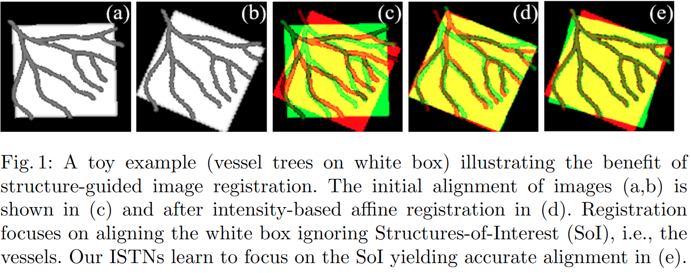

#无监督 #单应性估计 #图像配准

[toc]

# Image-and-Spatial Transformer Networksfor Structure-Guided Image Registration
## 摘要

感兴趣的结构信息 (SoI) 一般仅在训练时可以得到,通常作为一种分割掩模或者特征点出现.本文提出来一个新颖,通用的框架图像空间变换网络 ISTMs,利用 SoI 信息来学得一个新的图像表示,以此来优化下游的图片配准任务.

## 引言

常用的配准思路是将配准定义为一个优化问题,寻找一组参数 $\theta$ 使损失函数 $L(M*T_{\theta},F)$ 最小化,其中 M 是待配准图像, F 是目标图片.  
最近出现了一些监督学习方法,直接预测出图片之间的变换.但是由于变换 $T_{\theta}$ 无法直接获得,因此使用变换来合成图片或者使用传统计算变换的方法来获得训练数据.但是合成图片往往不够真实或者会产生不好的泛化,而使用传统方法应测作为标签则导致结果不够精确.   
一些基于无监督的方法则是和传统方法类似的思路,通过最小化平方差等函数,其实理论基础和传统方法类似,因此无法取得更好的性能.   
因此现在的深度学习方法并没有充分利用深度学习的表示学习能力,仅仅是提升了计算速度.我们注意到现在监督或者非监督方法并没有探索深度学习在以下两个思路中能力:

1. 学习一个为诸如图片配准等任务优化的新的表征
2. 在训练时融合和利用一些在测试时较难获得的信息.

当然这里关于第二点是有一些例外的,一些分割的 mask 或者若标签可能会在训练过程中成为额外信息,这些额外信息可能使得配准在测试时隐式的利用了一些图像强度.比如,如图 1,一些配准可能过于注重一些特定的结构信息.   

另外,我们认为迭代求解的方法比一步到位的方法更好更精确.

### 贡献

在 STN 网络的头上加体格 图像变换网络 (ITN) 来提取 SoIs 信息,

## ISTN

STN 在本文看来,主要分为两个部分,一是利用 CNN 学习到来一个用于重采样的表示,二是使用了一个 reshape 和回归将学习到的表征特征转化成变换的参数.而 STN 学习到的表征是隐式的,在推理阶段无法使用.本文的一大贡献便是引入来一个专用的图像变换网络来利用这个新的图像表征.

### ITN

### ISTN 的显示和隐式训练
