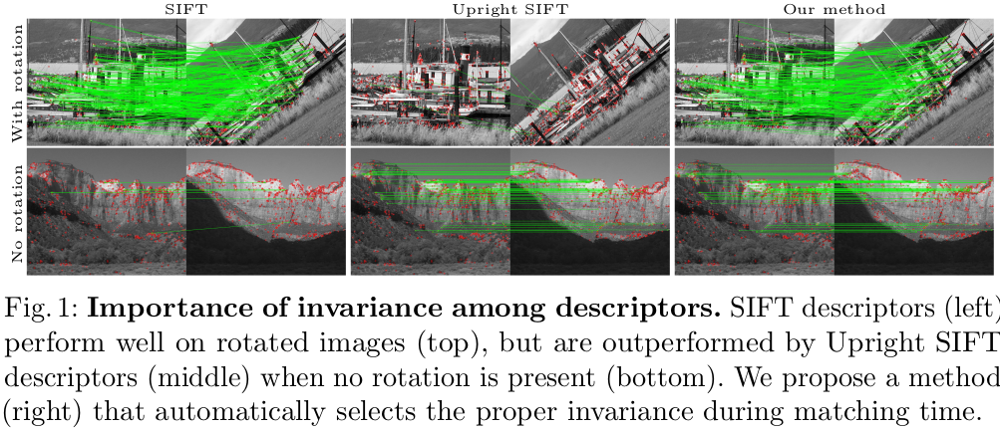
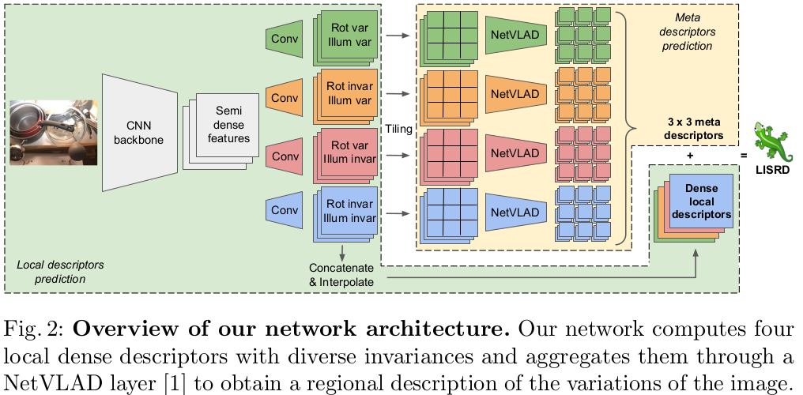
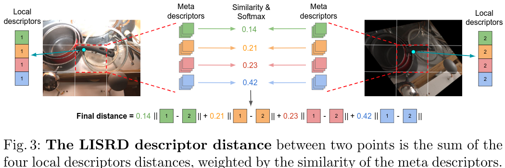

#单应性估计 
#图像配准 

[TOC]
# Online Invariance Selection for Local Feature Descriptors
- 论文:https://arxiv.org/abs/2007.08988
- code:https://github.com/rpautrat/LISRD  
- Oral at ECCV 2020

## 摘要
是保持不变性还是保持特异性是一个难以取舍的问题.为此,本文提出了一种分解局部描述符不变性和根据上下文在线给出选择的方法.我们的框架联合学习了不同不变性的局部算子描述符和元描述符.在进行局部算子描述符匹配时,以跨图片的元描述符的的相似性为依据来确定选择正确不变性的局部算子描述符,这就是LISRD,可以在图片发生不良变化时调整描述符,在不需要不变性时保持特异性.结果SOTA,对昼夜变换很鲁棒.

## 1 引言
SfM,SLAM 要求特征描述子可以对昼夜,季节和跨基线匹配.  
现在描述子越来越偏向要求不变性.但是过高的不变性虽然可以取得更好的泛化,却使得描述子携带的信息更少.如图1,在小的旋转情况下 Upright SIFT 比常规 SIFT 明显更加鲁棒.因此我们认为最佳的不变性和特异性的平衡是和具体场景有关的,若希望描述器可以有更强的鲁棒性,那么它们的各种特性因该是可以分离分情况的.

为此,我们将聚焦描述子,在给定上下文的情况下选择出正确的不变性描述子.借用局部描述子,我们学习出元描述子来编码图片的全局变化.在匹配时,匹配时,我们通过元描述子的相似性来加权本地描述符的距离,最终产生出一个最终的描述子距离.然后基于这个距离进行特征点筛选.
因此我们的 LISRD 可以根据局部区域选择最佳不变性的的算子.元描述子的公式也可以轻易的推广到其他关键点描述子上.并且元描述子增加的运算开销很小.综上,本文贡献如下:  
- 我们展示了如何通过一个网络,学习到几种不同的本地算子.其思想和多任务学习类似.
- 我们提出了一个轻量的元描述子,这个描述子可根据上下文选择出最佳不变性的局部描述子.
- 本文方法可以推广至其他关键点检测器

## 2 相关工作
**学习局部特征描述器**  
和经典方法类似,早期 CNN 在这方面通常是在一个局部区域进行卷积来得到一个块描述符,块可能是各种形状,这个块描述符对空间变换进行了编码.网络使用一个三元组loss区域正负样本块来进行优化.最近还有诸如 [SuperPoint](SuperPoint.md) 和 R2D2 之类的工作,可以同时推理关键点和描述符,后者更是使用了一个额外的可靠性图来跟踪图片中信息最丰富的地方.还有一些方法直接使用网络特征作为密集描述符来检测关键点.DELF 学习了注意力来选择特征点. D2-Net 则选取描述符特征图在通道数据在通道上的最大响应.UR2KID 则将通道分成不同组,将响应进行 L2 正则化之后提取特征点.尽管联合估计关键点和描述符可以让预测更快,且预测的描述符和关键点强相关,但是这样关键点检测器和描述器都共享同样的不变性.而本文将聚焦描述符的学习

**特征描述符的不变性**  
BOLD 的核心是选择在线不变性的二值描述符,即在运行时,针对每个图像块选择一个针对小的透视变换具有最大不变性的二进制测试子集.类似的,最近的研究趋势是如何获得对任何图像变化都不变的描述符. LIFT 仿照 SIFT,通过估计关键点和它们的方向,描述符来获得旋转不变性.将不同的几何变换聚类测和那个不同的组,那么使用分组卷积就可以获得特定的几何变换不变性.为此,需要在训练数据中加入尽可能多的多样性样本.本工作也将采用多光照的,单应性变换的数据来进行训练.   

**描述和匹配任务中的多任务学习**   
在特征描述和匹配上使用单一网络来完成多个相关任务的技术并不新鲜.联合学习描述器和检测器就是典型的多任务,可以使得描述其针对预测关键点位置更加具有特异性.通过借助多任务教师网络蒸馏,HF-Net 将关键点检测,定位,全局图像描述统一来起来. SuperGlue 和 ContextDesc 则在描述符中利用视觉和几何上下文来或者图片间更好的一致性. UR2KID 则绕过关键点的监督训练,直接为局部匹配和图像索引优化描述器.在本文方法中,我们将并行的学习多种描述器,但是个描述器中间的域不同,特定的不变性也不一样.于之前从全局到局部的方法不同,我们将首先依赖于局部描述符,然后使用全局信息来细化描述符.

## 3 为局部描述器学习最佳不变性
首先,我们设计来一个网络来学习几种不同的稠密描述器,每个描述器都有不同的不变性(如3.1节).然后我们提出来一个策略在匹配局部描述器时选择最佳不变性的描述器,如节3.2. 图2 展示来整个设计的全貌.
  

### 3.1 分解局部描述器的不变性
有诸多图像影响描述符,完全分解出这些因素是困难的.这里,我们将聚焦分解出:旋转和光照,当然也可以推广到其他变化,如尺度变化.那么这样就有四种可变性组合.下面,我们展示来不同版本的描述子变体将更加具有特异性因为这些特异性是可以分解的,这些特异性帮助对应的算子在特定条件上实现更好的不变性.   
**网路结构**   
受 [SuperPoint](SuperPoint.md) 启发.如图2,通过一个共享的基干网络计算 semi-dense 特征,然后分出4个头,每个头预测一种 semi-dense 描述子.因为4个局部描述子之间的计算是有冗余的,所以共享权值的基干网络可以减少网络参数并提高计算效率.   
**数据集准备**    
数据集是三元组形式的.包括锚点图片(anchor image)$I^A$,是从大规模数据集中得到的真实图片.变体图片(variant image)$I^V$,对$I^A$进行无旋转的单应性变换,保持光照条件,用来训练变体描述子.不变图片(invariant image)$I^I$,改变$I^A$的光照和方向得到,用来学习到不变描述子.  
**训练损失**   
局部描述子的训练使用不同变体的三元组损失,这取决于描述子应该是$I^I$的不变表征还是变化表征.根据关键点位置对密集描述符进行采用,然后进行 L2 归一化并以此计算 loss. 由于我们仅仅关注描述符,所以我们使用 SIFT 关键点来传播图像信息区域的梯度.当然,任何关键点在推理时都是可以使用的,详情参见4.5节.   
给定两张图像$I^a$和$I^b$,其中$I^a$经过单应性变换矩阵$H$得到$I^b$,给定$I^a$中$n$个关键点$x^a_{1..n}$,那么得到$I^b$关键点$x^b_{1..n}=H(x^a_{1..n})$.对应的稠密描述符map为$d^a_{1..n}$和$d^b_{1..n}$.那么我们在$I^a$和$I^b$间定义一个常规三元组 loss $L_T(I^a,I^b,dist)$.该 loss 将强迫正确的配对$(x^a_i,x^b_i)$在描述符空间中尽量相近.   
$$
p_i=dist(x^a_i,x^b_i) \tag{1}
$$
此外,三元组 loss 将增大$x^a_i$和$I^b$中最近点的负向距离$n_i$,这个最近点应该和正确匹配的$x^b_i$距离$T$,然后分别计算a到b和b到a的距离,取最小值,计算方式如下:
$$
n_i=min(dist(x^a_i,x^b_{n_b(i)}),dist(x^b_i,x^a_{n_a(i)})),  \tag{2}
$$
其中:
$$
n_b(i)=arg min_{j \in [1,n]}(dist(x^a_i,x^b_j))
$$
这里$n_b(i)$是使公式达到最小值时i的取值.
$$
s.t. ||x^A_i-x^b_j||_2>T 
$$
$n_a(i)$同理.  这里的公式意思是取一个i,得到a中一个点$x_i^a$,在所有b的点中,和它距离大于 $T$ 的点,该点$x_i^a$和符合条件的 b 中点的距离最小.     
给定间隔$M$,那么三元组边界损失如下:
$$
L_T(I^a,I^b,dist)=\frac{1}{n}  \sum^n_{i=1}  max(M+(p_i)^2-(n_i)^2,0)  \tag{3}
$$
这里$p_i$是一一对应的一对关键点的描述符的距离,$n_i$是和选中的点距离最近的点的描述符距离,这连个点之间距离最小为T.
我们定义不变性描述符的 loss $L_I$ 是锚点图片$I^A$和不变图片$I^I$之间的三元组损失,那么描述符之间的 L2 距离是:
$$
L_I=L_T(I^A,I^I,||d^A-d^I||_2)   \tag{4}
$$  
变体描述符的损失 $L_V$ 是基于三元组图像:$I^A$,$I^I$,$I^V$.这将迫使变体描述符在保持锚点图片和变体图片之间相似性的同时,捕捉到锚点图像和不变图像之间的不同.正向损失是$I^A$和$I^V$之间的距离,负向损失是$I^A$和$I^I$之间的距离:
$$
L_V=\frac{1}{n}  \sum_{i=1}^n max(fM+||d_i^A-d_i^V||_2^2-||d^A_i-d^I_i||^2_2,0)  \tag{5}
$$

$f$用来控制$I^A$和$I^I$之间的点的不同.对于旋转,$f=min(1,\frac{\theta_I}{\theta_{max}})$,这里 $\theta_I$ 是锚点和不变图片之间的绝对旋转角度,若角度大于 $\theta_{max}$ ,则认为锚点图片和不变图片是不同的.而光照的变换难以量化,针对$I^A$和$I^I$之间的光照变化,我们设置$f=1$.     
假定1~4重描述子分别对应的不变性是无光照和旋转的变化,无光照有旋转变化,有光照无旋转变化,有光照和旋转变化.那么当$I^A$到$I^I$之间有光照无旋转变化,那么此时针对1,2,4描述子应该使用损失$L_V$,针对描述子3使用损失$L_I$.最终损失是四者平均.即对公式6的解释.    
$$
L_l=\frac{1}{|D|} \sum_{d \in D} L_{I/V}(d)   \tag{6}
$$

### 3.2 在线选择最佳不变性
得到上述的描述子之后,我们就可以依据描述子信息来选择最佳不变性了.简单粗暴的方法是将4个局部描述符和图片相似度都算一遍,选最接近的那个.但是这样做没有利用上下文信息,也没有利用到其余没那么相似的描述符信息.因此,我们提出从局部描述符中提炼出一种区域描述符(元描述符,meta descriptor),利用这个来指导不变性描述符的选择.   
将一个区域内的局部描述符经过一个 [NetVLAD](NetVLAD.md) 聚类来得到元描述符.那么这样元描述符和对于的局部描述符应该有类似的不变性,但是元描述符携带了更多上下文信息.我们将图片分成$c \times c$个区域,每个区域计算 4 种元描述符,并对齐分别进行L2归一化.  
这里根据元描述符计算点是否匹配的代码如下:
```python
# geometry_utils.py
def lisrd_matcher(desc1, desc2, meta_desc1, meta_desc2):
    """ Nearest neighbor matcher for LISRD. 
        这里是计算两张图片得到的meta_desc1,meta_desc2之间两两相乘,然后再分别在4个描述符中求softmax,然后将得到的权值和原始描述符相乘
        然后将原始描述符的加权和作为选择点的的依据
        最后输出的matches x轴上第一位表示Ia图片中选中的点的索引,第二位表示Ib中应该匹配上的点的索引
    """
    device = desc1.device
    # 这里求取meta1和meta2中两两相乘
    desc_weights = torch.einsum('nid,mid->nim', (meta_desc1, meta_desc2))
    print(desc_weights.shape)
    del meta_desc1, meta_desc2
    # 在四个描述符之间求softmax
    desc_weights = func.softmax(desc_weights, dim=1)
    import ipdb; ipdb.set_trace()
    desc_sims = torch.einsum('nid,mid->nim', (desc1, desc2)) * desc_weights
    del desc1, desc2, desc_weights
    desc_sims = torch.sum(desc_sims, dim=1)
    # 以下三句检查nn12和nn21中点的相似度最高的点是一一对应的
    nn12 = torch.max(desc_sims, dim=1)[1]
    nn21 = torch.max(desc_sims, dim=0)[1]
    ids1 = torch.arange(desc_sims.shape[0], dtype=torch.long, device=device)
    del desc_sims
    mask = ids1 == nn21[nn12]
    matches = torch.stack([ids1[mask], nn12[mask]], dim=1)
    return matches
```

即: 将$I^a$和$I^b$中点的元描述符两两相乘,然后在结果的描述符种类的轴上进行 softmax ,以此作为权重,对描述符的两两相乘的结果进行加权,然后最后选取互相之间相似度均是最高的点,这些点作为配对点.  公式表示就是:
$$
dist(x^a,x^b)=\sum^4_{i=1} \frac{exp((m^a_i)^T \cdot m^b_i)}{\sum^4_{j=1}exp(m^a_j)^T \cdot m^b_j} ||d^a_i-d^b_i||_2   \tag{7}
$$
这里 $x^a$ 表示图片 $I^a$ 的关键点.局部描述符为$d$,元描述符为$m$,整体示意图如图3:
   

这里训练 NetVLAD 的loss设置还需要进一步理解.**待补**

### 3.3 训练细节
**数据集**:   
为了训练描述符在光照和旋转变化上不同的不变性,数据集需要包含这些变换的所有组合.同时为了控制每个描述符是用 $L_I$ 还是 $L_V$.本文总共用了4个数据集.光照变化是用的 Aachen day dataset 和  [Multi-Illumination Images in the Wild](https://github.com/lmurmann/multi_illumination) 数据集.这两者提供固定视角,但是光照不同的图像对.光照固定数据集使用的 COCO 和 Aachen dataset 中day flow部分.除开 coco 和 Aachen,所有数据集都使用随机单应性变换进行增强.对于 Aachen 的白天图片,我们使用附带的流来构建对应,我们认为这些图片包含的旋转不大且光照变换没有大的改变.并且,有无光照变化和有无旋转的图片分布几近相等.   
**实现细节**:
基干网络类似 VGG, 3x3 卷积堆叠,通道变化为 64-64-64-64-128-128-256-256.每个卷积之后用 ReLU 和 BN.下采样是2x2大小,步长2的平均池化.  
局部描述符头是4个 3x3,256的卷积接一个128的1x1卷积.那么最终得到的输出是H/8xW/8x128.注意这里检测关键点的时候可以在多尺度的情况下进行,然后将结果汇总到原始图像分辨率.NetVLAD 是由8个128大小的描述符组成的,因此元描述符大小是1024.我们将一张图片分成 3x3 个区域来计算元描述符.    
实际训练时是将图片缩放成 240x320 大小,设置距离阈值 $T=8,\theta_{max}=\frac{\pi}{4},M=1,\lambda=1$,优化器是 adam 学习率0.001且$\beta =(0.9,0.999)$.先训练局部描述符,然后通过端到端训练元描述符来微调.   

## 4 实验结果
### 4.1 衡量指标  
所有用来评价的图片都通过中心裁剪成 480x640 ,并且之间的单应性变换已知.每对图片之间最多1000个关键点,后略

# 相关资料
1. http://www.liuxiao.org/2020/08/%e8%ae%ba%e6%96%87%e7%ac%94%e8%ae%b0%ef%bc%9aonline-invariance-selection-for-local-feature-descriptors/