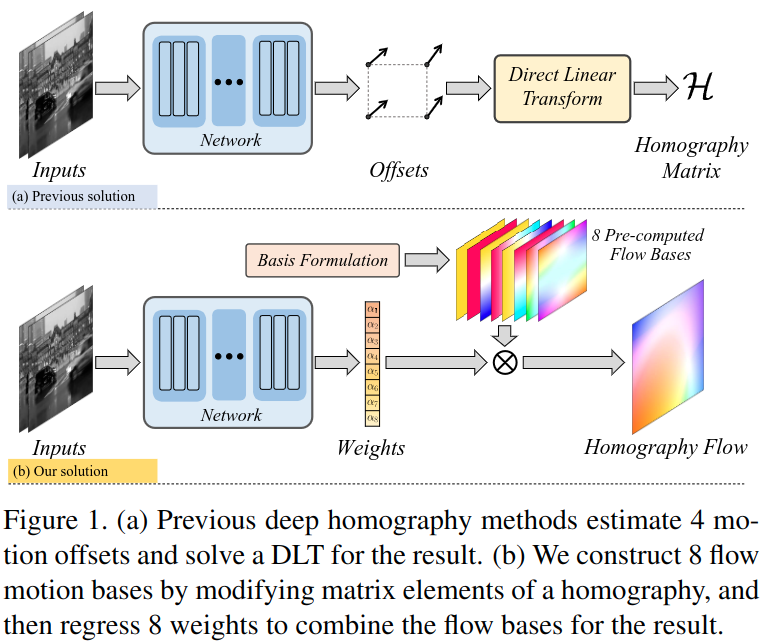
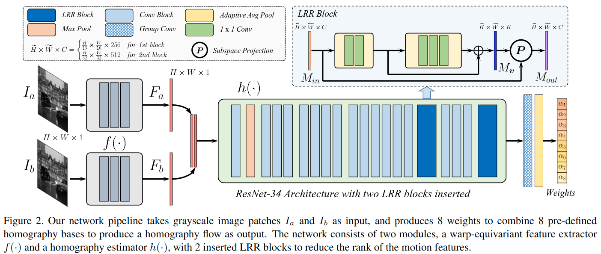
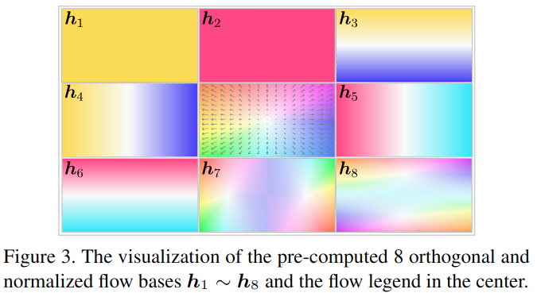

#图像配准 

[toc]

# Motion Basis Learning for Unsupervised Deep Homography Estimation with Subspace Projection
- 文章: <https://readpaper.com/pdf-annotate/note?pdfId=4665270569806086145&noteId=735298692965552128>
- 代码: <https://github.com/megvii-research/BasesHomo>
- 会议: [ICCV 2021 Oral](../../Tag/ICCV.md)

## 摘要
本文引入了一个无监督深度单应性估计的新框架.我们的贡献包括3点.第一,不同于以往使用4个偏移来表示单应性,我们提出来单应性流表示法,即通过一个8个预定义的单应性基流的加权和来估计单应性流.第二,单应性仅包含8个自由度(DOFs),这个比网络特征的层级要少很多,我们提出来一个低等表示块(Low Rank Representation,LRR)来减少特征的层级,使得和主要运动对应的特征将被保留,而其他特征将被消除.最后,我们提出了特征鉴别损失(Feature Identity Loss,FIL)来强迫学习到的特征是扭曲不变的,这意味着就算交换扭曲操作和特征提取的顺序,其结果也是不变的.有了这个约束，可以更有效地实现无监督优化，并学习到更稳定的特征。进行了广泛的实验以证明所有新提出的组件的有效性，结果表明，我们的方法在定性和定量上都优于单应性基准数据集的最新技术.代码见: https://github.com/megvii-research/BasesHomo .   

## 1. 引言
单应性估计是一个基础且重要的图像对齐模型,在图像识别任务中有广泛应用.单应性矩阵包含了8个自由度(DOFs),分别是2个尺度,2个平移,2个旋转,2个透视.以往,单应性估计都是通过检测和匹配特征之后,将离群点去掉解一个线性变化.对比之下,深度单应性估计方法可以取两张图片作为网络输入,然后直接输出单应性矩阵.相比于传统方法高度依赖提取出的特征的匹配,深度学习方法更加鲁棒.

深度学习方法可以分为以下两类,监督学习和无监督学习.前者采用带有真实标签的合成示例来训练网络，而后者则直接最小化两个图像之间的光度或特征差异.由于合成样本难以反映场景视差和动态目标,无监督的方法通常有更好的泛化性.对于无监督方法,Nguyen 在整张图片上最小化误差,但 Zhang 等人则提出在最小化时可学习一个 mask 来跳过离群区域.

直接回归出一个单应性矩阵通常不是最优选择,因为矩阵中每个元素的量纲不一样.现在的解决方法通常是是回归出4个点的偏移变化,然后通过一个线性变换求解(Direct Linear Transform,DLT)来求得单应性矩阵,如图1(a).但在本文中,我们提出来一个新解法,通过"单应性流"表示的角度来解决这个问题,如图1(b).具体而言,就是一次性生成8个流基修改单应性矩阵(类似8个权重对单应性矩阵进行将加权?).这样得到的8个单应性变换矩阵,每个都可以在给定图像座标的情况下进一步转换为流图,进而产生8个单应性基流.这样,在一些变化小的场景中,通过学习基流的加权,就可以重建出单应性流.

由于单应性只有8个自由度,因此单应性流处于低层级的子空间.而通过网络学习出来的特征层级往往比单应性高很多.具体而言,即该投影包含两步,首先是找到特征映射的子空间基,然后特征映射转换到子空间.为了完成这个投影,我们提出了低层表征模块(Low Rank Representation,LRR),该模块可以插入到普通CNN中进行端到端学习,来降低特征的层级.当层级降低之后,画面主要运动的特征,就可以被描述成单应性,这种特征通常容易被网络保留下来.而一些非主要的运动,比如景深和动态运动内容,则常常被抑制甚至移除.

Besides,the triplet loss of previous method still introduces trivial solutions.具体来说,特征的扭曲等变性在无监督训练中不是很好保留.理想情况下是我们希望这个特性应满足以下需求:
$$
f(W(I))=W(f(I))
$$
这里 $W,f( \cdot)$ 代表了扭曲操作和特征提取.这种特征扭曲同变缺失可能导致三元组损失不正确优化.因为三元组损失收敛方式受目标特征(anchors)和源特征(负例)之间距离的影响.然而,对于对齐任务,拉近目标特帧(anchors)和扭曲的源特征之间的具体是极为重要的.因此,我们提出了特征鉴别损失(Feature Identity Loss,FIL) 来强迫图像特征具有扭曲同变形.事实证明,使用FIL可以让我们的模型实现有效的无监督优化并学习到更加稳定的特征.

我们的对比实验和消融实验证明本文方法 SOTA.综上,我们的贡献如下:   
- 我们提出来一个新的表示方法 "单应性流",它包含8个预计算的基流用于无监督的深度单应性估计.
- 我们提出一个新的 LRR模块来减少运动特征层级来隐式的减少运动噪声.
- 我们提出来一个新的FIL损失来迫使学习到的图像特征具有扭曲同变形,从而促进无监督优化中的稳定性.

## 2 相关工作
**传统单应性估计**  
这种单应性估计方法主要先通过检测和匹配诸如 SIFT,ORB,SURF,LPM,GMS,SOSNet,LIFT,BELID,OAN 等图像特征,建起起两幅图像点之间的对应关系.然后使用 RANSAC,IRLS,MAGSAC等方法来过滤失败的匹配.最后通过一个线性变化求解来求得单应性估计.诸如 SuperPoint 等深度学习方法就是用来提高检测到的特征的,还有诸如 SuperGlue 等方法是用来匹配的.

**深度单应性估计**  
深度单应性估计可以分为监督和无监督的方式.相比于监督方法通常在合成图片上学习变换,导致缺乏景深差异,无监督方法则可以直接在真实图像对上通过最小化两图片的光学损失,使用 STN网络将源图像扭曲到目标图像上. Nguyen等人最小化整张图片的光学损失而 Zhang等人则学习了一个mask 来跳过离群区域离去.

**基础学习**  
我们方法也和基础学习(bases learning)有关.Tang 等人表示,在低级视觉问题中,可以利用其子空间来进行正则化.PCAFlow 从电影中学习一个基流,表明来流估计可以转化为学习基流的加权和.受这些工作启发,我们提出了使用 8个预定义基流来估计单应性流的方法.

## 3 算法
### 3.1 网络结构
我们的方法是建立一个卷积神经网络,输入为两张灰度图片对 $I_a,I_b$,尺寸为 $H \times W$,输出为 $I_a$ 到$I_b$ 的单应性流 $H_{ab}$,单应性流和输入具有一样的尺寸.整个网络结构包含两部分,一个扭曲同变性的特征提取器 $f( \cdot )$ 和一个单应性估计器 $h(\cdot)$.$f(\cdot)$ 是一个全卷积网络,而 $h(\cdot)$是添加了 LRR模块来产生8个权重的 resnet-34.整体架构如图2所示:

**单应性流和其基础公式**  
单应性矩阵具有8个自由度,且通过4对点进行线性变换求解出来.而本文,我们将从一个新的角度来求解这件事情.具体而言,我们网络将学习一个尺寸为 $H \times W \times 2$ 的特殊光流举证,我们称之为"单应性流".由于约束,实际上单应性流将被约束在一个 8D 的子空间中.

$$
\exists \{h_i\} s.t. h_{ab}=\sum_i \alpha_i h_i (i=1,2,...,8)  \
  where h_i \in R^{2HW},h_i^Th_j=0   \tag{1}
$$

这里 $h_{ab}$ 是 $H_{ab}$ 的展开版本, $\{ \alpha_i \}$ 是基流的系数.

为获得正交的基流,我们先通过修改单位单应性矩阵每个元素$h_i$来生成8个单应性矩阵.给定图像座标,通过将变换之后的座标减去原始座标,就可以将一个单应性矩阵转换成流映射.然后使用最大的流对8个单应性流进行归一化,然后在对齐进行 QR 分解,数学公式描述如下:
$$
M=Q \cdot R (M,Q \in R^{2HW \times 8},R \in R^{8 \times 8})     \tag{2}
$$

这里, $M$的每一列都是归一化单应性流 $H_i$ 展开而成.在 QR分解之后,Q的每一列都是正交的,可以用来作为基流,即$Q=[h_1,h_2,...,h_8]$.换言之,每个基流都与单应性组的原点的切线空间相关联.接下来通过预测8个基流对应的权值 $\{ \alpha_i \}$ 就可以得到单应性流了.考虑到在一些变化较小的任务中,透视变换是可以使用线性模型来进行近似的,因此我们可以使用这种线性加权解的方式来近似当影响.图3展示我们基流的可视化.

**讨论**   
和之前提到 PCAFlow 方法类似,本文方法也可以通过隐式的学习得到一组单应性的基.但与之不同的是,PCAFlows需预测更大更加灵活的一般性光流,而我们仅处理小变化下的场景.

