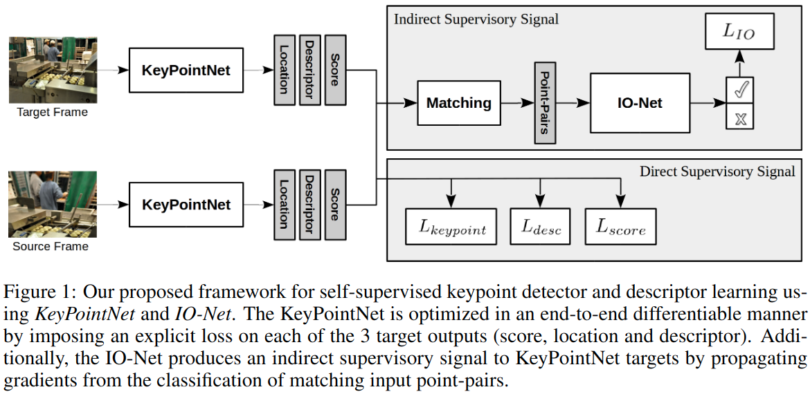
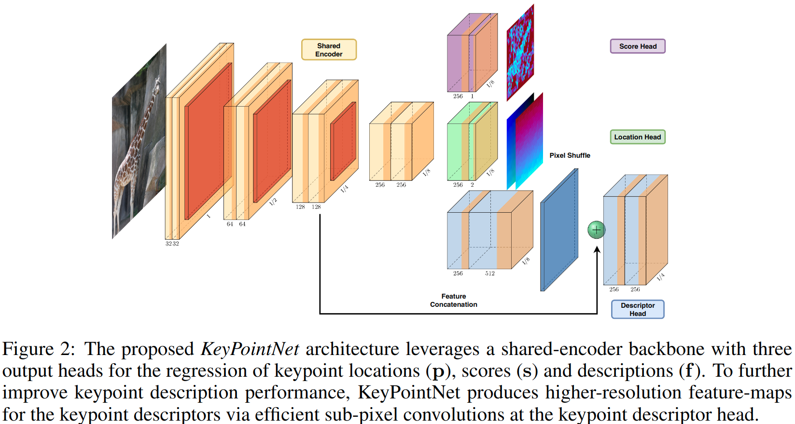
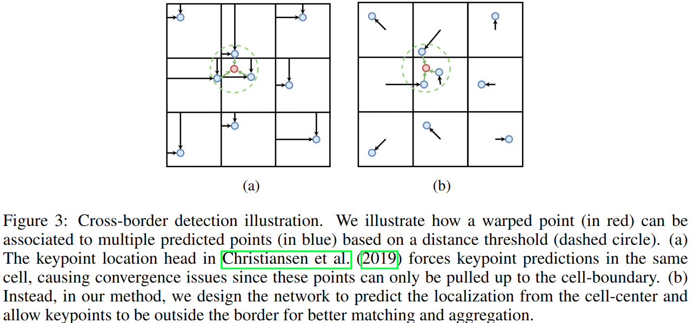
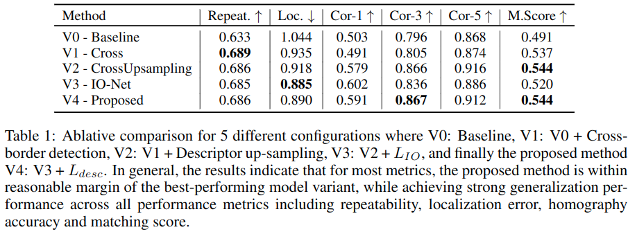
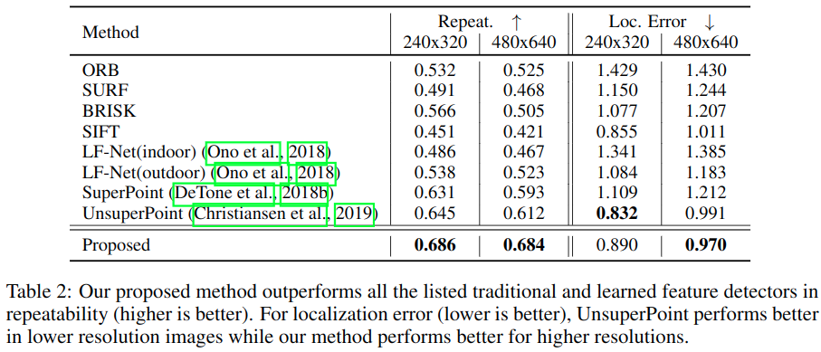
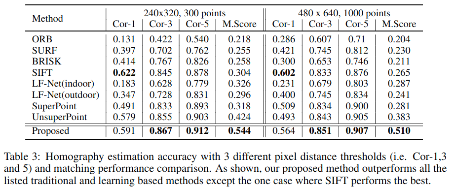

#自监督
#单应性估计 
#图像配准

[toc]

# Neural Outlier Rejection For Self-supervised Keypoint Learning

## 论文代码:
- 论文: https://arxiv.org/abs/1912.10615
- 代码: https://github.com/captainfffsama/KP2D

## 摘要
问题: 使用自然图像,生成一致且精确的,针对感兴趣点的训练数据比较难
解决方法: 
1. 引入了 IO-Net, 用来做自监督的关键点检测,描述和配对
2. 引入了 KeyPointNet,主要用来做关键点检测和描述

本文通过设计了局部关键点聚合来避免空间离散化导致的一些问题.通过一个像素混洗上采样来提升描述符的性能.  
We design the network to allow local keypoint aggregation to avoid artifacts due to spatial discretizations commonly used for this task, and we improve fine-grained keypoint descriptor performance by taking advantage of efficient sub-pixel convolutions to upsample the descriptor feature-maps to a higher operating resolution.

## 引言
贡献:
1. 引入 IO-Net.使用neurally-guided outlier-rejection scheme 作为辅助任务. While the keypoint network is fully self-supervised, the net-work is able to effectively learn distinguishable features for two-view matching,  via the flow of gradients from consistently matched point-pairs.

2. 引入 KeyPointNet.在 UnsuperPoint 上改进了两点.
	1. 改进了 kp 位置的回归头,现在 kp 的位置是可以超出 cell 的,不受 cell 的边界影响.
	2. 使用像素混洗来上采样提升描述符性能

## 相关工作
比较亮眼的工作是2019年的 UnsuperPoint.该工作在每个 cell 内预测一个点.但是我们发现这个并非最优方案,尤其点临近 cell 的边界.Self-Improving Visual Odometry首次使用 CNN 来估计2D 关键点,并基于逆反射设计了一堆方法来分辨关键点的稳定性,以此作为信号来训练模型.因为这个不是可微的,所以没法实现 end2end. 而本文的 IO-Net 是可微的,且显示的使用了一个额外的代理监督信号来匹配关键点对,关键点对是  KeyPointNet 识别出来的.

>
>KeyPointNet 设计了一个显式的 loss,利用 score,location,descriptor 来进行端到端的训练.而 IO-Net 则通过输入点对的结果来间接指导 KeyPointNet.

## 自监督关键点学习
我们目的是回归一个函数,这个函数以一张图片为输入,以关键点,点的描述符以及置信度作为输出,这里我们定义这个函数为 $K:I \to \{P,f,s\}$ . 图片为 $I \in R^{3*H*W}$,关键点为 $P=\{[u,v]\} \in R^{2*N}$, 描述符为 $f \in R^{256*N}$,关键点的置信度 $s \in R^N$,这里 $N$ 为关键点是数量,和输入图片的分辨率有关.$P$ 表示整张图片提取出来的关键点,$P$表示单个关键点.

我们的自监督以源图片 $I_s$ 和目标图片 $I_t$ 作为输入,其中 $I_s$ 经过仿射变换H到 $I_t$ .

另外受 Neural Guided Sample Consensus methods 启发.我们还定义了函数 $C$ ,根据距离策略给一对点赋予权重,并以该对点为输入,输出这对点是否可以用于变换的概率.注意这个函数 $C$ 仅仅用于训练阶段,它可以迫使梯度偏向那些符合变换的点对.

图1显示了我们模型的整体框架,是一个编解码结构的网络,设模型为K,其参数为 $\theta_K$. 编码结构是是个4个block堆叠起来的 VGG 风格的网络,用了3次下采样,将图片 $H*W$ 降到 $H/8*W/8$, 这样最终的特征图每个点对应了源图片一个 $8*8$ 的 cell,解码部分是3个独立的头网络,分别输出描述符,点位置,置信度.这样,对于一个 $H*W$ 大小的图片,最终得到的关键点数量是 $H*W/64$. 除了最后一个卷积层之外,每层都使用了 BN 和 LeakyReLU.图2显示了网络的一些细节. IO-Net 是一个一维 CNN, 参数为 $\theta_{IO}$, 参考的是[ngRANSC](https://arxiv.org/abs/1905.04132),用了4个残差块,并把最后一层的激活函数去掉.这些网络详细结构参数参见表6和表7.

>
>KeyPointNet 网络用了一个共享编码结构的网络作为基干,三个输出头分别输出点座标 $p$,置信度 $s$ 和描述符 $f$.在描述符头上,使用  [Sub-pixel convolution](../../DL_knowlege/Sub-pixel%20convolution.md)上采样之后再与之前底层信息相加来做预测.

### KeyPointNet: 神经网络点检测和描述符学习
#### 关键点位置学习:
类似 [UnsuperPoint](UnsuperPoint.md), 关键点输出头输出一个关于$8*8$ 网格的座标偏移 $[u^{\prime} _i,v^{\prime} _i ]$. 这样结合网格在源图中的位置,可以求出关键点在源图片中的座标 $[u_i,v_i]$.然后我们将源图中关键点座标 $[u_i,v_i]$ 进行仿射变换得到其应在目标图片中的关键变换点座标 $p^*_t=[u^*_i,v^*_i]$,然后对于这些变换点,分别计算目标图片中和这些变换点最近的关键点 $\hat{p}_t=[\hat{u}_t,\hat{v}_t]$ 的欧氏距离(Euclidean distance).将大于预设阈值  $\epsilon_{uv}$  的点对丢掉.那么最终使用的位置损失函数则为:   
$$
L_{loc}=\sum_{i} ||p^*_t- \hat{p}_t||_2 \tag{1}
$$
这里和 UnsuperPoint 似乎没啥区别,为了好说明流程,放一张 UnsuperPoint 的 Fig3:   

>
>在本文中,下方 wrapped image 是 Target Image,上面是 source image 源图片

**注意重点来了**:   
原始 unsuperpoint是不允许预测的关键点超出 cell 的边界的.这里本文就提出了一个新方法,对关键点进行聚合允许其超出边界.我们使用以下函数将相对于 cell 的偏移 $[u^{\prime}_s,v^{\prime}_s]$ 映射到输入图片的座标系中. 
$$
[v_i,u_i]=[row^{center}_i,col^{center}_i]+[v^{\prime}_i,u^{\prime}_i] \frac{\sigma_1(\sigma_2-1)}{2} 
$$  
$$
v^{\prime}_i,u^{\prime}_i \in (-1,1) \tag{2}
$$

这里 $\sigma_2=8$,为 cell 大小, $\sigma_1$ 正比于 cell 大小,本文实验中 $\sigma_1=2$. $row^{center}_i,col^{center}_i$ 是每个 cell 的中心.当 $\sigma_1 >1$,这时,预测的关键点座标是相对于 cell 中心偏移的,显然是可以超出cell边界的,这样靠近 cell 边界,如图3 所示: 

>
>本图展示了我们是如何利用欧式距离将一个经过变换的点(源图上的点,红点)和多个目标图上的点(蓝点)进行配对的.图(a)显示原始 UnsuperPoint 中点因为不能越过 cell,导致其距离红点的最近距离也仅仅只能在 cell 边界,这不利于按照距离来筛选点对.而图(b)本文方法是计算相对 cell 中心的偏移且允许关键点超出 cell 边界,自然有利于配对.  
**注意这里和上面展示的 UnsuperPoint 的图颜色是反过来的**

#### 描述符学习:
首先本文用了[Sub-pixel convolution](../../DL_knowlege/Sub-pixel%20convolution.md)将描述符头的特征图进行了上采样.  
在训练描述符头时,还借鉴了度量学习的思想.我们这里使用了带有[困难样本](https://blog.csdn.net/weixin_42696356/article/details/90738531)挖掘的 [per-pixel triplet loss](https://arxiv.org/abs/1503.03832?context=cs).对于源图中每个关键点 $p_i \in P_s$ 都有一个描述符 $f_i$, 参见 [superpoint](),这个描述符可以通过对最后的密集描述符特征图合理采样来获得.在目标图片中,描述符特征图的 $p^*_i$ 位置的通道值可以被视为了正样本描述符 $f^*_{i,+}$,选择描述符空间中距离正样本最近的负样本描述符为三元组中的负样本描述符 $f^*_{i,-}$, 则描述符损失函数为:
$$
L_{desc}=\sum_i max(0,||f_i,f^*_{i,+}||_2-||f_i,f^*_{i,-}||_2+m)   \tag{3}
$$

本文实验中的 $m=0.2$

#### 置信度学习
置信度损失函数 $L_{score}$ 在设计时有两个出发点:
1. 同一对点的分数应该尽量一致
2. 同一对点靠得越近,分数应该越高,表示这类点更加可能是一对稳定的关键点.
受 [UnsuperPoint](UnsuperPoint.md) 启发,使用了如下损失函数:  
$$
L_{score}=\sum_i [\frac{(s_i+\hat{s}_i)}{2} \cdot (d(p_i,\hat{p}_i)-\bar{d})+(s_i-\hat{s}_i)^2]  \tag{4}
$$
$$
\bar{d}=\sum^L_i \frac{d(p_i,\hat{p}_i)}{L}
$$
这里 $\bar{d}$ 是每对点欧氏距离的平均值.

### IO-Net: 引入神经网络剔除离群点作为辅助任务
关键点和描述符学习其实和离群点剔除有着紧密的联系.因此,我们将使用后者作为一个代理任务来监督前者.损失函数设计如下:  
$$
L_{IO}=\sum_i \frac{1}{2} (r_i-sign(||p^*_i-\hat{p}_i||_2 -\epsilon_{uv}))^2  \tag{5}
$$

$r_i$ 是 IO-Net 的输出, $\epsilon_{uv}$ 是第3节关键点学习中提过,关键点大于这个阈值会被丢弃,不用于计算关键点损失函数,这里相当于把大于阈值的点对作为负样本,小于的作为正样本,用来分类.   
这个想法其实脱胎自 neuRANSAC.但是做了一些简化.

综上,最后的损失函数就是以上4个损失函数的加权和:
$$
L=\alpha L_{loc}+\beta L_{desc}+ \lambda L_{score}+L_{IO} \tag{6}
$$
本文实验中  
$$
\alpha=1,\beta=2,\lambda=1
$$

## 实验
### 数据集
训练使用的 COCO 2017,测试使用的是 HPatches ,本文结果是没有使用 NMS 的,表3中 Cor-1,Cor-3,Cor-5 表示精度阈值为1像素,3像素,5像素

### 实现细节
优化器是 ADAM, 初始学习率 $10^{-3}$ ,训练50 epoch, batch size 8. 40轮之后,学习率减半.所有网络使用随机初始化.   
IO-Net 中负样本 relaxtion criteria $c=8$, IO-NET 中取置信度前300的点对用来训练.  
随机仿射变换操作包括: crop, 平移,缩放,旋转,symmetric perspective transform. 
在处理时,空间变换包括先将图片裁剪到原始的 0.7 大小.然后缩放范围是$[0.8,1.2]$,旋转范围是$[0,\frac{\pi}{4}]$,perspective 范围是[0,0.2].光学色彩变换包括,幅值为0.02的高斯噪声,使用核大小为[1,3,5]大高斯模糊,亮度调整[0.5,1.5],对比度[0.5,1.5],饱和度[0.8,1.2],色调[-0.2,0.2].并且0.5机率混洗颜色通道和将图片转换成灰度图.

### 消融实验  
所有实验的图片分辨率大小都是240x320,设置了5组实验:  
- V0:基线版本,不带有跨边界检测,描述符学习上没有进行上采样
- V1:V0基础上带有跨界检测
- V2:V1上带有描述符学习的上采样
- V3:V2基础上仅仅使用 $L_{IO}$,不使用 $L_{desc}$
- V4:V3用上 $L_{desc}$

结果见表1.显卡是 Titan XP,不用上采样是 194.9FPS,使用上采样是 174.5FPS.

>

### 性能评估   
这里评价指标 Repeat 指的是,对于 warp 图片中预测点,计算每个点和gt的距离,得到一个 KxK 矩阵,然后计算小于阈值的点的个数,认为这些点是匹配上的,分别计算预测点匹配到gt点的个数和gt点匹配到预测点的个数,然后统一除以预测点和gt点的个数.这样就是一一对应的比率.代码中阈值取的3.

cor-1~5 是指取图片四个角点,分别使用预测的 H 和 gt 的 H 计算对应点,然后图片点平均误差距离小于1~5的概率.

M Score计算方式,分别计算 A->B 和 B->A 时点误差距离小于3的点数目比上在图片范围内的点的比值,然后两个比值求平均.

   

# 相关论文
1. https://github.com/vislearn/ngransac
2. https://arxiv.org/abs/1907.04011
3. http://www.liuxiao.org/2020/04/%E8%AE%BA%E6%96%87%E7%AC%94%E8%AE%B0%EF%BC%9Aunsuperpoint-end-to-end-unsupervised-interest-point-detector-and-descriptor/

# 个人思考
1. 就个人测试来看,似乎模型的尺度不变性比较差,毕竟是固定输入的,但也许调整训练参数,可以获得较好的尺度不变性
