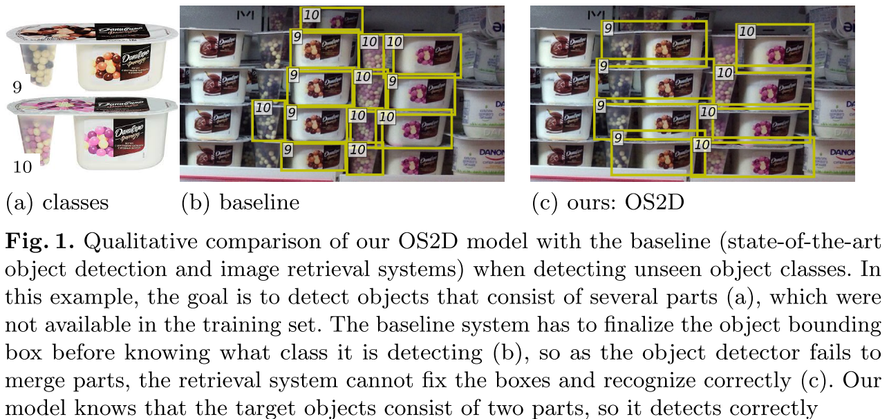
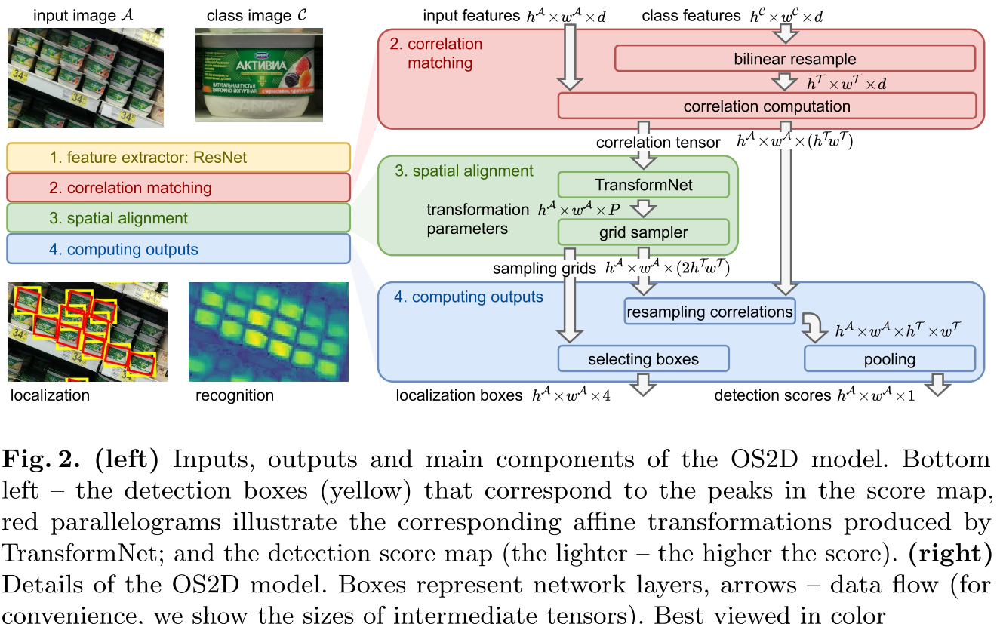

[TOC]

# OS2D: One-Stage One-Shot Object Detection by Matching Anchor Features 
- 论文: <https://arxiv.org/abs/2003.06800>
- 代码: <https://github.com/aosokin/os2d>
- 会议: ECCV 2020

## 摘要
我们构建了一个 one-stage 的系统来连个处理定位和目标识别问题.我们通过对学习的局部特征进行稠密相关性匹配来找到对应性,使用一个前馈几何变换网络来对齐特征,对相关张量对使用双线性采样之后来计算对齐特征的检测分数.所有组件都是可微的,所以这是端到端的.结果显示 SOTA.

## 1. 引言
因为标准目标检测需要耗费大量精力来构建标注数据集.而比如超市等场景,货物经常更新,导致很难构建数据集来识别新的货物.由此我们提出了一个系统来进行 one-shot 检测.注意这里和标准目标检测不同的是,训练和测试时的目标是不重合的.  

常见的 one-shot detection 方法可以分为两个阶段:首先找到所有的目标 (RPN),使用一个 embedding 模块来进行识别. 文献18,45,50,45联系了两个阶段,进行联合微调,但是在测试阶段,这些模型依赖于类别相关的 proposals.

本文贡献:
本文借鉴来 Faster R-CNN 和 SSD 中稠密 anchor 的设计,变换模型使用的是 Rocco 等人设计的用来进行语义对齐的模型和可微的双线性插值.我们聚合这些经典模块.本文方法最大特点是检测和识别是一体的,无需定义个一个通用的对象,这就要求我们特征提取器和变换模型具有较好性能.图1 显示了相比于独立的检测和索引系统,我们是如何将检测和识别统一到一起的.

>这里可以看到,基线模型中,模型必须通过 bbox 才能知道需要检测哪一类,这导致图像索引完全没有办法来修正 bbox.

其次,我们结合元学习中的 ranked list loss 和用于 bbox 回归的 L1 loss 设计来新的损失函数.我们还可以对前馈结果进行重映射,使得我们所需的 anchors 大大减少.

最后,我们将我们的模型应用在来 GroZi-3.2k ,everyday 3D,INSTARE 数据集.我们甚至对 GroZi-3.2k 数据的所有目标进行了重新标注并添加来一些新的类别作为测试集.

在第二节我们将回顾一些背景知识,主要是关于 Rocco 等人的.在第三节和第四节将详细展示我们方法的架构和训练过程.第5节,我们将再次回顾相关工作.最后介绍实验结果和结论.

## 2. Preliminaries: matching networks
我们的工作是建立在 Rocco 等人工作上的.他们聚焦于如何对齐源图片和目标图片的语义. 他们使用 ResNet 或者 VGG 提取到一个 $d \times h^{\tau} \times w^{\tau}$ 的特征张量.通过计算各个特征之间两两的相关性 $c[k,l,p,q]=\frac{<f_{kl},g_{pq}>}{||f_{kl}||_2 ||g_{pq}||_2}$ 得到一个 4D 张量 $c \in R^{h^{\tau} \times w^{\tau} \times h^{\tau} \times w^{\tau}}$.  

然后他们将 $c$ reshape 成 $\hat{c} \in R^{h^{\tau} \times w^{\tau} \times (h^{\tau}  w^{\tau})}$ 然后扔进一个卷积网络,然后输出将目标图片座标映射到源图片的变换的参数.注意,这里卷积网络的第一个卷积核显然其通道数是 $h^{\tau}  w^{\tau}$,整个网络将空间尺寸从 $h^{\tau} \times w^{\tau}$ 变换到 $1 \times 1$,来提供一个单一的向量作为变换的参数.这里卷积网络将是我们模型的重点,同时我们还参考来 TransformNet.注意这里 TransformNet 有3个感受野是 $15 \times 15$ 使用 ReLU 和 BN 的卷积层.假设我们的输入是 $240 \times 240$ 大小,使用 ResNet 第四个 block 的输出,那么最终输出的 feature map 大小是 $h^{\tau}=w^{\tau}=15$,整个结果见 Appendix B.1..

TransformNet 是使用点匹配的强监督学习训练的.最近 Rocco 等人提出使用  soft-inlier count  可以不依赖标注的点匹配,仅仅依赖弱监督来微调 TransformNet. soft-inlier count 是一个可微的函数,可以用来评价当点变换的对齐效果.具体的操作方式是将张量之间的相关张量 $c$ 乘上 soft inlier mask,对事先定义好的mask使用一个空间变换层来进行网格生成和双线性采样进行变换可以得到 soft inlier mask.
 

## 3. The OS2D model
OS2D 的主要想法在于通过使用 TransformNet 可以对大的 feature map 以一个全卷积的方式进行变换,另外使用一个改进过的 soft-inlier count 作为而检测分数.  

如图2, OS2D 包含以下步骤:  
(1) 对源图像和目标图像分别提取局部特征.  
(2) 对两者特征进行相关性计算  
(3) 根据成功匹配的对来对齐特征  
(4) 计算 BBOX 和识别分数.  

**Feature extraction**   
输入图片 $A$ 和 class 图片 $C$.

注意这里 TransformNet 要求图片 $c$ 固定大小.这里我们将图片 $C$ 的 feature map $f_{pq}^C$ 转换成 $f^{\tau}_{pq}$. 这里我们实验发现有些类经过 resize 之后会导致纵横比发生较大变化导致特征质量大大下降.我们发现直接应用可微的双线性重采样来 resize feature maps 可以得到更好的效果.

我们还发现以共享权重 siamese 结构来提取 input 和 class 图片的特征很重要,这就可以不再使用 FPN 等更加有效的多尺度特征提取方式?. **我们尝试解绑两个分支,并使用 FPN 来提取 input 图片的特征,这样的系统在训练时见过的类表现很好,但是无法泛化到新的类别上.**

**特征匹配和对齐**  
前略. All transformations are defined w.r.t local coordinates (different for all locations), which we then convert to the global w.r.t,the input feature map coordinates (we denote the transformations by $G_{kl}$)

Rocco 等人放出来 TransformNet 的权重,但是他们是将 input 变换到 class image.这和本文定义刚好相反.我们直接将两个图片对调并不合适,因为他们的 feature maps 尺寸不同.一种选择是对 transformtions 的结果进行批量的求逆.另一个可选是从头训练.

最后,我们将变换 $G_{kl}$ 喂进一个网格采样器,得到一个网格点集,这个点集将 class image 在 input image 中的每个地方都进行对齐.这里网格的尺寸还是 $h^{\tau} \times w^{\tau}$.网格采样器输出的张量是 $g \in R^{h^A \times w^A \times h^{\tau} \times w^{\tau} \times 2}$, $(g[k,l,p,q,0],g[k,l,p,q,1]):= G_{kl}(p,q)$ with coordinates w.r.t. the input feature map.

**识别分**  
接下来,使用匹配点的 grids 来提取分数 $s \in R^{h^A \times w^A \times 1}$ 表示每点是否有检测到目标. soft-inlier count 是一个很直白的选择,但是它计算量太大.具体而言,它需要创建一个尺寸为 $h^A \times w^A \times h^{\tau} \times w^{\tau} \times h^{\tau} \times w^{\tau}$ 的 mask.其中 $h^{\tau} w^{\tau}=225$.为了规避这个问题,我们将相关张量 $c$ 进行了重采样 $\hat{s}=[k,l,p,q]:=c[g[k,l,p,q,0],g[k,l,p,q,1],p,q],\hat{s} \in R^{h^A \times w^A \times h^{\tau} \times w^{\tau}}$.注意这里位于非整数点 $(y,x)$ 的值 $c[y,x,p,q]$ 是通过可微分的双线性采样从 $c[:,:,p,q]$中得到的.注意这个操作不能直接使用标准的双线性插值的(这里是不同的通道被采样成不同的点).我们可以遍历所有通道分别处理,但这样很慢.我们也可以创造一个新的层.The last step to get s is to pool $\hat{s}$ w.r.t. its two last dimensions.我们使用平均池化并忽略网络的边缘来减少背景的影响.

**bbox定位**  
We extract the localization of the detections by taking max and min of grid tensor g w.r.t. its 3rd and 4th dimensions,i.e.,output the tight bounding boxes around the transformed grid points.

## 4. 模型训练
**Training batches and data augmentation**  
input images 有较高的分辨率且不适合去转成小的固定大小.为此,我们使用了 random crop/scale 变换.每个 batch,我们收集了一些标注好的类和一些随机类作为负样本.

**损失函数**  
使用一个带边界的 hinge-embedding loss 作为识别目标和一个平滑 L1 loss 作为定位:
$$
l^{pos}_{rec}(s)=max(m_{pos}-s,0),l^{neg}_{rec}(s)=max(s-m_{neg},0)  \tag{1}
$$
$$
l_{loc}(x,y)=\sum_{c=1}^4 
        \begin{cases}
            \frac{1}{2}(x_c-y_c)^2,  & {if |x_c-y_c|<1} \\
            |x_c-y_c|-\frac{1}{2}, & \text{otherwise} \\
        \end{cases}
\tag{2}
$$

这里 $s \in [-1,1]$ 为识别分数,正样本高,副样本低,$m_{neg}$和$m_{pos}$ 是负正边界,$x,y \in R^4$作为输出来编码 bbox 位置。

很显然，无论是作为检测还是索引任务，本任务下，都有严重的类别不平衡问题。这里我们借鉴了 Faster R-CNN 中的方法：即对每个正样本取数目固定的负样本。然后在计算定位时仅仅使用正样本.所有的 loss 在归一化时也仅仅考虑正样本.对于识别,我们使用了索引里的 contrastive loss: 平方 $l_{rec}$ 和将正边界 $m_{pos}$ 设置为1.
$$
L_{rec}^{CL}=\frac{1}{n_{pos}} \sum_{i:t_i=1} l_{rec}^{pos}(s_i)^2+ \frac{1}{n_{pos}} \sum_{i:t_i=0} l_{rec}^{neg}(s_i)^2 \tag{3}
$$
$$
L_{loc}=\frac{1}{n_{pos}} \sum_{i:t_i=1} l_{loc}(x_i,y_i)  \tag{4}
$$

这里,索引 $i$ 是遍历所有 anchor 位置, $\{s_i,x_i\}_i$ 是来自网络,而 $\{t_i,y_i\}_i$ 来自于标注和分配的目标.

我们还尝试了  ranked list loss(RLL):
$$
L_{rec}^{RLL}=\sum_{i:t_i=1} \frac{1}{\hat{n}_{pos}} l^{pos}_rec(s_i)+\sum_{i:t_i=0} w_i^{neg}l_{rec}^{neg}(s_i)  \tag{5}
$$
$$
w_i^{neg}  \propto exp(Tl_{rec}(s_i,0))[l_{rec}^{neg}(s_i)>0]  \tag{6}
$$
这里 $\hat{n}_{pos}$ 是被激活的正样本,比如 $l_{rec}^{pos}(s_i)>0$ 的正样本.权重 $w_i^{neg}$ 是用来平衡归一化一个图像对里所有负样本的. 常量 $T$ 用来控制权重的力度. 在 Wang 等人的文章中提前固定了 $T$ 但是我们发现这个参数并不好调整.为此,我们对每个图像对使用了一个自适应的策略,即有较高 loss 的负样本的权重是在边界处负样本权重的 1000 倍,最后我们并不通过 $w_i^{neg}$ 来反传梯度,而是保持这部分来近似的表达负样本的采样机率.  

**Target assignment**  
对于 input 图片的 feature map 上的每个位置,我们都会分配一个 anchor,这是我们通过解码 transformation net 的输出的得到的.对于每个位置,我们使用一个矩形作为 anchor 来对应于 transformation net 的感受野.接下来一步是对于所有的 anchor-class 对,我们都分配正负样本目标,然后将其送入到损失函数中.首先,我们尝试了标准的目标检测策略,即将和 GT IOU 大于0.5的视为正样本,将 IOU 小于 0.1 的视为是负样本.注意,我们并不强制每个 GT 至少有一个正的 anchor,这是由于我们在训练的 batch 中图片仅仅使用了一种尺度,这和标注目标的尺度很可能不一样.我们还尝试了降低正样本的 IOU 阈值,但是这并没有帮助.为了克服这个问题,我们将标准 iou 阈值仅仅用于定位目标的决策,而分类目标的决策是在定位输出之后进行计算的.因此,我们将正样本的iou 调整到0.8,负样本 iou 调整到 0.4.我们将此技术称之为*目标重映射*.这种方法对我们模型是非常适合的,由于 transformation model 的原因,我们不是在 anchors 的位置计算识别分数,这点和常规的目标检测模型很不一样.

## 5. 相关工作
**目标检测**  
目标检测的标准形式是固定目标类型的类别数量,比如20~80类,然后使用一个完全标注的数据集训练.常见的分为一阶段和两阶段.Our OS2D architecture is a one-stage method and never computes the detections of a general object, which potentially implies better generalization to unseen classes.

**One-shot object detection**  
us. Karlinsky 等人建立了一个两阶段完了过,RPN 不依赖目标的类别,通过目标类别图像的全局表征来进行识别. Hsieh 和 Fan 等人使用注意力机制来增强 RPN 的proposals 功能(这里 proposals 是类别无关的),然后通过建立上下文独立的全局表征.本文方法和这些方法有两大不同:(1)我们对于目标类别不会去建立全局表征,仅仅在低级特征上工作,通过使用 feature map 进行匹配而非 vector.(2)本文方法是一阶段的,never outputs non-class specific bounding boxes.

**Image retrieval**  
图像索引的目的是从一个大的数据集搜索到和待查询的图像最接近的图像.和 one-shot detection 不同,该任务输出是一系列的图片且不包含目标的 bbox.现代方法的主要思想是通过所有图片表征之间的距离来表示图片之间的相似性.这些表征取决于预训练完了过.当然,最近也有一些工作直接学习图片的索引.注意不同的是, Noh 等人通过匹配局部图像特征的做法和 OS2D 不谋而合.但是他们并不是直接提取稠密的特征,而是通过注意力机制来下采样,网络的训练方式也不是端到端的,且后处理的空间匹配验证方式用的 RANSAC,这并且网络的一部分.

**Tracking in video**  
VOT 和 one-shot detection 很相似,若是我们将第一帧被标记的的目标视作是 class image ,将后续帧视为是 input images.使用全卷积孪生网络,同相关性来匹配特征是跟踪中流行的方法.最近一些效果较好的系统都在计算相关性之前在分支中添加了不对称性. OS2D 则通过完全相同的网络来提取特征来计算相关性.我们仿照文献19来打破这种对称性,但是这会在未见过的类别上导致性能衰退.

**Semantic alignment**   
Rocco 等人研究了语义对齐的问题,该任务的目标是计算两张图片之间相同类别之间的对应性,该类方法的原始输出是匹配点的点集.在 one-shot detection 中,我们关心表征相似性的分数和目标的 bbox,这和语义对齐相关但是还是有所不同.我们应用 TransformNet 结构(该网络以稠密相关图作为输入,输出变换参数).和参考文献中方法不同,我们以全卷积的方式使用这个网络,这使得我们可以处理任意尺寸的输入.这就导致我们需要以全卷积的方式来重采样相关图,但是现存的方法是不支持的.另外从训练方式的角度而言,本文方法和文献 39 类似,都是以一个弱监督的方式来训练变换,而 Rocco 等人方法是使用一个合成数据集来进行强监督学习的.

## 6. 实验
**Datasets and evaluation.**  
以前的工作都是从标准目标检测数据集中构建 one-shot detection 数据集的,即 class image 是从图片集中随机选出的.我们相信标准目标检测方法有一个很强的建设那就是目标的类别的定义要比target class要丰富得多.因为在标准目标检测中,同一类的目标也可能表现得很不一样.这也就要求需要大量的图片来训练这一类,没有办法来实现 one-shot.
数据集我们使用 GroZi-3.2k,INSTARE.详细见附件A  
评价方式使用标注的 VOC 评价方式,即 mAP,阈值为0.5.同时使用 difficult flag 来忽略一些检测.
在附件D 中我们还测试来 IMageNet

### 6.1. 消融实验

