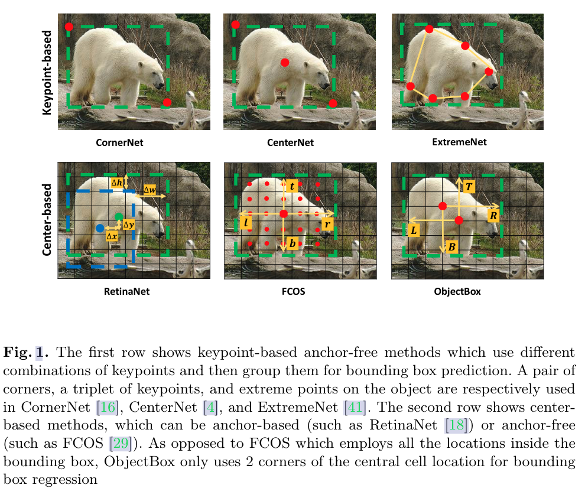
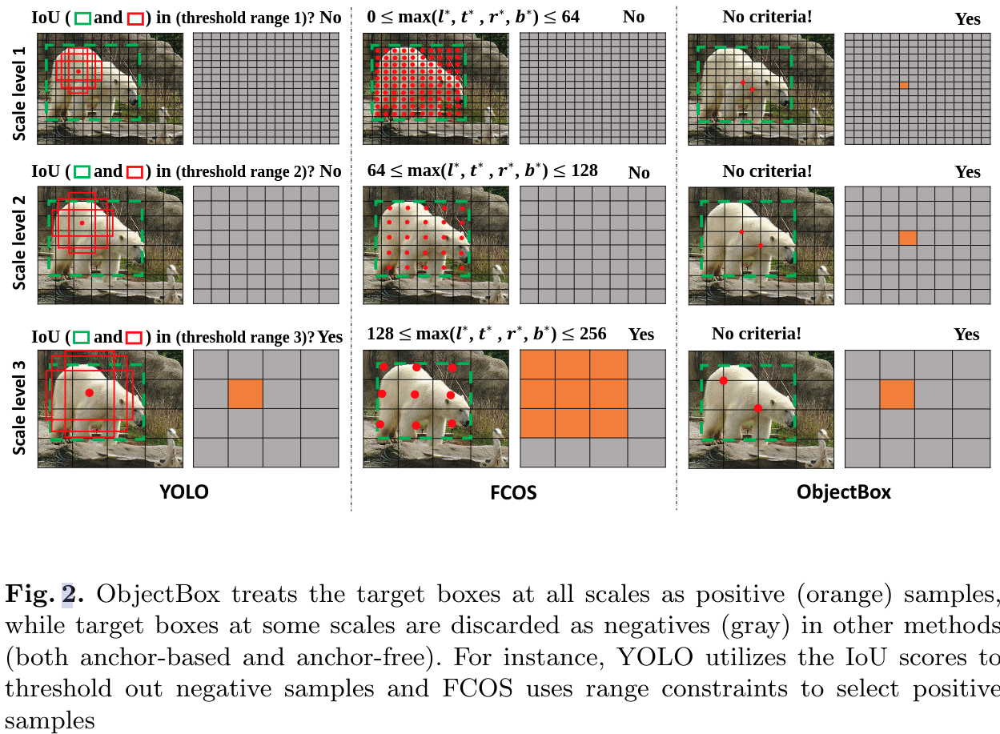

#目标检测 

#ECCV

[TOC]

# ObjectBox: From Centers to Boxes for Anchor-Free Object Detection
- 会议: [ECCV 2022 Oral](../../Tag/ECCV.md)
- 代码: <https://github.com/MohsenZand/ObjectBox>
- 论文: <https://readpaper.com/paper/707728013247815680>

## 摘要

本文提出 ObjectBox 方法,该方法是一个新颖的单阶段 anchor-free 且有很好泛化能力的目标检测算法.现有的 anchor-based 和 anchor-free 检测器通常在标签分配上偏向于特定的目标尺度,而本文算法仅使用目标中心区域作为正样本,且无视目标的大小和形状,对所有目标的不同层级特征都一视同仁.具体而言,本文的标签分配策略是将目标中心位置视为一个和形状大小无关的 anchor,并允许其在所有尺度的所有目标上都可以进行学习.为了支持这一点,我们将框的回归目标改为中心区域对角点到 bbox 4 个边界的距离 (中心区域左上点到 gt 框右下边距离,中心区域右下点到 gt 框左上边距离).此外,为了处理尺度不同的目标,我们还定制了一个 IoU Loss 来处理不同尺寸的框. 最终,我们的方法无需设置任何和数据集有关的超参数来进行跨数据集调优.我们使用了 MS-COCO 2017 和 PASCAL VOC 2012 来验证算法,并与 SOTA 的方法进行了横向对比.本文方法性能超出了以往方法.此外,我们还进行了严格的消融实验来验证本文方法不同模块的作用. 本文代码地址: <https://github.com/MohsenZand/ObjectBox>

## 1. 引言

现在的一些 SOTA 目标检测算法,无论是一阶段还是二阶段方法,都是先设定一些 bbox,然后从 bbox 中提取特征,标记目标类别.都是在共享的局部特征上进行边界框定位和分类任务.一种常见策略是在卷积特征图上使用手工设计的稠密 anchor 在共享的本地特征上生成丰富的候选框.基于目标和 anchor 之间的 IoU,这些 anchor 在尺寸和纵横比上和 GT 框分布一致.

由于 anchor-based 方法的巨大成功,这类方法一度成为目标检测的主导.但是该类方法依然存在大量缺点.第一,使用预定义的 anchor 会引入和特定尺寸纵横比相关的超参数,这会影响算法的泛化性能.第二, anchor 必须密集覆盖才能最大化 recall.但是实际覆盖在 GT 框上的仍旧是少数,这导致了正负样本的不平衡,且加到 了计算量.第三,anchor 的数量,尺寸,纵横比必须精心设计,这些参数会极大的影响性能.

为应对这些挑战,最近出现了一系列的 anchor-free 检测器,他们可以被分类成基于关键点和基于中心的两类方法.基于关键点的网络使用类似 HourglassNet 这类关键点估计网络来定位诸如中心点或者角点,然后通过点分组来框住目标.这类方法在得到点之后需要一个复杂的组合分组点的算法.而基于中心的方法则类似 anchor-based 方法,它们使用目标感兴趣区域或者是中心位置来定义正样本.不同之处在于, anchor-based 类方法使用的 anchor 来预定义这类中心位置的参考框, anchor-free 的方法则是直接在这些位置上回归 bbox (如图 1)

正如文献 37 所示, anchor-based 和 anchor-free 中基于中心方法最大的不同在于训练时正负样本的定义,这造成来性能瓶颈. anchor-based 方法使用 IoU 同时在空间和尺度上选择正负样本, anchor-free 方法则是通过一些空间或者尺度上约束,首先在空间维度上找到候选正样本,然后在尺度维度上筛选出最终的正样本.然而，两种静态策略都施加约束阈值来确定正样本和负样本之间的边界，忽略了对于不同大小、形状或遮挡条件的物体，最佳边界可能会有所不同的事实\[6\].文献 37,6,13 都提出来一些动态分配策略来应对这个问题.比如文献 37 中,根据一些统计指标来设定每个目标的正负样本分界.

本文提出放松所有的约束策略,无论是静态还是动态的,平等对待所有尺度上的所有目标.为了学到无视目标形状和尺度的分类标签和回归偏移,我们将目标中心位置视为是形状和大小无关的 anchors,仅从此处回归.为此,我们定义来新的回归目标,即包含目标中心的网络对角点到 bbox 的距离 (L,R,B,T 如图 1).图 2 展示了本文方法和其他方法在正负样本上的处理策略的不同,即,我们没有用什么花里胡哨 (any bells and whistles) 的方法来选取正样本 (其他都是通过设定策略阈值的方法).为能从所有尺度上学习正样本,我们提出来一种新的尺度不变的 IoU 衡量策略,它可以在不同尺度不同尺寸上对目标和预测框进行损失计算.

综上,本文提出了一个新的 anchor-free 检测器,它可以更好的处理标签分配问题,ObjectBox.本文方法即插即用且跨数据集时无需任何超参调整,且代码开源.

## 2. 相关工作
### 2.1. Anchor-based 检测器

# 有用的参考
1. <https://mp.weixin.qq.com/s/QLzg5fFcu87lLoPnlO_Lgw>
