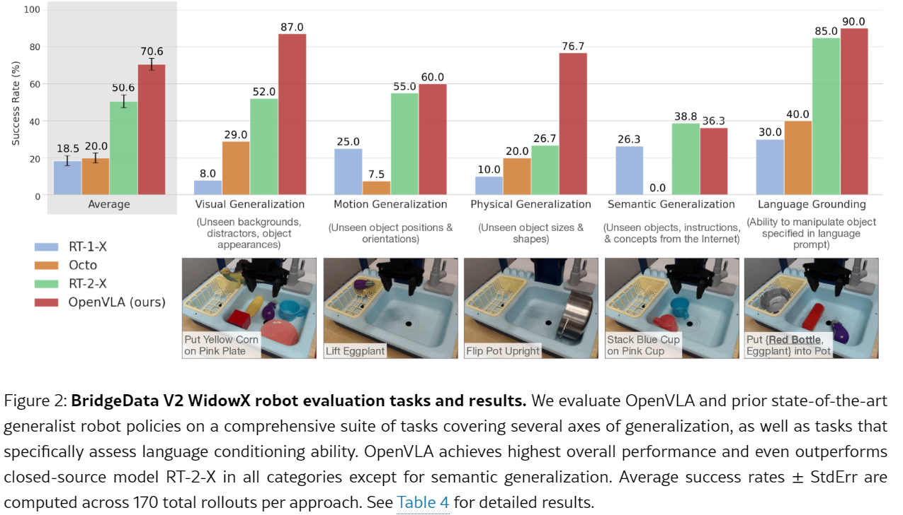
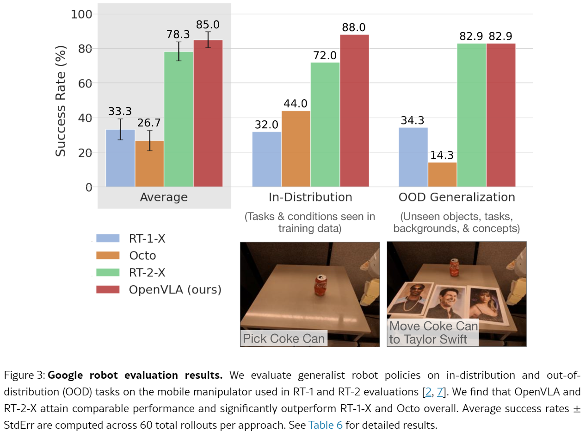
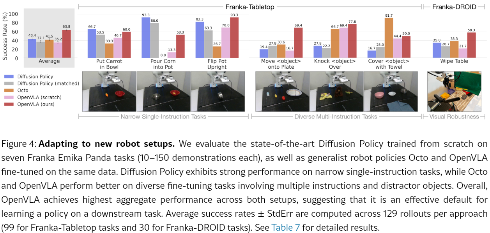
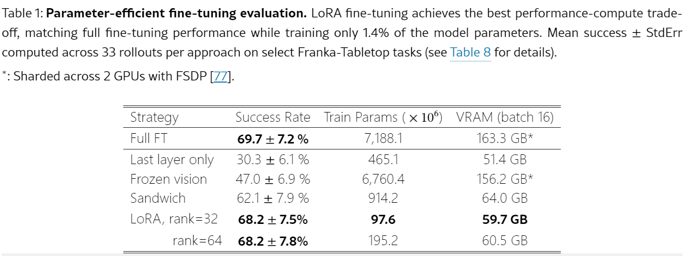
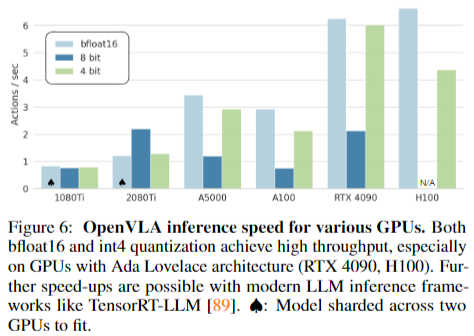
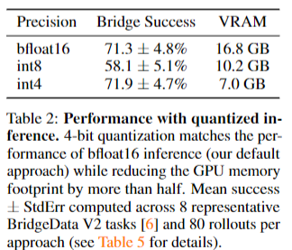
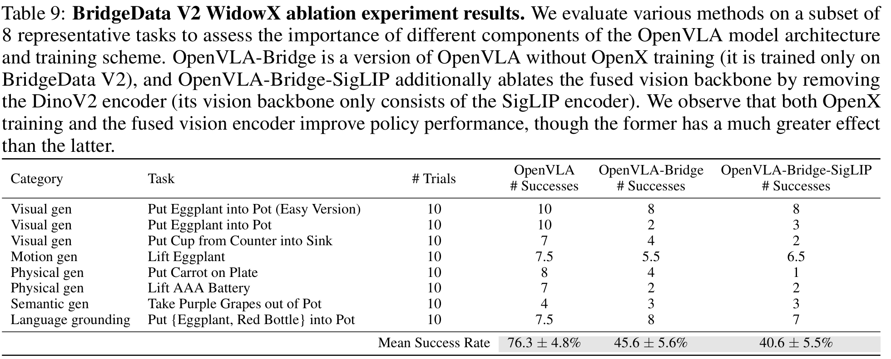
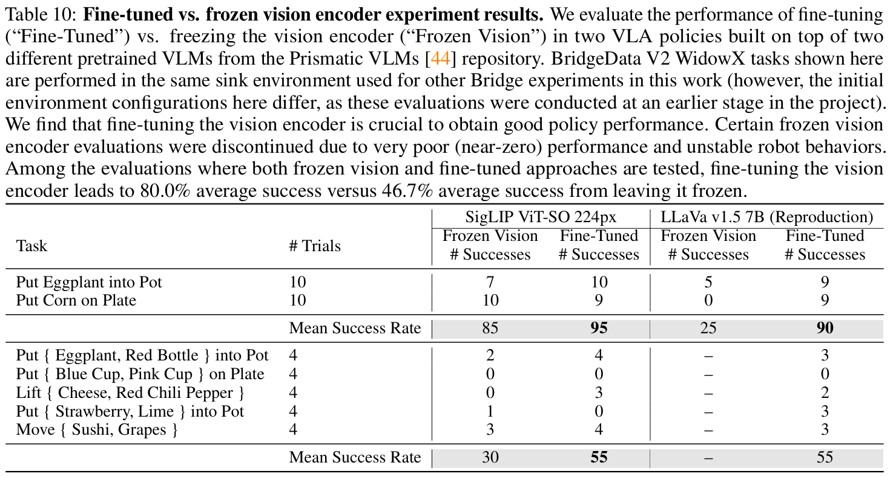
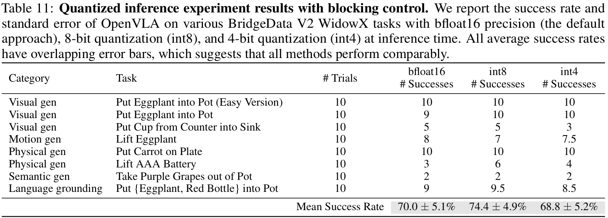

# # OpenVLA: An Open-Source Vision-Language-Action Model

[toc]

#具身智能  

- 论文： <https://arxiv.org/abs/2406.09246>
- 代码： <https://github.com/openvla/openvla>
- 相关衍生工作：
	-  <https://github.com/stanford-iliad/openvla-mini>
	- <https://github.com/moojink/openvla-oft>
	- [TraceVLA: Visual Trace Prompting Enhances Spatial-Temporal Awareness for Generalist Robotic Policies](https://tracevla.github.io/)

# 摘要

现有 VLA 有 2 个问题： 1. 都是闭源 2. 没有新任务的有效微调方法

我们开源了 OpenVLA，这是一个 7B 模型，在 970k 真实世界机器人演示合集中进行了训练。模型的语言编码使用 Llama2，视觉编码是预训练的 DINOv2 和 SigLIP 结合。

OpenVLA 在 29 个任务中比 RT-2-X 高 16.5%，参数仅其 1/7. 我们还发现 OpenVLA 可以用 LoRA 微调并量化，在消费级 GPU 上操作，下游任务成功率几乎不会掉点。

# 引言

最大的机器人操作数据集也只有 100k-1m 大小,难以像 VLM 那样使用大量数据端到端训练。PaLI 等工作将预训练的语言和视觉模型集成到表示学习中，作为任务规划模块，取得了令人印象深刻的稳健结果。但是依然存在两个关键原因阻碍了现在 VLA 的广泛应用：

1. 模型闭源 
2. 没有提供微调手段
为此，我们创建了 OpenVLA。我们在 WidowX 和 Google Robot embodiments 上的 29 个评估任务中进行了测试，成功率提高了 16.5%。我们发现 OpenVLA 的微调比微调预训练 Ocoto 要好。和使用 diffusion policies 的模仿学习从头训练相比，微调的 OpenVLA 在多个对象多个任务设置语言映射到动作上的任务表现更好。

# 2. 相关工作
## VLM

现在 VLM 都使用 patch 即 token 的范式。我们算法中使用的 DINOv2 的低级空间信息和 SigLIP 高级语义信息。

## Generalist Robot Policies

先前的工作比如 Octo，是直接将预训练的组件比如语言和视觉编码器和从头训练的附加模块缝合在一起。而 OpenVLA 更加端到端，直接使用 VLM 中的 token 来生成机器人动作.

## VLA 模型

原来一些工作是把 VLM 作为一个组件插入到整个 policy 架构中，这样不是端到端的。直接微调 VLM 输出动作的模型称为 VLA 模型，这样做有以下好处：

1. VLM 本身就可以将视觉和语言对齐
2. 它是通用架构，可以复用现代的 VLM 训练
3. 机器人容易从这些预训练工作中收益

但是现在 VLA 要么闭源，要么缺少有效微调手段，目前最好的工作是 RT-2-X。我们与其的不同是：

1. 通过强大的开源 VLM 主干和更加丰富的机器人预训练数据集想结合，我们的参数量比 RT2X 小很多
2. 我们做了很好的微调工作研究
3. 我们率先证明 VLA 的 PEFT 和量化有效性
4. OpenVLA 是第一个开源通才 VLA

# 3. OpenVLA 模型
## OpenVLA

这是一个在 Open X-Embodiment 数据上使用 970k 机器人演示进行训练的 VLA 模型。我们还研究了用于训练的最佳模型主干，数据集，超参等。

接下来我们首先概述 OpenVLA 的 VLM 架构，然后介绍我们的训练配方和数据集，介绍一些关键设计的思路，并提供一些用于训练和推理的基建的详细信息。

## 3.1 预备知识：VLM

常见 VLM 由三部分组成：

1. 视觉编码器：将图像编码成很多 patch 的嵌入
2. 投影层：将视觉编码器输出的嵌入映射到 LLM 的输入空间
3. LLM
本文将以 Prismatic-7B VLM 为基础，它包含一个 600M 的视觉编码器，一个 2 层 MLP 投影层，一个 7B 的 Llama2.注意这里的视觉编码器使用 SigLIP 和 DINOv2 两个模型，生成的图像嵌入按照通道层连接。Prismatic 这篇文章中已经证实了使用 DINOv2 的特征有助于改进空间推理。prismatic 将 LLaVA1.5 中 1M 的文本对数据和开源的纯文本数据来微调训练。

## 3.2 OpenVLA 训练过程

这里论文直接将机器人动作视为是一种语言，将输入的观察图像和自然语言指令直接映射为一连串的机器人动作。OpenVLA 使用末端执行器控制来表示动作，这是一个 7D 数组，最终 openvla 采用自回归的方式输出 7 个 token。然后通过动作解码器将每个 token 转换成 0~255 之间的一个 bin 索引，然后再通过 bin 所以通过缩放变成连续值。在实际训练时，我们取数据集中 7D 的每一维度的 1%~99% 数作为上下限（为了排除异常动作），然后离散化成 0~255 的 bin，每个 bin 对应 token 表中一个 token。

但是 Llama2 分词器只支持新加 100 个特殊 token,因此我们这里直接使用动作 token 替换分词器中使用最少的 256 个 token。并在新预测的动作标记上评估交叉熵损失。

## 3.3 训练数据 

这里我们使用 Open X-Embodiment 数据集，它包含 70 个独立机器人数据集，超过 200w 个机器人运动 trajectories。

我们希望数据集：

1. 所有训练数据集的输入和输出空间一致
2. 最终用于训练的数据中，机械臂的类型、要完成的任务以及所处的场景都能均衡搭配
为了实现第一个目标，按照参考文献 [1, 5] 的做法，只选择那些至少有一个第三人称视角摄像头，并且是用单臂末端执行器控制的机械臂操作数据集来进行训练。这就好比在一群工具里，只挑选符合特定标准的工具来教机械臂。对于第二个目标，利用 Octo（参考文献 [5] 中的方法）的数据混合权重，对通过第一轮筛选的数据集进行处理。Octo 会根据一些经验方法，减少那些不太多样的数据集的权重，或者直接去掉它们，同时增加任务和场景多样性大的数据集的权重。

## 3.4 OpenVLA 设计过程中的一些关键点决策思路

在进行最终模型训练之前，这里我们使用了 BridgeData V2 这种小数据集来训练评估 OpenVLA 模型。以下是一些经验总结：

**VLM 骨干：**  
除了 Prismatic，还测试了 IDEFICS-1 和 LLavA。后两者在之哟一个物体的场景中表现相当，但是若有多个物体，需要操作指令指定物体的场景，将 LLaVA 相比 IDEFICS-1 有更好的语言关联能力。而 Prismatic 在单物体，多物体语言关联任务中，成功率都比 LLaVA 高 10%。我们认为这受益于 SigLIP 和 DINOv2 主干带来的空间推理能力。  

**图像分辨率：**  
训练评估中我们测试了 224x224 和 384x384 图像，两者没有明显性能差异，但是后者的训练时间增加了 3 倍。目前我们没有在 VLA 中发现增加分辨率可以提高性能的现象。

**微调视觉编码器：**  
一般 VLM 训练过程中认为冻结视觉编码器可以保留其在大规模预训练中学到的稳健特征。**但是我们发现 VLA 训练时微调 VLM 对获得良好 VLA 性能至关重要**。我们推测，预训练的视觉骨干可能难以捕捉到场景中重要部分的足够细致的空间细节，以实现精确机器人控制。

**训练轮次：**  
一般 LLM 或 VLM 微调就 train 1~2 个 epoch。我们发现在 VLA 上，epoch 轮次要多得多，知道训练动作的 token 超过 95%。我们实验中最终训练遍历了数据集 27 次。

**学习率：**
发现了和 VLM 使用相同的固定学习率 2e-5 效果最佳，warmup 没有作用。

## 3.5 训练和推理基建  

在 64xA100 的 GPU 上训练了 14 天，花费 21500 个 A100 小时，batchsize2048.推理使用 bfloat16，需要 15GB 显存，在 4090 上运行效率约 6Hz（不做编译等一些加速技巧）。我们还开源了一个远程 VLA 推理服务端。

# 4 OpenVLA 代码

我们发布了 OpenVLA 代码库，支持从单 GPU 微调到多节点集群训练数十亿参数 VLA，支持 AMP，FlashAttention，FSDP 等，开箱即用。还支持和 HF 的 AutoModel 集成，支持 LoRA 微调和量化推理。

# 5 实验  

## 5.1 多机器人平台评估结果

定性看，RT-2-X 和 OpenVLA 的行为比其他测试模型更加稳定，比如存在干扰物时接近正确物体。附录 C 展示了我们对数据集的处理，附录 D 展示了 OpenVLA 各种组件的消融分析。附录 B 展示了不同实验中任务的详细分解和训练数据的不同之处。

## 5.2 新数据新机器人的可迁移性  

我们和 Diffusion Policy 进行了比较。还与 Octo 进行了比较。在图 4 中，单一指令任务（比如把胡罗卜放锅里和把玉米倒锅里）上，Diffsion Policy 和 Octo 还有 OpenVLA 差不多，但是当涉及到多个物体，语言条件更加复杂时，后两者更好。这是因为使用 OpenX 进行预训练的模型（Octo，OpenVLA）可以更好适应这些多样化的且需要语言定位的任务。我们在小数据集上从头训练的 OpenVLA 表现较差也佐证了这一点。

总体来说，OpenVLA 的平均性能最好，他是在所有测试中唯一能至少有 50% 成功率的方法，说明默认能力就很强，特别涉及多样化的语言指令时。但是对于更狭义且高度灵巧的任务，Diffsion Policy 有更加平滑和精确的轨迹。OpenVLA 如果加入动作分块和时间平滑（如 Diffsion Policy 中实现的），可能能达到同样灵敏度，这可能是未来的方向。（第 6 节，我们会对这个进行讨论）。

## 5.3 PEFT 微调

上面实验中，OpenVLA 全量微调使用了 8xA100 GPU，每个任务需要 5~15 小时（取决于数据集大小）。

这里 Last layer only 是仅微调 OpenVLA transformer 最后一层和 token embedding。Forzen vision 表示冻结视觉编码器。Sandwich 表示解冻视觉编码器，token embedding 和最后一层。LoRA 则应用于模型所有线性层。

推荐使用 r=32 的 LoRA，在单 A100 上花费 10~15 小时，相比全量微调计算量可以减少 8 倍。

## 5.4 量化实现高效推理

> 各种 GPU 上的 OpenVLA 推理速度。bfloat16 和 int4 量化都能实现高吞吐量，尤其是在具有 Ada Lovelace 架构的 GPU（RTX 4090，H100）上。使用现代的 LLM 推理框架（如 TensorRT-LLM）还可以进一步提高速度。 ♠ ：模型跨两个 GPU 划分以适应。

> 量化推理的性能。4 位量化与 bfloat16 推理（我们默认的方法）的性能相当，同时将 GPU 内存占用减少了超过一半。平均成功率 ± 标准误是在 8 个代表性 BridgeData V2 任务和每种方法 80 次滚出（详情参见表 5）上计算得出的。

8bit 量化掉点明显是因为量化引入的额外操作拖慢了效率，而 4bit 因为减少了 GPU 内存传输，补偿了量化开销。在 A5000 上，8bit 仅能以 1.2Hz 运行，在 BridgeData V2 任务中，和 5Hz 的非阻塞控制器相比，这显著和训练时的速率不同，改变了 system dynamic。而 4bit 则能以 3Hz 速度运行，更加接近数据采集时的 system dynamics。

# 6 讨论和局限

局限：

1. OpenVLA 目前仅支持单张图像观察
2. 推理吞吐量需要提高，在诸如 ALOHA（运行频率 50Hz）的高频控制设置可以支持。使用 Speculative Decoding 是一种潜在选择。
3. 性能存在进一步提升空间

另外还存在以下问题未能充分探索：

1. base VLM 的尺寸对 VLA 性能的影响
2. 使用机器人动作数据和大规模文本图像数据进行联合训练可否显著提高 VLA 性能
3. 哪些视觉特征最适合 VLA 模型

# 附录
## 附录 D 消融实验和额外实验
### D.1 OpenX 预训练消融

验证 OpenX 预训练对模型性能影响。

OpenVLA 是使用 OpenX 预训练之后，再在 BridgeData V2 上微调的。

OpenVLA-Bridge 是没有预训练，直接在 BridgeData V2 上 train 的。

OpenVLA-Bridge-SigLIP 是在 OpenVLA-Bridge 基础上，从视觉编码器中去掉了 DinoV2.

### D.2 单双视觉编码器对比

还是参照表格 9。DinoV2 中的低级空间特征似乎在某些情况下有助于泛化。

### D.3 解冻还是冻结视觉编码器

微调的平均成功率有 80.0%，而冻结平均成功率只有 46.7%。

### D.4 量化实验：分离策略性能和模型推理速度的影响
5.3 发现 8bit 量化掉点严重，推测是 8bit 量化中额外操作导致模型推理速度下降。因此这里再次在三个不同精度上评估了 OpenVLA，但加入了阻塞控制，换句话说，每个动作在策略预测下一个动作并由控制器执行之前，都会在机器人上完全执行。这种方案控制了具有不同延迟量的系统动力学，从而使我们能够测试策略动作预测的质量，而与其预测速度无关。实际上，具有更高吞吐量的精度级别（bfloat16 和 4 位量化）被迫运行得更慢，以匹配在 8 位精度下部署 OpenVLA 时观察到的动力学。因此，我们预计 OpenVLA 在 8 位精度下的性能将与 bfloat16 和 4 位精度在阻塞控制下的性能相匹配。

结果。表 11 显示了具有阻塞控制的量化推理实验结果。与表 2 不同，其中 8 位量化由于推理速度慢而导致最差的滚动性能，这里我们观察到，在采用阻塞控制以消除推理速度变化对任务性能影响的情况下，8 位量化与 bfloat16 精度和 4 位量化表现相当。这证实了我们在先前实验（使用非阻塞控制时）关于推理速度对 8 位量化性能影响的假设。我们还观察到，在最低精度 4 位的情况下，性能没有显著下降，如第 5.3 节所述。

