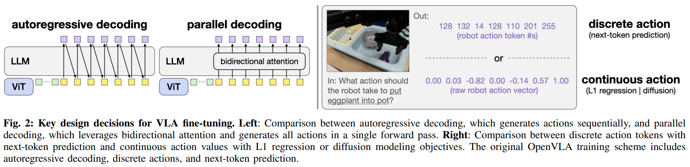
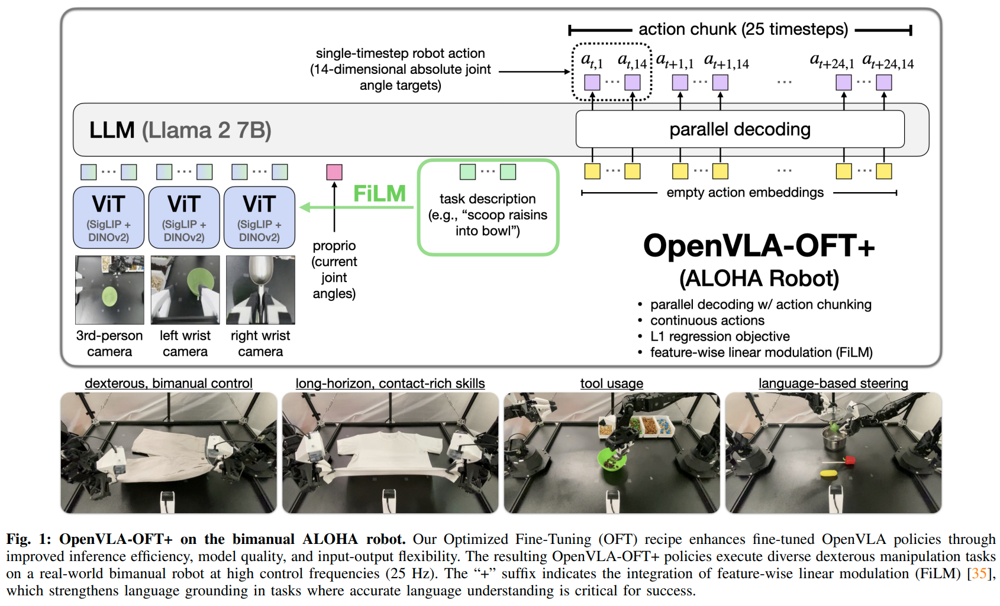
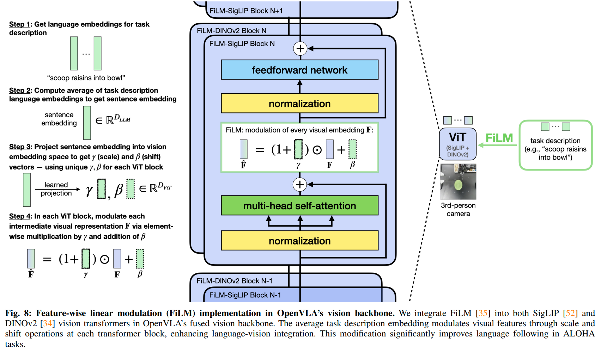
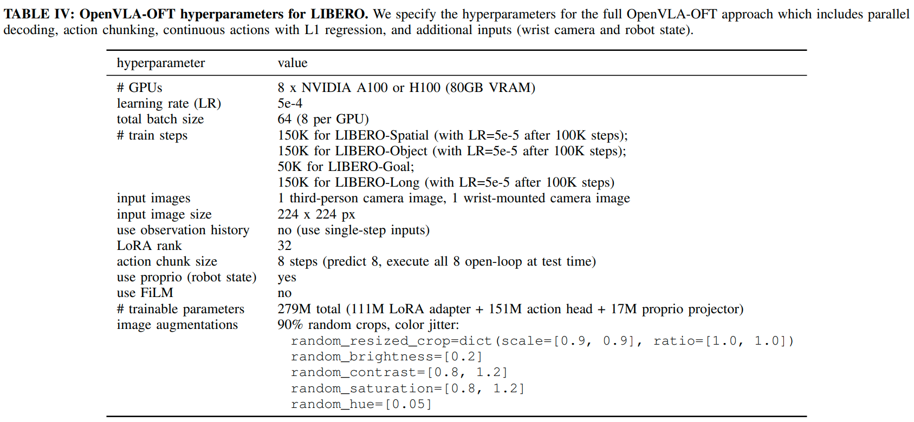
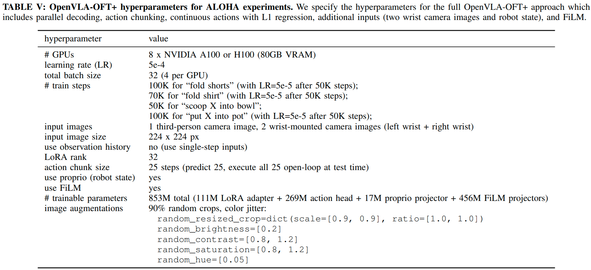

# Fine-Tuning Vision-Language-Action Models: Optimizing Speed and Success

#具身智能 

[toc]

- 论文：<https://arxiv.org/abs/2502.19645v1>
- 代码：<https://github.com/moojink/openvla-oft?tab=readme-ov-file>

## 摘要

在 OpenVLA 基础上进行了进一步研究，确定一些算法的可行策略。提出了一个优化微调版本（Optimized Fine-Tuning，OFT）。这个版本集成了并行解码（parallel decoding），动作分块（action chunking），连续动作表示（continuous action representation）以及使用 L1 损失作为回归目标。

## 1. 引言

现有工作的预训练配方并非最佳。LoRA 微调在双臂操作中表现不佳。使用 FAST 之类的动作分词（action tokenization）虽然可以实现 2~13hz 的速度提升，但是动作块之间的延迟依然很高。

针对以上问题，我们重点考量了以下三个关键设计：

1. 动作解码方案（涉及自回归和并行生成的对比）
2. 动作表示（涉及连续表示和离散表示的对比）
3. 学习目标（涉及 next-token 预测，L1 回归和 diffusion 的对比）

我们发现：

1. 并行解码结合动作分块可以提高推理效率，下游任务成功率也有所提高，模型的输入输出规格也可以更加灵活
2. 连续动作表示比离散表示更好
3. L1 回归和 diffusion 效果向东，但是收敛更快

基于以上发现，我们提出了 OpenVLA-OFT。

## 2. 相关工作

openvla 研究表明：LoRA 可以有效适应低频控制（<10Hz）的单臂机器人，但是他们没有扩展到高频（25~50）的双臂机器人。

使用向量量化（vector quantization）和离散预先变换可以比简单到按维度分 bin 方法，使用更少到 token 来表示动作片段（一系列的动作）。但我们将并行解码和动作分块进行结合，取得了更大到速度提升。

使用 diffusion 或者 flow matching 可以实现高频双手操作，但是训练慢。另外这些 diffusion VLA 在架构，学习方法，视觉语言融合以及输入输出格式上差异很大，哪些元素是性能影响最大仍不明朗。我们通过实验发现使用 L1 回归目标进行微调可以取得和这类复杂方法相近的结果。

## 3. 前置知识

OpenVLA 的架构细节见附录 A-A。OpenVLA 对于每个时间步，使用自回归的方式预测 7 个离散机器人动作 token（3 位置，3 姿态，1 夹爪），学习目标为 next token 到交叉熵。

动作分块是预测和执行一系列到未来动作，而无需中间规划，这在很多工作中已经被证明可以提高 policy 成功率。但是 OpenVLA 太慢了，它在 A100 上生成单时间步到动作需要 0.33 秒。对于 K 个时间步和 D 个动作 token，OpenVLA 需要进行 KD 次前项解码，若不进行分块，也需要 D 次解码。这显然没法进行高频操作。

## 4. VLA 微调的关键设计

使用基础模型进行自回归微调训练有两个大局限：1. 速度慢（3-5Hz） 2. 双臂上执行任务效果不行。

综上，我们研究了三个关键组件：

1. **动作生成策略：** 我们比较了自回归生成和并行解码，见图 2 左
2. **动作表示：** 我们对比了离散动作（进行 256-bin 的分块和归一化，然后通过 softmax 处理）和直接使用 MLP 生成连续动作。对于离散动作而言，语言模型解码的最终隐藏状态会被线性投影到 logits，然后通过 softmax 形成动作 token 的概率分布。而对于连续动作，隐藏状态则会直接通过一个单独到 MLP 映射到归一化到连续动作，如图 2 右。
3. **学习目标：** 我们对比 next-token 交叉熵，使用 L1 回归连续动作，以及使用条件去噪到 diffusion，如图 2 右。

本文使用了 OpenVLA 作为 base 模型，因为实验数据只有 500 个而预训练用了 1M 到数据，所以使用 LoRA 微调。

### 4-B 替代组件的实现
**并行解码和动作分块**  
为了使模型可以一次前传就输出一个完整动作，我们修改模型可以接受动作 query，使用双向注意力替换 causal 注意力掩码。假设动作为维度是 D，那么动作生成就从 D 次顺序遍历减少到了一次前传。

并行解码即对输入 query 进行分组。假设时间步数为 K，则模型一次前传输出 KD 个 token。理论上并行解码理论上不如自回归方法，但是在我们实验上，各种任务没有性能下降。

**连续动作表示**  
原始 OpenVLA 将每个动作数值归一化到\[-1,+1\],然后离散化到 256 个区间。这种方法无需对基础 VLM 进行架构修改，但是会牺牲动作精度。我们研究了源自模仿学习到两种连续动作表示：
1. 我们直接将解码器最终隐藏层通过 MLP 映射到连续动作值，学习目标使最小化预测动作和真实动作之间到 L1 损失。
2. 仿照 diffusion policy 使用条件去噪扩散建模。这种方法对于动作建模可能更具表现力，但是推理过程中仍需多次前传（本文扩散使用了 50 步）。

**扩展模型输入输出**  
原始 OpenVLA 处理单个摄像头。本文使用 OpenVLA 到双目视觉编码器，从每个视角图片中提取 256 维嵌入，然后通过共享到投影层将其都投影到语言嵌入空间。对于低维度的机器人状态（关节角度，夹爪状态），使用一个单独到投影层将这些信息也映射到相同到嵌入空间中。
接着把所有输入嵌入在 token 维度上进行链接。如图 1.

### 4-C 使用 FiLM 增强 OpenVLA-OFT 来提高语言定位效果

本文发现，在多视角的情况下，policy 不好正确关注语言指令。其次语言指令可能在任务特定时刻才很重要，比如把 X 舀入碗中，在抓取到勺子之后，语言指令才会更加重要。

**FiLM** 使用 FiLM 将语言嵌入融入到视觉表示中。我们发现对单个视觉嵌入进行调制（modulated）效果不好。因此我们对所有视觉嵌入都进行相应到 FiLM 处理。我们在视觉编码器到每个自注意力层之后和 FFN 之前使用 FiLM，并且每个块使用单独到投影层，如图 8.具体参见附录 A-C。

## 8. 局限  
**多种模式任务的处理**  
L1 回归鼓励 policy 学习演示动作中的中位模式来平滑训练演示中的动作噪声。但是若任务中有多个有效动作，它可能非最佳选择，使用基于 diffusion policy 的方法可能更好，但 diffusion policy 可能存在过度拟合训练数据中次优模式。

**预训练和微调**  
本文关注 VLA 在下游任务到微调。OFT 能否扩展到预训练，或者是否需要更有表现力的算法（如扩散模型）来进行大规模训练，需要进一步研究。

**语言 grounding 能力不好**
ALOHA 实验证明，OpenVLA 在没有 FiLM 到情况下，指令跟随很拉。但是在 LIBERO 中没有这个问题。差异的原因是否是预训练中缺乏双手数据，目前需要进一步研究。

## 附录 A 
### A-A 模型架构细节

基础模型是 OpenVLA，它输入处理单张第三人称图片和语言指令。dionv2 和 siglip 将图片变成 256 维嵌入，然后在 hidden dim 上拼接在投影到语言空间，接着在 token dim 上进行串联，一起送入 Llama-2，然后输出一个 7 维到机器人动作，它表示末端执行器到姿态变化，是经过离散化到动作 token。

**OpenVLA-OFT 的修改：**

1. 使用共享到 siglip-dinov2 处理多个输入图像（比如第三人称图像 + 手腕相机图像）
2. 使用两层 GELU 激活的 MLP 将机器人本体信息（robot proprioceptive）投影到语言嵌入空间 
3. 使用双向注意力替换因果注意力进行并行解码
4. 使用四层 MLP（ReLU 激活）替换语言模型解码器的输出层，使之直接输出连续动作的数值
5. 以动作块的形式输出，而非单步时间动作
6. 使用 FiLM 改善指令跟随性能（详细见附录 A-C）

### A-B 实现细节
### A-B1 并行解码实现  

原始 OpenVLA 自回归训练方案中，最初使用右移一位的 GT action token 作为输入，然后使用因果注意力来自回归。测试时，每个预测的 token 都被作为下一个预测的输入。  
OFT 中我们使用空的动作嵌入作为 query 输入，这些空到动作嵌入仅在位置编码上有不同。然后本文使用双向注意力掩码。  

### A-B2 连续动作表示  

本文直接对动作分布进行建模，不进行离散化。大致细节如下：

**L1 回归：**  动作头是 4 层 ReLU MLP，直接把 llama-2 解码器到最终隐藏层状态映射到连续动作。

**Diffusion：** 

- 使用 DDIM 采样，扩散 50 步
- 遵循 ALOHA 和 diffusion policy 中设置，使用了 squared cosine beta schedule
- 噪声预测使用 4 层 MLP，和 L1 回归头一致。

### A-B3 输入细节

使用 siglip-dinov2，对每张输入图像进行处理，得到 256 维的 patch embeddings，然后使用 3 层 GELU-MLP 将其投影到语言嵌入空间。机器人本体信息使用 2 层 GELU-MLP 投影。

### A-C FiLM 细节

### A-D OpenVLA-OFT 超参和训练细节

LIBERO 训练细节。

ALOHA 训练细节。

