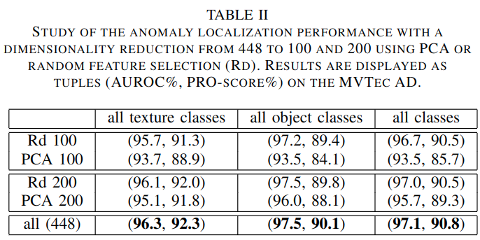

#异常检测

[toc]

# PaDiM: a Patch Distribution Modeling Framework for Anomaly Detection and Localization
- 论文: https://arxiv.org/pdf/2011.08785
- code: https://github.com/xiahaifeng1995/PaDiM-Anomaly-Detection-Localization-master

## 摘要
PaDiM 使用于预先训练的 CNN 来进行分块嵌入,然后使用多元高斯分布来得到正常类别的概率表示.此外,还利用了 CNN 不同层的语义来更高的定位缺陷.

## 引言
本文提出的方法 PaDiM 利用预训练的 CNN 来提取图片特征,并遵循以下连个规则:
- 每个 patch 位置都使用一个多元高斯分布来表示
- 考虑不同层之间语义的相关关系

## 相关工作
异常检查方法大致可以分为重建的方法和嵌入向量相似性的方法.  
**重建类方法:** 重建类方法最简单的方式是将重构误差作为异常分数来进行异常检测,当然,也有很多更加复杂高端的方法.这类方法虽然富有可解释性和符合直觉,但是生成模型有时对异常区域也能较好的重建导致其有时失灵.

**嵌入向量相似性方法:** 主体思想是使用神经网络来提取有意义的向量来表示整张或局部图片用以异常检测.这类方法可解释性差,难以明确分出究竟是哪一部分的图像会造成高的异常分.这类方法通常使用测试图片的嵌入表示向量和代表正常训练集的参考向量之间的距离作为异常分数.正常的参考向量可以被视为是一个包含了所有正常图片嵌入表示的球形空间的中心.(即这一族数据的中心.)  
SPADE 在整个正常嵌入空间上直接跑来一个 KNN ,取得来不错的效果,不过计算量和数据集大小成正比,显然是不太实用的.

## 模型方法
  

说白了,取最大特征图上的一点上的特征,顺次高层特征图上对应点的特征取出,然后将这所有的特征向量拼接在一起,作为这点的特征向量,那么这个点上有 N 个特征向量, N 为训练集大小, 假设 N 个特征向量服从正态分布,那么把这个正态分布的期望和标准差就作为这个点的最终正常特征.
推理时,将待测图片也计算出特征向量,然后根据马氏距离计算每个点的差异,得到最终的缺陷值.

一些有趣的点:
1. 构建嵌入特征的时候,实际上特征图的通道上依然有很多冗余信息,作者发现使用 PCA 降维不如使用随机选择= =|||.
2. 在计算某点的特征的正态分布时,协方差矩阵的计算使用添加来一个正则项 $\epsilon I$ 来保证 协方差矩阵是满秩且可逆的.具体计算公式如下:
$$
\Sigma_{ij} = \frac{1}{N-1} \sum_{k=1}^N (x_{ij}^k- \mu_{ij})(x_{ij}^k- \mu_{ij})^T + \epsilon I   \tag{1}
$$
实际中 $\epsilon = 0.01$
3. 马氏距离计算方式:
$$
M(x_{ij})=\sqrt{(x_{ij}-\mu_{ij})^T \Sigma_{ij}^{-1} (x_{ij}-\mu_{ij})}   \tag{2}
$$

## 实验
### 数据集构建
对于 MVTec AD 使用了 (-10,+10) 的随机旋转和随机裁剪来得到训练和测试集

### 模型使用
尝试了 ResNet18, Wide ResNet-50-2 和 EfficientNet-B5.  
对于 ResNet 系的,选取来前三个block?作为嵌入向量.
对于 EfficientNet-B5,取来7,20,26层作为嵌入向量.

### 对比实验设置
和 SPADE 比较的时候,是将图片先缩放到 256x256 大小然后用中心裁剪到 224x224.最后对于定位图和图片使用双线性插值+高斯模糊,高斯模糊 $\sigma=4$.
和 VAE 比较时.使用了的训练数据增强是随机转 $\pm 2$,然后缩放到292大小,然后随机裁剪到282大小,然后使用中心裁剪到256大小.使用 Adam 优化,初始学习率为 $10^{-4}$, batch 大小是32.

## 结论
### 消融实验
**层间的融合**:   
其实就是验证单单使用一层特征和每层都用,但是是相加的,以及使用拼接的效果,效果如图:  

**降维方法**:
两个结论:  
1. 随机选取比PCA好
2. 随机选取200维减到100维似乎影响并不大

