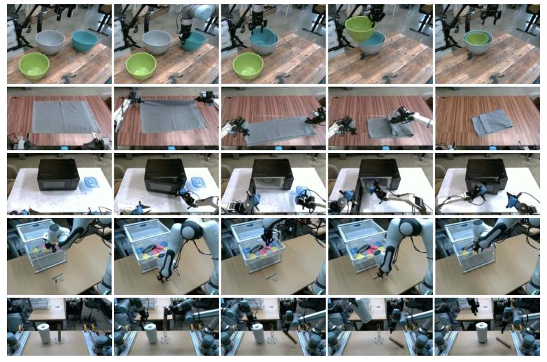
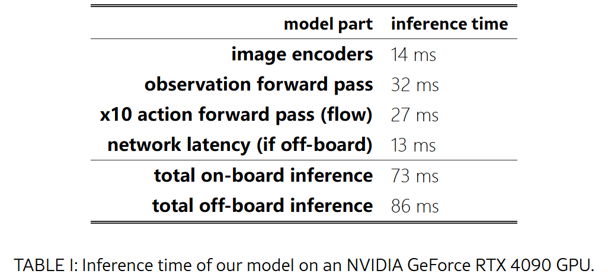

# Pi0: A Vision-Language-Action Flow Model for General Robot Control
- 会议：[[2410.24164v3] $π_0$: A Vision-Language-Action Flow Model for General Robot Control](https://arxiv.org/abs/2410.24164v3)
- 代码：
	- [Physical-Intelligence/openpi](https://github.com/Physical-Intelligence/openpi)
	- [allenzren/open-pi-zero: Re-implementation of pi0 vision-language-action (VLA) model from Physical Intelligence](https://github.com/allenzren/open-pi-zero)
	- [lucidrains/pi-zero-pytorch: Implementation of π₀, the robotic foundation model architecture proposed by Physical Intelligence](https://github.com/lucidrains/pi-zero-pytorch)

## 摘要

提出了一种基于预训练的 VLM 的 flow matching 架构，可以继承互联网规模训练的指示。

## 1. 引言

VLM 从大规模互联网数据进行训练，然后使用精选数据集微调激发需要的行为和响应模式，这种模式以被证明可以激发人工智能的多功能性。但是这种模型不是处在真正物理世界中，它们对世界的物理交互理解是基于抽象描述的，我们认为人工智能要能像人类那样进行物理操作，模型需要使用物理位置数据来 train。

开发通才机器人 policy 面临三个挑战：

1. 需要非常大规模的预训练
2. 模型架构应可以有效利用各种数据源，能够理解各种和物理场景互动所需的复杂行为
3. 有正确的训练配方，**这个最重要**

基于以上问题，我们提出了 $\Pi_0$。我们从一个预训练的 VLM 来构建模型，采用跨实体训练。并为了能够执行复杂和高度灵活的任务，采用了一种动作分块架构，使用流匹配来表示复杂的连续动作分布。

我们先使用一个很大且多样的语料库进行预训练，然后在精选数据上微调，以诱导出期望的行为模式。在高质量数据上训练并不能教会模型如何从错误中恢复，因为这类数据中错误很少见。使用低质量预训练数据则不能教会模型如何高效稳健的行动。我们使用两者的结合，期望得到以下结果：模型尽可能的像高质量数据的方式进行行动，但是仍然保有一系列恢复和纠正错误的手段。

我们使用了超过 10000 小时的机器人数据集进行预训练。

> 图 1：我们的通才机器人策略使用预先训练的视觉语言模型 （VLM） 主干，以及具有各种灵巧作任务的多样化交叉实施数据集。该模型通过添加单独的动作专家来适应机器人控制，该专家通过流程匹配产生连续动作，从而实现精确和流畅的作技能。然后，该模型可以直接用于根据提示执行任务，或根据高质量数据进行微调，以实现复杂的多阶段任务，例如折叠多件衣物或组装盒子。

## 2. 相关工作

> 图 3：我们的框架概述。我们从预训练混合物开始，它由我们自己的灵巧作数据集和开源数据组成。我们使用这种混合物来训练我们的流程匹配 VLA 模型，该模型由一个较大的 VLM 主干和一个较小的动作专家组成，用于处理机器人状态和动作。VLM 主干权重是从 PaliGemma [5] 初始化的，提供了从大规模 Internet 预训练中学到的表示。由此产生的 $\pi_{0}$ 模型可用于控制具有不同动作空间的多个机器人实施例，以完成各种任务。

最近的一些 VLA 工作采用自回归方法，使用离散化的 token 来表示动作，类似文本 token 的处理方法。相比之下，我们使用了流匹配来输出动作。这是的我们可以进行高频动作。

我们还用了一个大约 10000 小时的演示的数据集，辅以 OXE 数据集来进行预训练。

## 3. 概述 

预训练阶段我们使用了自己组合的一个数据集，其包含 7 种不同机器人，68 个不同任务。然后我们还往里添加了整个 OXE 数据集。

我们使用了 PaliGemma VLM，因为其尺寸小，便于实时控制。

## 4. Pi_0 模型

pi0 模型架构如图 3 所示，采用 late fusion 的 VLM，即通过图像编码将机器人图像嵌入到语言嵌入空间中。然后我们进一步还往里面添加了机器人本体状态（proprioceptive state）和机器人动作。然后我们使用条件流匹配（conditional flow matching）模型来建模机器人动作的连续分布。整个架构受 Transfusion 启发，使用多个目标函数来训练单个 Transformer。在其基础上我们发现使用单独权重来处理机器人的动作和状态 token 可以提升性能，即第一个权重来处理图像和文本输入，第二个权重用来处理机器人的特定输入输出（机器人本体状态和动作）。我们吧第二个权重称为动作专家（action expert）。

数学形式上，我们需要建模的数据分布为 $p(A_t \mid o_t)$，其中 $\mathbf{A}_t = [\mathbf{a}_t, \mathbf{a}_{t+1}, \ldots, \mathbf{a}_{t+H-1}]$ 对应于未来动作的动作块（本文中 H=50），$o_t$ 代表观察（observation）。观察信息由多张 RGB 图像，语言指令，机器人本地状态组成，用数学形式表示为 $\mathbf{o}_t = [\mathbf{I}_t^1, \ldots, \mathbf{I}_t^n, \ell_t, \mathbf{q}_t]$，$\mathbf{I}_t^i$ 第 t 个时间步的第 i 张图像（每个机器人输入 2 或 3 个图像），$\ell_t$ 是语言 token 的序列，$\mathbf{q}_t$ 是关节角度的嵌入。图像和关节角度都通过对应的编码器进行编码，然后经过线性投影层投影到和语言 token 相同的嵌入空间。

对于动作块 $A_t$ 中每个动作 $a_t$，我们都设定一个对应的动作 token 作为动作专家的输入。训练时，我们使用条件流匹配损失，公式如下：

$$
L^\tau(\theta) = \mathbb{E}_{p(\mathbf{A}_t \mid \mathbf{o}_t), q(\mathbf{A}_t^\tau \mid \mathbf{A}_t)} \left[ \left\| \mathbf{v}_\theta(\mathbf{A}_t^\tau, \mathbf{o}_t) - \mathbf{u}(\mathbf{A}_t^\tau \mid \mathbf{A}_t) \right\|^2 \right]
$$

这里下标为机器人时间步长，上标是流匹配时间步长，$\tau in \[0,1\]$。在实践中，网络先进行随机噪声采样 $\epsilon \sim \mathcal{N}(0, \mathbf{I})$,计算出“噪声动作”$\mathbf{A}_t^\tau = \tau \mathbf{A}_t + (1 - \tau) \epsilon$,然后训练网络预测需要去除的噪声 $\mathbf{v}_\theta(\mathbf{A}_t^\tau, \mathbf{o}_t)$，该预测的 GT 为 $\mathbf{u}(\mathbf{A}_t^\tau \mid \mathbf{A}_t) = \epsilon - \mathbf{A}_t$ （去噪矢量场，denoising vector filed）。这里动作专家网络使用双向注意力掩码。其中流匹配时间步长 $\tau$ 是从 beta 分布中采样的。更多细节参见附录 A-B。

推理时，通过从 $\tau=0$ 到 $\tau=1$ 积分学习到的向量场来生成动作，起点时随机噪声 $\mathbf{A}_t^0 \sim \mathcal{N}(\mathbf{0}, \mathbf{I})$,使用欧拉积分规则生成，其公式如下：  

$$
\mathbf{A}_t^{\tau + \delta} = \mathbf{A}_t^\tau + \delta \mathbf{v}_\theta(\mathbf{A}_t^\tau, \mathbf{o}_t)
$$

$\delta$ 为积分步长。本文实验中 $\delta=0.1$ 即 10 个积分步长。这里可以对观察 $o_t$ 进行 KV 缓存，可以高效推理。更多细节参见附录 A-D。

**非 VLM 基线模型：** 我们还 train 了一个 $\Pi_0 - small$ 模型,有 470M 的参数，没有使用 VLM 初始化，用来消融评价引入 VLM 的好处，详情见附录 A-C。

## 5. 数据收集和训练方案

预训练数据应该多样化（质量较低），可以使模型从错误中恢复并处理更加多样化的情况。而后训练数据应该涵盖有利于有效执行任务的行为，且这些行为应该是一致且流畅的，使得模型可以熟练流畅执行下游任务。

### 5-A 预训练和后训练

> 图 4：数据集概述：预训练混合数据集由 OXE 的子集和 π 数据集组成。我们使用 OXE 的一个子集，我们称之为 OXE Magic Soup 。右图说明了预训练混合数据集中不同数据集的权重。左图说明了通过步数测量的相对大小。

这里由于每个训练示例都是一个动作时间步长 $(\mathbf{o}_t, \mathbf{A}_t)$，所以我们用时间步长来量化数据。训练的混合数据中，开源数据占比 9.1%，包括 OXE，Bridge v2 和 DROID。这些数据通过有 1~2 个摄像头，控制频率在 2~10Hz，涵盖了广泛的对象和环境。另外我们还使用了 903M 时间步自己的数据，其中 106M 是单臂机器人，797M 是双臂机器人，包含 68 个任务，且这些任务由一系列复杂行为组成，比如分拣任务等等。以往工作任务的定义通常比较简单，使用名词和动词的组合，比如拿起被子。但是我们这些复杂任务的行为范围远比以往工作任务要复杂，涵盖的动作更多。

另外由于不同数据集在大小上存在不平衡，我们采用 $n^{0.43}$ 的系数来对任务和机器人组合进行加权，其中 n 为样本梳理。配置向量 (configuration vector ) $q_t$ 和动作向量 $a_t$ 的维度和数据集中机器人的最大维度相同（本文实验中为 18，可以容纳两个 6 自由度手臂，2 个夹具，一个移动地盘和一个垂直驱动的躯干）。对于不满足的机器人，我们在配置向量和动作向量上进行零填充。对于图像少于三张的机器人，我们还会 mask 掉缺失的图像槽位。

后训练阶段，我们使用较小任务数据集微调模型，使之适应特定下游应用。这里我们的任务定义很广泛，比如 “bussing” 这个任务需要操作多种不同物体。不同任务需要的数据集不同，最简单任务只需要 5 小时的数据，而最复杂任务则需要 100 小时甚至更多。

### 5-B 高层任务分解策略

对于一些复杂任务，比如餐桌清理，需要语义推理和高级策略，也可以通过将高级任务（如“清理餐桌”）拆解为子任务（如“拿起餐巾”，“将餐巾扔进垃圾桶”）来优化。第 6 节中，我们将使用这种高级策略来协助我们的模型。

### 5-C 机器人系统细节

- UR5e. 一种配备平行夹爪的机械臂，带有手腕式和肩上式摄像头，总共提供两个摄像头图像和一个 7 维配置和动作空间。
- 双手操作 UR5e。两个 UR5e 配置，总共三个相机图像和一个 14 维配置和动作空间。
- Franka。Franka 配置有两个相机和一个 8 维配置和动作空间。
- 双手操作 Trossen。此配置基于 ALOHA 配置 ，包含两个 6 自由度 Trossen ViperX 机械臂，配备两个手腕相机和底座相机，以及一个 14 维配置和动作空间。
- 双臂 ARX 与双臂 AgileX。该配置使用两个 6 自由度臂，支持 ARX 或 AgileX 臂，配备三个摄像头（两个腕部和一个底座）以及 14 维配置和动作空间。这一类别包括两个不同的平台，但我们将它们归为一类，因为它们的运动学特性相似。
- 移动 Trossen 与移动 ARX。该配置基于 Mobile ALOHA 平台，在移动基座上安装了两个 6 自由度臂，这些臂可以是 ARX 臂或 Trossen ViperX 臂。非完整基座增加了两个动作维度，形成一个 14 维配置和 16 维动作空间。有两个手腕相机和一个基座相机。这一类别包含两个不同的平台，但我们将它们归为一类，因为它们的运动学特性相似。
- 移动 Fibocom。在完整基座上安装了两个 6 自由度 ARX 臂。基座增加了三个动作维度（两个用于平移，一个用于方向），形成一个 14 维配置和 17 维动作空间。

## 6. 实验

### 6-A 基础模型评估

> 图 6： 开箱即用的评估任务： 为了评估我们的基础模型，我们在预训练后运行五个任务：衬衫折叠、轻松巴士、努力巴士、杂货店装袋和烤面包机吐司。这些任务需要灵巧的作、多阶段行为和语义识别的组合。

> 图 7：开箱即用的评估结果：我们评估了 $\pi_{0}$ 训练了完整的 700k 步，训练了 160k 步的版本与基线模型的更新数量相匹配， $\pi_{0}$ -small 的更新数量，以及三个基线：OpenVLA 和 Octo 训练了我们的所有数据，OpenVLA 仅训练了 UR5e 任务（我们发现 UR5e 任务效果更好）。在所有任务和所有比较中，即使是我们模型的 “parity” 版本也优于所有基线，并且我们模型的完整版本以很大的优势取得了最佳结果。

这里我们没有进行任何后训练，仅使用预训练模型。以下是任务的简介：

- 叠短袖：机器人必须将一件开始时平整的 T 恤折叠起来。
- 清洁桌子简易版：机器人需要清洁一张桌子，将垃圾放入垃圾桶，将餐具放入餐具盒。得分表示正确放置到指定容器中的物体数量。
- 清洁桌子困难版：比清洁任务更难的版本，有更多物体和更具挑战性的配置，例如故意放在垃圾物体上的餐具，相互遮挡的物体，以及一些不在预训练数据集中的物体。
- 打包购物：机器人必须将所有购物物品打包，如薯片、棉花糖和猫粮。
- 取出烤面包：机器人从烤面包机中取出烤面包。

其中 parity 版本训练了 160k 步，主模型训练 700k 步，OpenVLA 训练 160K，Octo 训练 320K。

评估指标使用 10 个回合的评价标准化分数，分数为 1 代表完全成功，部分成功获得部分分数，具体评分标准参见附录 A-E。

### 6-B 指令跟随实验

> 图 8：语言评估任务。在 3 个不同的语言条件下评估我们的模型，每个任务都需要遵循一系列中间语言命令。任务包括将餐桌（顶部）中的盘子放入垃圾桶，将垃圾放入垃圾箱。摆放餐桌（中部）通过从垃圾桶中取出物品。以及打包购物袋（底部）。

本组实验旨在验证 VLM 预训练对指令跟随的提升程度，注意本组实验没有控制模型参数这个变量，$\pi_0$-small 显然是一个更小的模型。本次实验中每个完整任务由多个语言指令组成，每个语言指令包括捡起物体和放置物体的到特定位置，其标记的片段长度约 2 秒。这些任务包括：

- 清洁桌子（Bussing）：机器人必须清洁一张桌子，将餐具和刀叉放入垃圾桶，将垃圾放入垃圾箱。
- 摆放餐具（Table setting）：机器人必须从垃圾桶中取出物品来摆放餐桌，包括餐垫、餐具、银器、餐巾和杯子，并按照语言指令进行调整。
- 超市购物打包（Grocery bagging）：机器人必须将咖啡豆、大麦、棉花糖、海藻、杏仁、意大利面和罐头等杂货物品装入袋子中。

我们评估了五种语言条件。

- $\pi_0$ -flat/ $\pi_0$ -small-flat: 直接使用任务描述（如“把杂货装进袋子”），不适用中间语言命令。
- $\pi_0$ -human / $\pi_0$ -small-human：使用人类编写的中间步骤指令（如”把 XX 物体放置到哪“）。
- $\pi_0$-HL：使用 VLM 生成高级指令，没有人类介入。

> 图 9：语言评估。我们比较了只接收整体任务命令（例如，“把杂货装进袋”）的“flat”版本的 policy， −𝚏𝚕𝚊𝚝 ，与接收来自人类专家的中间命令的方法， −𝚑𝚞𝚖𝚊𝚗 ，或高级 VLM policy， −𝙷𝙻 。我们还比较了在“专家”条件下，我们的模型与一个小型非 VLM 变体， π0 和 π0 -small，在语言遵循准确性方面的表现。结果显示，通过人类专家提供的中间语言命令以及在一定程度上由自主高级 policy 提供的命令， π0 ，有显著改进。值得注意的是，由于 π0 -small 的语言遵循能力有限，总体上，它并没有因为添加高级专家而获得收益。

### 6-C 学习新任务

> 图 10：微调评估任务：我们将模型微调到一系列与预训练任务不同的下游任务。我们的任务代表了从预训练任务到各种相似度的范围，包括与预训练任务最相似的任务（堆叠碗和折叠毛巾），引入了一个未见的新元素（微波炉）的任务，以及需要新的动作和新物体类型（物品归入抽屉和纸巾更换）的任务。

以下是本节任务的具体描述：

- UR5e 堆叠碗 (UR5e stack bowls)。这项任务需要堆叠碗，共有四种不同大小的碗。由于这项任务需要抓取和移动碗，类似于预训练数据中的摆桌任务，因此我们将其归入“简单”级别。训练数据包含各种碗，评估时使用的是已见和未见碗的混合。
- 毛巾折叠 (Towel folding)。这项任务需要折叠毛巾。由于这与衬衫折叠类似，而衬衫折叠在预训练中已经存在，所以我们将其归入“简单”级别。
- 微波保鲜盒 (Tupperware in microwave)。这项任务需要打开微波炉，将塑料容器放入其中，然后关闭。容器有不同形状和颜色，评估使用的是已见和未见容器的混合。容器操作与预训练数据相似，但微波炉不在预训练中出现。
- 换纸巾 (Paper towel replacement)。这项任务需要从支架中取出旧的纸盒纸巾筒，并用新的纸巾卷替换。由于在预训练中没有找到此类物品，我们认为这是“困难的”。
- Franka 东西放抽屉（Franka items in drawer）。这个任务需要打开抽屉，将物品装入抽屉，并关闭它。由于在预训练中没有与 Franka 机器人类似的任务，我们将其视为“困难”。

我们对比了 Octo，ACT 和 Diffusion Policy，这些模型都使用 OXE 上的公开预训练权重微调， $\pi_0$ 使用我们的基础预训练模型进行微调。

> 图 11：使用不同数据量的微调。 π0 即使使用较小的数据量也能学习一些较简单的任务，并且与从头开始训练的模型相比，预训练模型通常能获得更大的改进。

### 6-D 精通多阶段复杂任务

> 图 12：我们评估了一系列复杂且时间跨度较长的任务。这包括：从垃圾桶中折叠衣物（使用静止（a）或移动（b）机器人），清理真实午餐餐桌（c），组装盒子（d），将鸡蛋装箱（e），以及将食物装进外卖盒（f）。这些任务需要结合数十种单个行为，如抓取、堆叠、折叠和压平，以及将一般化应用于大量不同的物体配置，以及复杂的物理属性，如可变形物体或柔性纸板。

本节，我们采用微调和语言结合的方式来处理具有挑战性的多阶段任务。这些任务一部分在预训练中存在，但是需要微调效果才好。一些则完全不在预训练中。本节涉及的任务包括：

- 洗衣折叠：这项任务需要一个静态（非移动）的双手系统来折叠衣物。衣物物品开始于一个箱子中的随机皱褶状态，目标是取出物品，折叠它，并将其放置在先前折叠物品的堆叠上。皱褶衣物的随机初始配置提出了一个主要挑战，因为策略需要泛化到任何配置。这项任务存在于预训练中。
- 移动洗衣：在此，图 5 中的 Fibocom 移动机器人在折叠衣物时，需要控制方向和平移，面临许多相同的挑战。这项任务存在于预训练中。
- 干衣机整理：在这里，Fibocom 移动机器人需要将衣物从干衣机中取出并放入洗衣篮中。这项任务包含在预训练中。
- 桌面清理：这项任务要求在杂乱场景中清理一个包含各种新颖物品的桌子，比我们基准测试中的任务更具挑战性：策略必须泛化到未见过的形状和大小各异的物体，并执行复杂的灵巧动作，例如扭曲夹爪以拾取大盘子，并小心地抓取薄而精致的物品，如玻璃杯。机器人必须处理密集的杂乱物品，并智能地排序各种行为——例如，为了清理盘子上的垃圾，它必须首先拿起盘子，然后将垃圾抖入到垃圾桶中，然后将盘子放入垃圾桶。这项任务不包含在预训练中。
- 箱子组装：机器人需要组装一个从平整状态开始的纸箱。这项任务面临许多重大挑战：箱子需要弯曲成正确的形状，机器人需要在折叠时夹住箱子的某些部分，同时利用双臂和桌面表面作为支撑。机器人可能需要重试一些折叠，需要反应灵敏和智能的策略。这项任务在预训练中不存在。
- 打包盒子：这项任务需要将几个食物从盘子里移动到带走盒中，需要将物品打包进盒子里，确保它们不会突出，然后用双臂关闭盒子。这项任务在预训练中不存在。
- 打包鸡蛋：机器人需要从碗中取出六个鸡蛋，并将它们装入鸡蛋托盘，然后关闭托盘。需要以适合鸡蛋在碗中的姿态的方式握住鸡蛋，然后将它们放入托盘的开放槽中。由于鸡蛋的形状、滑腻和需要小心放置，这提出了挑战。关闭盒子需要使用双臂。这项任务在预训练中不存在。  

> 图 13：在复杂任务上的训练后结果，以 10 次试验的平均分数表示。完整的预训练模型在所有任务中达到超过 50% 的最大分数，并且通常优于消融版本，特别是在最困难的任务上取得了显著的改进。

## 7. 总结展望

普遍认为，这些模型中的大部分“知识”都是在预训练阶段获得的，而后训练阶段的作用是告诉模型如何利用这些知识来满足用户命令。我们的实验表明，类似的现象可能在机器人基础模型中发生，其中预训练模型具有一定的零样本能力，但像洗衣这样的复杂任务需要使用高质量数据进行微调。仅使用这些高质量数据进行训练会导致模型脆弱，无法可靠地从错误中恢复，而在零样本下运行预训练模型并不总是展现出后训练数据中演示的流畅策略。  

局限：

1. 预训练数据的配比权衡值得进一步研究
2. 目前并非所有评估任务都能可靠执行，具体还需要多少和怎样类型的数据才能达到可靠水平暂不清楚
3. 不同任务和不同机器人数据究竟各带来多少增益并不清楚

## 附录 A  
### A-B 模型架构细节

**额外输入输出**
标准的 PaliGemma 架构接收一系列图像 $[\mathbf{I}_t^1, …, \mathbf{I}_t^n]$，随后是语言提示 $\ell_t$。我们添加一个机器人本体感觉状态的输入 $\mathbf{q}_t$，该状态通过线性投影映射到 Transformer 嵌入维度。最终的输入标记集对应于噪声动作块 $\mathbf{A}_t^\tau = [\mathbf{a}_t^\tau, …, \mathbf{a}_{t+H-1}^\tau]$，标记数量等于动作范围（$H = 50$ 为我们的任务）。我们仅使用与 $H$ 噪声动作对应的 Transformer 输出，这些输出通过线性投影解码为 $\mathbf{y}_\phi(\mathbf{A}_t^\tau, \mathbf{q}_t)$。

**引入流匹配时间步**  
噪声动作块 $\mathbf{A}_t^\tau$ 通过包含流匹配时间步 $\tau$ 的多层感知器（MLP）映射到变换器的嵌入维度。对于每个噪声动作 $\mathbf{a}_t^\tau$ ，输入到变换器中的对应嵌入的表达式为 $W_3 \cdot \text{swish}(W_2 \cdot \text{concat}(W_1 \cdot \mathbf{a}_t^\tau, \phi(\tau)))$ ，其中 $\phi: \mathbb{R} \to \mathbb{R}^w$ 是正弦位置编码函数， $W_1 \in \mathbb{R}^{w \times d}$ ， $W_2 \in \mathbb{R}^{w \times 2w}$ ， $W_3 \in \mathbb{R}^{w \times w}$ ， $d$ 是动作维度， $w$ 是动作专家的嵌入维度（或宽度）。

**注意力掩码**
$\pi_0$ 使用具有 3 个块的块状因果注意力掩码： $[\mathbf{I}_t^1, …, \mathbf{I}_t^n, \ell_t]$ 、 $[\mathbf{q}_t]$ 和 $[\mathbf{a}_t^\tau, …, \mathbf{a}_{t+H-1}^\tau]$ 。在每个块内，存在完全双向注意力，而每个块中的标记不能关注未来块中的标记。第一个块包括来自 PaliGemma 的 VLM 预训练的输入模态，这些模态被阻止关注未来块（包括新输入），以最小化从该预训练中的分布偏移。机器人状态 $\mathbf{q}_t$ 是它自己的块，因为它不会随着每个流匹配集成步骤而改变；阻止它关注最终块允许其相应的键和值在采样期间被缓存。最后一个块对应于噪声动作 $\mathbf{A}_t^\tau$ ，它可以关注完整的输入序列。

**动作专家** 
$\pi_0$ 实现为一个单变压器，具有两组权重（也称为专家），其中每个标记被路由到其中一个专家；权重仅通过变压器的自注意力层进行交互。图像和语言提示 $[\mathbf{I}_t^1, …, \mathbf{I}_t^n, \ell_t]$ 被路由到更大的 VLM 主干，我们从 PaliGemma 初始化它。在 VLM 预训练期间未见到的输入 $[\mathbf{q}_t, \mathbf{A}_t^\tau]$ 被路由到动作专家。PaliGemma 基于 Gemma 2B[49] 语言模型，该模型使用多查询注意力 [44] 和配置 {width=2048, depth=18, mlp_dim=16384, num_heads=18, num_kv_heads=1, head_dim=256}。由于专家仅在自注意力层中交互，因此专家之间的宽度和 mlp_dim 不一定需要匹配。为了加快推理（需要动作专家的多次前向传递），我们将动作专家缩小到 {width=1024, mlp_dim=4096}，从而参数数量为 ~ 300M。

**采样流匹配时间步**  
原始的流匹配论文 [28, 32] 从均匀分布中采样流匹配时间步：$\tau \sim \mathcal{U}(0, 1)$。Esser 等人 [14] 则提出从对数正态分布中采样，强调中间时间步；作者认为，在高时间步（低噪声水平）时，模型只需要学习恒等函数，而在低时间步（高噪声水平）时，模型只需要学习数据分布的均值。然而，我们假设动作预测的任务与高分辨率图像合成有所不同——虽然根据文本标签预测均值图像可能相对容易，但根据机器人观察（即学习 $\mathbb{E}[\mathbf{A}_t \mid \mathbf{o}_t]$）预测均值动作是一个更难的问题；这是因为观察 $\mathbf{o}_t$ 非常具有信息性，它应该比文本标签对可能动作分布的约束更大。因此，我们设计了一个强调低时间步长（高噪声水平）的时间步长采样分布；此外，由于只要积分步长 $\delta$ 大于 $1 - s$，就不需要超过给定阈值 $s$ 的时间步长，因此根本不进行采样。该分布由 $p(\tau) = \text{Beta}\left(\frac{s - \tau}{s}; 1.5, 1\right)$ 给出，并在图 14 中进行了可视化。在我们的实验中，我们使用 $s = 0.999$，这允许进行 $\delta > \frac{1}{1000}$，或最多 1,000 次积分步长。

> 图 14：流匹配时间步长采样分布。我们从强调较低时间步长（对应于更嘈杂的动作）的偏移 beta 分布中采样 $\tau$ ，并且不会采样超过截止值 $s$ 的时间步长。在我们的实验中，我们使用 $s = 0.999$ 。
> 

### A-D 推理细节

回忆一下，我们的模型接受观察 $\mathbf{o}_t = [\mathbf{I}_t^1, …, \mathbf{I}_t^n, \ell_t, \mathbf{q}_t]$ 和噪声动作 $\mathbf{A}_t^\tau$ ，并输出需要积分以获得下一个匹配步骤的向量场 $\mathbf{v}_t^\tau$ 。每次我们预测一个新的动作块 $\mathbf{A}_t$ ，我们必须对每个图像 $\mathbf{I}_t^1, …, \mathbf{I}_t^n$ 进行编码，对对应的标记 $\mathbf{o}_t$ 执行正向传递，然后运行 10 步的流匹配，其中每一步都需要对对应的标记 $\mathbf{A}_t^\tau$ （与 $\mathbf{o}_t$ 对应的键和值）

由于模型一次生成一个 $H$ 步动作块，我们可以在再次运行推理之前执行多达 $H$ 个动作。然而，我们可能比这更频繁地运行推理，并且可以使用各种聚合策略将来自不同推理调用的动作结合起来。我们早期尝试了时间集成，发现它损害了策略性能，所以我们选择不聚合动作，而是开环执行动作块。对于 20Hz 的 UR5e 和 Franka 机器人，我们在执行 16 个动作后每 0.8 秒运行一次推理，而对于所有其他以 50Hz 运行的机器人，我们在执行 25 个动作后每 0.5 秒运行一次推理。

