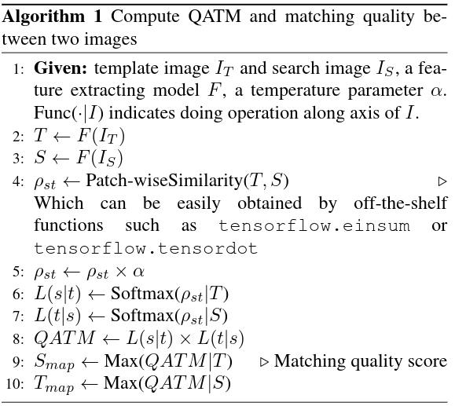
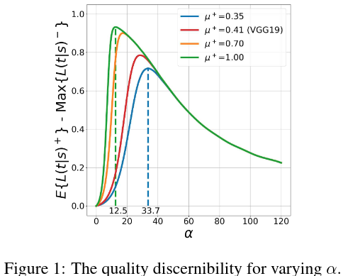

#模板匹配

[TOC]

# QATM: Quality-Aware Template Matching For Deep Learning

- 论文: <https://arxiv.org/abs/1903.07254>
- code:
	- <https://colab.research.google.com/drive/1PS5pNAkpeZMHLN3GJFblzWLgZEWyE52r?usp=sharing>
	-  <https://github.com/kamata1729/QATM\_pytorch.git>

## 摘要

我们提出的 QATM 是可训练的,可以轻易插入其他深度学习网络.我们评价匹配对的质量 ( quality ) 是使用软排名,因此针对不同的匹配场景,比如 1 对 1,1 对 N,N 对 N,这个 quality 的值是不同的.和传统方法的对比实验显示了, QATM SOTA.

## 1. 引言

经典的匹配方法是计算平方差值和或者是归一化互相关系数,这些方法对非刚性变化,遮挡,颜色漂移不鲁棒.  
基于深度学习的方法常常是简单的使用张量点乘 ( numpy.tensordot ).    
而本文提出的 QATM 则可以像一般模板匹配方法那样使用,而且可以用于其他深度网络中.它将考虑匹配的唯一性而不仅仅是匹配分数.

章节 2 讨论了 QATM 的思路.章节 3 将 QATM 和经典模板匹配方法比较.章节 4 将其应用到语义图像对齐和图像到 GPS 验证的问题.章节 5 展望.

## 2. Quality-Aware Template Matching
### 2.1. 动机

在很多视觉任务中,其实都或多或少的使用了模板匹配.无视各个领域算法细节,我们这里仅仅讨论一般的模板匹配.   
一个已知的问题是,在多数 TM 任务里,模板图的所有像素或者特征以及目标图片的候选框都被考虑在内.但这在很多情况下是不可取的,因为模板图片和目标图片之间的背景可能不相同.为了克服这个问题,BBS 通过最近邻域匹配 ( NN ) 的方法使得背景像素在匹配中不起作用.在 BBS 之上,DDIS 在 NN 区域添加额外变形信息来提升匹配性能.  
与以往工作不同,我们考虑了 5 种不同的 TM 场景,如表 1.  
   
设定 t 表示模板图像 T, s 表示搜索图像 S. 1-to-1 表示完全匹配, 1-to-N 和 M-to-1 表示 s 或 t 中存在相似的图像块 (比如内容是天空或者地毯,那么图像块都是相似的), M-to-N 表示 s 和 t 中都有很多相似的图像块.在这四种匹配上的情景中,只有 1-to-1 匹配上是高质量的.因为其他三种情况下,就算匹配上的对有很高相似度,但是依然存在很多匹配候选,这表明匹配对的独一性就没有那么强了.   
显然, 1-to-1 匹配是最重要, not-matching 是最没用的.因此对各种匹配情况进行定理评价.那么通过寻找最大化的所有匹配模式下的最大质量,就可以找到 S 上的最佳匹配区域.公式 1 展示了我们如何对匹配对进行定量评估

$$
R^*=arg max \{ \sum_{r \in R}max \{ Quality(r,t)|t \in T \} \}  \tag{1}
$$

这里 S 中 能使整体匹配质量最大化的 区域 R 就是最佳匹配区域. R 是固定尺寸大小的候选窗,实验中,我们将使用 object 的大小作为候选框.

### 2.2. 具体方法

在 TM 任务中使用公式 1,我们需要定义 s 和 t 之间的质量 Quality(s,t).后续章节中,我们将引出质量感知的模板匹配度量方法 (QATM),这是 Quality(s,t) 的一个代理函数.  
设 $f_s$ 和 $f_t$ 分别为图像片 $s$ 和 $t$ 的特征图, $\rho( \cdot )$ 表示两个图片的相似度.给定搜索图片 $s$,那么模板图片 $t$ 满足下列条件则是可匹配上的:

$$
L(t|s)=\frac { exp\{\alpha \cdot \rho(f_t,f_s)\} } { \sum_{t^{'} \in T} exp \{\alpha \cdot \rho(f_{t^{'}},f_s) \}}     \tag{2}
$$  

这里 $\alpha$ 是一个正值,作用待会讨论.这个似然函数 (公式 2) 可以视为模板 $t$ 和所有匹配图像块匹配日质量的一个软排序.其实就是一个带了一个可学习参数的 softmax.这里可学习参数就是 $\alpha$.  
然后我们这里简单的将 QATM 度量定义为 $s$ 匹配到 $T$ 和 $t$ 匹配到 $S$ 似然函数的乘积:   

$$
QATM(s,t)=L(t|s) \cdot L(s|t)
$$

对于相似度 $\rho( \cdot )$,当 $f_t$ 和 $f_s$ 相似的时候应该尽量高. 表 2 展示了各种情形下,匹配分数的理想值.   
     
ROI $s$ 的匹配质量定义如公式 4:  

$$
q(s)=max \{ QATM(s,t)|t \in T \}   \tag{4}
$$

$q( \cdot )$ 即为匹配质量函数.那么最佳匹配的区域 $R^*$ 即为最大匹配分数处:

$$
R^*=arg max \{ \sum_{r \in R}  q(r) \}     \tag{5}
$$

### 2.3. 将 QATM 作为一个神经网络层  

这里 QATM 显然是连续可导的,且所有的操作都可以在任意 DNN 框架中找到. 

Alg 1 显示了整个算法流程.  
   
示例中,我们使用余弦相似度作为图像块之间的相似度,`tf.einsum` 可以批量计算所有图像块的相似度,即第 4 行.  

### 2.4. $\alpha$ 的一些讨论  

本节,我们将讨论如何在不训练 DNN,而直接进行模板匹配时,$\alpha$ 应该如何旋转.而后我们将展示, QTAM 将可以轻易的作为一个可训练的层嵌入到一般的网络中,根据任务进行模板匹配而无需收到调整结果.   
$\alpha$ 的两个目的:  
(1) 使得匹配块的分数尽量接近 1  
(2) 不匹配的分数块尽量接近 0   
依据公式 6,可以推知 $\alpha$ 的选择如下:

$$
\alpha^* = argmax_{\alpha>0} \{ L(t|s)^+ - L(t|s)^- \}  \tag{6}
$$  

然而实际上,手动设置 $\alpha$ 是很难的.若是知道分布,那么我们可以模拟 $L(t|s)^+$ 和 $L(t|s)^-$   
图 1 显示了 $\alpha$ 和 $E[L(t|s)^+]-max \{ L(t|s)^- \}$ 的关系.当特征取自 DNN 且相似度取余弦相似度,此图是具有参考价值的.文献 37 显示了对于不匹配的图像对,其余弦相似度分数分布符合期望 0 方差 $1/d$,$d$ 是特征维度数.通过图可知,$\alpha$ 取值在 [12.5,33.7] 都是相对合理的.     
     

 
## 3. QATM	的模板匹配性能  
### 3.1. 实验设置  

通过一个 `NeuralNetQATM` 层,我们可以得到一个关于待查图片 S 的匹配分数图. `NeuralNetQATM` 层的输入是待查图片 $I_s$ 和模板图片 $I_T$.根据公式 5,我们可以得到 S 的最佳匹配区域.   
 测试数据集选的是 OTB,特征取自预训练的 ImageNet-VGG19,维度是 320.使用 IoU 和 AUC 来评价.对比算法选的 BBS, DDIS, CoTM,以及使用 SSD 和 NCC 的经典模板匹配方法.     

    
### 3.2. OTB 上的性能  

实验中设置 $\alpha=28.4$.具体结果见图 2  
     

  
### 3.3. 在魔改 OTB 上的性能  

因为标准 OTB 不包含任何的负样本.因此我们创建了一个魔改的 OTB 数据集.对于 OTB 中每一对 S 和 T,正样本对不变,依然使用 (S,T),但是负样本,我们将 T 换成其他一个 OTB 视频中的 T,这样得到一个负样本对.具体结果见图 2c.    

  
### 3.4. 讨论  

略  

  
## 4. 可学习的 QATM 性能 

本章,我们将聚焦分析,将 QATM 作为一个可微可学习的网络层插入到模板匹配应用中的性能.      

### 4.1. 用于图像 GPS 验证 (IGV) 的 QATM   


  
# 个人总结
## 存在问题

以往模板匹配方法不是很好.

## 问题分析

略

## 论文解法

先将模板图片 T 和待查图片 I 分别过一个特征提取器,原始实现使用 VGG19 提取第二层和第 17 层特征线性插值之后 concate 到一起.

将 T 和 I 在每个通道上对整张特征图进行标准化,即在 w,h 上进行标准化.然后将 T 和 I 在空间维度上两两计算余弦相似度.得到一个 $B, I_h,I_w,T_h,T_w$ 的张量 C,将这个张量送到真正的 QATM 模块.

将张量 C reshap 成 $B,I_h*I_w,T_h*T_w$ ,然后在将其各减去 $I$ 中最大值和 $T$ 得到张量 $C_I,C_T$,然后对 $C_I,C_T$ 分别在维度 1 和 2 上求 softmax,两者相乘之后开方作为初步置信图.

然后我们取 $I$ 每个点最大的分数作为 其分数,得到最终置信图.

具体 QATM 模块实现代码如下:

```python
class QATM():
    def __init__(self, alpha):
        self.alpha = alpha

    def __call__(self, x):
        batch_size, ref_row, ref_col, qry_row, qry_col = x.size()
        x = x.view(batch_size, ref_row*ref_col, qry_row*qry_col)
        xm_ref = x - torch.max(x, dim=1, keepdim=True)[0]
        xm_qry = x - torch.max(x, dim=2, keepdim=True)[0]
        confidence = torch.sqrt(F.softmax(self.alpha*xm_ref, dim=1) * F.softmax(self.alpha * xm_qry, dim=2))
        # ind3 表示了 ref 每个点 和它最匹配的qry点的索引
        conf_values, ind3 = torch.topk(confidence, 1)
        ind1, ind2 = torch.meshgrid(torch.arange(batch_size), torch.arange(ref_row*ref_col))
        ind1 = ind1.flatten()
        ind2 = ind2.flatten()
        ind3 = ind3.flatten()
        if x.is_cuda:
            ind1 = ind1.cuda()
            ind2 = ind2.cuda()

        values = confidence[ind1, ind2, ind3]
        values = torch.reshape(values, [batch_size, ref_row, ref_col, 1])
        return values
    def compute_output_shape( self, input_shape ):
        bs, H, W, _, _ = input_shape
        return (bs, H, W, 1)
```

将 QATM 的分数图缩放然后归一化取对数就可以用了.

## 最终效果

## 其他细节

## 启示
