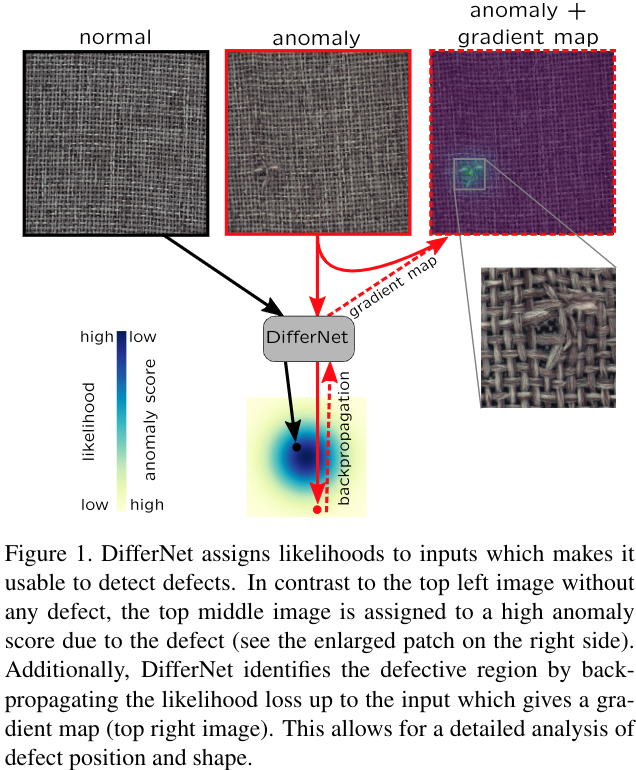
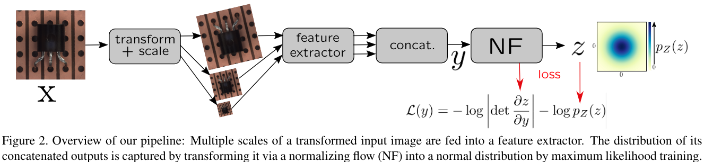

#异常检测 

[toc]

# Same Same But DifferNet: Semi-Supervised Defect Detection with Normalizing Flows
- 会议: WACV 2021
- 代码: <https://github.com/marco-rudolph/differnet>
- 论文: <https://arxiv.org/abs/2008.12577v1>

## 摘要

本文提出了 DifferNet: 该网络使用 CNN 提取特征,使用 normalizing flows 来估计特征密度. normalizing flows 可以很好的处理低位数据分布,但是对于类似图片这种高维数据不是很好.为此,我们使用的多尺度特征提取,使得 normalizing flow 来对图片输出概率.基于此,我们设计了异常分数来进行异常检测.将分数映射回图像,就可以得到缺陷的定位.同时为了提高鲁班性和性能,我们在训练和测试过程中还使用来各种转换.相比其他方法,我们不需要大规模的训练样本,甚至 16 张图片就可以 work 了.最后实验证明 SOTA.

## 1. 引言  

工业中缺陷检测难点再与,缺陷没有先验知识甚至没有缺陷样本可用.因此我们使用了一个半监督的方法,即在训练中仅仅使用正样本.   

一些传统的缺陷检测方法适用于类间方差大的数据,它们并不能较好的捕捉到微小的缺陷.针对这个问题,我们的解决方法是对卷积神经网络特征进行精确的密度估计.正确样本的特征分布描述是通过对潜空间使用 normalizing flow 来得到的. 类似变分自编码器, GAN 等生成模型,它们会建立其特征空间和潜空间之间的一一映射.图 1 显示了本文方法的核心思想,常见的样本分配高的似然,不常见样本分配低似然.由于缺陷在训练中几乎从未出现过,因此将它们分配一个低似然.我们使用了多尺度输入来进一步提高特征提取器的鲁棒新.为了使得异常分数更有意义,我们对似然进行了一些变换.由于特征提取器的有效性和我们对图片的变换,我们的结果 SOTA.

本文贡献:

- 通过对多尺度图像特征使用 normalizing flows 和多种变换得到似然,进而进行异常检测.
- 定位异常无需训练标签
- 在小的训练集上也可以 work
- 结果 SOTA
- 有代码

## 2. 相关工作
### 2.1. 异常检测

现有的异常检测方法可以大致分为生成模型和预训练模型两种.我们聚焦于异常检测而非异常定位.

#### 2.1.1. 使用预训练模型检测

介绍了一些相关工作,这里略过.  

总之以上工作仅仅能够检测一些特定类别的缺陷.本文方法不仅 SOTA, 还可以计算梯度,通过梯度来获得异常分数图.

#### 2.1.2. 生成模型

类似变分自编码器,GAN 等生成模型利用不存在训练集中的异常样本无法重建生成来进行异常检测.  

基于自编码器的方法通过对比输出和输入来进行异常检测,重建误差大的视为异常.但是很多时候会失败,因为自编码器的泛化能力太强,一些异常也可以被较好的重建.

基于 GAN 的方法假设只有正样本可以被生成.介绍了一些工作,这里略.

我们对生成模型可以适用于各种场景表示质疑,因为这类方法强烈依赖异常类型.比如,异常区域的大小和结构都会强烈影响异常分数.若感兴趣区域是一个高频结构,那么它们难以被精确表征.一些特定结构对重建误差的影响通常大于异常.相比之下,本文方法可以处理更多缺陷类型且无需大量的训练样本.

### 2.2. Normalizing Flows

Normalizing Flows (NF) 是一种可以较好的学习到数据分布和定义好的密度之间转换的神经网络.这种学习到的映射是一一对应且求值方向是双向的.首先,它们给给定样本分配一个似然,然后通过从已经建模的分布中采样来生成数据.通过堆叠自回归或固定的仿射变换层来确保一一对应性.一个常见的自回归流是 MADE,它利用贝叶斯链式法则来分解面密度.这些模型可以学习到一个由大量小图片组成的大型数据的分布.相比之下,我们尝试以较高分辨率来捕捉少量图片的分布.自回归流计算似然很快,但是采样慢.而 Kingma et al. 提出的反转自回归流则显现出了相反的特性. Real-NVP 可以被视为是一个特殊的简化的反转自回归流,它的前馈和反传都很快.类似 Ardizzone et al. 提出的可逆神经网络,我们在 Real-NVP 的仿射变换层中引入了一种参数化的夹逼机制来得到更加稳定的训练过程.详细细节见 3.1 节.

Normalizing Flows 在视觉数据上进行异常检测是首创的工作.

## 3. 方法
