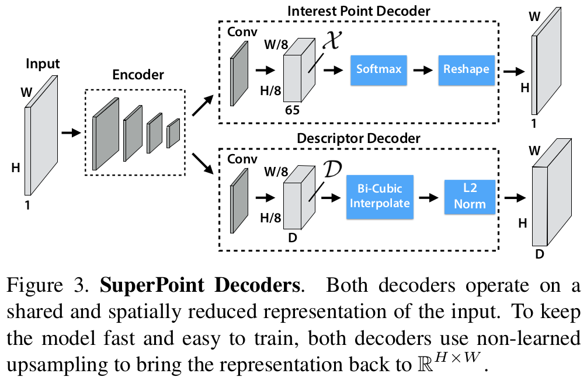
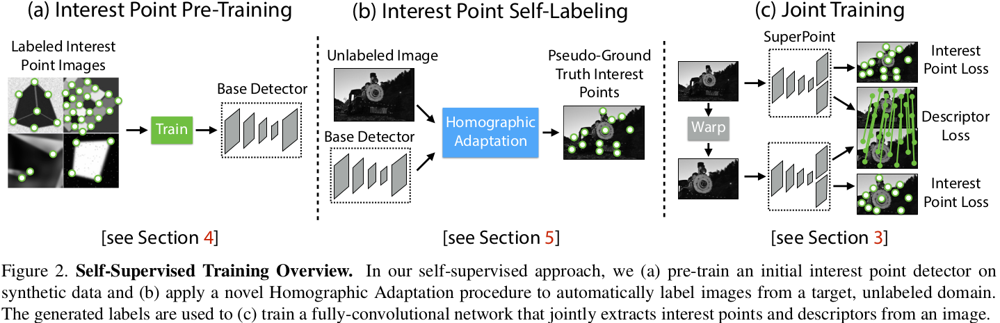
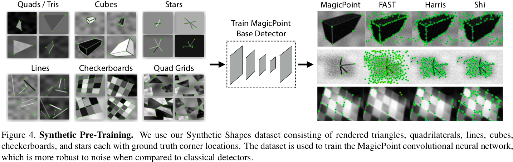
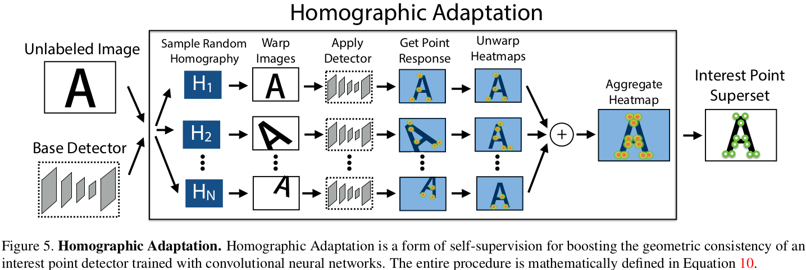

#自监督 

#图像配准 

#单应性估计 

[toc]

# SuperPoint: Self-Supervised Interest Point Detection and Description

## 论文和代码
- 论文: <https://arxiv.org/abs/1712.07629>
- 代码: <https://github.com/magicleap/SuperPointPretrainedNetwork>

## 摘要

提出一个了用于多视角几何匹配的自监督框架来检测感兴趣点和描述符.网络是全卷积的,引入了单应性自适应,使得方法是可以跨域的.

## 1.引言

首先在 `Synthetic Shapes` 数据集上训练全卷积网络.这个数据集规模很大,包含了一系列的简单几何图形,并简单标注出了毫无歧义的感兴趣点.我们将这个训练得到的全卷积网络称为 `MagicPoint`.但是这个模型很容易丢失一些潜在的兴趣点位置.所以我们又引入了 `Homographic Adaptation`.  

## 2.相关工作

略

## 3.SuperPoint 结构

本文网络是全卷积的,可以处理大图,能够一次推理出产生固定长度的关键点描述符的网络.先通过一个 Encoder 将图片下采样,然后分成两个解码头.  

>

### 3.1.共享解码器

类似 VGG 结构,使用池化层来下采样,对于图片大小 $H*W$,定义 $H_c=H/8,W_c=W/8$.这里将高层网络输出的低维度的特征图的像素称为 cell,使用了 3 个 2*2 大小的无相交的最大池化层,因此 cell 的大小是 8 像素.

### 3.2.兴趣点编码器

最终兴趣点编码器输出一个热力图,上面每个点代表了原图中对应点是兴趣点的概率.这就需要对特征图进行上采样了,常规操作是用反卷积,但是考虑到速度和避免棋盘效应,这里我们设计了一个显式解码器.  
即最终输出一个 $H_c*W_c*65$ 的张量,其中 64 个通道是最终来执行像素混洗上采样的,1 个通道用来标志是否是关键点,然后在通道上进行一个 softmax.[官方代码](https://github.com/magicleap/SuperPointPretrainedNetwork/blob/1fda796addba9b6f8e79d586a3699700a86b1cea/demo_superpoint.py#L235) 如下:

```python
outs = self.net.forward(inp)
semi, coarse_desc = outs[0], outs[1]
# Convert pytorch -> numpy.
semi = semi.data.cpu().numpy().squeeze()
# --- Process points.
dense = np.exp(semi) # Softmax.
dense = dense / (np.sum(dense, axis=0)+.00001) # Should sum to 1.
# Remove dustbin.
nodust = dense[:-1, :, :]
# Reshape to get full resolution heatmap.
Hc = int(H / self.cell)
Wc = int(W / self.cell)
nodust = nodust.transpose(1, 2, 0)
heatmap = np.reshape(nodust, [Hc, Wc, self.cell, self.cell])
heatmap = np.transpose(heatmap, [0, 2, 1, 3])
heatmap = np.reshape(heatmap, [Hc*self.cell, Wc*self.cell])
xs, ys = np.where(heatmap >= self.conf_thresh) # Confidence threshold.
```

没错,原始代码直接 cpu 操作,没用像素混洗,直接 reshape 的= =|||,简单粗暴

### 3.3.描述符解码器

先输出一个 $H_c*W_c*D$ 的张量,在通道上进行 L2 归一化,然后用双三次线性插值到原始大小.

### 3.4.损失函数



主要由兴趣点检测器 loss $L_p$ 和描述符 loss $L_d$ 构成.训练过程如图 2c,最终 Loss 如下:

$$
L(X,X',D,D';Y,Y',S)=L_p(X,Y)+L_p(X',Y')+\lambda L_d(D,D',S)  \tag{1}
$$

**关于位置损失:**  

$$
L_p(X,Y)=\frac{1}{H_c W_c} \sum_{h=1,w=1}^{H_c,W_c} l_p(x_{hw};y_{hw})   \tag{2}
$$

$$
l_p(x_{hw};y)=-log(\frac{exp(x_{hwy})}{\sum_{k=1}^{65} exp(x_{hwk})})   \tag{3}
$$

这里实际上就是将输入图片 A 进行变换得到 B 图片,然后 B 图片经过网络得到的描述符和点位置作为 label,然后在点位置的处理上,A 图片的点输出和 B 做交叉熵.具体点就是:

假定每个 cell 上都会有一个潜在 kp,然后 A 输出一个通道 65 的 tensor,在后 64 通道上进行 softmax,这样通道维上每一位代表了该像素在 cell 中是 kp 的概率,而第 0 通道指示了该 cell 有无 kp.  这显然就是一个经典的分类问题,所以可以直接拿在输出结果和 label 做交叉熵就好.  
原始论文中还有一个细节就是:

>If two ground truth corner positions land in the same bin then we randomly select one ground truth corner location.

**关于描述符损失**

$$
L_d(D,D',S)=\frac{1}{(H_c W_c)^2} \sum_{h=1,w=1}^{H_c,W_c} \sum_{h'=1,w'=1}^{H_c,W_c} l_d(d_{hw},d'_{h'w'};s_{hwh'w'}),   \tag{5}
$$

$$
l_d(d,d';s)=\lambda_d*s*max(0,m_p-d^Td')+(1-s)*max(0,d^Td'-m_n)    \tag{6}
$$

这里 $d$ 代表的是描述符向量,$S$ 代表一个矩阵,假设图 A 中 cell 有 $N_a$ 个,图 B 中有 $N_b$ 个,那么 $S$ 大小为 $N_a*N_b$,其元素 $s_{ij}$ 表示了图片 A 中 i cell 和图片 B 中 j cell 是否对应,对应就是 1,否则 0.判断公式如下:

$$
s_{hwh'w'}= 
\begin{cases} 
1, & \text {if $||\hat{Hp_{hw}}-p_{h'w'}|| \leq8$} \\ 
0, & \text{otherwise} 
\end{cases}
\tag{4}
$$

即取 cell 中心座标为 $p$,图片 A 到 B 的变换为 $H$,然后将 A 中 cell 的中心像素座标经过 $H$ 变换到 B 图片座标系中,AB 间 cell 中心像素座标小于 8 视为可以配对上,大于 8 为对不上.这里 8 正好是一个 cell 的大小.   
这里的损失函数用了一个 [hinge loss](../../DL_knowlege/hinge%20loss.md)

## 4.Synthetic 预训练
### 4.1.Synthetic Shapes 数据集



实际训练时,每张图片都会在线进行单应性变换.

### 4.2.MagicPoint

这个模型是用来生成假的兴趣点来指导 superpoint 训练的. MagicPoint 的结构类似 superpoint,将描述符去掉了.最终在 Synthetic Shapes 上训练出来的 MagicPoint 是可以在一定程度上迁移到真实世界图片的,但是性能还是比不上传统的关键点检测器.为此我们又提出了单应性自适应.

## 5.单应性自适应

即将一张图片进行多次随机单应性变换得到多个副本,然后将每个副本过上一步的 MagicPoint,得到特征点热力图,然后将副本热力图通过反变换回原始样子,然后将多个热力图叠加,得到最终的 SuperPoint 的训练集.  


这部分建议的一张图变换 100 次,第一次变换是不变换.

## 6.实验细节

编码器的通道变换是 64-64-64-64-128-128-128-128.每个卷积层之后加上 ReLU 和 BN.  
先使用 MagicPoint 在 Synthetic Shapes 上迭代训练 2000000 步,这里 Synthetic Shapes 是在线生成的.  
然后将 coco2014 缩放到 240*320 并灰度化.然后将图片单应性变换 100 次,利用 MagicPoint 和 Homographic Adaptation 策略生成标签.在第二轮使用 Homographic Adaptation 时,此时模型使用之前训练的 SuperPoint.  
训练 superpoint 时, $\lambda_{d} =250$,描述器用的 hinge loss,正间隔 $m_p=1$,负间隔 $m_n=0.2$,loss 权重用 $\lambda = 0.0001$. batch 大小是 32,优化器用 ADAM,学习率 $lr=0.001$,$\beta = (0.9,0.999)$.另外还使用了随机高斯噪声,运动模糊,亮度调整等常规增强手段.
