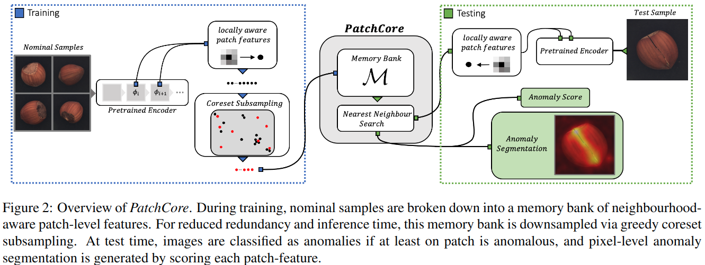
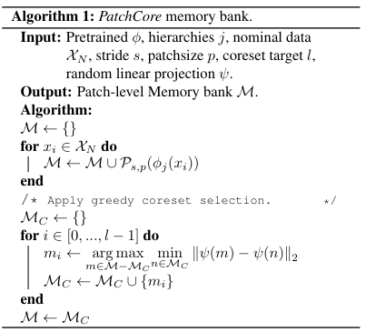
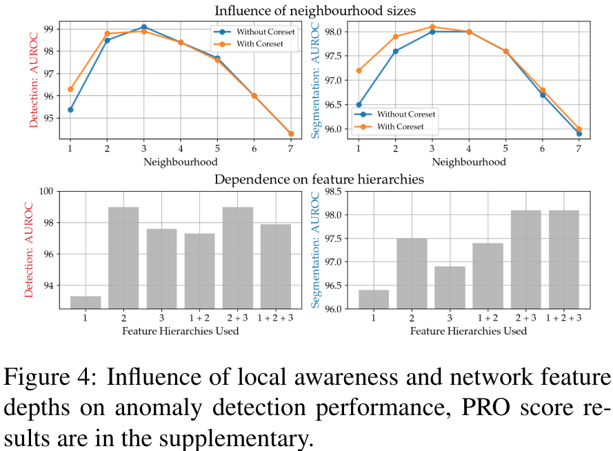
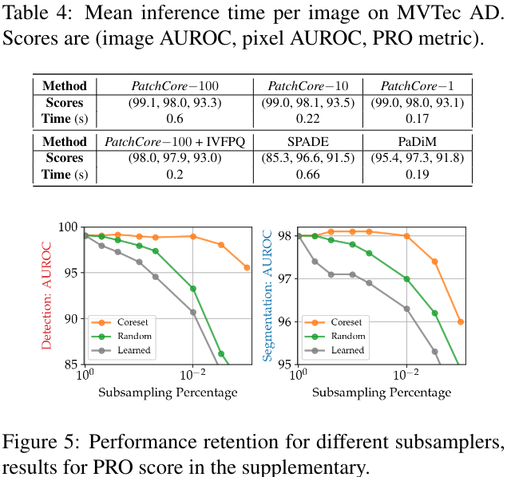

#异常检测 

[toc]

# Toward Total Recall in Industrial Anomaly Detection
- 文章: https://arxiv.org/abs/2106.08265
- 代码: https://github.com/hcw-00/PatchCore_anomaly_detection

##  摘要
本文提出了一个方法 PatchCore,该方法充分利用了正常样本的特征来构建表征的 memory bank.达到了 SOTA.

## 1. 引言
工业中获取正常样本很容易,但是获取异常样本难.那么我们将异常检测任务定义为一个非分布检测任务,即模型能够自动识别出训练数据以外分布的数据.  

现在已经有一些基于 AE,GANs 等一些无监督的自适应方法来做这件事了.这些方法背后的核心是利用深度特征的多尺度特性,对测试样本和正常样本进行特征匹配.那么一些小的缺陷可能在高分辨率特征上容易体现出来,而一些结构性的缺陷则更容易在更加高级的抽象的特征表示中体现出来.那么这类方法的一个难点是高维特征上的匹配置信度是有上限的,因为使用 ImageNet 上训练出的抽象特征和实际工业中缺陷的抽象特征在一致性上还是有所差别的.此外,这些方法的一些上下文在测试时很难被充分利用,因为高级抽象特征的不一致导致特征稀缺.  

本文就提出了 PatchCore 这一个补救方法.首先,我们最大化测试阶段的信息,其次,减少 ImageNet 训练的类别在缺陷上的偏差, 最后,保持一个高的运算速度.由于图片中只要有一个缺陷就算是缺陷,那么我们就可以利用将本地中层特征进行聚合来进行异常检测.通过使用中层网络特征可以使得在高分辨率上尽量减少 PatchCore 和 ImageNet 上类的偏移,同时特征的聚合可以保证上下文语境充足.那么这样我们就得到了一个额外的 memory bank,使得 PatchCore 在测试时可以充分利用正常的上下文.

## 2. 相关工作
略

## 3. 方法
### 3.1. 局部感知的特征块
使用 $X_N$ 表示训练集,训练集皆为正常图片,使用 $y_x \in \{0,1\}$ 作为标签,0为正常,1为异常.使用 $X_T$ 表示测试集图片,有正有负.使用 $\phi$ 表示在 ImageNet 上的预训练模型.使用 $\phi_{i,j}=\phi_j(x_i)$ 表示图片 $x_i$ 的特征, $j \in \{1,2,3,4\}$ 表示网络结构,比如 ResNet 的第几个 block 输出.

直接使用最后一层数据作为特征表达是有问题的.一是会损失很多局部正常信息,二是在 ImageNet 上预训练的模型最初是服务于分类的,因此其高层语义的敏感性和我们的任务很大程度上不匹配.

因此我们这里尝试使用中层的特征来做 memory bank $M$,比如 $j \in [2,3]$.我们假设 $\phi_{i,j} \in R^{c^* \times h^* \times w^*}$ 是一个张量,尺寸是 $c^* \times h^* \times w^*$, $\phi_{i,j}(h,w)=\phi_j(x_i,h,w) \in R^{c^*}$ 代表在位置$h \in \{1,...,h^*\},w \in \{1,...,w^*\}$ 的维度为 $c^*$ 维的特征向量.我们假设这一个特征向量的感受野大于1,那么这样一个向量就可以代表图片上一个块区域.理想情况下是每个特征向量的感受野足够大,这样可以为异常检测提供充分的上下文信息.通过池化和加深网络可以实现这一点,但是这样得来的特征会更加贴近 ImageNet 而不是和我们任务相符.  

我们取一个 patchsize $p$,然后以位置 $(h,w)$ 作为中心, $p$ 为大小,使用自适应平均池化来聚合这个邻域大小的特征作为最终在 $(h,w)$ 的聚合特征.实际操作中实际上使用中间两个 block 较低层的输出作为特征,然后分辨率低的使用双线性插值到和大的特征图一样大.最后对所有训练的图片 $x \in X_N$ 计算特征,构成 memory bank M.

### 3.2. Coreset-reduced patch-feature memory bank
随着训练集数据的增加, memory bank 会变得很大,这会占用很大的存储空间,且测试阶段推理时间会变慢. 在方法 SPADE 中同样存在这个问题,由于计算量的限制, SPADE 基于弱的图像级别的异常检测设计了一个特征图预选机制,在最后一个特征图上使用全局平均.这显然会导致低分辨率, ImageNet-偏置等一系列问题.  

因此我们使用了一种 coreset selection 的方法.这种方法就是找到一个子集 $S \in A$ 使得 $A$ 上问题的解和 $S$ 上接近,可以快速近似出来.面临的问题不同,我们感兴趣的核也不同.

另外我们还使用了随机投影来做降维. 具体算法流程见 Alg1.
> 关于随机投影的一些说明.
1. https://www.cnblogs.com/bjwu/p/10024094.html
2. https://doc.codingdict.com/sklearn/61/
3. http://lijiancheng0614.github.io/scikit-learn/auto_examples/plot_johnson_lindenstrauss_bound.html#example-plot-johnson-lindenstrauss-bound-py
4. https://zh.wikipedia.org/wiki/%E7%BA%A6%E7%BF%B0%E9%80%8A-%E6%9E%97%E7%99%BB%E6%96%AF%E7%89%B9%E5%8A%B3%E6%96%AF%E5%AE%9A%E7%90%86

### 3.3. Anomaly Detection with PatchCore

## 4. 实验
### 4.1. 实验细节
**数据集**  略.  
**评价指标** AUROC.

### 4.2. Anomaly Detection on MVTec-AD
略

### 4.3. Inference Time
略.

### 4.4. 消融实验

#### 4.4.1 局部感知特征和网络结构
详情见 Fig 4,最终邻域大小,neighborhood size $p=3$,网络结构上选的是第2和第3个 block.

#### 4.4.2 Coreset subsampling 的重要性
Fig 5 显示了使用 Greedy coreset selection,random subsampling,学习一个贝叶斯规则来下采样 memory bank 时的效果.

## 精要总结
训练阶段就是使用 WResnet50 提取所有训练图片特征,然后取block2,3 的输出作为特征,然后将所有图片所有 patch 的特征集合在一起,然后使用随机映射降维,对变化之后的特征使用 p 中值法(多用来解决工厂选址问题),选出最具代表性的 N 个样本作为 core,将这些 core 作为 memorybank.

测试阶段,使用 resnet50-w 提取完特征之后,使用 K 近邻,算出待测的patch 和最近的 memorybank 中core 的距离.然后取最近的距离作为 anomaly map. 对最近距离的 patch 算出的 K 个距离求一个 softmax,将最近距离的权重乘上最近距离作为异常分数.