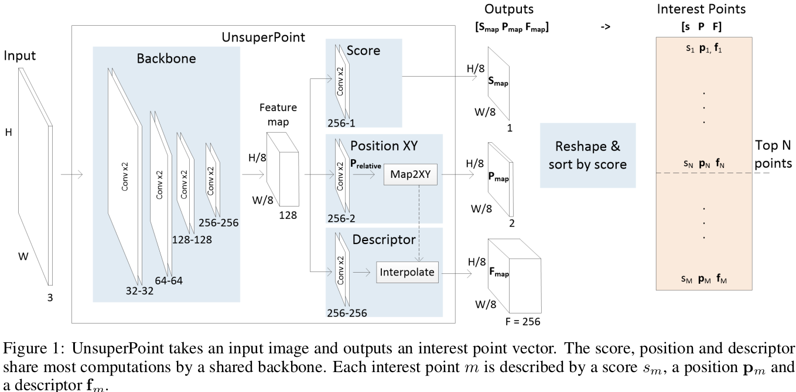
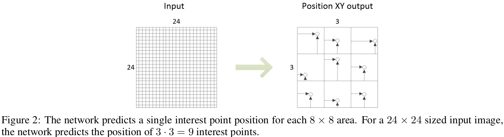
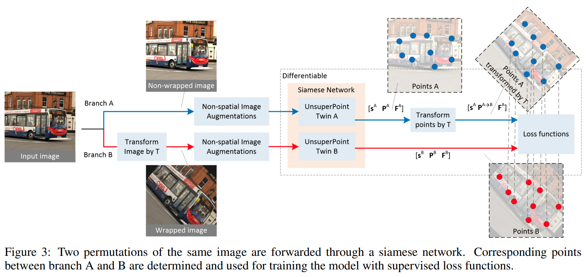
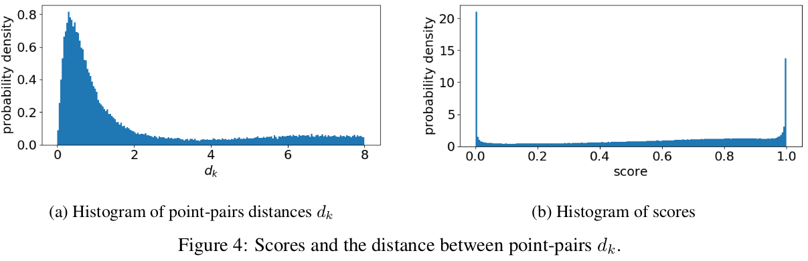
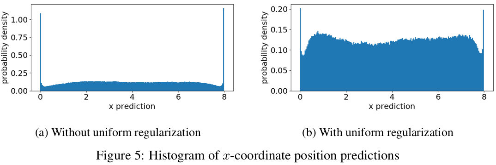
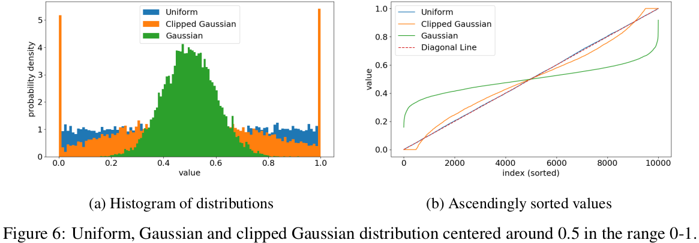

#单应性估计 #自监督 #图像配准  

[toc]

# UnsuperPoint End-to-end Unsupervised Interest Point Detector and Descriptor

## 论文代码
- 论文: https://arxiv.org/abs/1907.04011
- 代码: https://github.com/791136190/UnsuperPoint_PyTorch

## 摘要
使用回归点位置,这样模型是 end2end.在模型中引入了 NMS.引入了一种新颖的损失函数来使得网络预测点均匀化.

## 1.引言
例常讲 kp 检测的应用,并且之前工作没有很多都是需要标定数据集训练的.略

### 1.1.相关工作
略.

## 2.网络结构

基干网络还是类似 VGG 3次下采样

### 2.1.网络总览和表示
$P_{relative}$ 表示点的相对位置,$P_{map}$表示点的像素座标.$S_{map}$表示每个点的置信度,并用于选取最好的N个点.$F_{map}$表示描述符向量矩阵.这里的$S_{map},P_{map},F_{map}$ 分别 reshape 了之后,按分数取前 M 个 向量.最终 P 是 $M*2$, F是 $M*F$,这里 $M=\frac{H}{8}*\frac{W}{8}$.   
所有卷积层都是步长1核尺寸3的卷积,初开最终层,每层之后跟上 BN 和 ReLU.

### 2.2.基干网络模块
类 VGG, 包含4个 block,中间使用3个最大池化分隔,池化的步长和核大小是2.每次尺度变小,通道就加倍,通道数变换是 32-32-64-64-128-128-256-256. 最终输出的特征图,每个点代表一个8\*8的小块.对于480\*640的图片,最终得到$(480/8)*640/8=4800$个小块,即4800个特征点.

### 2.3.Score模块
这个模块将回归出每个点的置信度.它包含了2个卷积层,通道数分别为256和1,最后跟一个 sigmoid 函数将分数回归到[0,1],最后使用的时候选取 top N 个点.

### 2.4.Position模块
本模块预测点的相对8\*8网格的相对位置座标并将其映射会图像像素座标.包含的两个卷积成通道为256和2,如图2.最终跟一个 sigmoid.最终相对位置座标和像素座标的计算方式如下:

$$
P_{map,x}(r,c)=(c+P_{relative,x}(r,c))*f_{downsample} 
$$
$$
P_{map,y}(r,c)=(r+P_{relative,y}(r,c))*f_{downsample}    \tag{1}
$$

这里$(r,c)$分为为最终entry在x和y轴上的索引,也是它们在最终输出图上的图像座标.这里显然$f_{downsample}=8$.  
使用回归来进行点的检测是本文方法和 SuperPoint 以及 LN-Net 的主要区别.后两者都是直接从和图片同尺寸的热力图中得到 top N 的兴趣点.用回归的两个好处是:  
1. 该操作可微可以完全的端到端
2. 8\*8的 cell 分隔可以实现类似 NMS 的效果.直觉上我们可能觉得不太好,因为8\*8的 cell 里可能有多个兴趣点,但是事实是移除紧密的点,可以使点分布更加均匀,更好的进行单应性变换.

### 2.5.Descriptor模块
本模块针对每个 entry (最终输出特征图上的点) 输出一个定长的描述符.本模块包含两个通道为256的卷积层,最终输出无非线性变换.用的时候可以考虑直接用,也能考虑进行双线性插值之后用.不同于 superpoint 将插值作为一个推理时的后处理步骤,本文实现中,我们是将插值集成到模型里.  
这里因为输出的描述符代表的是一个8\*8的 cell 的描述,所以需要利用插值上采样到原始图片大小,然后根据 $P_{map}$ 中具体的兴趣点座标值进行插值.因为这里 $P_{map}$是可微的,所以插值过程也是可微的,可以参与到训练.

## 3.自监督框架

如上图,分支A(蓝)代表无变换图片,分支B(红)代表变换之后的图片.在训练时,先将分支B图片进行单应性变换T(旋转,缩放,倾斜和透视变换),然后两分支分别进行一个非空间的光学变换.然后分别经过一个共享权重的 unsuperpoint .然后将分支A预测的点按照T进行变换和分支B对齐.我们假定在空间上比较近的点是配对的.注意这里将分支点A 进行T变换,是可微的,所以整个过程训练是端到端的.

## 4.损失函数
$$
L_{total}=\alpha_{usp}L^{usp}+\alpha_{uni\_xy}L^{uni\_xy}+\alpha_{desc}L^{desc}+\alpha_{decorr}L^{decorr}  \tag{2}
$$

$L^{usp}$是 UnSupervised Point(USP)损失,用来学习兴趣点的位置和分数.$L^{uni\_xy}$是一个正则化项,可以鼓励点均匀分布.$L^{desc}$和$L^{decorr}$是专门用来优化描述符的.前者学习描述符.后者是用来防止前者在错误的描述符上过拟合.   

**Point-pair correspondences:**  
建立点配对的方式是建立一个 $M^A*M^B$ 大小的距离矩阵 G, 这个矩阵计算了分支A中点经过变换T之后,每个点到分支B每个点的距离.
$$
G=[g_{ij}]_{M^A*M^B}=[||p_i^{A \to B} - P_j^B||_2]_{M^A*M^B}  \tag{3}
$$

$g_{ij}$ 是 G 中的元素,表示了分支A中的点i经过变换T之后和分支B中点j的欧式距离.若经T变换之后的点A和B中最近点的距离小于 $\epsilon_{correspond}$,我们就认为这两个点可以组成点对.
根据得到的点对,我们就可以筛选分数$s^b$,点相对位置$P^b$和描述符$F^b$,得到$\hat{s}^b,\hat{P}^b,\hat{F}^b$,假设点对数目为K,则点对之间的距离为:  
$$
d_k=||T\hat{p}^A_k-\hat{p}^B_k||=||\hat{p}_k^{A \to B}-\hat{p}_k^B||   \tag{4}
$$

### 4.1. 无监督点损失 $L^{usp}$
这是本文亮点之一,本损失旨在提高预测点的可重复性(repeatability),即在不同摄像机视角下都可以检测到.公式如下:
$$
L^{usp}=\alpha_{position}\sum^K_{k=1} l^{position}_k+\alpha_{score}\sum^K_{k=1} l^{score}_k + \sum^K_{k=1} l^{usp}_k   \tag{5}
$$
k表示点对编号.第一项$l^{position}_k$旨在保证点对在输入图像中代表同一个点,所以:
$$
l^{position}_k=d_k   \tag{6}
$$
在初始阶段, Siam 网络将会随机预测点,但是随着训练推移,Siam网络将对尝试减少点对之间的距离,从而改善选点的位置.图4a显示了点对距离的直方图:  
  
第二项$l^{score}_k$将鼓励点对之间的分数相似.
$$
l^{score}_k=(\hat{s}^A_k-\hat{s}^B_k)^2   \tag{7}
$$
  
第三项$l^{usp}_k$用来确保预测点分数确实代表这兴趣点的置信度.对于每一个点对k:
$$
l^{usp}_k=\hat{s}_k(d_k-\bar{d})   \tag{8}
$$
其中
$$
\hat{s}_k=\frac{\hat{s}^A_k+\hat{s}^B_k}{2}   \tag{9}
$$
 
$$
\bar{d}=\frac{1}{K} \sum^K_{k=1} d_k   \tag{10}
$$

这样,对于 $d_k<\bar{d}$的点对,模型需要使分数$\hat{s}_k$变大,对于$d_k>\bar{d}$的点对,模型需要使分数变小.图4b显示了训练之后,预测分数的分布.

### 4.2.Uniform point predictions $L^{uni\_xy}$
本文亮点之一.  
若单一使用以上损失,会导致预测的相对位置集中在 cell 的边界,即大部分是(0或者8),如图5a.
   

这是因为对于一些难以重复的点,模型更加倾向于将预测点预测到 cell 的外面来减小$d_k$. 为了使点的相对位置分布更加接近平均分布,本文设计了以下方法:
  

图6a是平均分布(蓝),截断高斯分布(橙),高斯分布(绿)的概率密度曲线,橙色的期望是0.5,方差是0.3,绿色期望是0.5,方差是0.1. 图6b是各个分布的累积概率分布曲线,范围是[0,10000].这个图就揭示了,衡量某分布到平均分布的距离,可以转化为衡量分布采样点排序之后和 disagonal line 各点的距离.

我们定义了$D(U,V)$来衡量待测分布$V$和平均分布$U$在区间$[a,b]$之间的距离:
$$
D(U(a,b),V)=\sum^L_{i=1}(\frac{v^{sorted}_i-a}{b-a}-\frac{i-1}{L-1})^2   \tag{11}
$$
这里$v$是从分布V中采样出来的,L是对应的排序索引.$v^{sorted}_i$按照升序排列,若将区间限定在[0,1],以上loss简化为:
$$
D(U(0,1),V)=\sum^L_{i=1}(v^{sorted}-\frac{i-1}{L-1})^2   \tag{12}
$$
相比其他衡量分布差异的方法,本方法是可微的,且无需角预测进行离散化.   

如此得到最终的$L^{uni\_xy}$:
$$
L^{uni\_xy}=\alpha_{uni\_xy}(L^{uni\_x}+L^{uni\_y})
$$

$$
L^{uni\_x}=\sum^M_{i=1}(x^{sorted}_i-\frac{i-1}{M-1})^2
$$

$$
L^{uni\_y}=\sum^M_{i=1}(y^{sorted}_i-\frac{i-1}{M-1})^2 \tag{13}
$$

这里x,y是模型预测的相对图像座标.本loss不同于其他loss,是在每个分支上独立计算的,不依赖点的配对.
 
### 4.3.描述器损失,$L^{desc}$
损失函数使用 [hinge loss](../../DL_knowlege/hinge%20loss.md)   
定义一个 $M^A*M^B$ 大小的矩阵 C,其中元素值为0或1.若分支A经T变换之后,某点和分支B中有点的距离小于8,则矩阵C对应的元素$c_{ij}=1$,不同于之前的点配对,这里可能会出现一对多的情况.   
$$
c_{ij}=
\begin{cases} 
	1, & \text {if $g_{ij} \leq 8$ } \\ 
	0, & \text{otherwise} 
\end{cases}
 
\tag{14}
$$ 

[hinge loss](../../DL_knowlege/hinge%20loss.md)将利用正边界$m_p$和负边界$m_n$来计算

$$
L^{desc}=\sum^{M^A}_{i=1} \sum^{M^B}_{j=1} l^{desc}_{ij}
$$

$$
l^{desc}_{ij}=\lambda_d \cdot c_{ij} \cdot max(0,m_p-{f_i^A}^T f_j^B)+(1-c_{ij}) \cdot max(0,{f_i^A}^T f_j^B-m_n)    \tag{15}
$$

这里的${f_i^A}^T f_j^B$是对应的输出的描述符.

### 4.4. 独立描述符 Decorrelate descriptor,$L^{decorr}$   
将特征描述器的各项进行独立有助于缓解过拟合.参照[32](https://openaccess.thecvf.com/content_cvpr_2017/papers/Tian_L2-Net_Deep_Learning_CVPR_2017_paper.pdf),本文通过最小化每个分支$b$的描述符协方差矩阵$R^b=[r^b_{ij}]_{F \times F}$的非对角线元素来抑制描述符不同维度的相关性.

$$
L^{decorr}=\sum^F_{i \neq j}(r^A_{ij})+\sum^F_{i \neq j}(r^B_{ij})  \tag{16}
$$

对于$R^b$中每个元素$r^b_{ij}$:
$$
r^b_{ij}=\frac{(v_j^b-\bar{v}^b_j)^T(v_i^b-\bar{v}^b_i)}{\sqrt{(v_j^b-\bar{v}^b_j)^T(v_i^b-\bar{v}^b_i)} \sqrt{(v_j^b-\bar{v}^b_j)^T(v_i^b-\bar{v}^b_i)}}   \tag{17}
$$

$v_i^b$ 是 $M^b \times 1$大小的向量,它是$F^b$的第i列,$\bar{v}^b_i$是$v_i^b$的均值.

## 5.实验细节
用的COCO 118287张图片训练.整个模型训练了10个 epoch,带了数据打散,每个分支的 batch 是5,图片缩放成 240x320 大小.图片归一化之后减去0.5,然后每个通道乘上0.225. 优化器是默认的ADAM.图片增强上 分支A用了缩放,旋转,透视变换.然后每个分支额外使用了噪声,模糊,亮度等非空间变换.增强的参数呈均值分布.配对点的阈值$\epsilon_{correspond}=4$,仿照 [SuperPoint](paper_note/SuperPoint.md),合页损失函数的正向边界取值$m_p=1$,负边界的间隔取值是$m_n=0.2$,平衡因子$\delta_d=250$.公式2中各项权重还可以进一步探索,本文这里取值是$\alpha_{usp}=1,\alpha_{position}=1,\alpha_{score}=2,\alpha_{uni\_xy}=100,\alpha_{desc}=0.001,\alpha_{decorr}=0.03$  

## 6. 实验
### 6.1.评价指标
#### 6.1.1.可复现分(Repeatability Score,RS)
RS 是两个视角下都可以预测到的点的数目比上总的点数目.这里在实际计算,设定了一个距离阈值$\rho$,两个视角下点之间最近距离小于这个值才算点是可复现的,才纳入分子.实际计算的时候,最终 RS 取A到B和B到A的 RS 的平均值.

#### 6.1.2.定位误差(Localization Error,LE)
即上一标准中配对的点的平均像素距离,这里只有距离小于阈值$\rho$的才被计算.

#### 6.1.3.单应性估计过程
使用 opencv 中的暴力匹配,带 cross check 参数,估计方法用RANSAC.

#### 6.1.4.匹配分数(Matching Score,MS)
匹配分数是正确匹配点的数目比上共同视角内点的数目.使用gt单应性矩阵进行变换之后,点的描述符通过最邻近法可以匹配,且配对的两点之间的距离小于$\rho$.

#### 6.1.5.单应性精度(Homography Accuracy,HA)
本文将目标图片的角点经过$H_{gt}$和$H_{est}$变换之后的距离误差称为 homography error(HE),定义一个误差阈值$\epsilon$,则数据集上小于误差阈值的HE和所有HE的比值是单应性精度.

### 6.2.评价
这部分略了,肯定SOTA.

# 参考资料:
http://www.liuxiao.org/2020/04/%E8%AE%BA%E6%96%87%E7%AC%94%E8%AE%B0%EF%BC%9Aunsuperpoint-end-to-end-unsupervised-interest-point-detector-and-descriptor/
