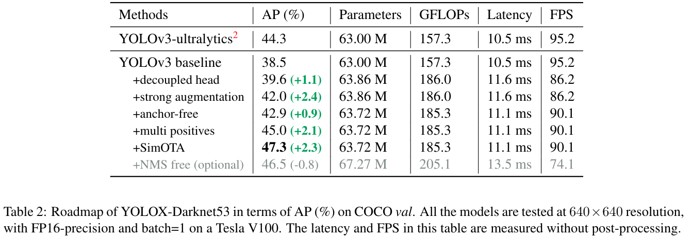
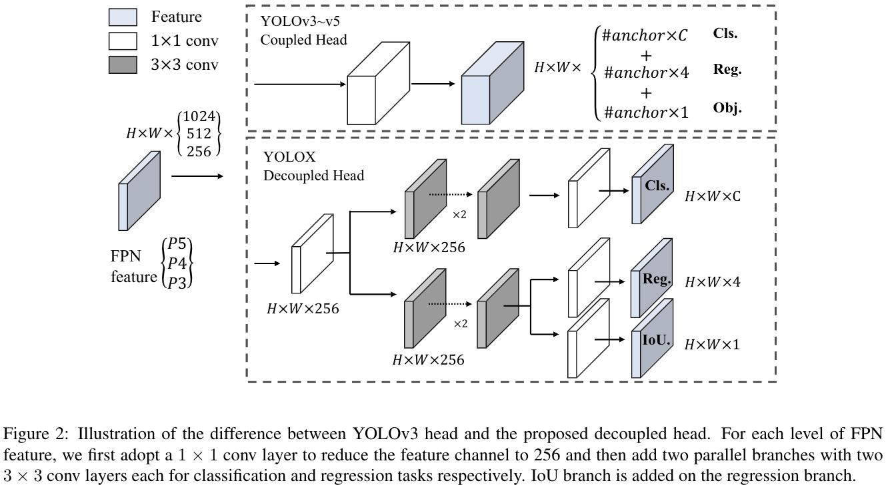
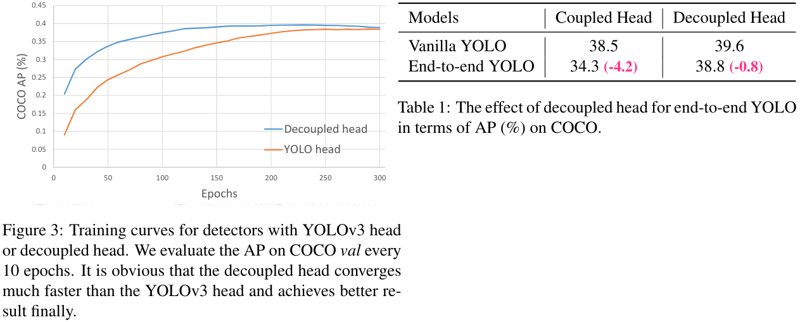
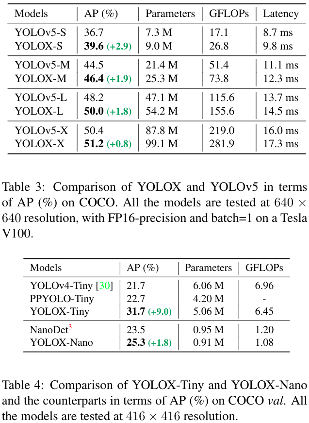

#目标检测 

[toc]

# YOLOX: Exceeding YOLO Series in 2021
- 论文: https://arxiv.org/abs/2107.08430v1
- 代码: https://github.com/Megvii-BaseDetection/YOLOX

## 摘要
我们针对 YOLO 系列进行了一系列的提升措施.我们将 YOLO 检测器重新带回 anchor-free,并设计了解耦的 head 和 SOTA 的标签处理策略 SimOTA.

## 1. 引言
最近两年的目标检测研究重点在 anchor-free 检测器, 更加先进的标签处理策略,和真正端到端的(NMS-free)检测器.但是这些技术目前还没有被融入 YOLO, YOLOv4 和 YOLOv5 依然是 anchor-based ,手工设定分配策略的检测器.

考虑到 YOLOv4v5 可能在 anchor-based 上过优化,所以我们选择 YOLOv3 作为我们的起点.即选用的 YOLOv3-SPP.

我们使用 640x640 大小,在 COCO 上训练 YOLOX-DarkNet53,这比 ultralytics version 版本的 YOLOv3 高了3%(47.3%->44.3%).当采用 YOLOv5 架构,使用 CSPNet 基干和额外的 PAN 头之后, YOLOX-L 在640x640分辨率训练下,在COCO上有 50.0% AP,比 YOLOv5-L 高了 1.8%. YOLOX-Tiny 和 YOLOX-Nano 也比 YOLOv4-Tiny 和 NanoDet 高了 10% AP 和1.8% AP.

## 2. YOLOX
### 2.1. YOLOX-DarkNet53
**实现细节**   
我们在 COCO train2017 上训练了300轮,使用了5 轮的 warm-up.使用的就是 SGD.使用的学习率是 $lr \times BatchBize/64$,初始为 $lr=0.01$,然后学习率调整策略是余弦退火.weight decay 是 0.0005,SGD momentum 0.9. batch size 128,用的8卡.不过用其他 batch size 也OK.The input sizeis evenly drawn from 448 to 832 with 32 strides.

**YOLOv3 baseline**.  
依然采用DarkNet53 + SPP 结构.添加了 [EMA 权重更新](),余弦学习调整策略,IoU Loss 和 IoU 感知分支.在 cls 和 obj 分支上使用的 BCE Loss,而 reg 分支上使用的 IoU Loss.当然,这些不是提升 YOLOX 性能的本质,所以我们将这些方法都放到 baseline里. 然后我们仅仅使用了 RandomHorizontalFlip,ColorJitter,和多尺度.但是注意我们没有使用 RandomResizedCrop ,因为我们与 mosaic 增强方法有所重复.在这些 tricks 的增强下,我们在 COCO val 上可以达到 38.5% AP,如表2.

**Decoupled head**
目标检测一个知名冲突就是分类头和回归头之间的冲突.在一阶和二阶方法中,解耦头被广泛使用.但在YOLO系列中,仍然使用了耦合头,如图2.

我们的两个分析实验表明,使用耦合头可能会损害性能.图3显示了使用使用解耦头可以更快的达到好效果,表1显示了解耦头是端到端 YOLO 的关键,关于端到端 YOLO 可以参见后面说明.因此,我们将 YOLO 头换成了图2结构,我们测试了推理阶段上,batch为1在V100上,使用解耦头仅仅会带来1.1 ms 的额外计算时间.

**Strong data augmentation**  
我们还应用了 Mosaic 和 MixUp 增强策略. MixUp 最初是用来做分类的,但是在 BoF 被改进用作目标检测.我们在最后15轮,禁用了这个策略.在使用了这些 AG 方法之后,我们发现 ImageNet pre-training 模型是没有益处的,所以我们干脆重新训练了.  

**Anchor-free**  
虽然 V3,V4,V5 都是基于 Anchor 的,但是 Anchor 本身也会带来很多问题.首先,为了进一步提升性能,一般做法是训练前,针对数据进行聚类分析,最终得到一组最佳 Anchor,这显然不利于泛化.其次,Anchor 也增加了检测头的复杂程度以及每张图片的预测数量,在诸如移动终端等场景下,这可能成为导致延时的一个瓶颈.

将 yolo 改造成 anchor-free 也是很简单的,我们将每个位置上的预测数量从3改成1,直接预测出框的左上点和长宽.我们将每个目标中心作为正样本,并参照[文献29](https://arxiv.org/abs/1904.01355)设定了一个尺度范围,来指定每个目标的 FPN level.这些改动减少参数的同时还提升了性能.  

**Multi positives**  
若是按照YOLOV3 的习惯,每个对象仅仅选取一个最佳位置作为正样本,那么会丢失很多高质量的预测.优化这些高质量预测是可能带来有益的梯度,同时缓解训练过程中正负样本的极端不平衡.为此,我们就选取了$3 \times 3$大小的区域作为正样本,即 FCOS 中的 "center sampling".这点改进,使得 AP 到了 45%.  

**SimOTA**  
更加先进的标签处理策略也是近年来目标检测的一个重要方向.基于我们自己的研究 [OTA](),我们认为先进标签分配有以下四个关键点: 1). loss/quality aware 2). center prior 3).每个gt可以有动态的正 anchors(即 dynamic top-kernel)(这里的 anchors指的是anchor-free中的 anchor point 的上下文和 YOLO 中网格的上下文) 4).全局视野.而 OTA 满足上面四点规则,因此我们选择它作为我们的候选标签分配策略.  

OTA 从全局角度分析标签分配,并将之视为一个最优传输问题,它是 SOTA 的.但是我们发现使用 Sinkhorn-Knopp 算法来解决 OT问题会增加25%左右的额外时间,因此我们就将这个策略简化成 dynamic top-k 策略,成为 SimOTA,来得到一个近似解.

这里我们简要介绍一下 SimOTA.针对每对预测-gt对,我们计算其两两的匹配程度作为 cost.比如在 SimOTA中, gt $g_i$和预测$p_j$之间的 cost 计算方式如下:
$$
c_{ij}=L_{ij}^{cls}+\lambda L_{ij}^{reg},   \tag{1}
$$
然后对于每个 $g_i$,我们在一个固定的 center region 中选取最小的前k个预测作为正样本.最后,这些正预测对于的网格都被视为是正的,而剩余的网格都视为是负样本.更多细节可以参考 OTA 中动态 k 估计策略.

[SimOTA](../../DL_knowlege/关于目标检测中的正负标签分类策略.md#YOLOX) 不仅减少了训练时间,还避免了使用 Sinkhorn-Knopp 算法带来的额外的超参数.这点改进使得 AP 上升到了 47.3%.

**End-to-end YOLO**
依据[文献39](),我们添加了两个额外的卷积, one-to-one label assignment, and stop gradient.这可以使得检测器实现端到端,但是会轻微的损害性能和推理速度,因此,我们将其作为一个可选模块保留,但是不放在我们最终的模型里.  

### 2.2. Other Backbones
除开 DarkNet53,我们还使用其他基干测试了 YOLOX.

**Modified CSPNet in YOLOv5**   
为了公平比较,我们使用了修改的 CSPNet, SiLU激活和 PAN 头.与 YOLOv5,相比,我们的方法提升了 1~3% AP,见表3.

 后略.

# 个人一些思考
1. 对于多输出网络,不同任务头之间若无内在的任务联系,且量纲差异较大,那么应该在任务头的特征前进行解耦
2. 标签分配策略依然很值得思考...YOLOX的策略是更加关注预测的准的样本,而其实更加关注预测不准的难样本也是值得的.
3. 注意SimOTA 中的动态标签数目很灵性!