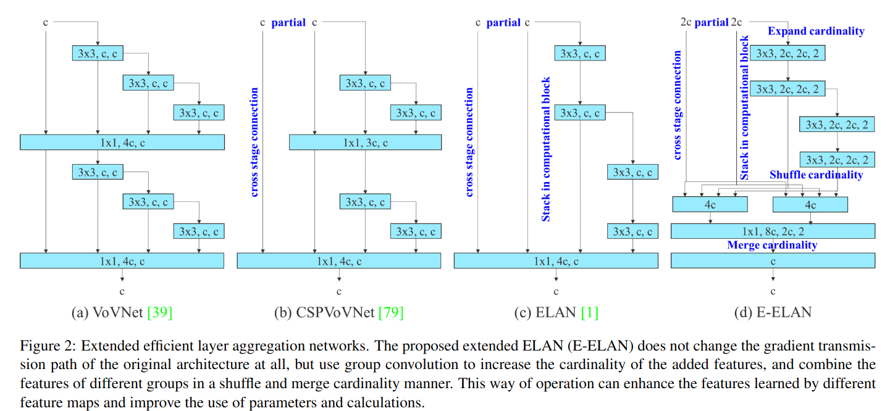

#目标检测

[toc]

# YOLOv7: Trainable bag-of-freebies sets new state-of-the-art for real-time object detectors
- 论文: <https://readpaper.com/paper/704833736052609024>
- 代码: <https://github.com/WongKinYiu/yolov7>

## 摘要
在5FPS到160FPS范围内,YOLOv7的速度和精度超越了所有已知的目标检测器,相比所有高速检测器(在V100上速度大于30FPS),YOLOv7 AP高达56.8%.YOLOv7-E6(56 FPS V100,55.9%)比 transformer 架构的
SWIN-L Cascade-Mask R-CNN (9.2 FPS A100,53.9% AP) 在速度和精度上分别提高了509%和2%,比CNN架构的
ConvNeXt- XL Cascade-Mask R-CNN (8.6FPS A100,55.2% AP) 在速度和精度上分别高出551%和0.7%AP. YOLOv7 同样在精度和速度上还打败了 YOLOR,YOLOX,Scaled-YOLOv4,YOLOv5,DETR,Deformable DETR,DINO-5scale-R50,ViT-Adapter-B 等一众检测器.此外,我们在仅使用了MS COCO 对 YOLOv7 进行了重头训练,没有借助其他数据集或者是预训练数据集.源码已开源在 <https://github.com/WongKinYiu/yolov7>.

## 1. 引言
实时目标检测作为计算机视觉中十分重要的课题，在诸如多目标跟中，自动驾驶，机器人，医学图像分析等计算机视觉系统中都有广泛的应用。常见的计算设备包括CPU,GPU,NPU。比如 the Apple neural engine (Apple), the neural compute stick (Intel), Jetson AI edge devices (Nvidia), the edge TPU (Google), the neural processing engine (Qualcomm), the AI processing unit (MediaTek), and the AI SoCs (Kneron), 这些都是 NPU。上述这些边缘设备专注于加速不同的操作，比如原始卷积，深度可分离卷积，MLP操作等等。在本文中，我们提出了一个实时目标检测器用于支持手机GPU和一些云端的边缘设备的GPU。
近年来，实时目标检测器在不同的边缘设备上都有所发展。比如 MCUNet和NanoDet专注于低功耗单片机，以及在边缘CPU上提升推理速度。而YOLOX和YOLOR，他们专注于提升不同GPU上的推理速度。最近这些年，实时检测器的发展主要集中在高效的结构设计上。而应用于CPU上的实时检测器则依赖于MobileNet，ShuffleNet和Gho's't近年来，实时目标检测器在不同的边缘设备上都有所发展。比如i比如 et和anoet专注于低功耗单片机，以及在边缘上提升推理速度。而和，他们专注于提升不同的上的图例推理速度。最近这些年，实时检测器的发展主要集中在搞笑的高效到处的结果结构设计师设计上。正如而在在上进行搞笑应用于上的实时检测器则一脸与依赖于Mobileet，Shuffleet和GhostNet。而主流的用于GPU上的实时检测器，它们通常使用ResNet,DarkNet,DLA以及 CSPNet策略来优化结构。本文提出的方法发展方向不同于目前主流的实时目标检测器。除开结构上的优化，我们提出的方法着重于优化训练过程。我们将专注于一些可以提升检测器性能的优化模块和优化方法,这些方法可能导致训练阶段的代价增加,但是对于推理阶段的代价是不会增加的.我们将提出模块和优化方法称为可训练的免费方法。

最近，模型重参数化和动态标签分配策略是网络训练和目标检测的重要话题。在一些新概念被提出后，目标检测器的训练引出了很多新问题。在本文中，我们将介绍一些我们发现的新问题，并设计有效的方法来解决它们。针对模型重参数化,我们结合梯度传播路径,分析了不同网络不同层的模型重参数化,提出了planned re-parameterized model，此外,当我们发现动态标签分配技术在多输出层训练中会一些新问题,即如何给不同的分支分配动态标签.为此我们提出了一个名为 coarse-to-fine lead guided的标签分配策略.

本文贡献:
1. 设计了一些免费的策略可以提高实时目标检测器的性能 
2. 评估了一些检测器之后,我们提出了两个新问题,如何使用重参数化来替代原始模型和在不同输出层之间如何进行动态标签分配 
3. 我们使用 extend 和compound scaling 来充分利用参数和计算 
4. 我们提出的方法在SOTA检测器减少了40%参数和50%计算量,还能保持高速和高精度检测

## 2. 相关工作
### 2.1. 实时目标检测器
目前SOTA的实时目标检测器主要基于YOLO和FCOS。SOTA的检测器一般有以下特征:1. 快且强的网络结构 2.高效的特征提取方法 3. 更加准确的检测方法 4. 一个鲁棒的损失函数 5. 有效的标签分配策略 6. 更加有效的训练方法.在本文中，我们不打算探索需要额外数据或大型模型的自我监督学习或知识蒸馏方法。我们将针对问题456设计新的可训练的免费方法。

### 2.2. 模型重参数化
模型重参数化技术在推理阶段时，会将多个计算模块融合成一个。模型重参数化可视为是一种集成技术,分为模块级集成和模型级集成。模型级重参数化通常由两条思路。一是不同训练数据训练多个相同模型,然后将其权重进行平均.一种是在不同迭代时期对模型权重进行平衡.模块级重参数化则是最近更为流行的研究方向。模块级的集成一个典型做法是在训练时将一个模块拆成多个相同或者不同的分支模块,然后在推理时使用一个等效的模块替换回来。然而，并未所有提出的重参数化模块都可以完美的被应用到所有架构上。基于此，我们开发了一个新的重参数化模块，并为各种架构设计相关的应用策略。

### 2.3. 模型缩放
模型缩放是一种通过缩放已经设计好的模型来使之适应不同计算设备的方法,它通常包含了不同是缩放因子，比如分辨率（输出图片的尺寸），深度（层的数量），宽度（通道数量），阶段（金字塔级数），从而在网络参数量、计算量、推理速度和准确性方面取得了良好的权衡。神经网络架构搜索（NAS）是模型缩放时常用的一种手段。NAS可以在无需定义太多计算规则的情况下在搜索空间中搜寻到最佳的缩放因子。但是NAS需要很昂贵的计算代价。文献15中，研究者通过分析比例因子与参数量、操作量之间的关系，试图直接估计一些规则，从而得到模型缩放所需的比例因子。
模型重参数化可视为是一种集成技术,分为模块级集成和模型级集成。常见模型级集成有两条路,一是不同训练数据训练多个相同模型,然后将其权重进行平均.一种是在不同迭代时期对模型权重进行平衡.通过查阅文献，我们发现几乎所有的模型缩放方法都是独立分析单个缩放因子的，甚至复合缩放类别中的方法也是独立优化缩放因子的。导致这样的原因是NAS发现缩放因子之间的相关性不大。但是对于类似DenseNet和VoVNet,当模型的深度缩放时,一些层的输入宽度也会改变.因此,针对这种concat型的网络,我们设计了一个新的缩放方法。

## 3. 结构
### 3.1 扩展高效的聚合网络层
多数文献在设计高效的结构时,主要考虑不增加参数量,计算量和计算密度.而着眼于内存访问的代价,Ma等人分析了输入输出通道比例,网络分支数量以及在推理过程中像素级操作的影响.Dollar等人则额外考虑了在执行模型缩放时激活函数的影响,具体而言就是着眼于卷积层输出张量的数量的影响.图2b中的CSPVoVNet是VoVNet的一种变体.除开以上设计原则,CSPVoVNet还分析了梯度传播路径,使得不同层的权重可以学习到更多独立的特征.上述阐释的梯度分析方法使得推理更加快速和精准.图2c的ELAN主要考虑了如何设计一个高效网络,他们得出的结论是:通过控制最短和最长的梯度路径,更深的网络可以学习和拟合得更加迅速.基于ELAN,我们提出了 Extended-ELAN(E-ELAN),主要结构如图2d所示.   

> Fig2: E-ELAN 不会改变原始结构中梯度的传播路径,但使用了组卷积来增加额外特征的 cardinality,同时结合了不同组特征的混洗和结合.这种方式可以增强不同特征图的特征,提高参数和计算的效率.

无视梯度路径长度和在大的ELAN中堆积的计算 block的数量的话,E-ELAN 可以达到一个稳定的状态.若是计算 blocks 无限制的堆叠,稳定状态将被破坏,参数利用率将下降.在不破坏原始梯度路径的前提下, E-ELAN 通过扩展,混洗,融合的方式来持续增强网络的学习能力.从结构角度来看,E-ELAN仅仅改变了计算block的结构,过度层的结构没有变化.我们的策略是使用组卷积来扩展计算block的通道和 cardinality.我们将对所有计算层的计算 block 都使用同样的组参数和通道扩展.设置组参数 g,每个计算 block 输出的特征图将分为 g 组进行混洗,然后 concatenate 起来.与此同时,每组特征图的通道数应原始通道数相同.最后我们将 g 组特征图执行融合操作.除开保留原始 ELAN 结构设计,E-ELAN 还可以引导不同组的计算 block 来学习更加独立的特征.

### 3.2 concatenation-based model 的模型缩放
模型缩放的目的是通过调整模型的版本来生成不同尺寸的模型来适应推理速度(比如resnet50调整到resnet18).比如EfficientNet 的缩放要考虑宽度,深度和分辨率.正如 scaled-YOLOv4,它通过调整stages 的数量来缩放模型.文献15分析来在执行宽度还有深度缩放时,朴素卷积和组卷积参数和计算量的影响,并以此来设计对应模型缩放方法.在PlainNet和ResNet中,这些方法被广泛应用。当对这些结构进行缩放时，每层的输入和输出维度并没有发生变化，因此我们可以独立的分析每个缩放因子对计算量和参数量的影响。然而对于concatenation-based结构,我们会发现在深度上缩放模型,在concatenation-based 计算block之后的过度层的输入维度也会发生变化,如图3a和3b.

> concatenation-based 类模型的模型缩放。从 ab 图可知，当 concatenation-based 模型在深度上进行缩放时，computational block 的输出宽度也会增加，这使得接下来的过渡层的输入宽度也会增加。因此我们提出了图c，concatenation-based 模型进行缩放时，对于计算block仅缩放深度，然后将其对应的过渡层的宽度也进行对应的缩放。

上述问题使得我们无法独立分析 concatenation-based模型的各个缩放因子。以深度放大为例，这会导致过渡层的输入和输出通道比例变化，使得硬件的利用率下降。为此，在对计算block进行深度缩放时，我们必须计算出block输出通道的变化。然后应用对应的缩放因子到过渡层，如图c，我们提出的复合缩放结构既能保持模型初始设计时特性，有能保持最优的结构。

## 4. 免费训练技巧
### 4.1. Planned re-parameterized convolution
尽管 RepConv 在VGG上取得了非常好的效果，但是当我们直接将其应用到 ResNet或者DenseNet 上时，其精度会极大的下降。我们利用梯度流的传播路径来分析这种现象。

> 计划重参数模型。在包含残差或者concatenation 链接的结构中，RepConv不应有等效的链接。在这些情况下，它应该被替换成 RepConvN，这是一个也不含等效链接的层。

RepConv包含3x3卷积，1x1卷积和等效链接。在分析完 RepConv 和不同架构的结合之后，我们发现RepConv 中的等效链接破环了 ResNet 中的残差和 DenseNet 中的concatea，而这两者为不同特征图提供了更为多样的梯度。出于这些原因，我们将 RepConv 中的等效链接去除，设计了计划重参数卷积(RepConvN)。我们认为当带有残差或者concate拼接的卷积被替换成重参数卷积时，它不应该再含有等效链接。图4展示了我们设计的“计划重参数卷积”时如何应用在 PlainNet 和 ResNet 中的。下面的章节我们将针对这一点进行消融实验。

### 4.2. Coarse for auxiliary and fine for lead loss
深度监督是训练深层网络常用的一种技术。它的主要思路是在中间层添加辅助头，并将浅层的权重作为辅助损失作为引导。诸如 ResNet 和 DenseNet 可以有利收敛，深度监督也可以在很多任务上帮助模型提升性能。 图5ab展示了目标检测器使用和不使用深度监督的例子。本文中，我们将最终输出的头称为引导头，用于辅助训练的头成为辅助头。
接下来，我们将讨论标签分配的问题。在过去，深度网络训练中，标签分配器通常直接通过GT来生成硬标签。然而近年来，以目标检测为例，研究者通常使用预测输出的分布或者质量结合GT来生成软标签。YOLO就使用了回归出的BBOX 和GT 的IOU作为目标的软标签。本文中，我们将考虑网络输出和GT来生成软标签的机制称为“标签分配器”。
基于以上情况，我们开始考虑一个派生问题，如何在辅助头和引导头上分配软标签呢？据本文所知，目前还没有相关文献探索过这个问题，一些流行的方法如图5c所示，一般做法会分离辅助头和引导头，然后使用其预测结果和GT来进行标签分配。本文则提出了一个新的标签分配方法。我们使用引导头来生成一个由粗到精的层级标签，用于辅助头和引导头的学习。图5d和e显示了两种深度标签分配策略。

**引导头指导标签分配**是基于引导头和GT来计算的，并通过一个优化过程来生成软标签。这些软标签在训练时，将同时被作为辅助头和引导头的训练目标。这样做的原因是引导头有相对较强的学习能力，它生成的软标签应该更能表征源数据和目标之间的分布和相关性。我们可以将其视为广义的残差学习。通过让浅层辅助头直接学习引导头的信息，可以使得引导头更加关注残差信息中还未学到的部分。

**由粗到精引导头指导标签分配**同样也是使用引导头预测结果和GT来生成软标签。但是在这个过程中，我们将生成两组不同的软标签，粗标签和精标签。精标签如上文一样，粗标签的生成则会放松对正样本的约束，使得更多的网格被视为正标签。这样做的原因是辅助头的学习能力不如引导头，因此我们更加注重提高辅助头的召回能力来避免遗漏了重要信息。对于引导头的输出，我们可以从高召回的结果中过滤出高精确的结果作为最后输出。然而，我们注意到粗标签的附加权重若和精标签的接近，这可能会导致最终预测有了一个坏的先验。为了使这些额外的粗正网格有更小的影响，我们将在解码器中添加一些限制，使得这些额外的粗正网络无法完美的产生出软标签。上述机制允许精细标签和粗标签的重要性在学习过程中动态调整，使精细标签的可优化上界始终高于粗标签。

### 4.3. 其他可训练的免费方法
本节，我们将列举一些可训练的免费方法。这些方法我们将在训练中使用，但是这些方法并非是我们提出的。这些trick的细节将在附录中展示，包括：
1. CBR拓扑中BN的应用：即在卷积层之后直接接BN层。这样做的好处是在推理阶段可以将BN层的期望和方差直接继承到卷积层的偏置和权重中。
2. 利用卷积特征图中的相加和相乘来和隐式知识进行结合：YOLOR 中的隐式知识可以在推理阶段进行重计算，进而简化成一个向量。这个向量可以和之前和之后的卷积层派偏置和权重结合起来。
3. EMA 模型：EMA 是 mean teacher 的一种技术，在我们系统中，我们仅仅在最后推理阶段使用EMA。

## 5. 实验
### 5.1. 实验设置
数据集我们使用COCO。所有实验均不使用预训练模型。在开发阶段，我们使用 coco train 2017 作为训练集，使用 val 2017 来进行超参数进行验证和选择。最终我们在 test 2017 上评价算法性能。在附录中详细展示了训练参数。
针对边缘GPU，普通GPU，云GPU，我们设计不同的基本模型 YOLOv7-tiny,YOLOv7,YOLOv7-W6.与此同时，我们还针对不同服务的要求对模型进行了缩放。对于YOLOv7，我们在 neck 层的堆叠上进行了缩放，并利用本文提出的复合缩放方法对整个模型的深度和宽度进行缩放，由此得到 YOLOv7-X。对于YOLOv7-W6，我们只用提出符合缩放方法得到了YOLOv7-E6和YOLOv7-D6。此外，我们在YOLOv7-E6中使用了 E-ELAN，从而得到了 YOLOv7-E6E.而YOLOv7-tiny是针对边缘设备的，因此它使用 leaky ReLU作为激活函数。其他网络，我们都将使用SiLU作为激活函数。附录中，我们描述了每个模型的缩放因子。

### 5.2. 基线
我们以之前版本的YOLO和 SOTA的 YOLOR 作为我们的基线模型。表1显示了我们提出的 YOLOv7和这些基线在相同设置下训练的结果。
从结果中，我们和YOLOv4进行比较，YOLOv7的参数减少了75%，36%的计算量，AP提高了1.5%。与 SOTA 的YOLOR-CSP相比，YOLOv7的参数减少了43%，计算量减少了15%,AP提高了0.4%。对于 tiny 模型，与 YOLOv4-tiny-31 相比，YOLOvv7-tiny 减少了39%的参数和49%的计算量，取得了相同的AP。对于我们的云GPU模型，我们的模型依然可以在保持高AP的同时减少了19%的参数和33%的计算量。

### 5.3. SOTA检测器比较
表2显示了在通用GPU和收集GPU上SOTA模型比较的结果。从表2可知我们提出方法在速度和精度上权衡是最好的。后略......

### 5.4. 消融实验
#### 5.4.1 复合缩放方法
表3展示了使用不同模型缩放策略进行缩放的结果。其中，我们将计算块的深度放大1.5倍，过度块的宽度放大1.25倍。如果我们仅仅缩放宽度，我们的方法可以提高0.5%的AP，且参数更少。若我们的方法仅仅缩放深度，我们仅仅增加了2.9%的参数和1.2%计算量，AP可以提高0.2%。这说明本文方法可以更好的利用参数和计算量。

#### 5.4.2 计划重参数模型
为了验证我们提出的计划重参数模型的有效性，我们使用拼接模型和残差模型来进行验证，这里我们在拼接模型上使用3-stacked ELAN ，残差模型上我们使用 CSPDarknet。
对于拼接模型，我们将3-stacked ELAN中不同位置的3x3卷积替换成RepConv，具体设置如图6.表4显示了我们的方法可以取得更高的AP。

对于残差模型，由于原始 Dark block 不包含符合我们设计策略 3x3卷积块，因此我们额外添加了逆 Dark Block，结构如图7。由于包含Dark Block和逆 Dark Block的CSPDarknet具有相同的参数和操作，所以这样比较是公平的。表5显示了提出的计划重参数方法对于残差模型同样有效。我们发现 RepCSPResNet也适合我们的设计模式。

#### 5.4.3 辅助头的辅助损失函数
在本节实验中，我们比较了通常分别为引导头和辅助头进行标签分配方法，以及之前提到的两种引导头指导标签分配的方法。表6显示了所有比较的结果。显然，任何增加了辅助损失的模型都可以显著提高性能。此外我们提出方法比独立的标签分配策略要更好。图8在辅助头和引导头上，使用不同方法得到目标特征图。从图8我们可以发现如果辅助头学习到了引导头指导的软标签，这确实有助于引导头从一致的目标中提取到残差信息。

表7 我们分析了由粗到精的引导标签分配方法在解码器的辅助预测头上的影响。即，我们比较了引入上界约束和不引入上界约束的结果。通过比较表格中数字，可以发现引入了目标中心距离的上届约束的方法可以获得更好的性能。

由于提出的YOLOv7使用多个金字塔来共同预测目标检测结果，我们可以直接将辅助头部连接到中间层的金字塔进行训练。这种类型的训练可以弥补在下一级金字塔预测中可能丢失的信息。出于以上原因，我们设计了在提出的E-ELAN结果设计了局部辅助头。我们的方法是在一系列特征图之后，在cardinality融合之前链接一个局部辅助头，这种链接方式可以使用最新生成的特征图的权重不会被辅助损失直接更新。我们的设计使得每个金字塔的引导头依然可以从不同大小的目标中获取信息。表8展示了由粗到精和局部由粗到精引导方法的结果，显然后者有更好结果。

## 6. 结论
本文提出了一种新结构的实时目标检测器，以及对应的模型缩放方法。并且由此，我们发现了目标检测方法产生的新的研究课题。在研究时，我们发现了重参数模块替换的问题和动态标签分配中分配的问题，我们提出了可训练的免费方法来提升目标检测的精度。综上，我们提出了YOLOv7系列目标检测系统实现了SOTA

## 7. 致谢
感谢台湾国家高性能计算研究中心NCHC提供的计算和存储资源。

## 8. 更多比较
略。

# 个人的一些思考
1. 细节解读参考:<https://zhuanlan.zhihu.com/p/543160484>
2. 总体结构图参见<https://zhuanlan.zhihu.com/p/543686792>